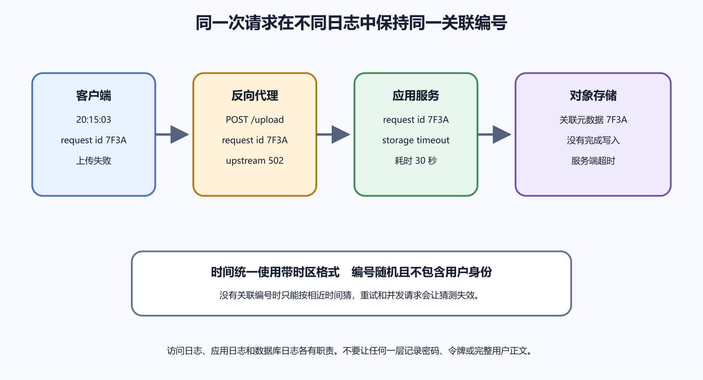

# 服务器、Docker、数据库和代理日志

服务器故障常常跨好几层。用户请求先到 Caddy 或 NGINX，再转发到应用。应用可能跑在 Docker 容器里，容器再连接数据库和外部服务。任何一层失败，用户都可能只看到 502、超时或保存失败。

排查这类问题，关键是让同一次请求在不同日志里对上。时间、请求路径、状态码、容器名、数据库连接和请求编号，要能组成一条线。



*图 61-1　同一次请求应能在代理、应用、容器和数据库日志中相互对应。等价说明见本章“从用户请求建立一条时间线”。*

## 四层日志各自证明什么

代理日志证明请求是否到达公开入口。它能看到来源 IP、Host、路径、状态码、上游地址和响应时间。若代理完全没有记录，问题可能在 DNS、CDN、防火墙或用户网络。

应用日志证明业务代码做了什么。登录失败、权限拒绝、参数错误、第三方 API 超时、数据库异常和任务队列错误，都应在这里出现。它最需要请求编号。

容器日志通常是应用主进程的标准输出和错误输出。它能说明进程是否启动、是否崩溃、环境变量是否缺失、端口是否监听。容器运行不等于应用健康，应用打印正常也不等于数据库可用。

数据库日志证明连接、查询、锁、慢 SQL、权限和崩溃情况。它不是第一站。只有应用日志或指标指向数据库时，再深入看对应时间段。

## 从用户请求建立时间线

先从用户报告拿到时间、路径、账号、动作和错误。再查代理入口。请求是否到达，返回状态是什么，耗时多长，上游是哪一个。代理记录 502 时，要结合上游日志区分连接失败与上游错误响应。NGINX 的 499 是非标准状态，通常表示客户端先断开；其他代理不一定使用这个代码。504 常与上游超时有关。

接着查应用日志。用请求编号最好，没有编号就用时间、路径、账号和实例缩小范围。应用是否收到请求，是否开始处理，失败在哪个操作。随后查容器状态。容器是否重启过，内存是否过高，磁盘是否满，健康检查是否失败。

最后查数据库。连接数是否耗尽，查询是否慢，锁等待是否异常，磁盘是否不足，迁移是否刚运行。不要先在数据库里乱改数据。很多服务器故障看起来像数据库，实际是代理转发错端口或应用环境变量缺失。

时间线要处理时钟差异。用户手机显示中国标准时间，服务器可能使用 UTC，日志平台可能按浏览器时区显示。记录时写清时区，查询日志时留出几分钟误差。容器重启、NTP 漂移和平台延迟都会让时间对不上。时间不准时，请求编号比纯时间可靠。

如果没有请求编号，就临时用可控测试请求制造一个。选择低风险动作，带一个独特字段或测试账号，立即查看代理和应用日志。不要用真实付款、删除和邮件发送来制造测试请求。能用健康检查或只读接口验证入口，就先用只读接口。

## Docker 日志和状态

`docker logs` 看容器主进程输出。常见用法如下。

```text
docker ps
docker logs --tail 200 app
docker logs --since 30m app
docker inspect app
```

这些命令用于读取和观察。不要在不了解影响时运行批量清理。容器日志中若只有应用启动信息，没有用户请求，先看端口映射、代理上游和应用监听地址。应用监听 `127.0.0.1`、容器暴露端口和代理转发地址不一致，常会造成 502。

容器反复重启时，查看退出码、启动命令和最近配置。内存不足、环境变量缺失、数据库地址错、迁移脚本失败，都可能让进程刚起来又退出。重启策略会掩盖问题，因为容器列表看起来一直存在。

Docker Compose 项目还要看服务名和网络。应用连接数据库时，主机名常常是 Compose 服务名，而不是 `localhost`。容器里的 `localhost` 指容器自己。把本机经验搬到容器里，容易让应用找错数据库。端口映射给宿主机和外部访问用，容器之间通常走内部网络。

Volume 和 bind mount 也会影响排错。配置文件、上传目录和数据库数据可能来自宿主机。容器重建以后问题仍在，可能是挂载数据没有变。容器删掉后数据丢失，可能是原来写在容器层。查日志时顺手确认数据到底挂在哪里。

## Caddy 与 NGINX 入口日志

代理负责把公开域名和 HTTPS 请求转给内部应用。排查时先看配置中的域名、证书、上游地址、端口和路径改写。再看 access log 和 error log。

```text
sudo nginx -T
sudo tail -n 200 /var/log/nginx/access.log
sudo tail -n 200 /var/log/nginx/error.log
```

这些命令会读取系统配置和日志，需要在有权限的服务器上执行。不要把完整配置贴到公开聊天里，里面可能有内部域名、证书路径和后端地址。给 AI 看时，先截取相关 server block，并遮掉敏感信息。

Caddy 也有自己的日志和配置入口。无论使用哪种代理，先确认请求进来了，再确认转发到哪里。代理层修复后，用公开域名验证，不要只在服务器本机 curl 内部端口。

## PostgreSQL 日志和连接边界

PostgreSQL 日志适合回答几类问题。应用是否连上数据库，认证是否失败，查询是否太慢，是否有锁等待，磁盘是否满，迁移是否报错。查看数据库日志前，先确认应用日志中确实出现数据库相关错误。

连接池耗尽很常见。应用实例变多，最大连接数不变，就可能让请求排队或失败。日志里可能出现 too many connections，应用里可能出现超时。解决时要同时看应用连接池、数据库限制和后台任务，而不是只把最大连接数改大。

慢查询也要结合业务动作。用户保存订单慢，数据库日志里同一时间出现某条 UPDATE 卡住。再看锁、索引、数据量和迁移。不要在事故中直接重建索引或杀连接，除非已经知道影响和恢复办法。

迁移日志要单独保存。一次发布可能先跑数据库迁移，再启动新应用。应用回滚后，数据库结构不一定跟着回去。若迁移失败到一半，后端日志、迁移工具输出和数据库状态都要收集。不要只看应用启动成功。

数据库权限也会造成局部故障。读接口正常，写接口失败，可能是连接用户只有读权限。某个表失败，可能是迁移后权限没有授予。错误里出现 permission denied 时，先查应用使用的是哪个数据库账号，避免用管理员账号手工测试后误判系统正常。

## 队列和定时任务日志

很多后端动作不在用户请求里完成。发送邮件、生成报告、处理图片、同步搜索索引、推送通知和调用 AI API，可能被放进队列或定时任务。用户点击保存后页面返回成功，几分钟后邮件没有发出，这时要看后台任务日志。

队列排查先看任务是否入队，再看是否被消费。随后看重试次数、失败原因、死信队列和任务参数。不要只看 Web 进程日志。任务失败如果不断重试，可能消耗外部 API 费用，也可能给用户重复发邮件。

定时任务要看调度时间和运行环境。服务器时区、容器重启、锁机制、任务超时和并发执行都会影响结果。凌晨任务失败，白天手工运行成功，不代表问题消失。它可能依赖当时的数据量、锁等待或外部服务窗口。

## 文件写在哪里

应用上传文件或生成报告时，要知道文件写到哪里。容器内部文件、宿主机 bind mount、Docker volume、对象存储和临时目录有不同生命周期。容器重建后，写在容器层里的文件可能消失。写到宿主机又可能遇到权限和磁盘问题。

日志里出现 permission denied 或 no space left on device 时，先定位路径属于哪一层。不要直接删除 `/var/log`、数据库目录或 Docker 对象。先确认哪个目录增长，保存事故区间证据，再按组件文档轮转、压缩或扩容。

文件上传失败还要查反向代理大小限制、应用大小限制、对象存储权限和超时。代理返回 413，说明请求体太大。应用返回 500，可能是存储密钥、目录权限或业务校验。数据库里只有文件引用，不代表对象存储里一定有文件。

## 一个跨层保存失败演练

假设用户保存头像失败。Network 返回 500，并带请求编号。代理 access log 显示 POST `/avatar` 到达，上游响应 500，耗时 12 秒。应用日志中同一编号显示对象存储上传超时。容器没有重启，数据库没有写入新头像引用。

这说明问题在应用到对象存储之间，不在用户浏览器、代理入口和数据库。修复方向是检查存储凭据、网络、超时和对象存储服务状态。临时提示用户稍后重试，同时避免数据库写入孤立引用。

修复后再做一次完整验证。上传新头像，刷新页面，另一个设备查看，删除头像，确认对象和数据库引用都清理。排错结束时，500 要消失，数据状态也要一致。

## 本章最终检查

- 用户请求能否在代理、应用和数据库日志中对应。
- 代理是否转发到正确上游地址和端口。
- 容器是否重启、是否监听预期端口、是否拿到必要配置。
- 数据库错误是否和应用动作同一时间出现。
- 文件上传路径、权限、大小限制和对象存储状态是否清楚。
- 日志是否脱敏，并在事故后撤销临时 Debug。

AI 可以帮你读日志片段、整理时间线和提出下一步。不要把服务器私钥、数据库密码、完整令牌和真实用户数据贴给它。日志是证据，也可能是敏感数据。[B 站 Linux 服务日志演示](https://www.bilibili.com/video/BV12P4y1u76e)适合先在练习机上认识 `journalctl` 的时间与服务筛选；备用入口见[视频索引](../frontmatter/videos.md)。本章的代理、容器和数据库关联仍要按自己的部署结构核对。

## 代理、应用和数据库的常见错位

第一类错位是端口错位。应用实际监听 3001，代理仍转发 3000。应用日志没有请求，代理报连接失败。第二类错位是路径错位。代理把 `/api` 前缀剥掉，应用路由却按完整路径注册，结果返回 404。第三类错位是协议错位。代理用 HTTP 连上游，上游只接受 HTTPS，或 WebSocket 没有正确升级。

第四类错位是环境错位。容器拿到测试数据库地址，生产域名却已经切来。用户看见空数据，后端日志正常，数据库也正常，只是它们不属于同一套环境。第五类错位是权限错位。应用使用的数据库账号不能写新表，管理员手工连接却能写，于是排查一度误判为应用代码问题。

遇到错位时，最有效的办法是把同一次请求从入口走到结尾。公开域名、代理上游、容器端口、应用路由、数据库连接名、外部服务项目名逐项写下来。只要其中一项属于另一套环境，就先修环境边界。
