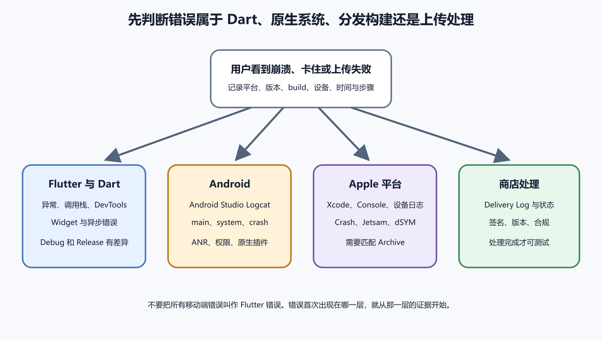

# Flutter、Logcat、Xcode 与商店上传错误

移动应用的错误会出现在几个不同阶段。Dart 代码运行时异常常在 Flutter 调试控制台出现，Android 系统与原生插件信息进入 Logcat，iOS 设备和系统事件由 Xcode 或 Apple 设备日志提供，签名与构建问题出现在构建输出，上传后的处理与合规问题则显示在商店后台。打开错误的窗口，很容易得到“没有日志”的误导结论。

先用一句话确定阶段。应用尚未生成安装包，应检查编译与签名；安装后点击按钮崩溃，应检查设备运行日志；本地 Archive 成功但后台没有可选构建，应检查上传、处理状态和邮件通知；构建已可测试但提交被拒，应阅读审核反馈。阶段一旦明确，工具就不再是一堆名字，而是各自负责一段证据。



*图 62-1　错误从 Flutter 调试、原生设备、构建签名到商店处理分层出现。维护者先确认失败阶段，再收集对应版本、设备和完整错误。下文提供等价说明。*

## 先区分五种失败阶段

第一种是编辑或静态检查失败，例如 Dart 语法、类型或分析规则不通过。第二种是构建失败，通常涉及依赖、Gradle、CocoaPods、编译器、签名或平台配置。第三种是安装与启动失败，安装包已经存在，但设备拒绝安装、应用启动即退出或插件初始化失败。第四种是运行中的功能错误，页面能打开，特定动作才触发异常。第五种是上传、处理、测试或审核失败，二进制已经离开本机，证据主要在商店后台和通知邮件。

同一段红字可能包含多层包装。Flutter 命令调用 Gradle，Gradle 再调用 Android 工具；Xcode 构建也会先输出大量步骤，末尾才总结失败。排错时应保留完整日志，同时找到最早一条能够指导行动的错误。最后一行 `BUILD FAILED` 只说明结果，前面的签名文件不存在、最低系统版本冲突或插件编译失败才是起点。

每次记录应用版本、构建号、提交哈希、Flutter 版本、操作系统、设备型号、系统版本、Debug 或 Release 模式和发生时间。仅说“最新版闪退”不够，因为测试者手机里的最新版、商店当前版本和开发者刚生成的构建可能不是同一个文件。界面截图适合展示发生位置，错误文本与日志文件适合搜索和比对，两者应一起保留。

运行位置为项目根目录，前提是已安装并配置 Flutter SDK、依赖已经获取、模拟器或测试设备可用。先确认环境和设备，再启动 Debug 构建。命令不会发布应用，但会在设备上安装开发构建。

```
flutter doctor -v
flutter devices
flutter run
```

`flutter doctor -v` 展示 Flutter、Android、Xcode 等工具链状态，`flutter devices` 列出可用目标，`flutter run` 构建并连接调试会话。预期结果是终端显示目标设备、构建过程和应用运行日志。若没有设备，先检查模拟器是否启动、USB 调试与授权是否完成；若 doctor 提示某个平台工具链缺失，只处理本次目标平台需要的项目，不要为了 Android 构建强行补齐 Xcode。

应用运行时，Dart 未捕获异常通常包含异常类型、消息和调用栈。先找到自己项目文件中最靠上的调用位置，再结合触发动作读取上下文。框架内部几十行调用栈并不等于 Flutter 本身有错误，常见情况是业务代码传入了无效值。Flutter 官方调试文档介绍断点、调试器、日志和 DevTools，Bug report 指南则强调可复现步骤、环境和最小示例。

不要只截取 `Null check operator used on a null value` 这一行。完整记录至少包含异常前后的用户动作、调用栈、应用版本和数据条件。若错误只在 Release 出现，要分别验证 Debug、Profile 与 Release，因为编译优化、调试断言、网络安全配置和原生签名可能不同。Release 故障不能仅靠 Debug 模式“没有问题”关闭。

## Flutter 日志、断点与界面问题各有用途

临时观察变量时，可以在代码中使用 Dart 与 Flutter 提供的调试输出，但生产版本不能无节制打印用户数据。断点适合稳定复现且能连接调试器的问题，能够查看调用顺序和变量；性能卡顿更适合用 Flutter DevTools 的性能时间线；布局溢出则应结合 Inspector 和终端里的布局错误。选择工具的依据是问题类型，而不是哪个窗口最熟悉。

若应用卡住但没有崩溃，记录点击前后状态、是否仍能滚动、网络请求是否完成、主线程是否繁忙。一个按钮没有响应，可能是回调未触发、Future 一直等待、界面状态未更新或原生插件阻塞。可以在关键边界加入短期、脱敏且带事件名的日志，确认程序走到哪里；验证完成后删除噪声输出或降低级别。

Hot reload 只更新部分 Dart 代码状态，不会重新执行所有初始化，也不能替代完整重启。修改原生插件、应用权限、启动配置或依赖后，应停止运行并重新构建。若热重载后问题消失或出现，要用冷启动再次验证，避免把开发会话的残留状态当成真实发布行为。

Logcat 汇集 Android 系统、应用进程和原生库输出，信息量远大于 Flutter 控制台。它适合处理应用启动即退、权限拒绝、Activity 与 Service 生命周期、平台通道、原生插件、系统资源和崩溃。Android Studio 的 Logcat 窗口便于按设备、应用与级别筛选，命令行 `adb logcat` 适合保存原始文本和重复执行。

运行位置为安装 Android SDK Platform Tools 的电脑，前提是目标设备已在 `adb devices` 中显示为 `device`。先核对设备，再清楚地区分“开始新的观察窗口”和“删除唯一证据”。测试设备上的旧缓冲区可以在确认无需保留后清理，生产用户设备则应先导出。

```
adb devices
adb logcat -v threadtime
```

第一行预期列出设备序列号与状态，第二行持续输出带日期、线程、级别和标签的日志，按 `Ctrl+C` 结束。若显示 `unauthorized`，应在设备上确认调试授权；若有多台设备，用 `adb -s 设备序列号 logcat` 明确目标。不要从互联网复制一条含其他序列号或包名的命令直接运行。

复现闪退时，先记录应用包名和开始时间，再在 Logcat 中查 `FATAL EXCEPTION`、`AndroidRuntime`、应用进程与崩溃附近的 `Caused by`。首个 `Caused by` 不一定最终根因，但通常比末尾重复堆栈更具体。Flutter 插件问题可能先在 Dart 层显示 `PlatformException`，同时在原生日志中给出权限、类加载或设备 API 的原因，两边要按同一时间对齐。

保存日志时限制故障窗口，减少系统噪声。下面示例把当前缓冲区导出到电脑文件，不会修改设备；文件可能包含其他应用或个人信息，分享前必须检查。

```
adb logcat -d \
  -v threadtime \
  > android-logcat.txt
```

若 PowerShell 终端执行，重定向语法可用，但文件编码和工具输出需在实际环境核对。预期当前目录出现 `android-logcat.txt`，末尾包含刚才复现的时间段。没有相关记录时，确认包名、设备、缓冲区、系统时间和应用进程是否正确；应用进程启动前就被系统拒绝时，不能只筛选该进程。

## Android 构建和签名错误从最早有效错误开始

`flutter build appbundle --release` 失败时，保留从命令开始到退出的完整输出，并记录实际 Flutter 与 Java 版本。依赖下载失败、Gradle 插件不兼容、Android SDK 缺失、Manifest 合并冲突和签名文件路径错误都可能在末尾汇总为同一个构建失败。先处理第一条与项目相关且可行动的错误，再重新构建，不要一次升级 Flutter、Java、Gradle 和全部依赖。

签名失败时检查 keystore 文件是否存在、配置读取的是哪个路径、alias 是否匹配、密码是否由安全机制提供，以及 Release 是否使用预期证书。日志与截图不能包含 keystore 密码、服务账号密钥或完整本地秘密文件。若 Play 已接管应用签名，还要区分上传密钥与应用签名密钥；二者职责不同，遇到上传密钥问题不能通过新建应用记录绕过历史更新关系。

构建成功后用生成文件的实际路径、大小、版本号和构建号做记录。不要只保存“成功”截图。上传后台提示版本代码已使用时，需要增加 `versionCode` 并重新构建；仅改面向用户的版本名称通常不足以形成可接受的新构建。具体字段和控制台要求可能变化，提交前应以检索当日的 Android Developers 与 Play Console 官方说明为准。

iOS 调试与发布需要真实 macOS、Xcode 和用户控制的 Apple 开发者配置。本工作环境是 Windows，因此下面内容依据截至 2026 年 8 月 6 日的 Apple 与 Flutter 官方资料整理，没有伪装成已经完成本机 Xcode 实测。最终出版前仍需在真实 Mac、测试设备与 App Store Connect 账号中核对界面和流程。

Xcode 构建失败时，在 Issue Navigator 或报告中找到第一个有效错误，记录 target、scheme、configuration、destination 和签名 Team。设备运行时崩溃，则保存设备型号、系统版本、应用构建号和复现步骤，并在 Xcode 连接的设备日志或 Organizer 中获取崩溃报告。Apple 的诊断资料强调崩溃报告、设备日志和符号信息，它们用于把内存地址还原到可读代码位置。

没有正确符号的崩溃报告可能只显示地址或系统库，难以定位自己的函数。发布构建应保存与该构建完全匹配的归档和调试符号，不能用另一个版本的符号文件猜测。Flutter 项目还要确认崩溃发生在 Dart、Flutter 引擎、插件还是原生宿主层；同一报告中先出现系统框架并不意味着 Apple 框架存在缺陷。

Apple 统一日志可以由系统框架和应用写入，隐私处理与可见范围受平台机制影响。生产日志应使用稳定类别、版本和必要上下文，避免直接记录密码、令牌、健康数据、位置和用户正文。临时为某个测试构建提高详细度时，应限制人群与期限，问题关闭后恢复正常级别。

## Archive 成功以后仍可能上传失败

Archive 只说明 Xcode 生成了归档，不说明 App Store 已接收。分发或上传阶段还会检查 bundle identifier、版本与 build、签名、entitlements、图标、隐私清单、受支持设备和平台要求。上传错误应保存完整 Delivery 信息、归档版本、构建号和发生时间，不能只截末尾的“Upload failed”。

常见处理顺序是先确认归档属于正确应用与 Team，再阅读第一条具体错误，修改后生成新的 Archive。若后台已接收过同一个 build number，通常需要增加构建号并重新归档，不能覆盖原构建。截至 2026 年 8 月 6 日，App Store Connect 官方状态参考区分处理中、处理失败和已完成等上传状态；界面文字与后台策略可能变化，封版前必须再次核对。

上传结束后，构建还会在服务器端处理，因此 Xcode 显示上传成功与 App Store Connect 立即可选之间可能有间隔。等待期间先检查应用记录、平台、版本、构建号、账号权限和 Apple 通知邮件。超过正常观察窗口仍不可见时，再按上传状态与邮件中的具体原因处理，不要连续重复上传完全相同的归档。

处理失败表示平台无法接受或处理二进制，常见证据是后台状态、邮件和上传工具输出。测试不可用可能来自合规问题、测试信息不完整或构建尚未关联。审核拒绝则是应用已经进入审核，反馈可能涉及功能、登录方式、权限说明、隐私披露、内容或元数据。三者对应不同负责人和修复材料，不应统称“商店报错”。

收到反馈后先逐条拆成可验证项。记录原文、关联版本、需要修改二进制还是只改后台资料、负责人和复测方式。审核要求测试账号时，应提供专用账号、稳定数据和明确操作路径，不能提供个人真实账号。需要回复解释时，说明实际行为和验证步骤，不要承诺尚未实现的功能。

商店规则与界面属于高变化信息。账号费用、测试人数、处理时间、SDK 要求、隐私表单和审核政策都应写“截至检索日期”，并引用官方资料。社区帖子可以帮助理解某段错误，但最终操作要回到 Flutter、Android Developers、Apple Developer 和商店后台的当前说明。

## 一次只修一个错误族

遇到二十条红字时，先把它们按阶段与共同原因分组。一个插件版本不兼容可能引发后续几十条类找不到错误，第一处修复后后续会一起消失。若同时升级插件、改变最低系统版本、重建证书和修改权限，即使构建成功也无法知道哪个动作必要，还可能把运行问题带进 Release。

每轮记录假设、单一改动、预期和实际结果。例如“假设 Android Release 使用了不存在的 keystore 路径；只把配置改为仓库外的实际文件位置；预期签名任务通过；实际签名通过，下一条错误变为版本代码重复”。下一条错误是新的排错起点，不代表之前的假设错误。完成构建后仍需安装或进入测试轨道，验证启动、登录、网络与更新路径。

缓存清理是常被滥用的动作。`flutter clean` 会移除可重建产物，可能解决陈旧生成文件，却不会修复错误的签名、权限或代码。执行前记录原始错误和版本，执行后重新获取依赖并比较结果。不要删除 keystore、证书、Provisioning Profile 备份、归档或用户数据来换取“干净环境”。

测试者安装内部测试版后，启动画面出现一秒便退出。Flutter 控制台没有连接到该 Release 构建，因此开发者先收集设备型号、Android 版本、应用版本和发生时间，再导出对应 Logcat。日志中 `FATAL EXCEPTION` 指向某原生插件初始化，紧邻错误说明缺少 Manifest 中所需配置。

开发者在测试分支只补充该配置，重新生成构建号更高的 AAB，并先在同型号测试设备安装验证。冷启动通过后，还要检查插件功能、拒绝权限时的提示、后台恢复和旧版本升级。随后进入内部测试轨道，确认 Play Console 显示的是新构建号。这个过程没有通过降低设备安全设置或改成 Debug 包绕过 Release 问题。

## 一个 App Store 构建不可见案例

Xcode 显示上传成功，但团队在 App Store Connect 的目标版本中看不到构建。维护者先确认 bundle identifier、版本、build number、Team 和应用记录一致，再检查后台上传状态与 Apple 邮件。状态显示处理失败，邮件指出归档中的某项平台材料不符合要求，问题发生在服务器处理阶段，不是 TestFlight 测试员配置。

团队修正材料后生成新 Archive，并增加 build number。新构建上传后完成处理，随后才关联到目标版本并进入内部测试。验证记录保留旧构建状态、错误全文、新旧归档编号和实际可见时间。由于本书当前没有真实 Mac 与该账号的操作证据，这个案例仅展示判断顺序；最终版必须用用户控制的测试应用复核当前界面，不制作虚构截图。

移动日志可能包含设备标识、账号、推送令牌、定位、文件路径、健康数据和用户输入。收集前说明目的、范围、保存位置与删除时间，只取故障窗口；分享给开发者或 AI 前进行脱敏。OWASP 的日志建议同样适用于移动端，日志应支持调查，但不能成为新的秘密与个人数据泄露源。

截图要遮住 Apple ID、邮箱、设备序列号、订单与令牌，但不能裁掉应用版本、状态、时间和错误类别。若必须保留原始文件，应限制访问并设置删除日期。公开 Issue 只放最小复现和脱敏片段，完整诊断材料使用受控渠道。

## AI 能做什么，哪些结果必须亲自确认

AI 可以对齐 Flutter 与 Logcat 时间、解释调用栈、把上传错误拆成检查项，也可以根据脱敏日志提出最小复现实验。输入时提供明确平台、构建模式、版本、设备、操作步骤、预期与实际，并要求它指出结论所依赖的原文。没有日志依据的猜测要标为待验证。

签名文件、证书私钥、商店账号、测试者数据和真实令牌不能交给 AI。AI 生成的 Gradle、Xcode 或权限修改必须经过 Diff 检查，并在测试构建中验证。上传、发布、回应审核与替换生产版本属于外部状态变化，最终按钮由账号持有人亲自确认。

- 已确认失败发生在分析、构建、安装、运行、上传处理还是审核阶段
- 记录了应用版本、构建号、提交、模式、设备与系统版本
- 保留完整日志，并找到最早一条可行动错误
- Flutter、Logcat 与 Xcode 证据按同一时间对齐
- Release 问题使用 Release 或商店测试构建复现
- Android 上传密钥与应用签名密钥没有混淆
- iOS 崩溃报告与正确归档和符号文件匹配
- 上传成功、处理完成、可测试和审核通过没有混为一谈
- 日志和截图已经脱敏，并限制保存范围
- 每轮只修改一个错误族，完成后检查相邻功能和升级路径

移动端排错的关键是尊重阶段边界。Flutter 控制台解释 Dart，Logcat 和 Xcode 补充设备与原生系统，构建工具处理编译签名，商店后台解释上传后的状态。把版本、设备、时间和构建号贯穿这些证据，才能知道它们是否描述同一个应用文件。
