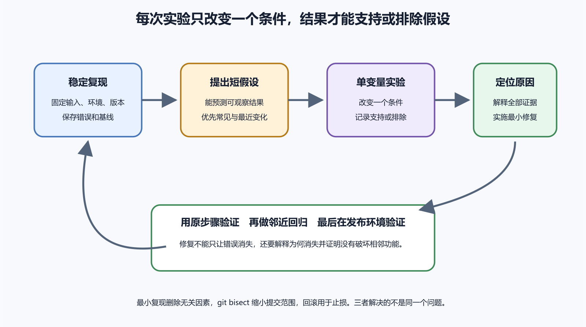

# 复现、调用栈、最小复现、最近改动和回滚

排错最怕一句“偶尔会坏”。它可能是真的随机，也可能只是条件没有写清。复现的价值，是把故障从雾里拖出来，让每个人都能用同一组步骤观察它。

*图 63-1　复现、假设、实验、修复和验证应形成可记录的循环。等价说明见本章“复现先把条件写清”。*

## 复现先把条件写清

一条复现记录至少包含环境、版本、数据、账号、步骤、预期和实际。环境包括设备、系统、浏览器、网络、后端环境和地区。版本包括前端 commit、后端 release、App build、数据库迁移状态和关键依赖。数据包括测试账号、订单、文件大小或触发条件。

步骤要能让另一个人照做。不要写“正常操作后失败”。写成打开页面、输入内容、点击按钮、等待几秒、看到什么。每一步只有一个动作和一个可观察结果。若需要先有旧数据、弱网、权限拒绝或某个角色，提前写清。

复现失败也有价值。它说明条件还不完整，或问题已经变化。记录“在 iPhone 15 iOS 19.1 build 18 未复现”，比沉默有用。

## 频率和范围决定实验设计

每次都失败的问题，可以逐层拆。换浏览器、换账号、换网络、换版本、看日志。偶发问题要先统计频率。十次中一次、每天凌晨一次、只在大文件上传时一次，它们对应不同方向。

范围也重要。所有用户失败，优先看入口、部署、后端和数据库。单个用户失败，优先看账号状态、权限、数据和设备。某个版本失败，优先看最近构建和兼容。某个地区失败，优先看 DNS、CDN、网络、支付和第三方服务可用性。

不要为了复现而污染生产数据。使用测试账号、测试环境或可清理的合成数据。必须在生产验证时，动作要小，有人批准，并提前准备撤销办法。

频率低的问题要扩大观察，而不是靠人不断手点。可以增加脱敏日志、计数指标、请求编号和客户端版本字段。记录失败前后的状态，比如队列长度、内存、外部 API 响应时间和数据库连接数。等证据足够后，再设计更小的复现实验。

范围变化也要记录时间。今天只影响测试账号，明天影响生产用户，说明故障在扩大或条件改变。发布后前十分钟正常，半小时后失败，可能与缓存、队列、定时任务、配额或流量有关。

## 调用栈要找应用相关帧

调用栈显示程序从哪里一路调用到错误位置。最上面一行不一定是根因。框架、系统库和运行时经常出现在顶部。要找第一个与你的应用代码、配置或依赖相关的帧，再结合用户动作判断。

前端压缩后，调用栈可能只有短变量名。需要 source map 才能还原。后端栈可能包含路径、环境变量和用户数据，分享前要脱敏。移动端 Release 崩溃需要 dSYM、mapping 或 Flutter 符号目录。没有匹配符号，地址很难变成可读函数。

调用栈不能单独证明业务根因。空指针说明代码读到了空值，还要问为什么会空。数据库唯一约束冲突说明重复写入，还要问请求为何重复、后端是否幂等、界面是否允许连续点击。

调用栈还要和版本对应。用户发来的崩溃若来自旧 build，用新源码看行号可能完全错位。后端容器若已经滚动部署，日志里同一路径可能对应不同镜像。先确认提交、构建号、镜像摘要、Archive 或符号文件，再读调用栈。

若调用栈指向第三方库，也不要立刻认定库有 bug。检查传入参数、版本兼容、平台配置和使用方式。给维护者提交问题时，最小复现比一句“你们库崩了”有用得多。

## 最小复现保留触发机制

最小复现不是把项目删到只剩一个文件。它要保留触发问题的机制，同时去掉无关部分。CORS 问题要保留浏览器、域名、请求头和服务端响应。数据库事务问题要保留表结构、并发写入和约束。Flutter 插件问题要保留平台目录和插件配置。

一个好最小复现让别人不用进入你的全部业务，也能看到同类失败。它还会逼你分辨哪些条件必要。删掉登录后问题消失，说明身份或权限可能参与。换成小文件后上传正常，说明体积、超时或代理限制参与。

最小复现可以放在临时仓库、脚本或测试用例中。不要包含真实密钥、生产数据和用户文件。提交给开源项目时，遵守项目的 Issue 模板和最小示例要求。

## 二分定位减少争吵

最近改动很多时，可以用二分定位。先找一个确定正常的版本和一个确定失败的版本，再在中间版本测试。每次测试把范围砍掉一半。它适合代码提交、依赖升级、配置变更和构建产物比较。

二分定位需要稳定复现。若问题偶发，先建立能稳定观察的指标或脚本。否则一次成功可能只是运气。数据库迁移、外部 API 和生产数据变化也会干扰结果，测试前要固定环境。

找到引入问题的提交后，也不要立刻责怪提交者。它只是最早让问题出现的变化。根因可能是旧代码已有假设，新变化碰到了它。二分定位给你线索，修复仍要回到证据和用户路径。

## 最近改动包括代码以外的变化

故障发生在一次发布后，最近提交值得优先看。完整变更面还包括依赖解析、环境变量、证书、DNS、数据库迁移、平台策略、流量、数据规模、系统更新和外部 API。没有人主动部署，证书到期或云平台规则调整也能改变结果。

建立一张变更表。

| 时间 | 变化 | 负责人 | 可能影响 | 证据 |
| --- | --- | --- | --- | --- |
| 13 点 20 分 | 前端部署 | 小林 | 静态资源与 API 路径 | 部署记录 |
| 13 点 40 分 | 数据库迁移 | 小周 | 订单字段 | 迁移日志 |
| 14 点 | 支付回调超时 | 外部服务 | 下单结果 | 状态页 |

这张表不直接给出根因。它防止你只盯着代码。排查时按时间和影响范围逐项验证。

## 回滚用于恢复，修复用于消除原因

回滚的目标是恢复服务，修复的目标是消除原因。两者经常不同。网页代码可以回滚，数据库迁移、外部邮件、付款、对象存储写入和用户操作不一定能回滚。App 已安装到用户设备后，也不能像网页那样瞬间换回旧包。

回滚前先看有没有状态变化。新版本是否写入了旧版本不能读取的数据。是否发送了外部通知。是否产生了订单和付款。是否执行了破坏性迁移。若答案不清楚，不要直接运行所谓 down migration。

回滚后仍要继续查根因。服务恢复不代表问题解释完成。把临时开关、降级配置和日志级别都写进记录，避免它们永久留在生产。

## 回滚失败时停止连续试错

回滚失败后，不要立刻再回滚另一个版本、清理缓存、重启数据库和改 DNS。先停下来，记录当前状态。确认流量入口、代码版本、数据库 schema、配置、队列和外部服务处在哪个组合。连续试错会把系统推到没人认识的状态。

若用户影响仍在扩大，选择更明确的止损办法。关闭入口、只读模式、暂停发布、关闭高风险功能或切到维护页。每个动作都要有恢复路径。对于数据写坏风险，宁可短暂停写，也不要继续收集错误数据。

回滚还要处理客户端版本。Web 前端可以重新部署旧构建，用户浏览器和 CDN 仍可能缓存新文件。App 已经更新到用户设备，就需要更高版本修复或后端兼容。小程序线上版可以重新发布或回退到可用版本，但后端写入、支付、消息和文件不会自动撤销。

所以回滚计划要分成代码、数据、配置和用户影响四块。代码回到旧版本，数据是否仍被旧版本读懂。配置是否也要回到旧值。用户在故障期间做过的操作是否需要补偿。只写“可回滚”三个字，没有说明这些问题，事故时会很难用。

## 修复验证要回到原始现象

开发者常在局部验证修复。函数测试通过，接口返回正常，构建成功。还要回到最初用户看到的现象。用户从同一个入口、同一类账号、同一设备或浏览器，按同样步骤操作，是否恢复。若原问题是升级后崩溃，就从旧版本升级。若原问题是弱网重复下单，就在弱网和重复点击下验证。

修复还要验证没有扩大影响。权限修了，管理员是否仍能操作。缓存修了，旧浏览器是否还能打开。数据库索引加了，写入是否变慢。一个补丁只要碰到共享层，就要看相邻路径。

## 并发、时间和随机问题

有些故障需要特殊复现。并发问题要控制同时请求数、数据初始状态和顺序。时间问题要控制时区、夏令时、日期边界、证书到期和定时任务。随机问题要记录随机种子、数据样本、机器负载和外部服务返回。

性能问题也要保留条件。数据量、设备、网络、缓存状态、并发用户和版本都影响结果。只说“变慢了”很难修。写成“一万条订单的搜索在 Chrome 中从 300 毫秒变成 4 秒”，方向就清楚很多。

## 把复现变成回归测试

修复完成后，把复现步骤转成测试。前端可以写组件测试或端到端测试。后端可以写接口测试、契约测试或数据库迁移测试。移动端可以保留人工升级脚本和关键真机清单。不是所有事故都能自动化，但最小复现至少能变成下次发布前的检查项。

AI 适合把现象整理成实验清单，生成测试草稿，比较最近改动。它不负责宣告根因。根因要靠复现、证据、修复和再次验证一起成立。没有这四步，最多叫当前猜测。

回归测试要覆盖事故发生的入口，不要只测试修复函数。支付重复提交，就测试两次请求和幂等结果。App 升级崩溃，就保留旧数据库升级样本。缓存导致旧前端调用新后端，就测试版本兼容。事故来自用户路径，测试也要尽量回到用户路径。

测试写不出来时，至少保留人工检查卡。写清准备数据、设备、步骤、预期结果和证据位置。下一次发布前照着走。自动化是好事，能被人稳定执行的手工清单也比记忆可靠。
