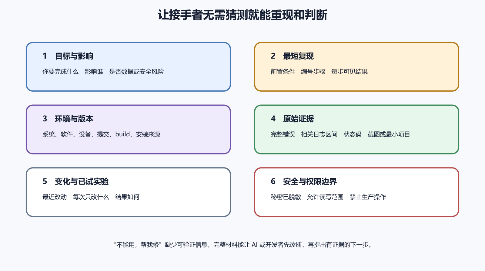

# 怎样向 AI 或开发者提交完整报错

一个好报错能省掉很多来回。它不需要写成论文，只要让接收者知道发生了什么、在哪里发生、怎样复现、你已经看过哪些证据、哪些信息不能公开。对 AI 也是一样。你给它一张模糊截图，它就只能猜。你给它完整上下文，它才有机会帮你缩小范围。



*图 64-1　完整报错要包含摘要、环境、步骤、证据、最近改动和安全边界。等价说明见本章“第一屏先让人知道发生了什么”。*

## 第一屏先让人知道发生了什么

报错第一段写五件事。哪个产品，哪个入口，做了什么，看到什么，影响谁。接收者不用先读二十张截图，就能判断大致层级。

```text
产品　记账 Web 后台
入口　/orders/new
动作　普通用户点击保存订单
实际　页面提示保存失败，Network 中 POST /api/orders 返回 500
预期　保存成功并回到订单列表
影响　两个测试账号稳定复现，生产用户暂未确认
```

标题也要具体。“系统坏了”不如“普通用户保存订单返回 500”。“App 闪退”不如“Android build 42 从 1.9 升级后启动闪退”。标题先给层级，正文再给证据。

不要把猜测写进标题。你可以写“疑似数据库唯一约束冲突”，前提是日志里确实有对应证据。没有证据时，写现象就好。准确的现象比漂亮的根因猜测更有用。

## 复现步骤一一对应

复现步骤要让动作和结果配对。每一步只做一件事。

```text
1. 使用普通用户 test-user 登录。
2. 打开订单新建页。
3. 输入商品 A，数量 1。
4. 点击保存。
5. 页面停留在原处，右上角显示保存失败。
```

若复现需要特定条件，先写前置条件。账号角色、旧版本数据、浏览器、设备、网络、时间、权限拒绝、文件大小、地区和后端环境都可能是条件。缺少前置条件，别人会在干净环境里试半天。

实际结果要可观察。不要写“系统不正常”。写状态码、错误文字、页面变化、日志片段、崩溃类型、耗时或截图。预期结果也要可观察。写“应该保存订单并返回列表”，比“应该正常”更清楚。

## 环境和版本

环境信息不是客套话。浏览器、系统、设备、App build、前端提交、后端版本、数据库迁移状态、Docker 镜像、Node 或 Flutter 版本，都可能改变结果。只要它可能影响故障，就写。

Web 问题至少写 URL、浏览器、账号角色、前端部署、后端环境和 Network 证据。服务器问题写域名、代理、应用版本、容器名、日志时间和请求编号。移动端问题写平台、设备、系统版本、安装来源、versionName、versionCode 或 build。商店上传问题写包名或 Bundle ID、目标轨道、错误原文和账号角色。

时间要有时区。日志系统、用户设备和云平台可能使用不同时间。写“今天下午”很难对日志。写“2026 年 8 月 29 日 14 点 12 分，中国标准时间”，接收者能找到对应区间。

版本信息要来自可验证位置。网页可以在页脚、构建变量或部署平台找到提交号。后端可以在健康检查、容器镜像或发布记录中找到版本。App 可以在关于页面、商店后台、TestFlight 或安装包信息里看到 build。不要凭文件名猜版本。`release-final-new2.apk` 这种名字没有诊断价值。

如果你不知道版本，就写不知道，并说明你能看到什么。比如“页面页脚没有版本号，部署平台最新生产部署时间为 14 点 05 分”。这比随便填一个版本号好。缺口本身会提醒团队补版本展示和发布记录。

## 最近改动附证据

最近改动不要写成猜测。写部署记录、提交号、配置变化、依赖升级、证书轮换、DNS 修改、数据库迁移、商店 build、后端开关和第三方服务状态。能附链接或编号就附，不能附时写时间和负责人。

不要把无关改动都塞进去。过去一个月所有提交没人看得完。先列和现象时间接近、影响层级相关的变化。保存订单失败，就优先列订单 API、数据库迁移、权限、部署和依赖。页面字体调整可以先放后。

如果你已经试过一些动作，也要写清。清缓存、换账号、换浏览器、回滚、重启、改配置，每一步都写结果。不要只写“都试过了”。这句话会让接收者重新问一遍。

## 附件要能独立使用

截图要包含定位问题所需的地址、时间、完整错误和版本；地址中的一次性令牌与查询参数先检查再分享。只截一个红色弹窗，接收者不知道页面、账号和操作。日志片段要包含足以看出因果的前后文，范围由请求编号、错误时间和相关操作决定，不必机械截取固定行数。HAR、崩溃报告、构建日志和最小复现仓库，都要说明怎样打开。

附件先脱敏。Cookie、Authorization、数据库连接串、SSH 私钥、服务账号 JSON、付款资料、手机号、邮箱、真实订单和用户正文都不应公开。给 AI 也一样。需要展示结构时，用占位符保留形状。

最小复现要能运行。README 写清依赖、命令、预期错误和清理方式。不要让接收者先猜项目根目录。若问题来自第三方平台，附控制台错误原文和相关设置截图，但遮掉账号和密钥。

日志附件要控制大小。不要把一天的生产日志全部贴进聊天。先按时间、请求编号、用户动作和版本截取相关区间。保留前后文，避免只剩一行错误。若日志太大，生成脱敏文件并说明筛选条件。接收者需要知道这份日志来自哪里，又漏掉了什么。

截图也要有顺序。先放入口和错误，再放 Network 或 Console，再放相关后台状态。二十张截图没有标题，接收者会反复问哪张先看。给每个附件起一个短名字，例如 `01-network-500.png`、`02-runtime-log.txt`。

## 给 AI 的提问

给 AI 提问时，限定任务。让它“根据这些日志判断下一步该查哪一层”，比“帮我修好”更安全。让它先列证据和假设，再提出最小改动。涉及生产、删除、迁移、密钥和付款时，不让它直接决定操作。

一个合适提示可以这样写。

```text
请根据下面的脱敏日志，判断故障更可能发生在哪一层。
不要假设我没有提供的配置。
请列出三个可验证假设和每个假设需要看的证据。
不要建议删除数据或重置密钥，除非先说明风险。
```

AI 的回答要落到可验证动作。检查 Network、查请求编号、比较版本、看构建日志、确认签名指纹，这些动作有用。笼统说“优化后端”“检查配置”不够。

如果让 AI 改代码，先给范围。允许改哪些文件，不能碰哪些文件，是否允许改依赖、数据库迁移、CI、环境变量和部署配置。很多风险来自范围外修改。一个按钮报错任务，AI 顺手升级框架、改鉴权、重写路由，看起来勤快，排查会变难。

要求 AI 交付证据。它改完后应说明改了哪些文件、为什么改、如何验证、哪些情况未覆盖。不要只接受“已修复”。对生产问题，先让它在本地或测试环境给出复现和验证，不直接把补丁推到线上。

遇到含秘密的报错，先让 AI 说明需要哪些字段，而不是直接贴完整日志。它通常只需要变量名、错误类型、脱敏 URL、状态码和配置结构。真实值由人保留在安全环境里核对。

## 给开发者和开源项目的报错

给开发者报错，要尊重项目规则。先搜已有 Issue，确认是否已有同类问题。阅读模板，提供版本、系统、最小复现和完整错误。不要把自己的生产密码贴进公开仓库，也不要要求维护者登录你的真实账号。

开源项目维护者不认识你的业务。你要把问题缩小到库、框架或工具本身。如果只有你的完整项目会失败，先准备最小复现。若无法最小化，至少说明你已经排除哪些条件。

商业支持则要附合同或账号允许的材料。别把公司内部日志发到个人邮箱。先确认接收方、保密边界、数据脱敏和处理期限。

给团队内部开发者时，也要避免把情绪当证据。写“这个功能又坏了”只会让对方防御。写“build 42 中普通用户保存订单返回 500，build 41 不复现”，问题会清楚很多。若你怀疑某次改动，附上证据和时间，不把猜测写成指责。

报错也要说明优先级。影响所有生产用户、涉及钱或数据丢失、阻断审核、只影响内部测试，处理顺序不同。优先级来自影响和风险，不来自谁声音更大。

## 接收追问后更新报告

别人追问，不代表你一开始失败了。排错就是逐步缩小。更新报告时，把新证据加到原记录，而不是开十个新聊天。旧猜测被推翻，要写明。这样后面加入的人能看到过程。

如果问题已经解决，也要回报原因和修复办法。写清修复版本、用户是否需要操作、数据是否需要补偿，并说明有没有新增测试。只说“好了谢谢”，下一次同类问题还要重新来。

更新报告时保留结论边界。可以写“当前证据指向后端版本 42 的订单校验错误，修复已在版本 43 验证”。不要写成所有类似保存失败都已永久解决。新的证据出现时，报告继续改。

一份报告最终应能留下可复用知识。把可复用部分放进 README、运行手册、FAQ 或测试用例。把临时聊天里的关键结论搬到项目文档。否则同一个错误三个月后再来，团队还会翻聊天记录找那句“当时怎么弄好的”。

## 一份可复制的报错模板

团队可以把下面的模板放进 Issue 或工单系统。

```text
一句话摘要：
影响范围：
开始时间：
入口：
环境与版本：
复现步骤：
预期结果：
实际结果：
错误证据：
最近改动：
已尝试动作：
敏感信息处理：
需要协助判断的问题：
```

模板不是为了增加填写负担。它让报告人少漏关键信息，也让接收者知道从哪里开始。字段不知道就写不知道，不能编。涉及安全、付款、生产数据和用户隐私时，在敏感信息处理里写明哪些内容已脱敏，哪些证据只能由有权限的人查看。

最终检查。

- 标题能否说明现象和层级。
- 环境、版本、时间、账号和入口是否完整。
- 复现步骤能否让别人照做。
- 实际结果和预期结果是否可观察。
- 日志、截图和附件是否脱敏。
- 最近改动和已尝试动作是否写清结果。
- 给 AI 的任务是否限定在证据和假设内。
