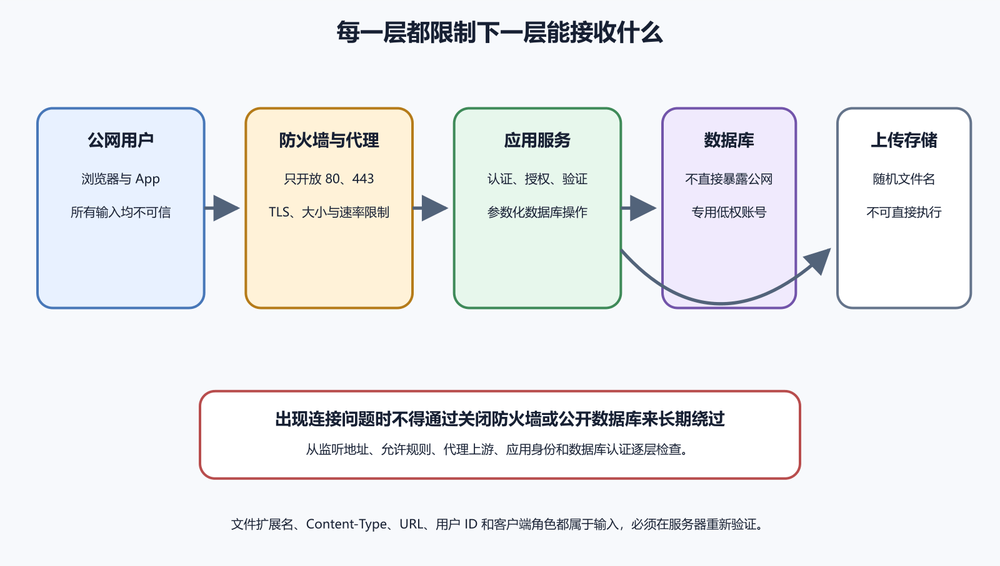

# 防火墙、数据库暴露、输入验证和文件上传

互联网服务的安全边界可以从一条请求看清。防火墙决定网络连接能否到达主机，数据库监听与认证决定谁能连接数据服务，应用授权决定当前用户能否操作目标资源，输入验证决定程序接受什么数据，文件上传还要处理类型、大小、存储和后续访问。每层只解决一部分问题，缺少任何一层都可能让其他保护承受不必要压力。

安全配置不能以“绝对安全”为目标，也不能靠关闭功能逃避责任。更实用的做法是减少公开入口、默认拒绝未明确允许的动作、验证所有不可信输入、隔离上传内容、及时更新，并为失败准备日志与恢复。CISA 的基础安全资料同样把资产、访问、更新、备份和事件响应视为持续工作。



*图 66-1　公网流量先经过云防火墙和主机防火墙，再进入代理与应用；数据库和上传存储保持受限，每个请求继续执行身份、授权与输入验证。下文提供等价说明。*

## 先列出真正需要公开的入口

一个常见网站通常只需要向公网开放 HTTPS 的 443 端口，HTTP 的 80 端口可用于跳转或证书流程，SSH 只向受控来源或管理网络开放。应用内部端口、PostgreSQL 的 5432、Redis、Docker daemon 和管理面板不应因为“调试方便”直接暴露全网。端口开放是一项架构决定，应记录用途、负责人和关闭条件。

云平台安全组、供应商防火墙、Ubuntu UFW 和应用监听地址可能同时生效。外层拒绝会让流量根本到不了主机，主机防火墙拒绝会让应用日志为空，应用只监听 `127.0.0.1` 则外部即使到达主机也无法直连。排错时要辨认每层，不能一遇到超时就关闭所有防火墙。

先用资产清单记录公网 IP、域名、开放端口、服务进程和预期来源。再从受控外部网络测试公开入口，从服务器本机测试内部入口。成功结果应符合设计，例如公网 443 可达、5432 不可达、本机代理可以连接应用的 3000。结果不同就检查具体层，不扩大整个地址范围。

下面命令适用于使用 UFW 的 Ubuntu 服务器，运行位置是已经通过 SSH 登录的终端，前提是云平台外层规则允许正确 SSH 端口，并且维护者知道当前 SSH 实际监听端口。Ubuntu 官方文档说明 UFW 的规则与状态操作。

```
sudo ufw status verbose
sudo ss -lntp
```

第一行只读检查 UFW 当前状态与规则，第二行查看主机监听端口。预期能确认 SSH、HTTP、HTTPS 和内部服务的真实端口。若 SSH 使用非默认端口，后续规则必须替换示例中的 22。不要根据教程猜端口，也不要在没有第二个恢复入口时直接启用拒绝策略。

确认端口后，先允许当前 SSH，再允许 Web 流量，最后启用 UFW。使用云控制台、快照或供应商恢复模式作为后备，并保持当前会话不断开，从第二个终端验证新连接。

```
sudo ufw allow 22/tcp
sudo ufw allow 80/tcp
sudo ufw allow 443/tcp
sudo ufw enable
sudo ufw status numbered
```

预期状态为 active，并显示三条预期规则。若第二个 SSH 会话失败，不要关闭当前会话，先检查云防火墙、实际端口、来源限制和 UFW 日志。规则可进一步按管理来源 IP 收窄，但家庭网络公网地址可能变化；使用 VPN 或供应商管理通道常比长期开放全网更稳定。

高风险操作

> 不要执行“允许所有端口”来证明应用能用，也不要在远程会话中先删除 SSH 规则。先做只读检查，添加精确允许，从第二个会话验证，再移除旧规则。

## 防火墙不等于应用授权

443 对公网开放后，任何人都能连接 Web 入口，后端仍要验证身份与权限。防火墙看见的是地址与端口，通常不知道用户是否有权修改某条笔记。页面隐藏按钮、前端路由守卫和客户端角色字段都可以被绕过，API 必须在每次请求中检查当前主体、目标资源和动作。

OWASP 授权指南强调默认拒绝和服务端验证。例如 `DELETE /notes/123` 不能只确认用户已经登录，还要确认笔记 123 属于该用户或用户拥有明确管理权限。对象编号换成难猜的 UUID 可以降低偶然发现，却不能代替授权检查。

权限错误应返回合适结果并写安全日志，日志记录内部主体编号、目标类别、动作、结果和请求编号，不记录完整令牌。大量拒绝可能提示攻击或客户端缺陷，但告警阈值要避免被正常错误淹没。

Web 应用通常由后端连接数据库，用户浏览器不需要直接访问 PostgreSQL。数据库监听地址、云网络规则、主机防火墙、`pg_hba.conf`、TLS、账号与数据库权限共同形成边界。只配置强密码，却让 5432 面向全网，会增加扫描、暴力尝试和未知漏洞风险。

PostgreSQL 的 `listen_addresses` 决定服务器在哪些网络接口监听，`pg_hba.conf` 根据连接类型、数据库、用户与来源选择认证规则。应用和数据库在同一主机时，可以考虑只监听本机；在私有网络不同主机时，只允许应用子网或准确来源。具体设置要符合部署结构，不能机械复制 `0.0.0.0/0`。

检查数据库暴露应分三步。先在数据库主机用 `ss -lntp` 确认监听地址，再核对外层与 UFW 规则，最后从一个获准应用主机和一个未获准外部位置分别测试。预期是前者按认证策略连接，后者超时或拒绝。测试使用专用低权限账号，不在命令历史中直接写密码。

`pg_hba.conf` 按顺序匹配，第一条匹配规则决定认证方式。修改后要按 PostgreSQL 文档重新加载并查看错误日志，语法错误或顺序不当会影响连接。保留当前管理会话和恢复路径，避免把所有管理员锁在外面。数据库超级用户只用于受控管理，应用运行账号限制到必要数据库、schema 与操作。

## 输入验证要在服务端再次执行

所有来自浏览器、App、Webhook、文件、URL、消息队列和第三方 API 的数据都应视为不可信。前端验证可以即时提示用户，攻击者却能绕过页面直接发送请求，因此服务端必须重复验证。验证通过也不代表已经授权，格式正确的笔记 ID 仍可能属于另一个用户。

语法验证检查结构，例如日期格式、字符串长度、整数范围、枚举值和 JSON 字段。语义验证检查业务含义，例如结束日期不能早于开始日期、库存不能为负、普通用户不能选择管理员角色。OWASP 输入验证指南建议尽量使用允许列表，明确接受有限集合，比试图列举所有危险字符更可靠。

对数据库使用参数化查询或可靠 ORM 参数绑定，不能把用户输入拼进 SQL。对 HTML 输出按上下文编码，不能依赖输入过滤一次解决所有显示位置。对操作系统命令避免直接调用 shell，确需调用时使用固定程序和参数数组，并限制允许值。每种注入风险都有对应执行上下文，通用的“删掉特殊字符”既会误伤正常内容，也容易被绕过。

错误响应不要回显内部查询、文件路径、栈和验证规则细节。面向用户说明哪个字段需要修正，服务端用错误编号关联详细日志。验证失败率异常升高时，结合来源、账号与请求编号告警，但不要把完整恶意载荷永久保存到普通日志。

## 文件上传同时处理内容和后续使用

上传功能把用户控制的字节带入系统，风险不止“扩展名错了”。文件可能伪装类型、包含恶意脚本、体积巨大、压缩后急剧膨胀、利用解析器漏洞、覆盖现有文件，或在公开链接中泄露隐私。OWASP 文件上传指南建议组合扩展名、内容类型、文件签名、重命名、大小、存储位置、权限和扫描等多层控制。

第一层明确业务允许什么。头像可能只允许经过服务器重新编码的 JPEG、PNG 或 WebP，并限制像素与字节；文档系统可能允许 PDF，但仍要限制页数、解析方式和公开范围。不要提供“任意文件”再依赖杀毒软件兜底。允许列表、限制和失败提示应与真实产品需求一致。

第二层不要信任原始文件名和浏览器提供的 MIME type。服务器生成随机存储名，原始名称只作为脱敏元数据；同时检查扩展名、声明类型和文件签名，并用安全解析器验证。双扩展名、大小写、空字节与特殊路径都要由成熟库处理。即使检查通过，也只能说明符合预期格式，不能证明内容绝对无害。

第三层把文件放在 Web 根目录之外或独立对象存储中，默认私有，通过应用授权或短期签名链接访问。Web 服务器不执行上传文件，响应设置安全内容类型与下载策略。公开图片与私密文档使用不同存储规则，删除账号时还要处理派生缩略图、缓存和备份保留。

第四层限制单文件、单请求、单用户和总存储量，并为解析设置 CPU、内存与时间上限。压缩包要防止路径穿越和解压炸弹，不在生产目录直接展开。需要病毒或内容扫描时，文件先进入隔离区，扫描和业务验证通过后再发布；扫描失败或超时保持不可访问状态。

## 代理限制和应用限制要相互配合

反向代理可以限制请求体大小、连接数、超时和请求速率，尽早拒绝明显超限流量。应用仍要按当前用户、业务类型和剩余额度再次检查，因为代理不知道一个五兆文件对头像合理，对文本字段却完全异常。两层阈值应有明确关系，代理上限不能小于合法业务请求，也不能大到让应用在验证前耗尽内存。

超时要覆盖连接、读取、应用处理和外部服务，每层错误与日志字段不同。盲目把所有超时改成十分钟，会让连接和工作线程长期占用。先测正常文件大小与处理时间，为极端但合法场景留余量，再对异步处理返回任务编号，让客户端查询状态。

限流用于约束单个来源、账号或操作的频率，降低暴力尝试、重复提交与资源耗尽。来源 IP 可能由代理共享，攻击者也能分布请求，因此重要操作还要结合账号、设备、业务键与全局容量。限流响应说明何时重试，写操作配合幂等键，不能让客户端无限立即重试。

跨源资源共享 CORS 决定浏览器是否允许某个网页来源读取跨域响应，它不是服务器身份认证，也不会阻止非浏览器客户端直接发送请求。允许来源应是准确的受控站点，使用凭据时不能随意允许所有来源。命令行请求成功而浏览器失败时，才应结合 Origin、预检与响应头检查 CORS。

跨站请求伪造 CSRF 利用浏览器自动携带 Cookie，让用户在不知情时执行写操作。使用 Cookie 会话的应用要采用合适的 SameSite、CSRF Token、来源检查和重新认证等组合，具体取决于业务风险。只设置 CORS 不能完整防止 CSRF，隐藏按钮也没有作用。

使用 Authorization 头的 API 也要防止令牌泄露、恶意脚本和不安全存储。认证方式改变威胁边界，不会消除服务端授权与输入验证。安全测试分别覆盖未登录、普通用户、资源所有者、管理员和跨来源请求，验证允许与拒绝都符合设计。

## 错误处理要避免放大攻击

验证失败、限流、上传拒绝和数据库授权错误应快速结束，释放临时文件、连接与内存。错误页只返回必要提示和稳定编号，详细解析器错误与内部路径留在受控日志。若一次恶意文件能触发大量调用栈和告警，日志本身也可能被用来占满磁盘。

对连续失败设置聚合与采样，同时保留安全事件计数和少量代表样本。自动封禁要谨慎，攻击者可能伪造或共享来源，使正常用户受影响。高风险操作可以增加多因素确认、验证码或人工审核，不能依赖一个容易误伤的 IP 黑名单。

HTTPS 保护传输中的机密性与完整性，证书还要匹配域名并在有效期内。HTTP 应按设计跳转到 HTTPS，敏感 Cookie 使用 `Secure` 与 `HttpOnly` 等属性。反向代理终止 TLS 后，应用仍要正确识别原始协议和可信代理，不能无条件相信任意客户端伪造的转发头。

浏览器安全响应头可以限制页面被嵌入、资源从哪里加载、浏览器怎样处理内容类型和传输策略。内容安全策略应从真实资源清单设计并在报告模式观察，再逐步收紧。直接复制一条过严策略会让正常脚本与图片失效，复制过宽策略又可能没有实际保护。

安全头不能修复后端授权、SQL 注入和上传执行。它们属于浏览器侧补充边界，测试应覆盖正常页面、登录回调、第三方资源与错误页。配置后通过 Network 查看最终响应，而不是只读代理模板，因为 CDN、平台和应用都可能增加或覆盖头。

## 下载远程 URL 会引入 SSRF 风险

“粘贴图片网址，由服务器代下载”看似方便，却让用户控制服务器访问的目标。攻击者可能请求云元数据地址、内网管理面、localhost 或重定向后的私有地址，这类问题称为服务器端请求伪造。OWASP SSRF 指南建议优先使用允许列表，并对协议、域名、解析地址、重定向和网络出口进行限制。

若业务只需从固定合作方导入，应只允许其 HTTPS 域名与预期路径，并在每次解析和重定向后检查目标地址。通用网页抓取更复杂，需要独立隔离网络、阻止私有与保留地址、限制响应大小、类型、时间和重定向次数。简单正则检查 URL 字符串无法覆盖 DNS 变化与跳转。

服务器获取的内容仍按不可信上传处理。即使目标域名合法，文件也可能过大、类型错误或随后改变。下载过程使用低权限服务账号，不携带内部 Cookie 与云凭据，日志记录安全的目标摘要、结果和请求编号。

图片、PDF、压缩包和媒体解析器都可能出现安全漏洞。操作系统与依赖更新应进入固定维护流程，先在测试环境验证，再按风险窗口部署并准备回滚。Ubuntu 自动更新与 GitHub Dependabot alerts 可以提供部分更新与已知漏洞提醒。

更新工具不会自动证明应用安全。项目还要知道哪些库实际进入生产、漏洞是否影响使用路径、修复版本会不会破坏兼容。高风险且正在利用的漏洞需要加急处理，普通更新也不能无限拖延。移除不使用的解析器和插件，通常比长期维护更多攻击面更省力。

## 一个被错误开放的数据库案例

假设维护者为了让本地工具连接 VPS，把 PostgreSQL 配置为监听所有接口，并在云防火墙允许全网 5432。应用恢复连接后，这条临时规则没有关闭，数据库日志开始出现大量未知来源认证失败。强密码暂时阻止登录，却不能消除公网暴露和持续扫描。

处置时先确认合法应用来源和当前会话，保存相关日志，再从外层规则移除全网入口。数据库只监听私有接口或本机，`pg_hba.conf` 只允许应用账号从准确来源访问。随后轮换可能暴露的密码，检查登录、角色和数据变化，从获准与未获准位置分别验证。

长期改进包括把管理访问放进 VPN 或受控隧道、设置数据库认证失败告警、记录端口负责人和到期日期。不要通过关闭防火墙日志隐藏扫描，也不要把来源从全网缩到一个仍然过大的网段后宣告完成。结果应以实际监听、规则、认证和外部测试共同证明。

头像功能只需要静态图片。服务端限制认证用户、每个文件五兆以内、允许 JPEG 与 PNG，读取文件签名并用安全图片库解码，再重新编码为固定尺寸。存储名由服务器随机生成，原始名称不参与路径；文件进入私有对象存储，通过授权后的短期链接访问。

若解码失败、像素过大、扫描超时或用户超额，上传保持隔离并返回安全错误编号。日志记录用户内部编号、文件大小、检测类型、结果和请求编号，不记录图片内容或签名链接。删除头像时同时删除当前对象和可控派生文件，备份按公开的数据保留政策到期清除。

这个设计没有声称文件绝对安全。它把允许范围压缩到业务需要，并让每层失败都可见、可限制和可撤销。若未来增加 PDF，应该新增独立处理流程和风险审查，不能因为已有上传接口就直接放宽允许扩展名。

## AI 可以审查边界，不能替你开放入口

AI 可以根据脱敏架构图检查公开端口、生成 UFW 规则草案、审查验证逻辑和上传威胁清单。输入应包含预期流量方向、服务监听、部署平台和业务允许类型，不包含真实私钥、数据库密码与用户文件。要求它把只读检查、配置修改和破坏性动作分开。

防火墙启用、数据库规则变更、对象存储权限和删除隔离文件都会改变外部状态。执行前由维护者确认当前会话、恢复通道、准确地址、备份与验证步骤。AI 给出的 `0.0.0.0/0`、`chmod 777`、关闭 TLS 或关闭验证建议，应视为高风险信号并停止。

- 公网端口有清单、用途、负责人和关闭条件
- 云防火墙、UFW、监听地址与应用授权分别验证
- 启用远程防火墙前保留当前会话和恢复入口
- 数据库未向全网开放，应用使用低权限账号
- `pg_hba.conf` 来源、用户、数据库和顺序经过核对
- 客户端与服务端都验证输入，服务端结果为准
- 参数化查询和上下文输出编码分别处理
- 上传使用允许列表、随机名称、隔离存储和大小限制
- 远程 URL 下载限制协议、目标、重定向和响应
- 日志不保存密码、令牌与完整用户文件
- 解析器、系统和依赖进入更新与回滚流程
- 规则从获准和未获准位置分别测试

分层防御的价值在于任何一层失误时，其他层仍能限制影响。防火墙减少可达入口，数据库网络与认证保护数据服务，授权约束主体动作，输入验证控制数据结构，上传隔离限制不可信内容。每层都要有明确预期和实际测试，不能只看配置文件“似乎正确”。
