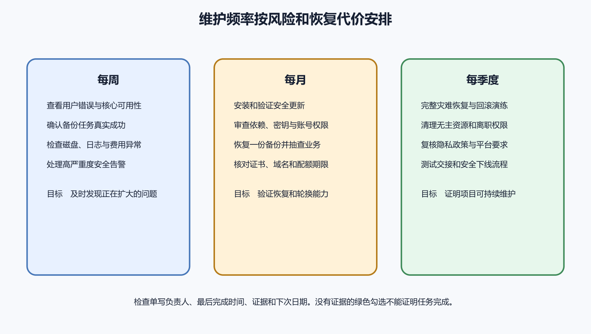

# 每周、每月和每季度维护清单

维护清单的作用，是在系统看似正常时检查那些会缓慢积累的风险。磁盘每天增加一点、证书距离到期越来越近、备份任务悄悄停了、旧成员仍保留权限、依赖告警无人分类，这些问题很少在当天造成明显故障，却会在某个时间一起暴露。

清单不能只写“检查日志”“更新依赖”。每项应说明检查对象、正常标准、异常后做什么、由谁负责、留下什么证据。周、月、季度只是适合小型项目的默认节奏，高风险变化和紧急漏洞不等待日历，低变化静态站点也可以在有证据后调整频率。

*图 68-1　每周发现近期异常，每月处理容量、更新与账号，每季度验证恢复、权限和下线准备；事故与高风险告警可随时触发额外任务。下文提供等价说明。*

## 先建立资产、负责人和证据位置

清单开始前先有一张最小资产表，包含代码仓库、部署、域名、服务器、数据库、对象存储、邮件、监控、备份、商店应用和付费账号。每项记录用途、生产或测试、负责人、恢复负责人、官方入口、续费时间与下线条件。没有资产表，维护者很容易只检查熟悉的服务器，漏掉两个月前创建的测试数据库。

负责人要能接收告警并有权限采取下一步。只有一个人的项目也要指定备用恢复方式，例如云平台应急控制台、加密恢复材料和一个可信联系人。密码与秘密不放进资产表，只记录秘密名称、存储位置、用途、负责人、轮换与撤销日期。

证据统一保存在受控维护记录中。每次写日期、执行者、范围、观察、动作、结果与待办，敏感截图与日志放受限位置并设删除期限。绿色对勾只能表示检查已完成，旁边还要有版本、数值、恢复编号或平台回执，使下次能够比较。

每周检查重点是“过去七天是否已经出现异常”。先看可用性、错误率、延迟和核心路径，例如登录、读取、保存、上传与同步。与上周和正常基线比较，记录峰值、持续时间和受影响版本。Google SRE 的监控资料强调延迟、流量、错误与饱和度，个人项目可以从少量真正能行动的指标开始。

若没有监控平台，至少从外部网络打开生产域名，检查 HTTPS、核心只读功能和一个专用测试账号的无破坏流程。人工检查不能替代持续告警，但能发现证书、登录和移动端兼容问题。测试记录使用固定内部编号，避免每周在生产制造无法清理的数据。

日志检查只看聚合趋势和新错误，不逐行阅读所有文字。代理关注 4xx 与 5xx 变化、上游超时和异常来源；应用关注新异常类别、重启与任务失败；数据库关注认证失败、锁、慢查询和容量；Docker 与 systemd 关注退出、重启和日志增长。各官方文档决定实际字段与命令。

备份每周检查最后成功时间、退出码、文件或快照大小、校验、外部存储和保留任务。大小突然变为零或骤降，即使命令退出为零也要调查。至少抽取一份备份做可读性与元数据检查，真正的完整恢复按月或季度执行，频率由 RPO、变化量与风险决定。

本周部署与配置变化要和异常时间对齐。核对生产实际版本、失败部署、回滚、数据库迁移、DNS 与秘密轮换。若某项临时开关、额外日志级别或防火墙规则已超过到期时间，立即进入审查，不让事故绕过长期留下。

### 每周最小清单

- 核心页面与 API 从外部网络可达，状态和 TLS 正常
- 登录、读取、保存或项目定义的核心路径完成一次安全测试
- 错误率、延迟、流量与资源没有脱离基线
- systemd、Docker、代理、应用和数据库没有新的高影响错误族
- 最后成功备份时间符合 RPO，大小和上传位置正常
- 生产版本、最近部署和回滚记录一致
- 临时权限、调试日志和事故绕过没有过期
- 用户反馈与公开 Issue 已分类并指定下一步

每项异常都应创建可跟踪任务，写影响、负责人和期限。GitHub Issues 与模板适合承载维护任务和复现证据。不要在清单里写“稍后处理”后继续勾选完成，未完成风险应出现在下一次检查和项目状态中。

## 每月处理增长、更新和账号变化

每月检查关注积累趋势。对 CPU、内存、磁盘、数据库、对象存储、日志、备份和出站流量做三个月对比，估算何时触及阈值。容量规划需要同时观察当前百分比和增长速度。磁盘剩余 30% 若每月只增 1%，风险不同于每天增 5%。

检查费用账单与资源清单，找出突然增长、闲置测试环境、未关联卷、静态 IP、旧快照和日志存储。任何删除先确认资源 ID、负责人、恢复价值和账单关系。Docker prune 会删除未使用对象，不能作为“每月自动清理全部”的命令；生产镜像可能是回滚材料。

更新检查涵盖操作系统、安全公告、运行时、框架、依赖、Docker 基础镜像和商店要求。Ubuntu 自动更新与 GitHub Dependabot alerts 可以提供线索，维护者仍要判断影响、测试兼容并准备回滚。紧急且正在利用的漏洞立即处理，不等到月底；普通升级进入测试环境，验证构建、核心功能和数据兼容后再发布。

每月还要复查新增成员、离职人员、CI 令牌、SSH 公钥、数据库角色、商店成员与第三方集成。临时权限已经到期就撤销，长期权限与职责不符就收窄。OWASP 授权和秘密资料强调默认拒绝、最小权限、轮换与审计。

域名、证书、支付方式、云额度、开发者账号与商店材料要查看未来九十天到期项。自动续费不能只看开关，还要确认付款方式、恢复邮箱、多因素认证和负责人仍可用。平台价格、免费额度与政策属于高变化信息，以当月官方页面为准并记录检索日期。

### 每月最小清单

- 容量和费用按最近三个月趋势比较，异常资源已归属
- 操作系统、依赖、基础镜像和平台要求完成风险分类
- 测试环境验证本月计划更新，生产发布有回滚
- 成员、SSH 公钥、CI、数据库和商店权限与职责一致
- 未来九十天的域名、证书、账号和付款到期已处理
- 日志轮转、保留期限、隐私与磁盘上限仍生效
- 备份保留策略执行，至少完成一次隔离恢复抽查
- 文档中的版本、域名、服务名和应急联系人仍准确

月度恢复抽查可以选择一个数据库和几项对象，不一定每次演练整站灾难。预期要明确，例如在隔离环境恢复最近 dump、登录测试账号、读取三类记录、写入后重新读取，并在目标时间内完成。失败立即开高优先级任务，因为无法恢复的备份会给系统可靠性带来直接风险。

## 每季度验证系统性假设

季度检查不只是把月度清单做得更多，而是验证平时默认成立的假设。选择一次灾难场景，例如主服务器不可用、数据库误删、主要管理员设备丢失或云令牌泄露。由没有编写原脚本的人使用现有文档执行，能够发现隐藏在个人记忆中的步骤。

恢复演练从隔离环境开始，记录获取备份、解密、恢复数据库、恢复对象、部署应用、切换测试域名和验证核心功能的完整耗时。与 RTO、RPO 比较，任何缺失凭据、版本不兼容、过期文档和权限不足都形成行动项。PostgreSQL、SQLite 与 restic 资料提供工具边界，真实成功仍由演练结果证明。

季度权限审查从主体出发，而不是逐个平台随便浏览。列出人员、CI、应用、备份与第三方服务，核对每个主体能够访问的仓库、服务器、数据库、存储、域名和商店。撤销闲置权限，轮换高价值长期凭据，测试紧急撤销流程。SSH 密钥按人记录指纹和用途，共用私钥应被拆分。

安全边界审查从公网扫描面开始。核对云防火墙、UFW、监听端口、数据库 `pg_hba.conf`、对象存储公开策略、上传限制、远程 URL 获取与管理后台。测试既从获准来源执行，也从未获准外部位置执行，确认允许和拒绝都符合设计。

季度还要评估是否继续运行所有功能。无用户的测试环境、已替代 API、旧移动版本和无人维护的域名会增加费用与攻击面。能关闭的先制定迁移和下线计划，不能关闭的明确负责人、用户、恢复和更新责任。下线预案每季度核对一次，事故发生时才不会边找账号边决定数据去向。

### 每季度最小清单

- 完成一次端到端或高价值场景恢复演练，并测量 RPO 与 RTO
- 另一位人员能够仅凭文档找到应急入口和恢复材料
- 所有人、服务、CI 与第三方权限完成逐主体审查
- 高价值秘密、恢复码和 SSH 公钥完成状态核对
- 公网端口、数据库、存储、上传和 SSRF 边界通过正反测试
- 监控告警实际送达备用负责人，操作说明可执行
- 事故行动项、临时绕过和逾期安全任务得到清理
- 资源、费用、用户和维护能力支持继续运行决定
- 下线清单、数据导出和用户通知方案仍可使用

## 不按日历等待的触发事件

秘密泄露、正在利用的高风险漏洞、证书即将到期、备份连续失败、磁盘快速增长、异常费用、管理员离职、域名转移和商店政策截止，都应立即触发专项检查。日历频率是最低保养，不是延迟紧急响应的理由。告警应直接关联操作说明与负责人。

发布重大版本、数据库迁移、更换云平台或新增文件上传后，也应临时执行相关月度或季度项目。系统风险发生变化，清单要随之更新。例如新增远程 URL 导入，就要增加 SSRF 测试；引入 iOS 发布，就要增加证书、Profile、Archive 和 App Store Connect 成员检查。

用户量、数据敏感性和可用性承诺提升后，人工周检可能不足。逐步自动化高频且可判定的任务，例如备份年龄、磁盘水位、证书到期、核心 HTTP 检查和依赖告警。自动化结果仍要由人处理，沉默的失败监控也需要外部检查。

“检查磁盘”应展开为“记录根分区、数据库卷、Docker 与日志目录的使用率和增长；正常为低于项目阈值且增长符合基线；异常时先确定增长来源、保存事故证据、停止非必要写入并制定容量或轮转修复”。这种写法让新人知道看到什么，也避免一上来删除未知文件。

“检查备份”应展开为“确认最后成功时间不超过 RPO、退出码为零、文件非空、校验与外部副本存在；异常时停止依赖该备份做破坏性变更，修复任务并补跑，随后在隔离环境恢复”。监控任务还要确认告警通道本身可用，测试通知不包含秘密。

“检查商店发布”应记录当前公开版本、测试构建、崩溃趋势、待处理反馈、证书与账号状态。截至 2026 年 8 月 6 日，App Store Connect 上传状态仍应按 Apple 官方参考核对，界面和政策封版前复查。Android 与 iOS 的检查分开，因为签名、后台和失败证据不同。

## 自动化清单要保留人工确认边界

适合自动化的是只读收集、阈值比较、备份执行、校验、测试环境部署和通知。自动删除生产数据、批量撤销成员、覆盖备份和直接发布商店版本风险更高，应保留审批、准确目标和回退。脚本输出使用稳定字段，失败时非零退出，并保存运行时间与版本。

定时任务本身要被监控。不能只依赖任务失败后发邮件，因为任务根本没有启动时不会发信。增加“最后成功时间”和外部心跳，超过窗口主动告警。自动化账号使用最低权限，密钥设置期限，日志不输出秘密。更新脚本后在测试目标运行，再启用生产定时。

清单也要版本化。每次新增服务、数据类型、账号或发布渠道，同步修改资产表、备份、监控、权限与下线项目。删除功能后移除失效任务，避免维护者反复处理不存在的系统。变更通过 Diff 审查，说明为什么增加或改变频率。

维护频率来自风险与变化速度。每天部署的服务需要更频繁检查失败发布和错误率，几个月不变的静态站点可以把部分人工检查放到月度，但域名、证书和外部可用性仍由自动监控持续观察。涉及支付、健康或大量用户数据时，应由合格人员制定更严格控制。

连续三个月没有异常，不足以直接取消检查。先确认任务真正执行、阈值能发现故障、系统变化确实较少，再降低人工频率并保留自动告警。反过来，一项检查连续发现相同问题，应修复产生问题的机制或自动化预防，不能只是把周检改成日检。

每次调整都记录原因、旧频率、新频率、下一次复评日期和批准人。这样团队能区分有证据的优化与单纯遗忘。新成员、供应商迁移、重大版本和事故都会触发提前复评。

## 定期删除无效清单项目

清单过长会让维护者机械勾选。每季度抽查几项证据，确认任务仍对应真实资产、正常标准可判断、异常动作能够执行。没有负责人、永远显示“不适用”或多年未产生任何决定的项目，应修改、合并或在确认资产下线后删除。

删除清单项不能早于删除责任。停止检查旧数据库前，先证明数据库、备份、DNS、密钥、账单和用户迁移已经完成。若某平台由自动化完全覆盖，人工清单仍保留告警通道、最后成功时间和定期演练，不把“有脚本”当作“无需监督”。

清单语言应描述结果，例如“最近成功备份距今不超过一小时，并完成本月恢复编号”，少用“关注”“加强”和“酌情处理”。新维护者读完应知道去哪里、看什么、异常后停在哪里并找谁确认。清单封版或交接前，可以让另一位维护者随机抽取三项，仅凭文字执行。若他找不到入口、不知道正常阈值，或无法判断何时停止，说明清单仍依赖作者记忆。修订后再次抽查，并把所需权限与安全限制写在任务开头。

假设周检发现 Docker 日志目录从 20 GB 增至 65 GB，磁盘剩余 18%。记录应包含检查时间、主机、目录、过去一周增量、主要容器、日志驱动、用户影响和告警状态。当前动作先限制非必要详细日志并保存故障窗口，随后核对应用重复错误，不直接执行 prune。

调查发现一个后台任务每秒重试并输出完整调用栈。团队修复重试退避与日志级别，配置日志总量限制，再观察二十四小时增长恢复。验证包含任务成功率、容器日志、磁盘趋势和告警。行动项还包括给日志增长率设置阈值，下一次周检比较实际变化。

这条记录比“已清理日志”更完整，因为它说明了增长原因、保留证据、修复和验证。简单删除可能一周后再次占满磁盘，也可能删除排错现场。维护的目标是减少重复风险，不是让检查当天的图表短暂变绿。

## 事故与维护相互反馈

每次事故复盘都应产生一个或多个可验证改进，并决定进入自动监控、周检、月检还是季度演练。例如证书到期造成中断，就增加到期监控、九十天月检和备用负责人；数据库恢复失败，就提高恢复演练频率并修正文档。Google SRE 的复盘资料强调可执行跟进。

反过来，维护检查发现的异常也可能升级为事故。备份连续失败、数据库磁盘快速增长或秘密疑似泄露时，立即指定协调者、控制影响并建立时间线。不要等到清单全部完成后才报告高风险问题。

AI 可以读取脱敏的资产表、监控摘要和上次记录，生成本周差异、待办优先级和建议频率。让它引用具体数值与日期，区分已检查、未检查和需要账号持有人确认。不能因为 AI 输出一张完整表格，就把未登录平台的项目标为通过。

AI 生成命令时，先按只读、状态修改和破坏性动作分类。查询日志、版本和磁盘可以在授权环境执行；更新系统、重启服务、删除资源、撤销秘密和发布商店版本需要单独确认。真实凭据、用户数据和未脱敏诊断文件不进入通用 AI 对话。

## 本章最终检查

- 资产表覆盖代码、域名、运行、数据、商店、监控和费用
- 每项有负责人、正常标准、异常动作和证据位置
- 周检关注用户影响、日志、备份与近期变化
- 月检关注容量、费用、更新、账号和到期项
- 季检真实演练恢复、权限撤销与安全边界
- 紧急风险和重大变化能在日历外触发检查
- 自动化任务有退出码、最后成功时间和外部告警
- 删除与发布保留准确目标、审批和回退
- 事故行动项会进入适当频率的长期检查
- 清单随系统新增与下线而版本化

维护清单的价值不在项目数量，而在持续回答“现在是否符合预期，异常后谁做什么，结果怎样证明”。周检保持对近期变化的敏感，月检处理增长与更新，季检验证恢复和权限等系统性假设。把事故经验写回清单，个人项目也能逐步形成可靠的长期维护能力。
