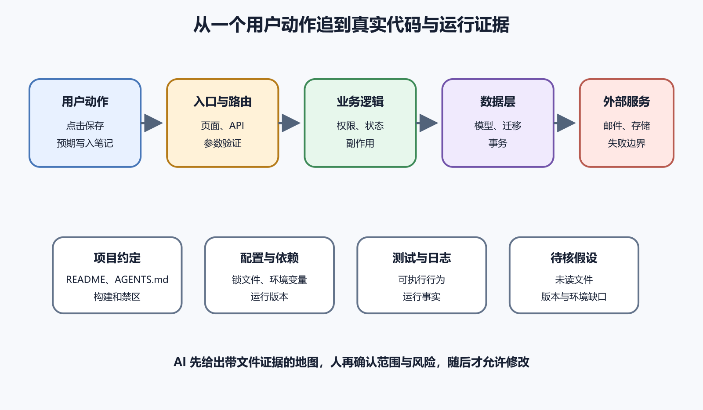

# 让 AI 先理解项目结构

让 AI 修改现有项目之前，先让它画出一张有证据的项目地图。地图要说明用户从哪里进入，请求经过哪些模块，数据存在哪里，配置怎样进入运行环境，测试保护什么，哪些文件不能随意改变。只有文件列表，没有执行关系，AI 仍然可能在错误位置做出看起来合理的修改。

AI 擅长搜索和归纳，却不知道你的生产状态、外部账号和口头约定。它也可能把过期 README 当成事实，把生成文件当成源码，把示例 `.env` 当成生产配置。理解阶段要区分已确认事实、合理推断和仍需核对的空白。

*图 69-1　从一个用户动作出发，沿入口、业务逻辑、数据与外部服务追踪代码，再使用项目约定、依赖、测试、日志和配置交叉验证。下文提供等价说明。*

## 第一轮只读和解释

面对陌生项目，人会按自己看见的东西提问。只看到页面，就会问颜色和文案；看到 Network 后，会追问请求有没有发出；继续看到后端、队列和对象存储，才会想到保存成功后的异步任务。项目地图让问题指向真实边界。

第一轮只要求 AI 阅读和解释，不授权编辑、安装依赖、启动生产服务或访问外部账号。让它指出入口、数据流、外部服务、权限检查、后台任务和部署路径，并引用文件或配置。看不见或无权访问的部分写成未知。

只读也要有范围。仓库里可能有秘密、用户导出、生产日志和商业材料，运行测试也可能连接外部服务。开始前清点敏感目录，必要时使用脱敏副本或隔离工作区。

## 从根目录识别入口

项目根目录通常有 README、依赖清单、锁文件、构建配置、容器配置、CI 工作流、测试目录和源码目录。它们回答项目做什么、依赖什么、怎样运行、怎样部署和怎样验证。先读这些文件，再进入具体模块。

常见依赖清单包括 `package.json`、`pyproject.toml`、`pubspec.yaml`、`Cargo.toml` 和平台构建文件。锁文件记录实际解析版本。看到清单不能直接安装，先确认包管理器、运行时版本和网络权限。README 的命令也要与脚本、CI 和锁文件核对。

入口文件是程序接收输入的位置。网页可能从路由、页面组件或 API handler 进入，服务器可能从主程序、命令行或消息队列进入，Flutter 应用从 `main()` 启动。AI 应指出具体文件和函数，不能只写“前端层”“后端层”。

生成文件、依赖目录、构建产物和缓存通常不能作为主要源码阅读。典型例子有 `node_modules`、`build`、`dist`、Flutter 生成目录和覆盖率输出。规则以项目配置和版本控制状态为准，不能仅凭名称删除。

同名配置也可能属于不同环境。`config.dev`、`config.production`、Compose override 和平台环境变量会改变实际行为。项目地图要标出源码默认值、部署注入值和运行时读取位置。真实秘密只记录变量名，不读取或输出值。

## 沿一个用户动作追踪

假设用户在网页点击“保存笔记”。第一步找按钮或表单事件，确认它如何收集数据和展示加载状态。第二步找客户端请求，记录 URL、方法、请求体、认证与错误处理。第三步找服务器路由、参数验证、授权、业务逻辑、数据库事务和外部副作用。最后看响应怎样回到界面。

每一步都应附文件路径、函数或类、输入与输出。AI 若说数据会存入数据库，继续追问哪个模型、哪张表、哪次迁移、是否在事务中、失败怎样回滚。若找不到，应写未在已读文件中确认。

读项目时容易遗漏函数返回后的事情。保存数据库后可能发送邮件、上传对象、刷新缓存、推送消息或投递后台任务。回滚代码不会自动撤销已经发出的邮件，测试环境也可能误连第三方服务。地图要把这些副作用单独列出，写清触发条件、凭据来源、失败处理、重试、幂等和日志。

状态也可能留在浏览器 Cookie、移动端数据库、Redis、文件系统和对象存储。只追踪主数据库会错过缓存失效、离线同步和升级迁移。询问用户关闭应用再打开后状态从哪里恢复，往往能找到持久化边界。

## 版本、测试和部署证据

同一段源码在不同运行时与依赖版本上可能表现不同。项目地图应记录语言和运行时版本、包管理器、锁文件、操作系统差异、数据库版本与基础镜像。版本来自配置、CI 和实际命令输出，不写“最新版”。

直接依赖由项目声明，间接依赖由锁文件解析。AI 可以解释某个库承担什么工作，但不能未经授权升级它。遇到来源不明的脚本，先读内容与调用位置，再决定是否运行。`postinstall`、迁移、种子数据和部署脚本都可能访问网络或修改数据。

测试展示某些输入下程序被要求产生什么结果。先查看测试目录、测试框架和 CI 命令，再把测试关联到用户路径。登录流程若只有组件渲染测试，没有服务端授权测试，地图应标出保护缺口。没有测试的项目仍能理解，但修改风险更高。

本地代码路径可能与生产不同。反向代理重写 URL，平台注入环境变量，Docker 改变工作目录，数据库通过私有网络连接。部署配置、构建日志、运行版本和健康检查能说明实际路径。理解报告应区分本地仓库结论与生产证据。

生产日志只使用脱敏故障窗口。请求编号、版本、实例、状态码和错误类别通常足以验证流向。若仓库说服务监听 3000，运行日志和容器配置显示 8080，应列出矛盾并请求确认。

项目可以用 `AGENTS.md` 给 Codex 提供持续指令，例如构建命令、测试要求、目录责任、禁止读取的材料和需要确认的操作。具体产品行为在封版前应按 OpenAI 官方文档再核对。约定文件进入版本控制，敏感凭据不放在指令中。

## 要求证据，不接受空泛总结

理解报告中的关键声明应引用具体文件、函数、配置或测试。可以要求表格包含结论、证据位置、置信度、待核问题和修改风险。文件链接帮助人快速打开，但不能堆成没有解释的清单。

让 AI 主动列出冲突与空白。例如 README 写 Node 20，CI 使用 Node 22；示例环境变量名与代码读取名不同；接口有路由却没有授权测试。冲突不等于立刻修改，先问哪个来源代表当前生产事实。

抽查三类结论。入口和调用关系要打开文件看引用是否存在；命令与测试要核对脚本和 CI；生产推断要有运行证据或明确写未验证。若抽查频繁出错，缩小范围并重新建立地图。

多应用仓库可能同时包含网页、API、移动端、基础设施和共享包。先识别工作区与构建边界，再为每个子项目建立入口、依赖、测试和部署。共享包的修改会影响多个消费者，需要列出反向依赖。

模块之间通过契约交换数据。Web API 的方法、路径、状态码和 JSON，消息队列的事件名与字段，数据库 schema，Flutter 平台通道，都是契约。AI 要找出契约定义、消费者、生产者、版本和错误行为。生成客户端通常不直接手改，要修改源 schema，再按项目命令重新生成。

## 一份理解报告应包含什么

报告开头写目标与已读范围，随后给出系统入口、请求流、数据与副作用、配置与环境、依赖版本、测试与部署、风险与待核问题。结尾给出若要修改，最小可能涉及哪些文件，哪些文件不应动，验证需要什么环境。

假设 AI 起初报告保存按钮直接调用数据库。抽查发现网页只发出 `POST /api/notes`，数据库访问发生在服务器仓库层。进一步追踪显示路由先验证正文长度，服务层检查所有权，事务写入笔记与版本表，提交后投递搜索索引任务。测试只覆盖路由成功，没有覆盖所有权拒绝和索引任务失败。这个报告已经能支持一个小修改计划，同时保留待核风险。

## 理解完成的最低标准

- 能从一个用户动作追到入口、业务逻辑、数据与响应
- 每个关键结论有文件、函数、配置、测试或日志证据
- 已区分源码、生成文件、依赖、缓存和用户数据
- 已记录运行时、锁文件、构建与部署环境
- 已列出数据库之外的副作用与后台任务
- 已说明现有测试实际覆盖和没有覆盖的内容
- 已标记 README、CI、配置与生产证据的冲突
- 已说明没有读取或无法验证的部分
- 已列出可能修改文件、明确禁区和验证环境
- 人已经抽查关键路径，确认没有明显虚构

AI 理解项目的价值，是把陌生系统压缩成一组可核对关系。它可以加快搜索和解释，这张地图仍要由代码、配置、测试、日志与项目负责人共同校正。完成这一步后，修改计划才有可信范围。
