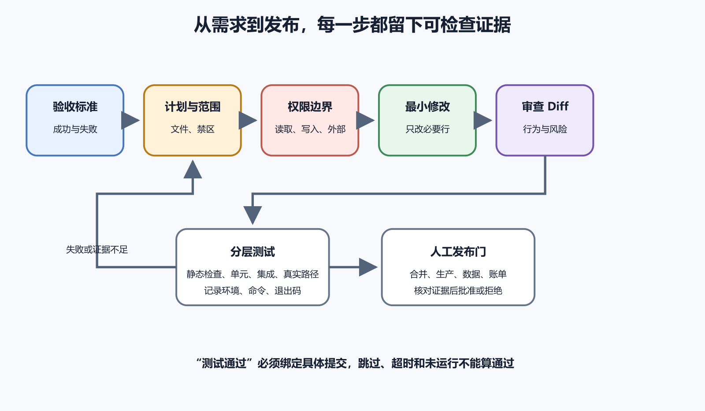

# 计划、权限、Diff、测试和验证证据

AI 已经理解项目，下一步仍不要立刻修改。一次受控变更要先把需求写成可失败的验收标准，限定范围与权限，记录基线，做最小 Diff，用相称的测试寻找错误，再把证据绑定到准确版本与环境。是否合并、部署或发布，仍由人决定。

任何一环缺失，“已经完成”都可能只表示 AI 停止输出。计划暴露假设，权限限制最坏影响，Diff 展示真实修改，测试尝试证伪，证据说明实际检查到哪里。非专业维护者不必读懂每行实现，也能靠这条线保留决定权。



*图 70-1　证据不足就回到计划或修改；自动检查通过后仍要人工核对业务、不可逆影响与发布目标。*

## 先把“修好”写成会失败的标准

“优化登录”“修好上传”“让页面专业一点”都无法验收。以头像上传为例，可以这样写。

> 未登录用户上传返回 401；已登录用户上传 2 MB PNG 后，刷新仍显示新头像；超过 5 MB 返回明确提示；原文件不公开；旧头像仍能显示。只修改 Preview 环境，不改生产，不升级依赖，不改变数据库结构。

它包含前置状态、动作、成功、失败和不变项。空值、最大输入、权限拒绝、超时、重复提交、旧数据等边界，按后果选择。纯文案不必设计数据库灾难恢复；支付、删除、认证和迁移不能只测一次成功演示。

信息不足时，把会改变方案的未知项列出来，包括部署分支、数据规模、现有备份、代理限制、旧客户端和账号权限。能用只读检查确认的先查；需要平台持有人或真机回答的，保留为门槛。涉及删除、迁移、付费、生产发布或真实凭据时，不能用“通常如此”替代确认。

停止点也写在开始前。目标文件和描述不符、已有未提交修改重叠、基线测试失败、Diff 超预算、发现秘密、备份不可恢复、需要未经授权的生产动作，都应暂停并报告。暂停说明控制回路在工作。

## 计划把文件、动作与验证连起来

有效计划不需要长篇叙事，每步都要能回答三件事。改什么，为什么，怎样知道没有改坏。修复上传限制的计划可以这样写。

1. 记录 Preview 的当前配置、两兆与六兆上传均被代理拒绝的基线，确认生产不在范围。
2. 添加一个能复现代理上限错误的检查。
3. 修改最小配置，让代理上限高于应用的 5 MB 业务上限及本次超限测试文件；应用仍负责返回业务拒绝，并单独保留代理的总请求上限。
4. 运行配置验证、自动测试和 Preview 两组真实请求。
5. 审查 Diff、日志与内存，准备回退；由负责人决定是否部署。

计划还要列预计文件、可能生成的文件、命令、外部系统、依赖、schema、权限变化和风险等级。执行中发现新增生产依赖、数据库迁移或公共接口，应重新计划。

权限要分类型。读取仓库、写工作区、执行命令、访问网络、推送、部署、发邮件、改 DNS、操作数据库和产生费用不是同一授权。“可以操作项目”不能覆盖全部。一个清楚范围可以写成允许读取仓库、修改当前测试分支、运行现有测试；不允许安装依赖、联网、推送或访问生产。

最小权限也包括凭据。测试用测试账号，Preview 用 Preview 秘密，生产秘密只在受保护环境中由批准流程注入。生产主令牌配一句“只操作测试站”依靠的是自律，不是权限。沙箱能限制越界，却不知道一次合法 API 调用会不会给真实用户发信。

## 修改前先固定基线

先记录当前分支、提交、已有改动和测试结果。现有未提交文件可能属于用户，AI 不能擅自覆盖、回退或格式化。基线测试已失败时，保存第一条有效错误、退出码和环境，说明它是否覆盖当前任务；修改后不能把同一个旧失败算成新回归。

基线也包括可见行为，比如页面截图、API 状态、测试数据、性能数字、配置摘要或应用版本。视觉任务没有修改前图片，“更好看”只能依赖记忆。有破坏风险时确认回退点和备份恢复记录。

Git 提交能保存代码状态，却不能替代数据库、对象存储和外部平台的恢复点。若任务会改生产数据、上传文件或远端配置，基线要写出备份位置、恢复样本和账号负责人。没有恢复证据时，计划应停在预览或副本环境。

证据还要有名字。截图文件、日志片段、测试账号、请求 ID、部署 ID 和数据样本如果散在聊天里，几天后很难知道它们对应哪次修改。可以用同一个任务编号把它们串起来，并在报告里写清采集时间、环境和当前提交。以后发现问题，维护者能回到这一组证据，而不是在旧截图和新日志之间猜。

版本绑定尤其重要。一个测试报告说通过，但对应的是上一个提交；一个预览链接打开正常，却已经被新部署覆盖；一个 App 截图来自 Debug 包，商店包还没有安装。这些证据都不能直接支撑当前发布。证据包不需要复杂，至少要让人知道它验证了哪个对象。

如果证据无法绑定对象，就把它降级为线索。线索可以提醒下一步检查，不能替负责人按下发布按钮。报告里最好直接写明这一点，后续交接也会少很多误会，也能减少反复追问，避免旧材料混进新决定。

> **证据边界**
>
> 基线只描述开始时观察到的版本和环境；计划只表达预期动作；Diff 只显示文件变化；测试只覆盖实际运行的用例；绿色 CI 也可能跳过任务或对应旧提交。它们彼此补充，没有任何一项可以单独证明生产用户已经安全获得正确结果。

## 最小 Diff 让因果可审查

“最小”指每一处变化都与验收标准有直接关系，不是文件越少越好。新增字段确实需要验证、API、迁移、界面和测试时，这些都可能必要；顺手改名、全仓格式化、升级全部依赖和重写相邻模块通常不必要。

先看文件列表与增删规模，再逐块问这段对应哪条标准，正常路径怎样，失败路径怎样，权限与数据有何影响，测试在哪里。发现任务外文件、二进制、秘密、生成噪声或巨大锁文件时暂停。删除验证、错误处理、旧数据兼容和回退代码往往比新增更危险。

一行配置可能开放公网或切换生产资源，所以风险不由行数决定。低风险文案通常用 Diff、构建和页面检查；中风险业务逻辑需要相关测试、预览与评审；高风险认证、生产数据、支付、网络入口和不可逆删除需要独立复核与人工批准。

## 测试必须对应改动和当前版本

静态检查发现语法、类型和部分配置问题；单元测试验证小范围规则；集成测试验证文件、数据库或 API；端到端与人工验收覆盖真实用户路径。没有一层自动包含其他层。先运行最相关的快速检查，再扩大到相邻模块和完整套件。

修 Bug 时先写能复现的测试，并确认修复前失败、修复后通过。测试从未失败，可能根本没有走到错误路径。无法自动化的商店、真机或视觉流程，记录环境、步骤、预期、实际和未自动化原因，不能写成“默认通过”。

“已运行测试”至少要有这些信息。

```text
提交或工作区状态：
环境与运行时：
命令：
开始 / 结束时间：
退出码：
通过 / 失败 / 跳过：
警告与报告：
测试数据：
仍未验证：
```

退出码 0 只表示工具认为成功。筛选错误可能匹配零个用例，CI 条件可能 skipped，缓存可能复用旧产物。检查测试数量、目标文件、当前 SHA、矩阵任务和构建标识。代码变化后，旧截图、旧报告与旧批准都可能过期。不稳定测试不能连续重跑到绿后只保存最后一次，首次失败、随机种子、并发和环境也要留下。

### 绿色状态必须能回答“验证了哪个版本”

GitHub 等平台会把构建、测试、扫描和部署显示为状态检查。颜色只是入口。被条件跳过的工作流、neutral 任务、取消或超时、旧提交的成功、只覆盖一个运行时的矩阵，都不能自动代表当前改动完整通过。查看 run 对应的 SHA、触发事件、必需作业、跳过项与产物标识。

本地通过、CI 失败时，比较操作系统、大小写路径、运行时、依赖锁、环境变量、时区和外部服务；CI 通过、Preview 或生产失败时，继续比较构建产物、部署配置、数据库版本、网络和数据规模。“电脑上没问题”和“Actions 是绿色”描述的是两个环境。

预览环境也要验证真实隔离。名字叫 Preview，不保证没有连接生产数据库；自动端到端测试可能写入真实用户数据。检查实际项目 ID、连接和权限。移动 App 要区分模拟器、本地 Release、内部测试和商店 build；签名、优化与平台处理都会改变行为。没有 Mac 或目标账号时，明确 iOS 未验证，不能用 Android 结果替代。

构建号、部署 ID、镜像摘要、App versionCode 和提交 SHA 用来把证据连到同一对象。使用会移动的 `latest` 标签，会让“测试过这个镜像”失去对象。修改文件以后，判断哪些报告过期，并重新运行受影响检查。

### 多种证据最终要汇合

静态检查、单元测试、界面 QA、安全评审可以并行，但必须从同一基线出发。某一路修改了文件，其他结果可能过期。集成人要核对当前提交与待发布产物，汇总通过、失败、跳过和冲突。

两个评审结论矛盾时，不能按 AI 数量投票。一个说授权安全、另一个说可能越权，应使用最小权限测试账号请求目标 API，检查服务端授权与日志；无法消除的高风险冲突阻止发布。证据包只保留一个当前版本，旧报告标记已被替代。

人审与自动检查关注点不同。机器擅长重复规则，人知道“这个旧字段要兼容两年”“这个地区不能启用服务”“这次费用需要财务批准”。高风险变更至少让未实施的人检查验收、Diff、证据、未验证项和回滚。旧截图、旧测试报告和只允许 Preview 的批准不能混进当前交付。

## 一次 413 修复怎样形成证据链

Preview 上传 2 MB 和 6 MB 均返回代理的 413，生产当前正常。只读项目地图显示代理和应用都有上限。验收标准要求 5 MB 内通过，超过 5 MB 由应用返回一致提示，内存不异常增长；明确不接触生产。

AI 发现 Preview 代理上限只有 1 MB，而应用上限为 5 MB。最小修改把代理限制调到高于本次 6 MB 超限样本，让请求能到应用做统一校验，同时保留合理的代理总上限，并补配置测试。Diff 只包含目标配置、测试和说明，没有改上传实现、依赖或生产环境。

验证同时做配置语法检查、自动测试、Preview 的 2 MB 与 6 MB 请求，查看代理/应用日志和资源变化。2 MB 得到成功并可重新读取，6 MB 得到明确 4xx，才覆盖用户结果。配置检查通过只证明语法，413 消失也可能变成 500。

维护者审查后批准 Preview 部署。若将来要改生产，这是新的外部状态变化，需要比较生产配置、选择窗口和重新批准，不能把 Preview 结果自动扩大。

证据本身也有风险。日志、截图、HAR、崩溃报告和测试数据库可能包含秘密与个人数据。只保留证明结论所需的窗口，脱敏后共享，限制原始材料访问，并写删除日期。AI 或命令因超时、断网、权限错误而返回失败，不等于没有改变任何状态。重试前先查看工作区、进程、临时文件和外部平台活动。

## 人保留发布与回滚判断

回滚要在修改前写好稳定代码或制品、旧配置来源、数据库兼容、触发条件和回滚后验证。邮件、付款和用户数据不能靠 Git 还原，需要幂等、状态查询与补偿。命令超时也不表示没有副作用；重试前先查文件、进程和外部平台真实状态。

代码回退也不是终点。恢复旧提交后要重新构建或部署，确认流量和运行版本确实回去；数据库迁移要判断旧程序能否读取新结构；配置回退要确认秘密与外部服务仍兼容。共享历史通常用新的撤销提交比强制改写更安全。

自动检查完成后，人重点看业务规则、权限、数据、费用、用户沟通和不可逆影响。高风险变更最好由未实施的人复核。一个人维护的项目也可以把实现与评审分时进行，从原始目标重新读 Diff 和证据。

交付前反向问哪些输入没测，是否扩大了权限，哪个环境与生产不同。日志泄露秘密和回滚假设未验证，也要单独写出来。最终报告只写实际完成、测试证据、未验证项和下一步；计划中的动作不能冒充已经执行。

再检查重复提交、网络中断、旧数据、最大输入和最小权限账号。共享组件有多少消费者，配置是否改变缓存或代理，新增依赖是否运行安装脚本，删除字段是否伤害旧客户端。每个风险要么有证据，要么由明确负责人接受。

## 现在可以跳过什么，继续查哪里

低风险、可完全恢复的本地文案不需要生产级审批和灾难演练，但仍应有验收标准、干净 Diff 和实际构建。涉及外部状态、秘密、真实用户或不可逆数据时，再增加隔离、备份、独立评审和人工批准。

CI 状态细节、flaky test、覆盖率、缓存、安全审查、证据脱敏与留存、并行验证和事故模板见[《测试、监控与事故参考》](../../references/testing-monitoring-incidents.md)。核心控制线很简单。需求可以失败，权限可以拒绝，Diff 可以解释，测试可以复查，证据绑定当前版本，发布决定仍在人手里。
