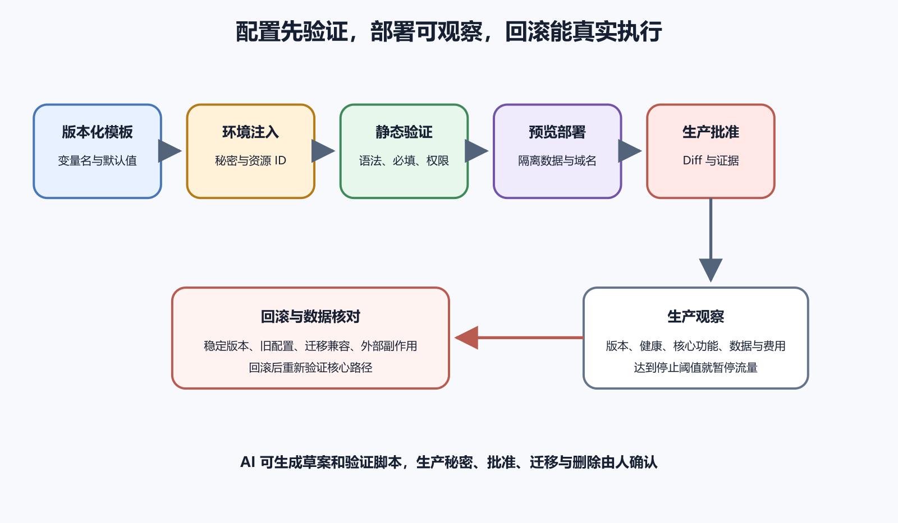

# 安全地生成配置、部署文档和回滚方案

配置、部署文档和回滚方案很适合让 AI 起草，因为它能把重复字段、命令与检查项快速组织起来。风险也来自这种速度。AI 可能引用错误版本，生成过宽权限，把示例秘密写进仓库，忽略生产与预览差异，或者写出从未执行的回滚方案。

安全做法是把 AI 输出当成待验证草案。配置从真实软件版本与项目结构生成，秘密在受控环境注入，部署文档说明位置、权限、预期和失败入口，回滚方案在发布前验证关键步骤。涉及生产账号、数据迁移、域名、商店和费用的最终动作都保留人工确认。

*图 71-1　版本化模板经过环境注入和静态检查后进入预览，证据通过再由人批准生产；生产观察达到停止阈值时，按已验证方案回到稳定版本并核对数据。下文提供等价说明。*

## 先找出配置来源

一个值可能来自代码默认值、配置文件、环境变量、命令行参数、容器 Secret、部署平台或远端功能开关。它们通常有覆盖顺序。AI 只改 `.env.example`，生产值可能完全不变；只改 Compose 文件，平台又可能用环境变量覆盖。生成配置前先列出来源、优先级、环境和读取位置。

项目文档、当前配置、启动命令、CI 和运行日志要交叉核对。README 说端口 3000，容器健康检查访问 8080，生产代理又指向 3000，这种冲突必须先解决。不要让 AI 按框架默认值选一个。

配置还分静态与动态。静态配置在构建或启动时读取，修改后需要重建或重启；动态配置可能在运行时刷新。文档要说明生效方式和观察结果，否则维护者改了值却看不到变化。

可版本化模板可以包含变量名、说明、非敏感默认值与占位符。真实域名、项目 ID 是否敏感要按项目判断，密码、令牌、私钥、连接串与恢复码绝不进入模板。若秘密已经进入 Git 历史，删掉当前行后仍要轮换。

## 用 schema 和验证器约束格式

配置 schema 可以定义字段、类型、必填、枚举、范围和弃用。JSON Schema、框架验证库或项目自己的启动检查都能承担这个工作。选择项目已有机制，不为一次小配置引入新的验证框架。schema 与读取代码要一起测试。

跨字段规则还要验证语义。例如 `COOKIE_SECURE=true` 与 HTTPS 部署匹配，生产环境不能使用本地数据库地址，公开 URL 与 OAuth 回调域名一致。错误提示应给变量名和预期类型，不回显值。

Caddy、NGINX、Docker Compose、GitHub Actions、Flutter 和云平台配置都会变化。提示 AI 时给出软件版本、操作系统、部署方式和现有文件，不问它生成一个最新配置。从互联网找到的示例也要回到官方文档验证。

不要让 AI 直接覆盖唯一生产配置。先创建测试分支、预览环境或明确的新文件，保留当前版本与 Diff。生成器可能重新排序、展开默认值或重写整份文件，应先比较语义。

配置工具若支持 dry run、validate、lint 或打印最终合并结果，先使用只读或不发布模式。NGINX 可以检查语法，Caddy 可以格式化和适配配置，Docker Compose 可以解析合并结果，GitHub Actions 通常通过平台工作流与专用检查工具验证。验证至少分三层，先检查语法与必填，再查看展开后的监听、路径、镜像、网络与权限，最后在隔离环境执行核心请求。

许多验证工具会把环境变量、默认值与模板合并后打印完整结果。终端滚动、CI Artifact、聊天粘贴和截图都可能因此包含密码或令牌。先查看工具是否有 quiet、redact 或只验证模式，在隔离环境使用无权限测试值。

## 部署文档从前置条件开始

一份可执行部署文档开头应写目标环境、维护窗口、账号角色、代码版本、依赖版本、所需备份、用户通知和停止条件。随后写每一步在哪执行，会改变什么，预期看到什么，结果不同先看哪里。

部署对象必须可识别。记录提交 SHA、构建号、镜像摘要、迁移编号与配置版本，避免使用会变化的 `latest` 作为唯一证据。文档说明怎样确认待部署产物就是测试过的产物，不能在批准后重新构建未知内容。

权限也按步骤分配。构建任务不需要生产数据库，部署任务不需要组织所有者，健康检查不需要删除权限。准备阶段完成备份、配置验证、测试、容量和回滚检查。实施阶段上传产物、运行兼容迁移、切换少量流量或发布预览。观察阶段核对版本、健康、错误率、延迟、业务、数据和费用。

例如错误率超过基线两倍、数据库迁移出现未解释警告或核心写入失败，就停止扩大流量。阈值要在发布前写。部署后的用户路径检查可以用自动化辅助，视觉成功不证明后台写入，要配合 Network、日志和测试数据确认。

状态检查要绑定准确提交。AI 先运行测试，随后又修改配置，旧结果不能证明当前版本。文档应说明哪些检查必需，怎样确认 run 的 SHA，失败在哪里查看，跳过是否允许。绿色状态若来自旧提交或被跳过，不能证明待部署产物。

数据库迁移常是部署中最难回滚的部分。添加可空列通常比立即删除列容易兼容。先让新旧程序都能工作，再回填数据与收紧约束，可以降低滚动发布风险。删除列、改变含义、重写大量数据和不可逆加密，需要更严格审批和恢复测试。

## 回滚要分成三件事

配置回滚恢复旧值与旧来源，代码回滚部署已知稳定产物，数据恢复将数据库或文件回到恢复点。三者触发条件、权限和副作用不同。配置回滚要知道旧值是否仍兼容新代码，秘密是否已轮换，DNS 与缓存何时生效。代码回滚要知道旧程序能否读新数据。数据恢复可能丢失恢复点之后的合法写入。

回滚文档列出准确目标、执行位置、前置备份、预期结果、验证与停止条件。不要在示例中提供会删除生产资源的通配命令。破坏性步骤需要用户填入准确资源 ID。

纸面方案可能依赖不存在的旧镜像、已撤销令牌、过期域名或只有作者知道的步骤。预览环境中定期演练，从当前版本切到旧稳定版本，再恢复到当前版本，记录耗时、数据兼容和缺失权限。

## 让 AI 标出未知项

AI 草案中的版本、路径、服务名、账号角色和阈值都要有来源。没有来源时使用 `[待确认]`，不要填入常见默认。要求它在文档末尾列出未验证命令、需要真实账号的步骤、仅适用于某平台的内容和时间敏感政策。

让 AI 对每条命令说明读取、写入、停止服务或删除的影响。只读命令也可能输出秘密，状态修改命令则需要回退。平台控制台手工修改后，仓库配置与生产状态可能不同。可公开的基础配置尽量进入版本控制，秘密与平台专属设置至少记录名称、负责人和最后核对日期。

基础设施即代码要先看 plan 和状态。Terraform 等工具把云资源声明为代码，实际系统还包含远端 state、手工变更、供应商默认和导入资源。直接执行 apply 可能创建、替换或删除生产资源。先锁定准确工作区与账号，刷新或读取受控状态，再查看 plan。计划输出按创建、原地修改、替换和删除分类，替换数据库、负载均衡或静态 IP 时必须停下来确认。

## 文档要包含失败分支

一份部署文档若每步都假定成功，第一次异常就失去作用。关键步骤后写预期输出、常见不同结果和安全停止点。例如配置验证失败就不重载，迁移出现锁超时就停止流量切换，健康检查非 200 就保留旧实例。

失败分支先提供只读检查，再给状态修改。查看服务、日志、端口和版本通常优先，重启、清缓存、删除资源需要更强理由。任何为了继续而关闭防火墙、TLS 或验证的建议都应拒绝。

让没有编写文档的人在隔离环境按步骤执行。他应能找到入口、判断当前版本、完成部署、识别一次故意配置错误并安全停止。每个需要口头提示的地方都说明文档缺失。自动化脚本负责重复操作，文档解释输入、权限、输出、失败和回退。

部署可能依赖 GitHub、容器 Registry、云平台、DNS、邮件和商店。供应商故障时，自动化失败不一定是项目代码问题。文档列状态页、错误入口、重试边界和哪些动作不能重复。关键产物保留在受控位置。
