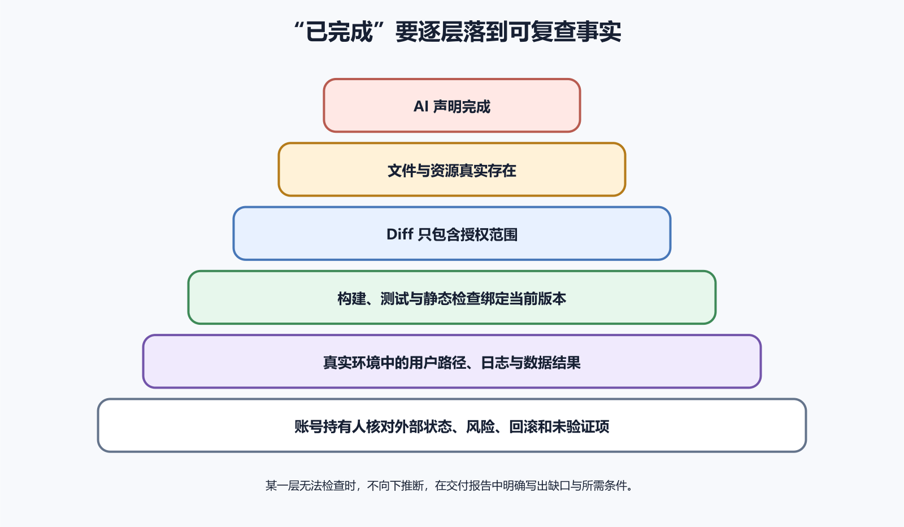

# AI 声称完成以后还要检查什么

AI 说“已经完成”，最可靠的理解是它认为当前工作可以交付。这句话本身没有证明文件已经写入、程序能够构建、功能在真实环境可用、外部平台已经更新，也没有证明用户数据和权限安全。验收要把声明还原成可检查事实。

检查深度与风险相称。改错别字可以看 Diff 和构建，修登录要增加权限与会话测试，数据库迁移要真实恢复与回滚，应用商店发布还需要账号后台状态。无法进入某个环境时，结论写这部分尚未验证，不能从本地成功向外推断。



*图 72-1　AI 的完成声明依次由文件存在、Diff 范围、构建测试、真实运行、外部状态与人工验收支撑；某一层无法检查时，交付报告必须标记缺口。下文提供等价说明。*

## 先拆成具体声明

“我已经修好 Bug”至少包含代码已修改、原问题不再发生、相邻行为没有回归和修改已保存。“我已经部署”还包含产物上传、目标环境更新、流量切换、健康检查与用户路径通过。“我已经备份”需要文件完整、隔离存储和恢复测试。不同动词对应不同证据。

要求 AI 在结论中列出实际动作、文件、命令、结果、外部操作和未验证项。若它只说“应该可以”“通常会”“已配置好”，继续追问可观察证据。计划中提到的动作不等于已经执行。

可以建立声明表，记录声明、证据、版本、环境、验证人和状态。状态使用已验证、部分验证、未验证、失败和不适用，避免用模糊绿色。每项未验证都写需要的条件，例如真实 Mac、开发者账号、生产维护窗口或用户确认。

AI 可能生成一个路径链接，却没有写入文件，或工具调用中途失败只留下半份内容。先打开目标文件，检查大小、结尾、编码、关键章节与资源引用。代码文件要确认语法完整，配置要有正确层级，文档内部链接与附件路径要存在。

## 检查 Diff 和测试

Diff 展示版本控制文件的真实变化。先看文件列表、增删规模和二进制，再逐块审查。任务是改一处按钮，却出现锁文件、数据库迁移、CI、格式化数百行或删除测试，就需要解释。未跟踪文件不会总出现在普通 Diff 中，还要结合 `git status`。

每个块都应对应验收标准。检查条件、默认值、权限、错误处理、日志、数据迁移和旧版本兼容。AI 的摘要可能漏掉误改的部分，Diff 是更可靠入口。已有用户改动要单独识别。

测试报告要与当前提交或工作区匹配。AI 先运行测试，随后又修改代码，旧报告就不能证明当前状态。记录提交 SHA、构建号、命令、环境、时间和退出码。CI 页面核对运行触发的提交。测试结果包含通过、失败、跳过和警告。

修 Bug 时，新测试应在未修版本失败，在修复版本通过。若从未确认失败，它可能测试了错误函数、错误环境或永远为真的断言。认证功能至少检查未登录、普通用户、资源所有者和越权；上传检查允许类型、超限、解析失败与存储错误；重试检查重复提交与未知结果。

高层端到端测试能证明一条用户路径，无法精确覆盖全部分支。低层测试全绿也不能证明路由、签名、部署和真实浏览器正常。选择组合，不迷信某一层。

源代码通过检查，构建仍可能因依赖、环境变量、平台签名与资源缺失失败。运行项目规定的生产构建，记录产物目录、大小、版本与哈希。网页检查 HTML 引用的 JS、CSS 与图片是否存在；Docker 检查镜像摘要、入口、健康与非 root 运行；Flutter 检查 APK、AAB 或 Archive 的版本号、构建号和签名。

## 第一次通过后再复查

第一次通过以后，先用相同版本和相同步骤再做一次，看看结果能否重复。然后根据风险选择干净环境、重启后的服务或新设备再试，检查成功是否依赖本机缓存、未提交文件、旧登录状态和临时配置。很小的文案修改无需把所有测试都做一遍。

还要安排一次合理的失败路径。表单缺少必填项时是否给出清楚提示，令牌过期时是否回到登录，数据库暂时不可用时是否保留用户输入，部署失败时旧版本是否继续服务。证据也要能由另一人复核。

开发电脑可能残留未提交文件、全局依赖、缓存和旧构建，使当前项目恰好能用。在安全的新工作区或 CI 中从版本控制重新获取，按文档安装锁定依赖并构建，可以发现隐含条件。

真实运行检查从用户入口开始，使用隔离账号与数据完成核心动作。记录页面、步骤、版本、时间、预期、实际、截图与请求编号。页面显示成功后检查 Network、服务日志或测试数据。刷新页面、退出重登或换设备验证持久化。

优先使用预览或内部测试，生产使用专用低风险账号和可清理数据。支付、发信、推送与删除设置沙箱或人工确认。AI 说保存成功时，确认数据库记录、对象、缓存和索引是否一致。事务失败后有没有半成品，重试会不会重复。

## 外部平台和运行风险

部署、DNS、云资源、GitHub、应用商店和邮件服务都在仓库之外。AI 可以生成配置或提交请求，但外部平台可能拒绝、排队、处理失败或等待审批。必须在官方控制台或 API 中核对目标账号、项目、区域、版本、状态和时间。

部署页面显示成功后，从外部网络访问域名，查看响应版本与核心功能。DNS 修改要等待传播并从权威与递归解析验证。商店上传成功后还要处理、测试与审核，状态与构建号缺一不可。

账号持有人保留凭据与发布按钮。若 AI 没有权限进入平台，结论写配置草案已生成，尚未部署。新增功能可能让普通用户访问管理员数据，工作流可能获得仓库写权限，容器可能改成 root，防火墙可能开放数据库。审查 Diff、部署配置和实际平台权限。

功能正确却把页面从一秒变成十秒，或每次请求执行百次数据库查询，仍然没有完成。与修改前基线比较响应时间、CPU、内存、查询、包体、日志和网络。上传、AI API、对象存储、日志和第三方服务会产生费用，要验证限额、超时、重试和预算告警。免费额度与价格属于高变化信息，使用官方当前页面并注明检索日期。

网页视觉通过后，使用键盘完成核心路径，检查焦点、标签、对比、缩放、错误提示与屏幕阅读器语义。图片有替代文字，表单错误与字段关联，不能只用颜色表达状态。Windows 路径大小写、macOS 签名、Linux 权限、Android 版本与 iOS 证书都可能造成平台差异。

## 日志、报告和来源

故意触发一个安全失败，确认用户看到可理解提示，日志有时间、版本、事件与请求编号。错误不能泄露调用栈、密码、内部路径和用户数据。后台失败要有告警与重试边界。AI 常为方便调试增加大量日志，验收要查级别、保留、磁盘和隐私。

日志本身也是外部运行证据。确认它来自当前实例与版本，时间和时区一致。找不到日志时先验证采集通道。实现者容易沿自己的成功路径验收，可以让另一位人或独立 AI 只读需求、Diff 与证据，寻找未覆盖输入、权限扩大和环境差异。

一个上传上限例子能说明验收方式。AI 报告已把上传上限从一兆改到五兆，测试通过。验收看 Diff 后发现只改了前端提示，代理仍限制一兆；所谓测试只调用前端校验，没有发送真实请求。修正计划同时处理代理与应用边界，增加五兆以内成功、超过五兆拒绝和解析失败测试。Preview 中上传两兆图片，Network 返回 201，服务日志有请求编号，对象存储出现私有对象，刷新后头像仍在。

交付报告开头给出结果与范围，随后列文件、外部变化、测试与真实路径，再列未验证、风险和回滚。每项证据附版本、环境和链接。失败也应报告。下面模板可以用于 AI 自检和人工验收。

```
完成的需求：
实际修改文件：
外部系统变化：
提交或构建标识：
运行的检查与测试：
通过、失败和跳过：
真实用户路径结果：
数据与副作用结果：
权限与秘密检查：
性能与费用观察：
回滚状态：
未验证内容及原因：
需要用户确认的下一步：
```

NIST 的生成式 AI 风险资料建议记录模型知识边界，并用已知事实、多种评估、自动检查与人工监督验证输出。交付报告把这些原则落到工程工作中。

## 不同交付物用不同验收办法

代码库交付检查 Diff、测试、构建、依赖与运行。部署交付增加平台状态、版本、域名、监控和回滚。数据库交付增加 schema、数据校验、备份恢复与权限。文档交付检查结构、链接、事实来源、可执行步骤和渲染。

EPUB、PDF 和网站要实际打开。EPUB 看导航、内部链接、图片、代码块、中文换行和阅读器兼容。PDF 看分页、字体嵌入、目录、链接和图片清晰度。网站看不同尺寸、Network、Console 和关键交互。

任务完成后查看未跟踪文件、缓存、下载、日志、临时服务器和后台进程。可重建缓存可以按项目规则清理，用户数据、备份、当前发布、签名和不确定文件保留。AI 生成的代码、字体、图片、数据和依赖也要看来源和许可。

## 本章最终检查

- 已把完成声明拆成文件、行为、外部状态和风险声明
- 目标文件与资源真实存在、完整且可打开
- Diff 与未跟踪文件都在授权范围
- 测试绑定最终提交，记录失败、跳过和警告
- 新测试在修复前能复现原问题
- 生产构建产物有版本、构建号或摘要
- 干净环境能按文档重建，或明确缺少条件
- 真实用户路径验证界面、Network、日志与数据
- 外部平台由账号持有人核对真实状态
- 权限、秘密、依赖、性能、费用和可访问性经过检查
- 独立评审尝试推翻关键结论
- 报告清楚列出未验证内容与下一步

AI 的已完成是一项待验收声明。文件、Diff、测试、运行、数据、外部平台和人工判断逐层增加可信度。某层缺失时坦率标注，项目和用户才不会被一句完成报告带偏。
