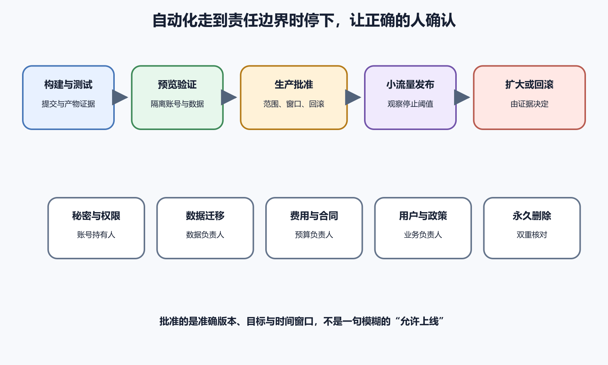

# 生产环境中的人工确认边界

生产环境承载真实用户和真实数据，也连着域名、账单和责任。AI 可以准备代码、配置、测试、部署草案和观察清单，也可以在明确授权下执行部分自动化。到了会影响用户、数据、权限、费用或不可逆状态的边界，确认必须由能够承担结果的人作出。

人工确认不等于在弹窗上随手点“允许”。有效确认需要知道准确目标、版本、动作、权限、用户影响、停止条件与回滚。批准预览部署不能自动延伸为生产发布，批准读取日志也不能延伸为删除日志。

*图 73-1　构建、测试和预览可高度自动化；涉及秘密、数据、费用、用户和永久删除时，由对应责任人确认准确版本与窗口，发布后按阈值扩大、停止或回滚。下文提供等价说明。*

## 先定义哪些资源属于生产

生产不只是一台标记为 `prod` 的服务器。生产域名、DNS、数据库、对象存储、邮件与推送、支付、应用商店、监控、备份、CI 环境、身份提供方和第三方 API 都可能影响真实用户。测试项目若使用生产数据或真实发信凭据，也已经跨入生产责任。

建立资源清单，记录平台、账号、项目、区域、用途、负责人和识别方式。颜色与名称只能辅助，批准前要核对不可变 ID、域名、数据库名、构建号或镜像摘要。`notes-prod` 和 `notes-production-old` 很容易混淆，尤其在多个账号和区域中。

生产副本、下载到本地的数据库和真实日志也应按生产数据保护。把它们放进测试目录不会降低敏感性。AI 工作区只使用脱敏数据或最小故障窗口。

代码合并通常由代码所有者确认，生产部署由服务负责人确认，数据库迁移与恢复由数据负责人确认，域名和证书由账号持有人确认，费用与合同由预算负责人确认，用户通知与政策由业务或合规负责人确认。一个人可能承担多个角色，责任仍要明确。AI 没有法律、财务和组织授权，不能因为技术上能够调用 API 就替代这些角色。高影响动作可以要求双重确认。

## 每次批准都绑定对象和时间

批准内容至少包含变更编号、提交或产物、目标环境、动作、时间窗口、预计影响、验证、停止条件和回滚。执行内容发生变化就重新批准。

时间窗口要考虑用户高峰、维护人员、供应商支持和回滚所需时间。窗口结束前仍未完成验证，暂停扩大并决定回滚或延长。紧急情况可以使用简化审批，仍要记录谁决定、为什么无法走常规流程、最小动作和事后复盘。

批准生产发布时，记录提交编号或镜像摘要、目标环境、计划开始时间、允许执行的步骤和停止条件。随后若 Diff 改变、镜像被重新构建、迁移脚本更新或目标环境切换，原批准不再覆盖新内容。

AI 获得一次写入权限，也不等于以后可以持续修改同类资源。任务结束后检查临时令牌、测试账号、开放端口和自动化计划是否仍有必要。

## 沙箱和审批提示各自能做什么

沙箱可以限制文件系统、网络与进程范围，审批提示可以在高影响操作前暂停。OpenAI 官方资料说明了 Codex 的沙箱与 agent approvals。这些机制降低意外执行，却不了解某份文件是否是唯一备份，也不了解一个域名是否承担用户邮件。

审批提示中的命令要翻译成业务后果。`apply migration` 可能锁表和改变数据，`sync --delete` 会让远端文件按规则消失，`terraform apply` 可能创建费用或销毁资源。确认人需要看到计划、准确目标、Diff 与回退。

网络访问也要限制。AI 搜索官方文档与向生产 API 发请求都使用网络，但风险完全不同。允许浏览资料不等于允许上传仓库内容或调用供应商管理接口。连接器和插件按数据与动作单独授权。

AI 不需要看见生产密码才能生成引用它的配置。配置使用秘密名称，部署平台在批准后向作业注入。日志、截图、Diff 和对话只显示 `[REDACTED_SECRET]`。秘密轮换会影响所有使用者，应先列应用、CI、备份、监控和人工客户端。

## 数据库变更需要独立门禁

数据库迁移可能锁表、改变格式、回填大量数据或让旧版本无法运行。即使代码测试全部通过，生产数据量、长事务和索引创建仍可能超出窗口。迁移批准要看到脚本、目标数据库、预计耗时、锁风险、备份与恢复测试。

先采用兼容变化，使新旧版本可以短暂共存。添加字段、回填、切换读取、收紧约束和删除旧字段可以分多个发布完成。迁移执行后检查 schema、行数、约束、权限、应用读写和错误率。

## DNS、域名和证书影响范围很大

DNS 修改可能把整个域名指向错误服务，缓存会让新旧结果共存。批准前核对账号、zone、记录名、类型、目标、TTL 与回退值。生产变更后从权威与多个递归解析检查。

删除旧平台前等待 DNS 与证书稳定，确认邮件、OAuth 回调、Webhook 和移动 App 没有仍指向旧域名。一个只服务网页的域名，也可能承担 API 和密码重置链接。证书自动化失败会在到期时中断服务，要确认自动续期、挑战路径、账号与告警。

上传 App 构建、选择测试者、提交审核、分阶段发布和停止销售都会改变外部状态。AI 可以生成发布说明、检查素材和整理错误，构建号、隐私披露、账号、地区和按钮由开发者账号持有人核对。

审核反馈可能要求修改二进制、元数据或测试账号。不要让 AI 根据一封截断邮件自动重新提交。保留原文，确认目标版本和规则，修改后重新构建与测试。没有真实 Mac、Xcode 和 Apple 账号时，iOS 流程标记未实测。

## 费用与配额属于生产确认

创建更大服务器、开启日志、复制数据库、使用 AI API 和跨区域传输都会产生费用。批准前给出供应商、资源、区域、计费单位、预计持续时间、预算告警和删除条件。免费额度与价格随时间变化，使用官方当前信息并标注检索日期。

AI 生成基础设施计划后，先查看 dry run 或 plan，确认新增、修改与删除。资源数量异常、区域错误、保留无限或高价规格都要停下。预算告警通常只是通知，不一定自动停止费用。任务完成后继续检查残留快照、卷、IP、日志和域名。

删除数据库、对象、卷、备份、域名、商店应用和 Git 历史可能难以恢复。执行前列出准确资源 ID、内容、最后使用、依赖、备份、恢复测试、保留政策和批准人。不要使用宽泛通配符。

删除分阶段进行。先停止新写入或取消公开入口，再进入只读或隔离，观察是否仍有访问，完成导出与恢复验证，再永久删除。若资源可以先停用或移入回收站，优先使用可恢复方式。历史重写无法让泄露秘密重新安全，必须先轮换。

## 生产发布前的证据包

确认人不应重新阅读整个项目。证据包包含变更摘要、验收标准、当前 Diff、评审、提交与产物标识、测试结果、跳过、预览验证、数据迁移、权限变化、监控、停止阈值和回滚。

状态检查绑定提交。确认人打开检查详情，验证当前 SHA、实际作业、矩阵和报告，不只看一个总绿点。新提交使关键 Diff 改变后，重新请求相关评审。

确认人可以问六个问题。部署的准确对象是什么，哪类用户受影响，怎样知道成功，什么情况立即停止，回滚是否验证，哪些部分仍未知。任何问题没有答案时，可以延后发布或缩小范围。还要确认观察者在线。

批准意见记录限制条件，例如“仅允许 Preview”“仅 5% 流量”“不得运行删除迁移”“十五分钟内错误率超过 2% 回滚”。自动化系统应能执行这些限制。

## 小流量发布降低未知影响

可以先部署到一台实例、内部用户、一个地区或少量流量，具体方式取决于平台。小流量阶段检查版本、错误、延迟、资源、数据与核心用户路径。它不能发现所有长期问题，却能在扩大前暴露明显回归。

分批发布要避免新旧版本数据不兼容。请求响应记录版本，监控按版本分组，确保错误来自哪一批。扩大每一步有等待与阈值，不能因为第一分钟绿色就立刻到 100%。生产操作使用专用低风险账号和数据。

发布前约定停止条件，达到后执行者有权暂停，不等待 AI 再分析。核心数据错误、安全泄露、无法登录、错误率或延迟超过阈值、迁移异常都可能触发。旧产物、旧配置与备份可访问，回滚后重新验证版本、核心路径、数据和监控。

## 防止批准变成橡皮图章

频繁低质量提示会让人习惯点击允许。把同类低风险只读动作预先限定在沙箱，把少量高风险动作保留清晰审批。提示显示业务影响和差异，不用几十行原始命令淹没重点。

为常见生产动作列执行者、技术审查者、业务批准者、知会对象与回滚负责人。代码部署、数据库迁移、DNS、商店发布、费用扩容和永久删除可以有不同角色。外部供应商也进入清单。

## 冻结、故障和观察

大促、考试、发布会或人员不足期间，可以设变更冻结，只允许安全修复与必要运营。冻结范围、开始结束、例外审批和允许动作提前写清。云平台、GitHub、DNS 和商店控制台可能延迟、超时或显示未知状态。按钮点击超时后，动作可能已经执行，先用部署 ID、活动记录、资源状态或 API 查询结果核对，再决定是否重试。

发布后观察分短期和长期。短期看启动、错误、延迟、关键用户路径和资源，长期看内存增长、队列积压、费用、用户反馈、备份和低频任务。发布成功时间应说明观察窗口。可能停机、改变数据、要求重新登录或影响旧客户端的发布，应提前准备通知。

## 支持、合规和长期自动化

上线前让客服或项目联系人知道版本、功能变化、已知限制、用户可见错误和升级方式。提供诊断编号和安全收集步骤，不让支持人员要求用户发送密码、Cookie 或完整数据库。

隐私政策、数据跨境、支付、医疗健康、未成年人、内容审核、应用商店披露和备案可能有地区与行业要求。AI 可以整理官方资料和待办，不能给出永久有效的合规结论。

定时备份、依赖更新、自动部署、内容处理和 AI agent 会在无人注视时改变状态。首次启用前审查触发频率、账号权限、数据范围、费用上限、失败告警、暂停开关和到期。关闭自动化前先停止新触发，再撤销服务账号、令牌、Webhook、runner 和预算。

## 单人项目怎样做人工确认

个人开发者没有第二个团队，仍可以把时间和角色分开。AI 完成后先生成证据包，维护者退出实施视角，按发布清单重新核对目标、Diff、测试、数据与回滚。高风险动作可以请可信技术人员复核或先在低影响环境演练。

不要在深夜疲劳时执行数据库删除、域名转移和商店发布。选择能观察与回滚的窗口，保留平台应急入口。记录决定和结果，未来的自己就是下一位接手者。

假设 AI 为笔记服务生成标签迁移，预览测试通过。证据包显示迁移会添加表与索引，新旧版本都可忽略标签，回滚代码不需要删除新表。维护者仍要求先在接近生产规模的数据上测量索引时间。若 AI 同时建议删除旧分类字段，确认人应拒绝，因为旧客户端可能仍读取它。

## 本章收尾检查

- 生产清单覆盖域名、数据、存储、消息、商店、监控和费用
- 每类高影响动作有能够承担结果的确认人
- 批准绑定准确提交、产物、资源、动作和时间窗口
- 沙箱、工具权限和业务授权没有混为一谈
- 生产秘密由受控系统注入，AI 看不到明文
- 数据迁移有规模测试、兼容、备份与恢复验证
- DNS、证书、商店、消息和费用分别核对
- 永久删除分阶段执行并双重确认目标
- 证据包包含 Diff、测试、跳过、预览、阈值和回滚
- 小流量发布按版本观察并逐步扩大
- 达到停止条件时执行者可立即暂停
- 单人项目也分离实施与确认时刻

生产人工确认的核心是责任与后果。自动化和 AI 可以让流程更快、更一致，批准必须落到准确对象、真实证据和可接受风险。能在不确定时停止，能在异常时回滚，才说明人仍然掌握发布。
