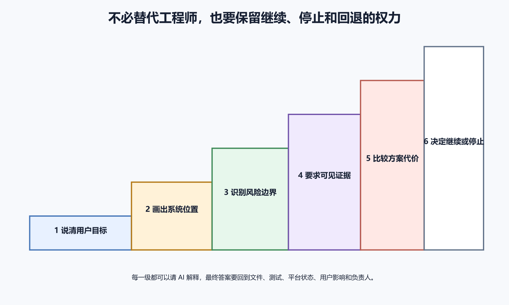

# 不懂代码时怎样保留最终判断能力

不会逐行写代码，不等于只能接受 AI 的最后一句话。项目所有者可以从用户目标、系统位置、风险边界、验证证据和外部状态作出判断。你不需要比工具更快地搜索语法，却要知道哪些结果由自己负责，哪些变化不可接受。

判断能力由一组稳定问题组成。这个功能解决谁的问题，改动发生在哪里，会读写什么数据，需要什么权限，怎样证明成功，失败先看哪里，能否回退，谁有资格按下发布按钮。工具和界面会变，这些问题仍然有效。

*图 74-1　判断能力从说清用户目标开始，逐步掌握系统位置、风险边界、可见证据与方案代价，最终能够决定继续、停止或回退。下文提供等价说明。*

## 先说清用户要完成什么

需求先用用户动作表达，不从技术名词开始。例如“用户换手机后仍能看到笔记”“管理员能撤销一个测试账号”“发布失败时旧网站继续可用”。这样的目标可以转成界面、数据和失败结果，也能阻止 AI 扩大范围。

问谁、何时、在哪个设备、做什么、应该看到什么、失败后能否继续。一个“增加登录”需求可能涉及注册、找回密码、会话过期、注销与权限；只画一个登录页不能完成目标。

目标还要有不变项。增加标签不能让旧笔记消失，优化部署不能公开数据库，改头像不能把原图设为公网。把不变项写进验收标准。

用本书前面的系统地图判断变化属于客户端、网络、代理、应用、数据库、存储、服务器、商店还是第三方服务。一个按钮报错，可能在浏览器执行阶段，也可能请求已到后端。先问失败首次出现在哪一层，再决定看 Console、Network、运行日志或商店状态。

你可以要求 AI 画出用户动作经过的文件与服务，并为每个箭头给证据。看不懂函数内部，也能核对“页面发请求”“后端验证权限”“数据库保存”“邮件在提交后发送”这些关系。地图围绕当前功能画最小路径，再列外部副作用和未知项。

## 识别哪类风险

风险可以先分为数据、安全、可用性、费用、隐私、政策与不可逆操作。数据库迁移关心丢失和兼容，防火墙关心公网暴露，自动重试关心重复扣款，日志关心秘密和磁盘，商店提交关心账号、政策与用户版本。分类后就知道需要谁确认。

再问最坏情况与影响范围。失败只影响一个预览账号，还是全部生产用户；能恢复一个文件，还是会删除唯一数据库；每分钟多花几分钱，还是循环创建高价资源。风险决定权限、测试、备份和审批强度。

无法解释风险时，不授权高影响动作。工具提示只说明动作试图越过某个边界，业务所有者仍要理解目标与后果。你有权要求更小范围、测试环境或复核。

证据分为文件、Diff、测试、运行与外部状态。文件证明产物存在，Diff 证明改了什么，测试证明部分输入与结果，真实运行证明目标环境能够工作，平台状态证明部署、DNS 或商店已经改变。

要求 AI 报告命令、版本、环境、退出码、通过、失败、跳过和未验证。不要接受“所有测试通过”却没有测试数量与提交。页面截图要保留 URL、版本和时间，日志用请求编号关联，数据修改使用测试记录核对。

个人项目可以用一个简化原则。同一结论至少由两种证据支撑，例如 Diff 加测试、页面加 Network、部署状态加外部请求。

## 比较方案的代价

AI 往往给出一个能实现目标的方案，你仍应问有没有更小、更可回退或更少长期责任的选择。静态网站能解决的需求，不必立刻购买 VPS；托管数据库够用时，自建数据库会增加备份与安全责任。

比较至少包含实现成本、维护成本、故障责任、平台依赖、数据迁移、费用与退出方式。最低初始价格不一定最低长期成本，技术最先进也不一定最适合非专业维护者。把方案写成并排表格，要求 AI 说明适用前提和不适用情况。

选择后记录为什么。半年后价格、用户量或能力变化，可以重新评估。没有记录时，团队只看到“用了 Docker”“选了 Firebase”，不知道当时的约束。

判断权最具体的表现是能够说“现在证据不够，先停”。缺少备份、目标账号不明、真实秘密出现在输出、测试未运行、生产与预览共享数据、迁移不可逆或没有观察者在线，都可以停。

继续也要带条件。例如允许修改测试分支，不允许部署；允许发布 5% 流量，错误率超过阈值回滚；允许生成配置，不允许读取 `.env`。条件写进计划与审批。回退后验证实际版本与数据。

## 不需要读懂所有代码，先读懂 Diff 的形状

打开 Diff 先看改了哪些文件、增删多少，是否出现锁文件、迁移、配置、二进制和测试。任务只改文字却动了数据库，范围已经异常。文件名不懂时，让 AI 说明它在系统地图中的位置。

逐块看行为解释。问修改前输入会怎样，修改后怎样，失败路径怎样，数据和权限有没有变化。要求回答指向具体行。AI 的解释可以帮助阅读，核对仍回到真实 Diff。

特别关注删除、默认值和条件反转。删掉一行权限检查，Diff 很小却影响重大；把默认私有改成公开，也只是一处布尔值。测试变化若只是删除失败用例，绿色状态可能没有意义。

单元测试通过能证明特定函数在测试输入下符合断言，不能证明生产数据库可连接。构建成功能证明生成产物，不能证明商店处理完成。页面显示成功能证明界面状态，不能证明数据已经保存。

失败也要定位范围。CI 因网络下载失败，不一定说明代码错误；iOS 未验证可能因为没有 Mac，不代表 Android 结果无效。报告把失败分成实现问题、环境门槛和外部平台状态。

让 AI 给每项结论附“证据”“适用范围”“不能证明什么”。抽查三项，若引用文件不存在、命令未运行或版本不对，就缩小信任范围。

## 区分事实、推断和建议

“日志显示 502”是事实，“上游应用没启动”是推断，“检查端口监听”是建议。AI 容易把三者写成流畅段落，让读者误以为已经确认。要求输出时分栏，尤其在事故和安全问题中。若认为代理无法连接应用，就用代理日志、应用日志和端口检查互相核对。

建议还要写位置、权限、预期、风险和回退。只说“重启服务”“清缓存”“重建数据库”不能执行。人不懂命令含义时，让 AI 逐个参数解释。

让 AI 同时给业务解释、系统地图解释、文件与测试解释。业务解释说明用户结果，系统地图说明浏览器、API、数据库与外部服务怎样变化，文件与测试解释指出具体 Diff 和证据。

若业务说只改提示，系统解释却增加数据库表，说明范围扩大。若文件解释没有服务器权限检查，业务却声称已经阻止越权，说明实现可能只在前端。也可以让 AI 解释为什么不改其他部分，例如只改 Web 是否会影响 App，新增字段为何不需要迁移。

## 重要事实回到一手资料

软件版本、平台界面、价格、免费额度、商店政策、备案和安全配置会变化。AI 记忆中的答案可能过期。要求使用官方当前资料，记录检索日期、适用版本和链接。社区案例可以理解真实故障，规则要回到官方来源。

涉及 Codex、ChatGPT 或 OpenAI API 的事实，应使用 OpenAI 官方资料。`AGENTS.md`、沙箱、审批与代码审查的产品行为都可能更新，封版和实际操作前再次核对。

官方文档只说明机制，不保证你的配置正确。版本匹配后还要在测试环境执行。文档证据、项目证据和运行证据互相补充。

域名、云平台、数据库、GitHub 组织、商店和支付都需要真实账号。记录谁拥有、谁可恢复、如何多因素认证、付款方式与交接。凭据放受控密码或秘密系统，不放 AI 对话和项目文档。AI 可以导航和准备表单，提交由持有人核对。

人员离开时按身份撤销，不继续共用密码。自动化改用专用低权限服务账号，避免某个人令牌到期让部署和备份停止。

## 保留一份项目所有者手册

手册面向不会天天读代码的所有者，内容包括系统地图、生产资源、用户数据、域名、部署入口、备份恢复、监控、费用、账号持有人、应急停止和下线。它不复制秘密，只写安全存储和恢复责任。每个核心功能用一页说明输入、输出、数据位置、外部副作用和故障入口。

重大选择写一页决策记录，包含背景、目标、选项、决定、代价、风险、验证和重新评估条件。选择托管平台会降低服务器责任，也会带来平台依赖；选择 VPS 能控制运行环境，也要承担更新、备份和安全。

## 危险回答要停下来

第一种危险回答是没有证据的确定语气，例如“已经绝对安全”“肯定不会丢数据”。安全和可靠性只能说明措施、剩余风险和验证。第二种是为了排错关闭防火墙、TLS、权限与验证，却没有限制时间和回退。第三种是把真实秘密粘贴进聊天或示例。

第四种是给出一长串工具与命令，却不说明运行位置、预期和失败入口。第五种是界面或价格没有检索日期。第六种是 AI 同时实施、评审、批准生产并宣告成功。还有一种只覆盖成功路径。网站打开了，却没有测数据库写入、权限拒绝、旧客户端和回滚。

第二意见应独立读取需求、Diff 和证据，不先看第一份结论。问题越具体，第二意见越有价值。比如这次迁移能否让旧版本继续读，这个 API 是否检查资源所有权。意见冲突时比较证据和适用版本。

## 从低风险项目练习

读完术语表以后，选一个没有真实数据的练习项目，把五个基础操作各做一遍。提交一个文件，比较一条成功请求和一条失败请求，登录一次练习服务器，重建一次容器，再完成一次测试渠道安装。每项只做最小范围。

每次练习只记四件事。原来预期什么，实际看到什么，漏掉哪个条件，下次先检查哪里。先在静态页面或测试仓库练习，再练表单验证，最后在隔离服务中练部署与回滚。

必须掌握的是文件与路径、版本与环境、请求与响应、权限与秘密、数据与备份、日志与状态码、Diff 与测试、发布与回滚。这些概念让你能理解系统位置和后果。复杂 Git 内部、Linux 内核、Kubernetes、大规模分布式算法，可以等项目需要时再学。

## 给 AI 一份长期工作约定

项目约定可以写“先读项目结构再改”“只做最小变化”“不读取真实秘密”“所有完成声明附验证”“生产与删除必须确认”“不回退用户已有改动”。OpenAI 官方 `AGENTS.md` 机制能让 Codex 在项目中持续读取这些说明。

约定要能执行和验收。写“代码要优雅”不如写修改后运行现有测试并报告跳过；写“注意安全”不如写不得在日志输出令牌，生产权限需账号持有人批准。过期后立即更新。每个任务仍要写目标、范围、外部状态与完成标准。

让 AI 对关键结论标记置信度，并说明依据。高置信度可以来自当前文件和成功测试，中等置信度可能来自多处一致文档但未运行，低置信度可能只来自命名或框架惯例。把未知具体化后，可以继续完成低风险部分。

## 什么时候必须请专业人员

涉及支付、医疗健康、未成年人、金融、身份、重大隐私、监管合规和大规模用户数据时，应由具备相应资格与经验的人审查。AI 与本书提供通识，不能替代法律、财务、安全或医疗责任。具体地区规则也会变化。

生产数据库恢复、复杂迁移、持续入侵、勒索、私钥或签名体系泄露、域名被劫持和无法回滚的停机，也值得及时升级。先止损和保存证据。

采用托管平台、BaaS、AI API、商店和专有工具时，问数据怎样导出，域名能否迁移，身份与权限怎样替换，离开后哪些功能消失，费用停止需要删除什么。

## 用过去的决定训练判断

每季度抽取一个已完成任务，比较原目标、AI 计划、实际 Diff、测试、生产结果和后续故障。回顾风险判断是否准确，证据哪里不足。若总在同一边界出错，例如环境变量、缓存或移动签名，就把检查写进项目约定与自动测试。

个人维护时间、可接受停机、每月费用和最多可丢数据都有限。把这些约束写成数字或范围，例如每月预算、RPO、RTO、支持的平台和每周可投入时间。新增数据库、队列、对象存储和监控前，问它解决的具体问题、增加的月度任务和下线方式。

## 一个不懂代码也能拒绝的例子

假设 AI 为了修复远程数据库连接，建议把 PostgreSQL 监听改为所有接口、UFW 开放 5432 全网，并使用超级用户。读者即使不会写 SQL，也能从系统地图和风险边界发现问题。浏览器不需要直连数据库，公网端口扩大攻击面，应用不应拥有超级用户。

可以要求更小方案。确认应用与数据库是否同主机或私有网络，只允许准确来源，使用低权限账号，并从获准与未获准位置测试。AI 若无法说明目标地址、权限和回退，就停止实施。

AI 为静态网站修正错别字，只改一个 Markdown 文件，Diff 清楚，构建与链接检查通过，预览页面显示正确，生产通过 Git 推送自动部署且可一键回滚。风险低，所有者可以批准合并。若同一个 PR 同时升级所有依赖和改变部署工作流，就要求拆分。

## 全书知识怎样汇成一次发布判断

拿到 GitHub 项目后，先确认仓库、许可证、文档和秘密，再在本地或隔离环境理解依赖与构建。网页发布要知道静态与动态、DNS、HTTPS、环境变量和日志。自建服务器增加 SSH、权限、防火墙、进程、代理、Docker、备份与更新。App 还增加签名、构建号、商店、测试和审核。

AI 可以贯穿这些步骤，负责搜索、解释、生成草案、修改、测试和整理证据。你负责目标、凭据、外部账号、真实数据、费用、用户影响、生产批准和验收。每次发布都用同一组问题收尾。实际改了什么，测试了什么，在哪个版本与环境，用户能否完成目标，数据和权限是否正确，失败怎样发现，能否回退，哪些仍未验证。

## 最终判断清单

- 用用户动作说明目标、失败和不变项。
- 指出变化属于客户端、网络、应用、数据、服务器或商店。
- 识别数据、安全、费用、隐私、政策和不可逆风险。
- 要求关键结论附文件、Diff、测试、运行或平台证据，并区分事实、推断、建议与未验证项。
- 重要版本、价格和政策回到当前官方资料，外部账号、秘密和最终按钮由真实持有人控制。
- 比较更小、更可回退和更少长期责任的方案，证据不足时拒绝扩大权限或生产发布。
- 持续更新项目所有者手册、决策记录和工作约定，清楚哪些内容还需要专业人员或真实设备。

判断能力让 AI 的速度建立在明确目标、有限权限与真实证据上。你可以不会写出所有代码，但必须看得见系统怎样变化，并保留说继续、停下和回到上一状态的权力。
