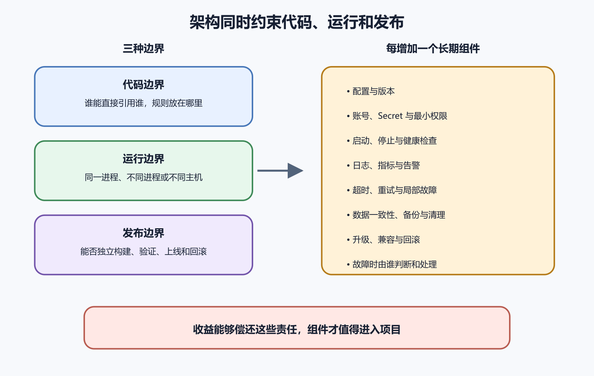

# 代码能运行以后，架构问题才开始出现

一个 AI 生成的项目第一次跑起来时，架构通常不会主动来找你。页面能打开，账号能登录，数据也能保存，需求看上去已经完成。等到第二次修改才会出现更有分量的证据。改一个订单状态，要同时碰页面组件、API 路由、数据库脚本、邮件发送和后台任务。删掉一个字段，三个地方继续读取旧名字。测试环境没有报错，生产队列却还在处理旧格式的消息。

**能运行证明眼前这条路径走通了。架构决定下一次变化会影响多大范围。**



*软件架构的代码、运行、发布边界以及新增组件带来的责任*

这张图可以当作本章的快速入口。左边三种边界回答系统怎样被切开，右边列出每增加一个长期组件以后必须有人承担的工作。AI 很擅长在当前文件附近补齐实现。它看到缺少缓存，就能加 Redis。看到请求太慢，就能拆 Worker。看到模块间调用麻烦，又能补一个事件总线。每项建议单独看都讲得通，合在一起却可能让一个原本只有应用和数据库的项目，多出四个运行组件、三套配置和一批没人负责的失败路径。

## 先看架构管的是什么

软件架构处理较难随意撤销的结构选择。代码怎样分区，数据归谁管理，依赖朝哪个方向，组件通过什么接口协作，哪些部分一起部署，哪里允许独立变化。文件夹排得整齐只能提供线索，边界要由依赖、接口、数据和部署行为共同证明。

[微软的 Web 架构指南](https://learn.microsoft.com/en-us/dotnet/architecture/modern-web-apps-azure/common-web-application-architectures)把逻辑分层与物理部署分开。一个应用可以只有一个部署单元，内部仍然分成清楚的业务、界面和基础设施区域。多个项目或多个文件夹也可能最终作为同一个进程发布。这一区分很要紧。把代码拆进八个目录，没有自动得到八个模块。把八个模块装进一个容器，也没有抹掉内部边界。

可以先画两张图。第一张画运行时请求经过哪里。

```
浏览器
  ↓
Web 应用
  ↓
业务规则
  ↓
数据库与外部服务
```

第二张画修改时谁依赖谁。

```
界面与接口
  ↓
业务规则
  ↑
数据库、邮件与对象存储的实现
```

第二张图里的箭头表达代码依赖。业务规则规定自己需要怎样保存订单，数据库实现去满足这份接口。测试业务规则时可以换成受控实现，数据库更换也不会迫使订单规则跟着改。具体项目未必采用同一套分层名称，判断点是核心规则是否被框架、数据库和供应商细节牵着走。

## 三种边界不要混在一起

代码边界决定哪些文件能够直接引用另一些文件。运行边界决定组件是在同一进程、不同进程还是不同主机。发布边界决定它们能否独立构建、验证、上线和回滚。三种边界可以重合，也可以分开。一个模块化单体拥有多个清楚的代码模块，运行和发布仍是一个整体。微服务进一步把部分模块放进独立进程，并承担网络通信、服务发现、超时、重试、观测和跨服务数据一致性。

项目没有独立发布需求时，把函数调用改成网络调用很少带来便宜。网络请求会超时，消息会重复，调用双方会在不同版本上运行，局部成功还可能留下中间状态。拆分可以解决真实的团队、扩展和隔离问题，也会把原先由一个进程隐式保证的事情变成显式工程责任。

架构图容易画得漂亮，真实改动更诚实。选一个已经做过的用户动作，例如“用户撤销一笔预约”，从入口沿代码走到数据变化和外部通知。记录下面几件事。

- 入口文件在哪里。
- 哪个模块拥有撤销规则。
- 哪张表或哪类记录发生变化。
- 邮件、推送和后台任务由谁触发。
- 哪些测试覆盖成功、重复请求和通知失败。
- 回滚代码后，新旧数据是否仍能读取。

如果同一规则在前端、API 和定时任务中各写一遍，修改范围会扩散。若一个模块可以直接更新另一个模块的表，数据所有权只是名义上的。若删除一项功能要先理解十个无关目录，边界也没有帮助维护者缩小问题。

可以做一次普通的受控检查。先运行当前版本的撤销流程，保存请求、数据库变化和通知记录。随后在测试环境让邮件服务返回失败，再运行同一操作。预约是否已经撤销，任务是否可安全重试，用户会看到什么，这些结果能说明系统如何处理局部失败。

## AI 最容易扩大哪几种范围

第一种范围是依赖。为了使用一个小函数，AI 可能加入一个包含大量间接包的 SDK。第二种范围是状态。为了提速，它可能增加缓存，却没有定义权威数据、失效时机和重建方法。第三种范围是部署。为了执行一段异步工作，它可能增加 Worker 和队列，却没有补健康检查、重试上限和积压监控。第四种范围是权限。新组件常伴随新的数据库账号、API Key 和环境变量。

审查 Diff 时不要只问新增代码能不能跑。还要查依赖清单、环境变量、迁移文件、容器配置、端口、队列名称和删除路径。只要项目新增一种长期状态，就要补上它的所有者、备份、清理与恢复办法。只要新增一个运行组件，就要补上启动、停止、升级、日志、监控与故障时的行为。

**复杂工具必须用减少的风险、时间或成本，偿还自己带来的复杂度。**

这句话并不要求所有项目永远保持简单。[PostHog 的架构说明原文](https://github.com/PostHog/posthog.com/blob/master/contents/docs/how-posthog-works/index.mdx)展示了 Django、Node.js 与 Rust 服务、Celery 等后台任务，以及 PostgreSQL、ClickHouse、Kafka 和 Redis 等组件。这些组件对应事件采集、分析查询、后台任务和高吞吐处理等责任。它适合用来学习成熟系统怎样组织复杂性，却不适合作为个人项目的起始清单。

## 架构决定也要留下来

许多项目只保存结果，不保存当时为什么这样选。几个月后，AI 或新维护者看到 SQLite、单体部署或轮询接口，容易把它们当成等待升级的旧方案。其实这些选择可能来自单机部署、有限写入、低维护预算和简单恢复需求。

架构决策记录常简称 ADR。短记录写清背景、采用的方案、放弃的方案、已知代价和重新评估条件。未来改变时用新记录取代旧记录，不改写过去。个人项目可以把它压缩到一页，不需要建立审批仪式。

一份关于数据库选择的 ADR 可以写明，当前只有一个应用实例，写事务短，备份通过恢复演练，暂时采用 SQLite。当出现多实例共同写入、持续锁等待或数据库需要独立扩展时，再评估 PostgreSQL。这样的记录给 AI 一条明确边界。它可以检查触发条件是否出现，不能只凭“生产环境应该用 PostgreSQL”推翻已有决定。

[GitHub 的 2026 年 2 月可用性报告](https://github.blog/news-insights/company-news/github-availability-report-february-2026/)记录过用户设置缓存的异步改写压垮共享后台协调组件，随后引发 Git HTTPS 代理连接耗尽和级联故障。另一项事件涉及遥测丢失，以及底层计算供应商错误应用安全策略。公开报告提供的材料有限，不能据此推断内部全部设计，却足以提醒读者把计划任务、队列消费者、Webhook、备份任务和监控采集画进系统图。

## 怎样判断这一章已经落到项目里

拿出当前项目，完成一张运行图和一张依赖图。再选择一个真实用户动作，沿着代码、数据和外部副作用走一遍。最终应当能回答四件事。

- 这条规则由谁负责，重复实现出现在哪里。
- 一项修改会跨越哪些模块、数据与部署单元。
- 新增组件以后多了哪些运行和恢复责任。
- 哪些证据证明主路径可用，哪些故障条件仍未验证。

回答不出来时，先补图、测试和决策记录。此时急着再拆一层目录，通常不会让答案更清楚。
