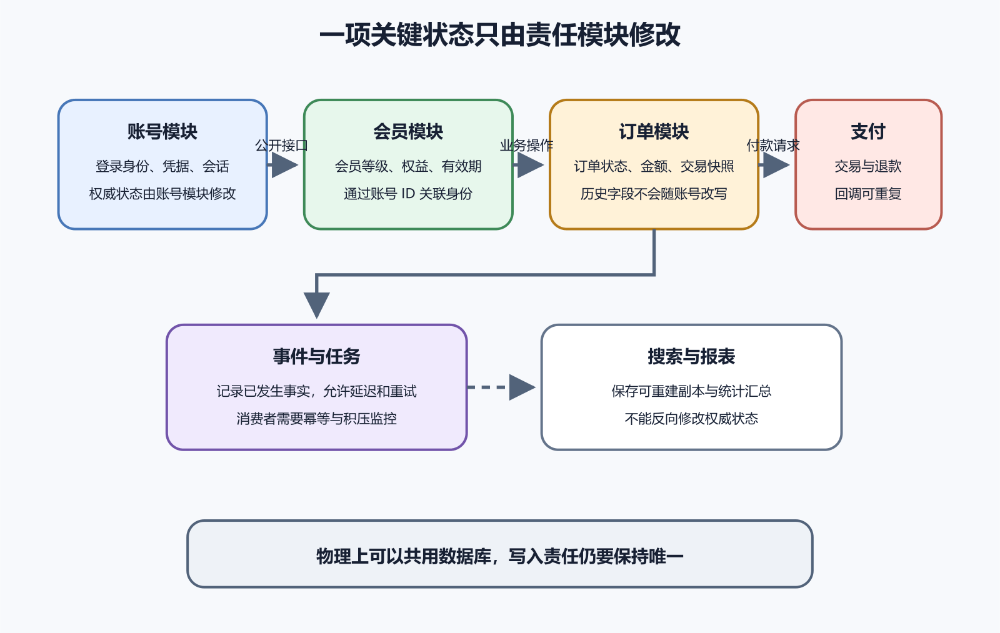

# 领域边界、数据所有权与跨模块协作

一个系统里可能同时有账号、会员、订单、库存和支付。它们都认识“用户”，却未必在说同一件事。账号关心登录身份和凭据，会员关心权益与有效期，订单关心购买者和收货信息，支付关心付款主体与退款去向。若 AI 看见这些对象都有邮箱和姓名，很容易把它们合并成一张越来越宽的用户表。后来改登录邮箱，历史订单抬头也跟着变化；删除账号，又把需要保留的交易记录一并清掉。

领域边界处理同一个词在不同业务区域里承担什么责任，哪些规则必须一起变化，哪一份数据拥有最终解释权。读者不必先背完领域驱动设计术语。先从一项真实修改开始，问清谁负责决定，谁只保存副本，谁只能通过公开接口发出请求。

**数据所有权的要点很朴素。每一项关键状态都要有一个明确的修改入口，其他模块不能凭方便绕过去。**

*账号、会员、订单和支付模块的数据所有权与协作关系。横向箭头示意可能的公开协作，不表示每次业务请求都必须依次经过全部模块。*

图中的账号、会员、订单和支付分别拥有自己的权威状态。搜索与报表可以保存副本，副本出错时从权威来源重建。事件把已经发生的事实送给其他模块，消费者需要处理延迟和重复。四个模块即使暂时共用一台数据库，这些责任也不该混在一起。

## 先从业务能力找边界

按技术层分文件很直观。Controller 放一处，Service 放一处，数据库模型再放一处。问题在于完成一个会员续费功能时，维护者仍要横跨所有技术目录寻找相关代码。按业务能力组织会把会员规则、入口、数据访问和测试放在彼此靠近的位置，邮件与支付等外部实现仍可留在基础设施区域。

边界来自相对稳定的业务能力，也需要足够业务知识。开发者若连“退款由谁批准”“库存何时算占用”都没有说清，先画几个服务框很难得到可靠边界。

可以用三个问题开始。

- 哪些规则必须在同一次业务决定中保持一致。
- 哪些词在不同区域拥有不同含义。
- 哪一类变化经常让同一组代码和数据一起修改。

报名系统里的“名额”属于活动管理，“报名状态”属于报名流程，“付款状态”属于支付记录。报名流程可以询问活动还有没有名额，也可以请求支付退款。它不应直接修改活动容量或伪造第三方支付已退款。这里的边界来自责任和规则，框架名称没有参与决定。

## 数据所有权不等于每个模块一台数据库

所有权描述谁可以决定和修改一份状态。物理存储描述数据放在哪个数据库、Schema、文件或服务中。模块化单体可以让多个模块共享一个 PostgreSQL 实例，甚至在早期共享同一个 Schema，同时通过代码约束、数据库权限和测试限制跨模块写入。

物理隔离更强，也更贵。每个服务拥有独立数据库以后，跨服务 JOIN、事务、备份、迁移和排错都会改变。读者若只为了证明模块独立就拆数据库，很快会重新建立一个能访问所有库的报表服务，维护工作却增加了。

稳妥的渐进顺序通常是先明确表和字段的责任模块，停止新增跨边界写入，再为必要查询提供接口或只读视图。现有系统若大量代码直接访问共享表，可以先把访问收拢到一个受控入口。包装入口本身会成为新依赖，需要容量、权限、监控和故障处理。

跨模块协作时，先给数据分身份。权威数据由责任模块维护。派生数据可以从权威数据重建，例如搜索索引、缓存和统计汇总。历史快照保存某个业务时刻的事实，即使源对象以后变化也不跟着改。

订单保存购买时的商品名称和价格，通常属于历史快照。商品模块后来改名，旧订单仍要呈现当时交易内容。搜索服务保存商品标题与关键词，属于可重建的派生数据。账号模块的当前登录邮箱是权威身份属性，却不应自动覆盖发票已经确认的抬头。

AI 常把重复字段判断成“违反规范化”，随后统一改成外键查询。也可能为了少一次查询，把同一份用户资料复制到许多表。两种建议都要回到数据身份。快照有保留理由，派生数据要有重建办法，权威数据要有唯一修改入口。

读模型用于跨模块读取。订单列表需要同时显示会员等级和付款状态时，系统可以订阅会员和支付事件，维护一份面向页面的只读汇总。读模型接受一定延迟，因此界面要区分哪些字段可以稍后更新。付款成功后的最终确认不能只依赖汇总。

删除请求会进一步检验所有权。账号模块可以撤销登录能力，订单模块可能仍需按法律和业务要求保存交易记录，分析与搜索副本则应按规则清理或去标识。删除不能由一个 `DELETE FROM users` 代替。每个责任模块要说明保留依据、删除动作、传播方式和验证结果。

## 跨模块协作有三种常见方式

直接调用最容易理解。订单模块调用库存模块的预留接口，拿到成功或失败后继续。它适合需要立即知道结果、调用链不长、双方位于同一进程或可靠网络范围的情况。代价是调用方等待被调用方，后者变慢或不可用会直接影响当前请求。

事件通知适合已经发生的事实。订单创建后发布订单已创建事件，邮件模块发送确认，分析模块更新统计。发布者无需知道每个订阅者的内部动作。代价在后面出现。消息可能延迟、重复或乱序，订阅者需要幂等处理，失败任务要能重试和观察。

共享数据读取适合过渡期和受控报表。调用方直接读别人的表最快，却会依赖内部 Schema。表一改，隐藏消费者就会出错。短期保留时应记录读取者、限制为只读、监控查询并给出移除条件。单一部署单元也能拥有可执行边界，靠导入规则、包可见性、Lint、测试和代码审查限制跨模块依赖。

## 一次操作跨越多个边界时怎么保持清楚

下面是一个假设的报名付款流程，用来说明设计检查，不代表真实公司的实现。

用户提交报名，报名模块先验证活动状态并创建待付款记录。支付模块创建付款请求，把第三方交易编号返回。第三方回调到达后，支付模块验证签名并记录付款成功，再通知报名模块确认名额。确认失败时，系统需要知道付款已经发生、报名尚未确认，并进入可观察的补偿流程。

这条流程很难用一个跨系统数据库事务包住。设计要明确每一步保存什么事实，重复回调怎样处理，超时后由谁查询，人工处理从哪里进入。若活动在付款期间名额已满，可以退款、进入候补或预留名额。产品必须选择一种规则。

测试正常路径只能证明一次顺序理想的操作能完成。还要在测试环境分别制造重复回调、回调延迟、确认名额失败和退款接口超时。每次只改变一个条件，随后检查报名、支付和任务记录。

各项结果证明的范围也要写清。

- 重复回调没有重复确认，说明当前幂等判断覆盖了这条回调路径。
- 确认失败后生成待处理任务，说明局部失败没有被当成整体成功。
- 重启 Worker 后任务继续，说明任务状态没有只留在进程内存。
- 人工页面能看到支付和报名的不同状态，说明支持人员可以识别中间状态。

这些检查仍不能证明所有并发顺序、安全攻击和第三方异常都已覆盖。它们给出的是具体证据。

## 边界怎样被慢慢绕坏

最常见的开端是一条看起来很小的捷径。邮件模板需要用户名，于是通知模块直接查账号表。运营报表需要会员等级，于是分析脚本加入生产数据库管理员凭据。退款页面缺一项字段，于是前端直接调用支付供应商接口。每次改动都能节省眼前时间，系统却多出一条未登记的依赖。

代码审查要看 Diff 触碰了哪些责任区域。个人项目只有一个维护者时，仍可维护一张路径与责任表。它提醒自己，修改 `payments`、迁移文件或权限策略属于不同风险等级，不能因为都是 AI 生成的 Diff 就一次接受。

边界检查也可以自动化。禁止模块直接导入另一个模块的内部目录，检查循环依赖，限制数据库模型只在责任模块出现。自动规则只能执行已经定义的边界。业务边界本身写错，绿色检查不会替你发现全部问题。

数据库迁移也是观察绕过行为的好地方。一个订单需求若修改了账号、会员和支付三组表，先确认它确实跨越多个业务责任，还是原有数据被放错位置。迁移脚本若从其他模块的表读取内部字段，要评估部署顺序与旧版本兼容。

共享数据库中可以用不同 Schema、受限数据库角色或只读视图加强边界。它们能阻止一部分意外访问，也会增加迁移与权限配置。个人项目早期可以先用代码与测试约束，等绕过风险、协作者数量或审计要求上升后再增加数据库级隔离。

## 从成熟仓库学习时不要只抄目录

学习成熟仓库时，先挑一个用户动作或后台任务，查看入口、负责模块、数据存储、事件和测试。直接复制顶层目录名称，只会得到一套脱离自身业务的外壳。某项功能每次都需要把整个项目重新读一遍，说明当前边界没有帮助你缩小理解范围。

要求 AI 修改跨模块功能以前，先让它列出当前责任模块、权威数据、允许调用的接口、外部副作用和预期失败状态。修改完成后再对照 Diff，检查它有没有直接写别人的表、复制业务规则、增加新的 Secret 或引入未说明的消息订阅。

一份可接受的说明应当回答下面这些问题。

- 谁能创建和修改这项状态。
- 其他模块需要读取时通过什么稳定入口。
- 数据副本属于快照还是可以重建的派生数据。
- 同步调用失败时，当前用户动作怎样结束。
- 异步消息重复、延迟或丢失时，系统怎样发现并继续。
- 哪些自动检查能阻止下一次绕过边界。

AI 给出的边界图与代码不一致时，以实际依赖、数据库权限、运行配置和测试结果为准。图需要随实现修正，不能用图替代码辩护。
