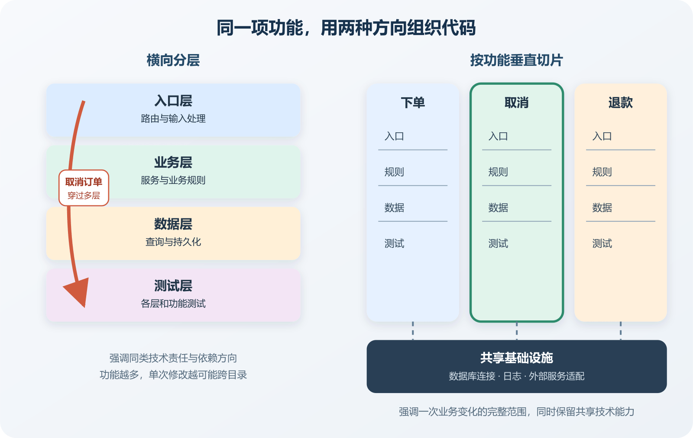

# 分层架构、按功能组织与 Vertical Slice

想给网站增加一个“取消订单”功能，AI 先修改控制器，再修改服务类、数据访问层、订单模型、路由、权限配置和测试。文件散在六七个目录中，每一处看起来都很规整，合起来却很难回答一个简单问题。取消订单这件事到底由哪些代码完成。

这种困惑经常被误判为目录不够整齐，于是维护者让 AI 继续创建 `controllers`、`services`、`repositories`、`models` 和 `helpers`。目录确实更像教程里的样子，理解一项业务修改仍要在它们之间来回跳转。另一种做法把订单取消的入口、业务规则、数据操作和测试放在相邻位置，让人先看见完整行为，再顺着依赖进入公共基础设施。这类组织常被称为 Vertical Slice，也就是按一项用户行为或业务能力形成“垂直切片”。

分层与切片都在缩小混乱，各自缩小的是不同方向。分层强调同类技术责任与依赖方向，切片强调一次业务变化涉及的代码范围。成熟项目常把两者组合使用。

*横向分层与按功能垂直切片的代码组织方式*

左侧按入口、业务、数据和测试形成横向区域，一项功能会穿过多层。右侧先按下单、取消和退款聚拢行为，每个切片内部仍保留必要的入口、规则与数据访问，底部共享数据库连接、日志和外部服务适配。图中表达的是理解方向，实际项目不会要求每个小功能拥有完全相同的文件数量。

## 分层先解决依赖失控

传统分层架构把程序按技术责任分开。界面或接口层接收输入，应用层组织用例，领域或业务层表达规则，基础设施层连接数据库、消息系统和第三方服务。名称可能因语言和框架不同而变化，核心判断仍是上层通过稳定接口使用下层能力，重要业务规则不应被某个网页框架或数据库驱动方式完全绑住。

假设会员到期规则写在页面按钮的点击事件里。以后新增后台管理入口、定时续费任务和手机 App 时，同一条规则可能被复制三遍。把规则移到业务区域以后，多个入口可以共同调用。若数据库从 SQLite 换成 PostgreSQL，理想状态下会员有效期怎样计算不需要随之重写。这里的分层确实降低了技术替换对业务规则的冲击。

分层还有几个直接好处。数据库访问集中后更容易控制事务和查询，HTTP 输入集中后更容易做鉴权和校验，外部服务通过适配器接入后更容易在测试中替换。对于框架约定强、业务较简单的项目，这种结构通常已经足够。

代价会在功能越来越多时出现。控制器和服务各自堆在一起，数据对象也远离具体业务动作。开发者看见的是技术分类，用户想完成的事情却被拆散了。修改订单取消时，代码搜索结果遍布整个仓库。AI 尤其容易沿着现有公共抽象继续添加参数，最后得到一个能处理创建、取消、退款、发货和查询的 `OrderService`。

因此，分层是否有效不能只看目录名。要观察依赖是否单向，业务规则能否脱离具体入口测试，数据库细节有没有渗入所有文件，以及一项普通修改会不会频繁触碰大量公共代码。目录叫 `domain` 并不能自动产生领域边界，目录叫 `infrastructure` 也不能阻止业务代码直接执行任意 SQL。

## 按功能组织让一次修改更容易看全

按功能组织会先建立 `orders`、`memberships`、`billing` 之类的区域，再在区域内部放入口、规则、数据访问和测试。退款属于支付责任还是订单责任，要由状态和规则决定，不能只因某个文件当前位于 `orders` 目录就结束讨论。

Vertical Slice 更进一步，把一个可观察行为涉及的代码放得更近。例如 `CancelOrder` 可以包含请求结构、输入校验、权限判断、取消规则、持久化操作、返回结果和这一行为的测试。阅读者打开这个区域，能较快看见输入怎样变成结果。新增一种订单查询时，也不必先把通用仓库接口扩展到可以表达所有未来查询。

不同项目会按页面、命令、用例、业务能力或模块形成切片，有的使用 CQRS 和消息分派器，有的只使用普通函数与目录。判断重点是相关行为能否被一起理解和修改。一个只有五个页面的展示网站，使用框架默认目录就能保持清楚。一个包含会员、订单、退款和通知的应用，即使代码总量还不大，也可能因规则变化频繁而受益于按功能组织。

## 切片内部仍然需要结构

把文件搬进功能目录不会自动解决耦合。`CancelOrder` 若直接读取环境变量、执行 SQL、发送邮件、调用支付平台并拼接 HTTP 响应，它只是把混乱集中到一个文件。切片应表达一项行为，同时把易变的外部细节交给稳定入口。

以取消订单为例，切片可以先验证订单是否属于当前用户，再检查状态是否允许取消，随后记录取消结果并发出待退款任务。数据库事务负责订单状态和任务记录的一致性。支付平台调用由后台任务完成，失败后保留重试状态。邮件通知订阅取消结果。这样安排以后，切片仍能被完整阅读，网络调用和数据库连接也没有散落在规则中。

横向能力仍有存在价值。身份认证、日志、数据库连接、时间来源、消息发送和外部 API 客户端通常由整个应用共享。共享区域要保持窄而明确。它提供可复用能力，不替各功能决定订单能否取消、会员何时到期或退款金额是多少。

同样要警惕复制。三个切片都需要解析分页参数，可以共享一个经过验证的小工具。三个切片都叫“验证订单”，却分别检查查看权限、取消条件和退款资格，此时硬合并成一个万能验证器会抹掉含义。是否抽取公共代码，要看变化原因是否相同。

## 不要为了模式纯度增加中间层

一些 Vertical Slice 示例会同时使用命令与查询职责分离，也就是 CQRS，还会使用 Mediator 之类的消息分派器。它们能让入口统一、横切行为可组合，也会增加类型、跳转和运行路径。只有一个调用方、一个实现和一条简单查询时，为每个动作创建接口、命令、处理器、仓库和映射器，读者可能要打开七个文件才能找到一行 SQL。

AI 很擅长生成这种结构，因为命名和样板高度规律。它也容易把“以后可能替换数据库”当成创建通用仓库的充分理由。审查时应要求每个抽象说清当前隔离了什么变化，有几个真实实现，测试是否确实借助它控制外部依赖。

简化不等于把所有代码写进路由函数。一个实用的个人项目起点可以是按功能建立目录，每个功能保留少量清楚的用例函数，公共基础设施集中管理，跨功能规则放入明确的领域模块。等到重复模式、替换需求或测试障碍真实出现，再抽取接口和公共行为。

源代码放在同一个进程里，函数调用失败通常立即返回异常，事务也可能覆盖多个模块。部署成多个服务后，相同的概念调用会穿过网络，产生超时、重试、身份验证和版本兼容问题。目录上的 Vertical Slice 不代表它拥有独立部署能力。

审查架构图时可以同时画两张关系。代码图说明谁可以导入谁，运行图说明进程、数据库、队列和外部平台之间怎样通信。前者能发现循环依赖和内部接口泄露，后者能发现网络故障与数据一致性风险。

架构约束可以部分自动执行。其他语言可以使用导入限制、Lint、依赖图和定制测试达到相似目的。工具只能检查写得出来的规则，无法判断取消订单究竟属于哪个业务责任。

## 用一次真实修改检验目录是否帮忙

选择一个规模适中的功能，例如给订单取消增加“已发货时拒绝取消”。先记录修改前需要阅读和改动的文件，再完成变更并运行测试。完成后看三个结果。

- 业务规则是否只存在于一个可识别位置。
- HTTP 入口、后台任务和测试是否调用同一条规则。
- 变更有没有迫使无关功能修改公共接口。

如果只改了取消切片和它的测试，可以说明当前组织缩小了这项变更的代码范围。它不能证明其他功能也同样清楚。若架构检查拒绝了从订单内部目录到支付内部目录的直接导入，可以说明这条已声明的依赖规则生效。

再做一个简单的受控失败练习。在测试环境让支付适配器返回超时，观察订单取消记录、退款任务和用户响应。订单状态保存成功、退款任务留待重试，说明当前实现没有因一次外部超时丢失已接受的业务动作。正常取消、禁止取消和重复请求也要得到明确结果。

## 让 AI 先展示改动地图

让 AI 开始大范围调整目录以前，要求它先列出本次功能涉及的入口、规则、数据、外部副作用和测试，再说明哪些文件准备移动，哪些公开导入路径会变化。若只是从横向目录机械搬到功能目录，运行行为应保持不变，测试和构建结果要在移动前后对照。

随后检查 Diff。一个功能修改若顺手创建了通用基础仓库、全局事件总线和十几个空接口，要求 AI 给出每项新增结构解决的当前问题。一个切片若复制了鉴权、日志和数据库连接，要求它指出可以安全共享的基础设施入口。

对多数个人项目，可以从一个克制的混合结构开始。顶层按稳定业务能力分区，功能区域内部按用户行为组织，公共基础设施保持少量稳定入口，真正跨功能的规则放在明确的共享领域模块。分层用于约束依赖，切片用于聚拢变化。
