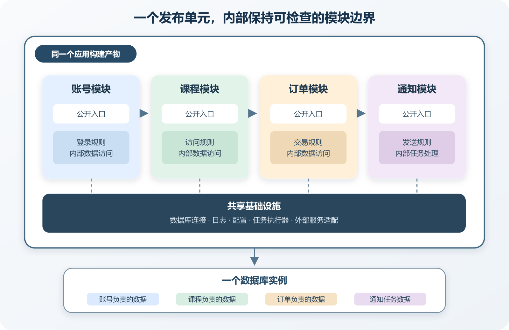

# 模块化单体怎样控制变化范围

一个课程网站起初只有账号、课程和订单。三类功能共用一套后端，部署时只启动一个进程，数据也放在同一个数据库中。优惠券、退款、试看和邮件通知陆续加入，任何需求都开始修改同一批公共服务。AI 为解决眼前报错继续增加条件分支，测试越来越慢，开发者也不敢单独调整订单逻辑。此时有人会建议立即拆成微服务，好像只要多建几个进程，混乱就会自动消失。

模块化单体提供了一条更克制的路线。系统仍作为一个整体构建和部署，内部却按业务责任分成可以说明、可以检查的模块。账号模块管理登录身份，课程模块管理内容与访问规则，订单模块管理购买过程。模块通过公开入口协作，内部表和实现细节不向整个项目随意开放。

它保留单体部署简单、进程内调用直接和本地事务可用的优势，同时迫使维护者正面处理边界。若边界在一个进程里都无法维持，换成网络调用往往只会把隐藏耦合变成超时、重试和数据不一致。

*模块化单体的一个部署单元、内部模块与共享基础设施*

图中账号、课程、订单和通知位于同一个应用进程中，各自拥有公开入口与内部实现。模块可以共用基础设施和数据库实例，但只写入自己负责的数据。构建产物作为一个整体发布，因此上线和回滚仍会影响整个应用。

## “单体”描述部署形态，不是质量评价

单体应用通常把主要后端功能构建成一个可部署单元。它可能是一个可执行文件、一个容器或一组必须一起发布的文件。Microsoft 的常见 Web 应用架构说明了单进程单体、分层单体和 Clean Architecture 等组织方式。这些方式的共同点是主要功能一起部署，内部代码质量则可能相差很大。

一个小型单体可以拥有清晰测试、稳定模块和可靠发布。一个由许多服务组成的系统也可能共享同一数据库、互相循环调用，并要求所有服务同时升级。服务数量不能直接证明架构成熟。读者应分别观察部署单位、代码依赖、数据所有权和运行调用。

## 一个模块要具备哪些实际边界

目录边界是起点。订单模块的公开入口可以暴露创建订单、取消订单和查询状态，内部目录保存状态机、数据库映射和实现细节。其他模块只能导入公开入口，不能为了省一步直接访问 `orders/internal`。包可见性、导入规则或架构测试可以把这项约定变成自动检查。

数据边界同样重要。订单模块拥有订单状态，课程模块拥有课程发布状态，账号模块拥有登录凭据。它们可以位于同一个 PostgreSQL 实例，也可以暂时位于同一个 Schema。所有权仍应写清，跨模块写入应通过责任模块完成。物理共用数据库降低了运维成本，也会让绕过边界十分容易，因此代码审查和测试不能缺席。

公开契约说明其他模块能依赖什么。它可以是一个函数、一组接口、应用内命令或领域事件。契约需要使用调用方能理解的稳定语义。例如课程模块询问某个用户是否拥有访问权，比直接读取订单表中的内部状态码更可靠。内部状态从 `paid` 调整为 `settled` 时，课程模块不应被迫一起修改。

配置和权限也应跟随责任。支付密钥只提供给处理支付适配的代码路径，普通课程查询不需要读取它。个人项目初期未必需要为每个模块创建独立数据库角色，至少要避免把管理员连接传给所有脚本。

## 模块之间怎样协作

同一进程中的直接函数调用速度快、路径短，也容易跟踪。订单创建时同步询问课程模块能否购买，适合当前动作必须立即获得结果的情况。调用接口应表达业务问题，返回值也要区分拒绝、找不到和内部失败，不能全部压成一个布尔值。

本地事件适合通知已经发生的事实。订单完成后发布订单已支付，通知模块发送邮件，课程模块授予访问资格。重要副作用可以把事件或待处理任务与业务状态一起写入数据库，再由后台 Worker 读取执行。这仍需要重试、幂等和积压监控。

共享数据库查询可以满足复杂报表，但要区分业务决策和只读分析。课程访问判断依赖最新付款结果，应通过订单公开能力或可靠读模型完成。月度销售报表可以使用受控只读视图，允许一定延迟。给报表脚本管理员权限并直接连接所有表，会让分析需求成为绕过模块边界的固定通道。

模块化单体还有一个实用优势。一次业务操作若确实需要同时更新同一数据库中的几项本地状态，可以使用数据库事务保持一致。拆成独立服务以后，这类原子事务通常会变成消息、补偿和中间状态。

## 共享基础设施要薄，业务公共层要慎重

数据库连接池、日志、时间来源、配置读取和 HTTP 客户端适合由应用统一管理。它们解决的是技术接入问题。共享区域若开始包含 `calculateFinalPrice`、`canRefundOrder` 和 `grantMembership`，业务边界正在重新混合。

一个常见坏味道是 `common` 或 `shared` 目录持续增长。AI 找不到明确归属时，很可能把新文件放进去。审查应要求说明谁负责这段代码，哪些模块使用，改动时需要同步验证什么。暂时无法判断归属的代码可以先留在最主要使用者附近，等第二个真实用例出现后再决定抽取。

可执行边界比目录名可靠。JavaScript 项目可以限制导入路径，Python 项目可以检查包依赖，Go 项目可以利用包可见性和静态分析。工具选择服从边界目标。

## 从混杂单体渐进改造

改造不宜从重排全部目录开始。先选择一个变化频繁、责任相对清楚的能力，例如通知或订单查询，记录它当前调用哪些文件、读取哪些表、使用哪些配置。再建立公开入口，把新调用引向入口，并停止新增绕过路径。

第二步收拢写入。搜索谁在修改这个模块负责的表和状态，把跨区域写入迁回责任模块。旧调用一时无法删除时，可以用兼容函数转发并记录调用者。这样既能继续运行，也能看见剩余依赖。直接移动数据库表通常风险更高，尤其涉及迁移、回滚和旧版本并存时。

第三步为边界加入检查。禁止外部导入内部目录，检查循环依赖，为公开入口编写模块级测试。测试应覆盖当前真实规则，不能只有“模块可以启动”这一项。

第四步再整理目录和命名。此时依赖已经被识别，移动文件的风险低一些。每批改动控制在可审查范围，重构前后运行同一组测试。若一次提交同时移动几百个文件、重写接口和修改业务逻辑，Diff 很难证明行为保持不变。

个人项目虽然没有跨团队协调，仍存在认知边界。某个功能每次都需要让 AI 读取整个仓库，说明项目没有提供足够局部的上下文。先把一个模块的接口、数据和测试讲清，AI 才更可能在有限范围内修改。

## 怎样验证模块边界真实存在

先做一次普通功能验证。通过公开入口创建订单，检查返回结果、订单记录和事件任务，再运行订单模块测试。成功结果可以证明当前公开路径在测试条件下完成了这项操作。它无法证明无人从其他脚本直接写订单表。

随后加入静态边界检查。故意在课程模块导入订单内部仓库，确认测试或 Lint 会失败，再撤销这项试验。它仍不能发现通过数据库连接执行的跨模块 SQL，因此还要搜索数据库模型使用位置，并审查后台脚本。

异步协作也要测试。让通知发送器返回一次可预测错误，检查订单仍保持完成、通知任务记录失败并可以重试。重启 Worker 后任务继续，说明任务没有只存在内存。重复执行没有发送两次，说明当前幂等规则覆盖了这条重试路径。

## 模块化单体的限制

一个构建产物意味着任何模块修改都要发布整个应用。即使只改通知模板，部署失败也可能影响订单入口。发布前需要运行整体烟雾测试，回滚也以整个应用版本为单位。模块级测试可以缩短反馈，不能消除共享发布风险。

共享数据库会形成容量和故障关联。慢查询、锁等待或连接耗尽可能影响多个模块。模块应记录查询来源，设置超时和连接预算，监控时按模块或操作标记指标。代码边界清楚并不等于运行资源已经隔离。

独立发布频率、独立扩展需求、合规隔离和团队自治持续上升时，某个模块可能适合拆出。可以先让新服务拥有明确数据和执行责任，再逐步迁移调用。仅把模块接口换成 HTTP，数据仍由单体直接修改，通常只增加了网络成本。

## 为可能拆分保留证据，不提前建设分布式系统

模块化单体最有价值的准备是明确契约、数据所有权和依赖方向。它们能帮助未来拆分，也直接改善今天的维护。提前引入消息集群、服务发现和分布式追踪，却没有独立部署需求，会让个人项目承担长期运维成本。

可以为每个模块维护一页简短说明，记录责任、公开入口、拥有的数据、发出的事件、依赖的外部服务、关键测试和运行指标。每次真实修改后更新它。等某个模块经常需要独立扩容或发布时，这些记录能说明拆分收益与剩余耦合。

给 AI 的任务应包含目标模块、允许修改的公开入口、拥有的数据和禁止触碰的内部区域。让它在动手前列出依赖图，在完成后给出实际修改文件、数据库变化、外部副作用和测试证据。若 Diff 越过三个模块，要求它说明每一次越界是否来自真实业务协作。

对于重构任务，让 AI 把“移动代码”和“改变行为”分成不同批次。第一批建立入口并保持结果，第二批迁移调用，第三批收紧导入规则，最后才删除兼容路径。每一步都应能单独构建、测试和回滚。一次性重写看起来省时间，出错后却很难判断是文件移动、依赖调整还是业务逻辑导致。

最终需要人来确认的内容很明确。模块责任是否符合产品规则，关键数据由谁解释，发布失败影响多大，以及新复杂度是否解决了已经出现的问题。AI 可以搜索依赖、生成测试和执行机械迁移，不能替项目承担这些选择的后果。
