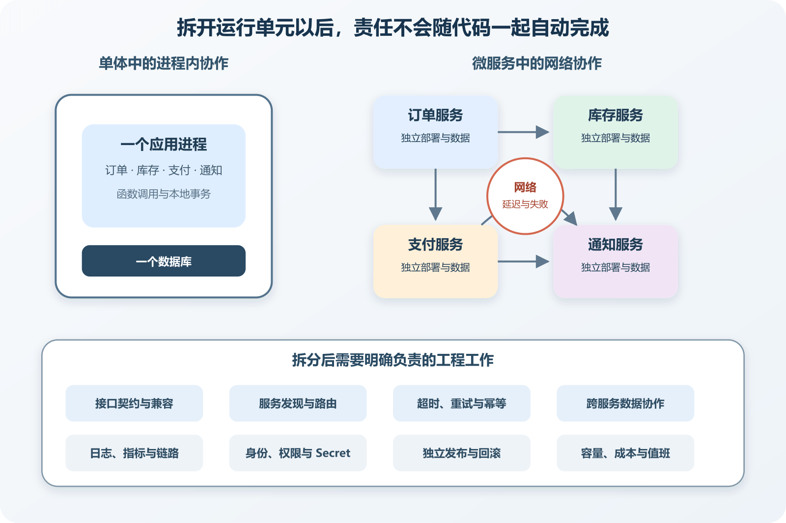

# 微服务真正增加了哪些工程责任

假设一个商城把开票功能从主应用中拆出来。原来是一段进程内函数调用，订单代码把购买者、金额和商品明细交给开票模块，成功后继续。拆分以后，主应用要先找到开票服务的网络地址，建立连接，完成身份验证，发送一份双方都能理解的数据。它还要面对超时、服务重启、版本不兼容和重复请求。开票服务则要拥有部署流程、配置、日志、监控、容量和故障处理。

代码可能更独立，系统承担的责任明显增加。微服务适合解决某些已经存在的扩展、发布和组织问题。它不是把大文件夹切成小仓库，也不是给每个目录套一个容器。若一项能力无法独立运行、独立发布，也不能控制自己负责的数据，它更像一个隔着网络调用的模块。

**判断是否需要微服务，先核算拆分后由谁长期承担网络、数据、发布、观测和安全责任。**

*从进程内调用到微服务协作后新增的工程责任*

图中左侧只有一个应用进程和数据库。右侧把订单、库存、支付和通知分成独立运行单元后，系统得到独立部署与扩展空间，也增加服务入口、网络故障、数据协作、版本兼容、观测、身份与资源管理。箭头变多不是设计失败，它说明需要被明确负责的地方变多了。

## 先确认它具备“服务”的基本条件

一个可靠的服务边界通常围绕一项业务能力形成。订单服务决定订单状态，库存服务决定库存是否被预留，支付服务记录付款与退款事实。AWS 的拆分指南建议根据相对稳定的业务能力寻找边界，同时提醒设计者需要足够业务知识。若只是按控制器、数据库访问和工具函数切分，任何业务动作都要穿过多个服务，网络调用会沿技术层逐级增加。

服务还应拥有可独立发布的代码和运行配置。修复通知模板时不必同步发布订单与支付，订单的新版本也不应要求所有调用者在同一分钟升级。独立发布需要兼容契约、自动测试、部署与回滚支撑。只有仓库分开，生产发布仍必须整体停机升级，预期收益就没有出现。

数据责任必须清楚。支付服务拥有付款状态，不意味着它一定拥有一台专用数据库服务器，但其他服务不能绕过它直接把付款改成成功。Microsoft 的微服务应用设计把独立开发、部署、扩展和服务内领域逻辑列为重要特征，也列出跨服务通信、基础设施和全局资源增加的成本。这些条件需要一起看，不能只取“独立扩展”这一项。

最后还要有持续维护者。服务上线以后需要处理漏洞、证书、依赖更新、告警和数据恢复。个人项目只有一个人时，每增加一个服务，都在增加自己未来要理解和看护的生产单元。AI 可以生成部署文件，无法替你在凌晨的故障中决定先停哪条路径、是否重试付款、怎样确认数据没有重复。

## 网络把确定的函数调用变成不确定结果

进程内调用通常能得到返回值或异常。网络调用可能出现第三种情况。调用方超时了，却不知道对方有没有完成。用户点击付款，订单服务等待支付响应。支付服务已经扣款并保存成功，响应返回途中连接中断。订单服务看到超时，若直接重试，可能造成重复付款。若直接判失败，又会出现钱已付而订单未确认。

因此每次远程调用都要回答几个问题。连接和读取分别等多久，哪些错误可以重试，最多重试多少次，重复请求怎样识别，最终失败时保存什么状态，由谁继续处理。付款、发邮件和创建外部工单的副作用不同，不能共用一个“失败就再试三次”的通用规则。

重试会消耗更多资源。依赖已经过载时，所有调用方立即重试，会把新请求和重试请求一起压上去。AWS Well-Architected 指南建议限制重试次数或总时长，采用退避并加入随机抖动，避免大量客户端在同一时刻重新请求。这些参数还要结合业务时限测试。五分钟后补发通知可能可接受，五分钟后才告诉用户库存不足通常不可接受。

幂等用于控制重复请求的副作用。客户端为一次付款尝试生成稳定请求标识，服务端记录该标识与结果。相同标识再次到达时返回已有结果，而不再次扣款。幂等也有范围和保存期限。更换标识、并发到达或记录过期后会怎样，需要通过测试确认，不能只因为接口参数叫 `idempotencyKey` 就认为问题已经解决。

超时也会沿调用链叠加。网页给订单接口五秒，订单再依次调用库存、优惠、支付和通知，每个服务都等五秒，最外层承诺已经失去意义。设计时要给整条用户动作分配时间预算，把可以稍后完成的通知移到异步任务，并在依赖变慢时尽早返回可解释结果。

## 数据不再天然处于一个事务里

单体共享数据库时，创建订单、减少库存和记录任务可以在一个本地事务中提交或回滚。服务各自管理数据以后，一次购买会跨越多个事务。订单成功、库存失败、支付处理中，这些中间状态都会真实存在。

处理方法通常是把长流程拆成一组可追踪步骤。每个服务先保存自己已经完成的事实，再通过调用或事件推动下一步。后续失败时，系统执行补偿、等待重试或交给人工处理。例如库存预留成功而支付失败，可以释放预留。支付成功而订单确认失败，则不能简单“回滚数据库”，需要查询支付事实并继续确认或退款。

补偿不等于时间倒流。退款可能产生费用，邮件无法从收件箱撤回，外部系统也可能已经读取事件。产品要定义可接受的后续动作，界面要向用户展示处理中、已失败或待人工确认。技术实现只能执行规则，不能自行决定商业后果。

跨服务查询也会变化。订单页面需要商品名、库存状态和付款结果时，直接跨三个数据库 JOIN 已不可用。可以由订单保存下单时快照，调用其他服务获取最新状态，或维护面向页面的读模型。每种方法都要说明新鲜度、故障表现和重建方式。把所有服务数据库权限交给一个报表程序，会重新建立全局耦合。

旧系统大量共享数据库时，不宜先搬表再寻找调用者。AWS 的数据库包装服务模式提出用受控入口收拢访问，逐步建立所有权。这种过渡入口会承受流量和故障，需要监控与容量。它是迁移工具，不应永久变成一个可以访问所有数据的万能服务。

## 每个服务都需要一条完整交付链

独立发布的前提是每个服务都能独立构建、测试、配置、部署和回滚。仓库可以共用 CI 模板，生产结果不能依赖某位开发者手工记住发布顺序。服务版本、数据库迁移和契约兼容要进入发布记录。

接口变化尤其需要克制。给响应增加可选字段通常比删除或改名容易兼容，改变字段含义则可能在语法不变时破坏调用者。服务提供方要知道谁在使用接口，可以采用契约测试、消费者清单和弃用期限。发布新版本时先兼容旧调用，等消费者迁移完成再删除旧能力。

数据库迁移要允许新旧服务版本短暂并存。先增加可空字段或新表，发布能同时理解旧新结构的代码，再迁移数据，最后清理旧字段。一次部署若同时重命名列并要求所有实例立即切换，滚动发布和回滚都会困难。自动化工具能执行步骤，兼容窗口仍要由维护者决定。

服务发现与路由也进入日常工作。调用者不能依赖某个容器临时 IP，需要通过稳定名称、平台服务或网关找到实例。入口要有健康检查、超时和负载分配。这里不需要读者立刻学习 Kubernetes。托管平台、Docker Compose 和普通反向代理都能提供不同规模的能力，选择应与服务数量和运维经验匹配。

配置与 Secret 会成倍增长。测试、预览和生产环境可能使用不同数据库、队列和外部账号。Secret 需要最小权限、轮换和审计，不能复制到所有服务的 `.env`。某个服务只发送邮件，就不应拥有支付密钥和生产数据库管理员凭据。

## 日志要能重新拼回一次用户动作

单体报错时，一份按时间排序的日志往往能提供大部分线索。微服务中，同一次下单会产生多个进程的记录。机器时间略有差异，异步任务又可能几分钟后执行，只靠时间和邮箱搜索很难还原路径。

入口应生成或接收请求关联标识，并在服务调用与消息中继续传递。日志记录服务名、操作、结果和关联标识，避免写入密码、Token 或完整个人信息。链路追踪进一步把每一段操作记录为 Span，展示调用顺序和耗时。OpenTelemetry 将 traces、metrics 和 logs 等信号作为观察系统活动的不同方式。工具可以统一格式，前提是应用确实传播上下文并标记有意义的操作。

指标回答整体趋势。每个服务要关注请求量、错误率、延迟和资源饱和，队列要看积压与最老任务年龄，数据库要看连接、慢查询与锁等待。只监控“进程还活着”无法发现支付成功率下降或订单确认持续积压。

告警需要对应可行动条件。某个实例重启一次未必需要叫醒维护者，五分钟内付款确认积压持续上升则可能直接影响用户。告警说明中应包含影响范围、看板、日志入口和第一项安全检查。服务越多，若告警没有分级和归属，噪声会让关键事故被忽略。

## 安全边界也随网络入口增加

进程内部函数原本不暴露网络端口，拆分后会多出服务地址、证书、身份和访问策略。内部网络不能自动等于可信。服务要验证调用身份和权限，限制可以访问的来源，传输敏感数据时使用加密，并记录关键管理操作。

用户身份跨服务传播时，应传递经过验证且范围受限的身份信息。把浏览器提交的 `userId` 原样转发给下游，会让调用者有机会冒充其他用户。下游也不能因为请求来自内网就跳过关键授权。具体实现可以是平台身份、短期服务凭据或签名 Token，选择取决于部署环境。

依赖更新与镜像修复同样扩散。五个服务可能有五套运行时和基础镜像，每套都要追踪漏洞与兼容。统一基础镜像能减少重复，也会形成集中升级影响。需要自动扫描和批量测试，不能让长期无人维护的服务留在生产网络。

更多服务意味着更多构建分钟、镜像存储、日志量、监控指标、网络流量和备份对象。开发电脑还要启动数据库、队列和多个进程。新成员或 AI 需要读取更多仓库、配置和契约，定位一次错误的上下文也会增加。

托管平台可以承担服务发现、证书、日志和扩缩容的一部分工作，账单与平台依赖随之增加。自建编排平台提供更大控制范围，也要维护控制面、网络、存储和升级。对只有几百名用户的个人项目，节省一次函数调用的理论扩展收益可能远小于这些固定成本。

团队协作也会改变。能够长期独立运行的服务需要明确负责人、值班边界和接口协商。一个三人团队拆出十二个服务，每个人仍要理解全部系统，独立团队收益很难出现。此时模块化单体通常更容易保留清晰边界并控制操作面。

## 什么情况值得考虑拆分

微服务的理由应能用当前证据表达。某个视频处理模块需要独立使用大量 CPU，且经常压慢网页请求。支付能力需要更严格的权限和审计。一个产品区域由稳定团队独立发布，却持续被全局发布节奏阻塞。某项能力已经拥有清楚边界和测试，拆出后可以独立扩缩与回滚。这些都比“项目以后会很大”更可检查。

拆分前可以维护一张责任表。

| 需要的收益 | 当前证据 | 拆分后新增责任 |
| --- | --- | --- |
| 独立扩展 | 该模块资源曲线与主应用明显不同 | 单独容量、队列、监控和成本上限 |
| 独立发布 | 发布频率高且经常被整体发布阻塞 | 契约兼容、独立流水线和回滚 |
| 故障隔离 | 已确认共享进程资源导致相互影响 | 超时、隔离、降级和跨服务观测 |
| 权限隔离 | 数据或操作需要更严格控制 | 服务身份、Secret、网络和审计 |
| 团队自治 | 有稳定负责人和清楚业务边界 | 接口协商、值班和运行责任 |

如果“当前证据”一栏只能写预计、也许和流行趋势，先改善模块边界与观测更稳妥。这样做不会浪费。清楚的数据所有权、公开契约和测试既有利于单体维护，也是未来拆分的基础。

## 先拆一条可验证的窄路径

Sam Newman 的渐进拆分方法强调按业务能力逐步迁移，并避免新服务继续依赖单体内部实现。实际操作可以选择风险较低、边界较清楚的通知或媒体处理能力。先定义输入、输出、权限和失败状态，再建立独立部署与观测，最后逐步迁移调用。

正常验证要从真实入口走完整路径。创建一项通知任务，确认主应用记录请求，通知服务接收、发送并回报结果。各服务日志应能用同一关联标识找到，指标应记录成功与耗时。这个结果可以证明当前环境的一条正常路径连通，不能证明峰值容量和所有失败都已处理。

受控失败可以先关闭测试环境中的通知服务。主应用应在约定时间内结束等待，保存可继续处理的状态，并给用户合适提示。恢复服务后任务继续，说明这条暂时故障路径具备恢复能力。再让同一消息重复到达，检查是否重复发送。每次只改一个条件，结果更容易解释。

回滚演练同样重要。部署一个保持数据兼容的新服务版本，确认健康后切换流量，再回到旧版本。旧版本若无法读取新写入的数据，说明发布策略还不支持独立回滚。演练在测试或预览环境完成，不要为了验证而故意破坏生产。

## AI 可以生成服务，责任仍需逐项验收

让 AI 拆服务以前，先要求一份当前依赖清单。它要列出调用者、拥有的数据、共享表、外部副作用、流量、延迟要求、现有测试和发布方式。随后给出拆分收益、迁移阶段、兼容策略与回退条件。没有这些内容的“创建一个微服务”，通常只会得到一套能启动的模板。

生成代码以后检查远程调用是否设置超时，重试是否有限且只覆盖可重试错误，副作用是否幂等，日志是否传递关联标识，Secret 是否按服务隔离。再检查数据库迁移能否与新旧版本并存，服务不可用时用户会看到什么，积压由谁处理。

最后要求验证证据对应具体结论。容器全部显示运行中，只能说明进程没有立即退出。健康检查返回成功，只能说明检查覆盖的依赖当前可用。一次端到端测试成功，只能证明那条路径在测试条件下完成。发布、数据与故障责任全部有人承担，微服务边界才开始具有工程意义。
