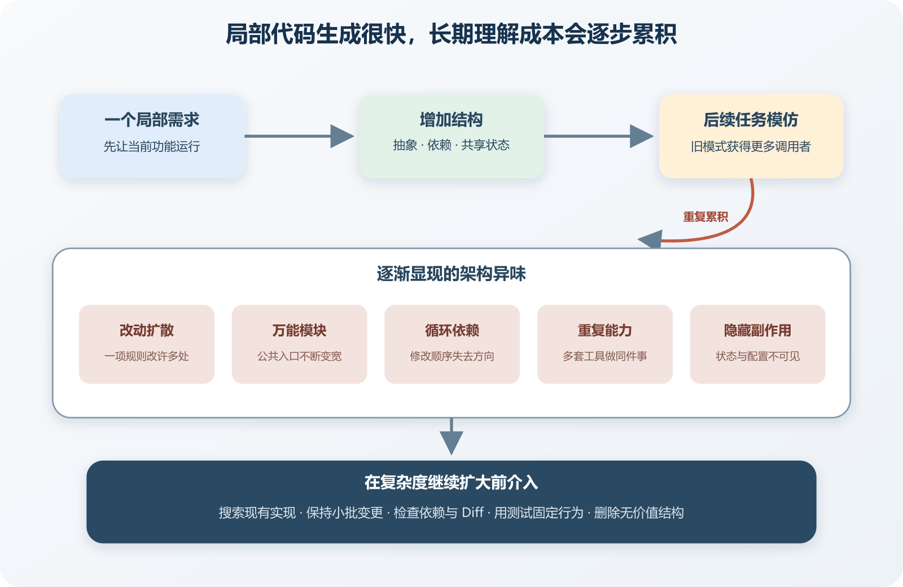

# 架构异味与 AI 生成项目的复杂度增长

一个 AI 生成的管理后台可以在半天内拥有登录、表格、图表和导出。继续修改两周以后，项目里出现三个请求客户端、两种状态管理、四套日期格式和一批只有一个实现的通用接口。新增一个订单字段，需要同时修改类型、表单、缓存、接口映射、数据库模型和导出脚本。每项结构当初都有一段听起来合理的解释，合起来却让小改动越来越难。

架构异味就是这类早期信号。它表示代码、数据或运行关系正在增加理解成本与变更风险，还没有直接证明系统存在故障。看见一个大文件不能立即判定设计错误，看见重复代码也不能立刻抽象。要把信号放进真实修改中观察，确认它是否扩大影响范围、隐藏副作用或阻碍验证。

AI 会放大这个问题，因为生成新代码很便宜，长期维护仍由项目承担。它能在几秒内增加一层封装、一个依赖和几十个文件，却不会自动感受到下个月查错时的跳转成本。人要学会从“代码能运行”继续追问“下一次修改会影响哪里”。

*AI 生成项目中局部改动如何累积为架构异味*

图中一次局部需求先生成新抽象、依赖或共享状态，后续任务再模仿已有结构。公共入口和隐藏依赖不断增加，最终表现为改动扩散、循环依赖、重复规则和难以解释的副作用。审查、依赖检查、小批变更和删除无用结构可以在循环继续扩大前介入。

## 异味是调查入口，不是自动判决

医生不会仅凭咳嗽判断唯一病因，代码审查也不应凭一个指标直接下结论。长函数可能承载一段必须按顺序阅读的转换流程，拆成十个小函数反而增加跳转。重复的两个校验看起来一样，却可能属于不同业务责任，未来变化方向也不同。

有效的异味判断至少包含三类证据。一项普通需求触碰了多少责任区域，模块通过什么公开入口与内部细节连接，故障和资源消耗怎样传播。单个 Diff 没有明显错误，仍可能为以后增加一个新的实现方向。审查者要看它是否与已有方式重复，是否扩大公共表面，以及删除它需要改动多少调用者。

最容易被普通用户感受到的异味，是一个小变化散落在许多地方。给订单增加“待人工审核”，前端颜色表、筛选选项、后端枚举、数据库约束、导出脚本和通知模板分别维护状态列表。AI 搜索到一处就修一处，漏掉的地方在之后才报错。

这类现象有时叫 Shotgun Surgery，可以直译为散弹式修改。名称不重要，关键证据是同一个业务决定没有稳定归属。修复方法可能是建立一个权威状态模型，也可能是让接口返回展示信息，选择取决于谁有权解释状态。

先建立变更地图。选择最近三次同类需求，记录触碰文件和原因。若每次都修改相同六处，可以考虑收拢规则或提供稳定转换入口。若文件多是因为数据库迁移、用户界面和审计记录本来就承担不同责任，数量本身未必异常。重构目标应写成减少重复决定或避免漏改。

验证时先保留原有功能测试，再加入一个能覆盖漏改位置的例子。完成收拢后，修改状态名称并观察需要改动的地方是否减少。

## 万能模块与不断变宽的公共接口

另一个常见信号是 `AppService`、`CommonUtils`、`BaseRepository` 或全局 Store 不断吸收功能。它们起初为减少重复，后来每个需求都增加一个参数和分支。调用者看见一个方便入口，内部却连接账号、订单、支付、文件和邮件。修改其中一项能力时，需要回归许多无关路径。

判断万能模块可以看变化原因。一个类既因税率变化而改，又因登录策略、文件格式和邮件模板而改，说明它承担了多类责任。再看依赖方向。大部分模块都依赖它，它又反向导入业务模块，循环关系很容易出现。最后看测试。若只能启动整个应用才能验证一个小规则，局部边界没有提供足够隔离。

拆分时按业务行为逐步抽出，不要一次把大类机械切成二十个小类。先选一条变化频繁且测试可建立的路径，创建明确入口，迁移调用，再删除旧分支。文件移动、接口调整和业务修复混在一起时，任何测试失败都更难定位。

公共接口也要控制宽度。模块对外暴露内部数据库模型，调用者会依赖每个字段。以后内部重构就变成全项目迁移。对外返回完成当前行为所需的稳定结构，更容易限制影响范围。接口过窄也会产生大量重复调用，要用实际消费者需求调整。

## 循环依赖让修改顺序失去方向

订单依赖会员折扣，会员又依赖订单累计消费。源代码层面可能表现为互相导入，运行层面可能表现为两个服务互相调用。循环使初始化、测试和发布顺序变得困难，也让任何一方都无法独立理解。

先区分循环背后的原因。有时双方共享的概念尚未被识别，例如消费汇总可以由独立读模型提供。有时责任放错位置，会员资格应由会员模块决定，订单只询问结果。有时只是为了复用一个类型而反向导入，可以把稳定契约放到更合适的上游区域。

依赖图、Lint 或简单脚本可以检查包依赖、层规则和循环关系。验证循环修复不能止于构建通过。画出修改前后的依赖方向，运行双方模块测试，再确认删除一方的内部实现不会迫使另一方改动。若只是把互相导入改成双方都依赖一个拥有全部业务规则的 `common` 包，循环在图上消失，耦合仍然存在。

## 重复抽象与只有一个实现的接口

AI 常为未来可能的替换创建接口、工厂、适配器和通用仓库。一层抽象可以隔离数据库、支付供应商或文件系统等外部变化，也可以让测试替换真实副作用。问题出现在抽象没有清楚边界，只把每个方法原样转发给唯一实现。

可以做一次删除测试。把接口和工厂暂时内联到实现，观察调用者、测试和配置是否明显变差。若只少了几个跳转，功能和测试仍清楚，这层抽象目前没有提供足够价值。

只有一个实现不是绝对错误。支付网关接口可能只有一个生产实现，却有测试替身，并且隔离了外部 SDK。仓库接口若完整复制 ORM 能力，让所有业务都依赖分页、过滤和事务细节，则边界很弱。审查要问隔离什么变化，消费者需要什么稳定语义，不能只数实现数量。

重复抽象还可能来自多次 AI 会话。第一次生成 `ApiClient`，第二次没有读到它，又创建 `HttpService`，第三次在某个功能内封装 `requestHelper`。提交前搜索相同依赖与方法名，比较超时、鉴权和错误处理。合并时保留一个责任明确的入口，并为它补测试。

## 隐藏共享状态与看不见的副作用

全局变量、单例缓存和自动注册机制能减少参数传递，也会隐藏代码实际依赖。一个名为计算价格的函数顺手读取当前用户、修改缓存并发送分析事件，测试结果会受调用顺序影响。并行请求还可能互相覆盖状态。

配置也是共享状态。模块在任意位置读取环境变量，测试很难说明它需要哪些设置。变量缺失时，有的地方立即失败，有的地方使用默认值，生产行为便难以预测。可以在应用入口完成配置解析和校验，再把需要的窄配置传给模块。

副作用要从名称、类型或调用位置中可见。`calculatePrice` 适合返回计算结果，保存订单和发送通知应由明确流程组织。关键是调用者能判断它会修改什么，失败后留下什么状态。

受控验证可以固定时间、随机数和外部适配器，重复运行同一测试。结果随顺序变化，说明存在未隔离状态。让邮件适配器返回错误，确认价格计算仍不受影响，可以说明两个责任在当前路径已被分开。

## 依赖膨胀与同一能力的多套实现

为了显示日期引入一个大型库，为一次请求增加另一套 HTTP 客户端，为简单表单再加入新的状态框架，这些依赖会扩大安装、构建、安全更新和浏览器体积。依赖本身可能质量很好，项目仍需承担它的版本与配置。

审查新增依赖时，先确认标准库和现有依赖是否已经满足需要，再看维护状态、许可证、包体积、传递依赖和安全记录。锁文件中的变化可能远大于 `package.json` 的一行。即使没有平台依赖审查，也应人工查看清单与锁文件差异。

同一能力存在多套实现会制造语义差异。两个日期库默认时区不同，两个请求客户端处理 Token 刷新和错误格式不同，两套表单校验对空字符串的判断也可能不同。统一前先列出行为差异和调用者，迁移一小批并运行测试。

AI 通常根据当前仓库模式推断“正确写法”。项目已有一个庞大 Service，它会为新功能继续加方法。目录里每项功能都有五层接口，它会完整复制五层。上下文不足还会造成并行发明。AI 只读当前文件，没有搜索现有能力，就会创建相似工具。

动手前要求 AI 找出现有相似实现、列出准备复用的接口和新增依赖。动手后要求它展示 Diff、删除未使用代码、运行测试，并说明是否增加公共入口、环境变量、后台任务或数据表。审查者也可以把设计模式名称改成可验证问题，例如这层接口隔离了哪个外部变化，这个新服务能否独立回滚。

## 先处理哪一种异味

项目通常同时存在多种不理想结构，没有必要暂停功能把它们全部清理。优先级可以从影响范围、发生频率、可验证程度和回退代价判断。支付状态被三个模块直接写入，优先级高于两个只在后台使用的日期工具。每周都会触碰的万能服务，也比一年未改的旧页面更值得先拆。

先问异味是否阻挡眼前变更。当前需求必须穿过一个循环依赖，可以先解除这段循环并补测试。若只是静态分析报告某个目录层次不够整齐，而功能修改没有经过那里，记录观察即可。把重构绑定到真实变化，更容易确认收益。

再看能否建立安全边界。已有功能测试、清楚输入输出和可回滚提交时，可以小步重构。关键逻辑无人理解、测试缺失且生产数据不可恢复时，第一步应是补观测、备份和特征测试。一个已被几十个模块调用的公共 Store 不能直接拔掉，应先统计消费者、建立替代入口并逐批迁移。

最后给每次治理设一个有限目标。例如订单状态只保留一个修改入口，新的 HTTP 请求不再使用第二套客户端，或模块依赖检查阻止一条已知越界路径。目标完成后停止扩张范围，回到产品工作。

## 建立一份项目异味观察表

不需要引入复杂评分系统。每两周或一个较大功能完成后，记录几项可比较事实。

- 最近一个普通需求触碰了哪些模块和公共接口。
- 新增了多少直接依赖、环境变量、后台任务和数据表。
- 是否出现新的循环依赖或跨模块写入。
- 是否存在两套完成同一能力的工具。
- 哪些测试必须启动整个系统才能运行。
- 哪些代码无人能说明删除后的影响。

数字用于发现变化，不作为好坏排名。一个文案修改却新增状态框架和公共 Store，值得停下来审查。选一个风险低的异味做小范围修复，先用测试固定当前行为，完成一次单独重构，再运行相同测试和构建。一个月后还能从模块入口、测试和变更记录理解设计，比今天生成整齐目录更重要。
