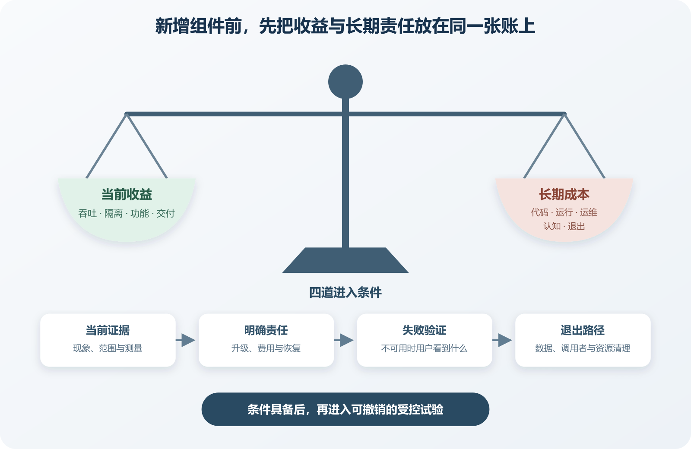

# 复杂度预算与什么时候不要增加新组件

一个网站偶尔查询较慢，AI 建议增加 Redis 缓存。发送邮件会拖慢请求，它又建议加入消息队列。搜索功能不够灵活，再加一个搜索引擎。为了分别运行这些能力，项目拆出几个服务，并引入新的部署平台。每一项建议都能解决局部问题，维护者很快要同时处理缓存失效、队列积压、索引同步、服务鉴权和多套账单。

复杂度预算用于约束这类累积。它不规定项目只能有几个依赖或几台服务器，也不需要算出精确总分。它提醒维护者，新增组件会消耗理解、验证、部署、监控和恢复能力。项目可以承担的复杂度有限，应优先用在直接支撑用户目标和可靠性的地方。

**新组件的收益应由当前证据支持，它的故障、升级、费用和退出方式也要有人承担。**

*引入新组件前需要核算的复杂度收支*

图中左侧列出新组件可能带来的吞吐、隔离、功能与交付收益，右侧列出代码、运行、运维、认知和退出成本。收益对应当前问题，责任在现有能力范围内，失败与移除路径可验证，项目才适合消耗这笔复杂度预算。

## 预算花在五个地方

代码复杂度来自新增 API、数据模型、适配器和兼容逻辑。加入缓存后，每个读取路径都要判断读缓存还是读数据库，写入路径要决定何时失效。代码行数只是表面，更重要的是状态和分支增加了多少。

运行复杂度来自进程、网络和数据关系。消息队列让请求与处理解耦，也引入排队、重复、乱序和消费者停机。一个新服务拥有独立扩展空间，同时需要超时、重试、身份和契约兼容。

运维复杂度来自安装、升级、备份、监控、告警和恢复。一条 Docker 命令只能启动自建 Redis，长期运行还要考虑数据是否需要持久化、内存满了怎样淘汰、重启后影响什么、谁更新安全版本。

认知复杂度来自维护者必须记住的概念和位置。项目同时使用两套状态管理、三种请求客户端和不同配置方式时，每次改动都要先判断该走哪条路径。AI 可以快速搜索，错误上下文仍会让它继续复制旧做法。一个月后的自己能否从文档、目录、日志和测试重新理解，属于真实成本。

退出复杂度来自依赖被移除或替换时的工作。数据怎样导出，旧格式怎样兼容，功能怎样降级，调用者怎样迁移。只记录安装步骤，没有记录退出条件，项目很容易长期保留已经失去价值的组件。

这五项不会等量出现。一个纯开发依赖可能几乎没有生产运行成本，却增加供应链更新。一个托管数据库代码接入简单，数据迁移和费用风险较高。预算也需要回收。功能下线后关闭 Worker、告警和云资源，迁移完成后删除旧 SDK、兼容层与 Secret。

## 先写清当前问题

“为了性能”“方便扩展”和“更专业”都太宽。可检查的问题要包含现象、范围和证据。例如商品列表在晚间高峰的九成请求低于三百毫秒，但筛选组合首次查询经常超过两秒，数据库慢查询显示相同聚合重复执行。这样的描述能继续比较查询优化、预计算、缓存和读模型。

若没有测量，先补最小观测。记录操作名称、耗时、错误和相关资源，重复几次真实场景。开发电脑上的一次慢请求不能代表生产瓶颈，生产平均值也可能掩盖少数严重长尾。

还要确认现有能力是否已经满足。数据库有索引、物化视图和连接池，部署平台有后台任务，框架自带缓存和队列接口。使用现有能力通常减少新运维对象，但不能为了少组件硬撑明显不合适的方案。

问题若来自错误实现，先修实现。一次请求循环查询一千次数据库，加入 Redis 会暂时遮住低效路径。文件上传占满内存，应先改为流式处理或限制大小，再判断是否需要独立 Worker。把基础错误交给新基础设施，会让故障多一层。

## 给候选方案建立同一张账

比较方案时，至少保留“不改变架构，只修当前实现”这一项。它提供基线，防止讨论只在几个新工具之间进行。每个候选方案记录直接收益、引入内容、失败表现、数据影响、权限、月度费用、验证办法和退出步骤。

假设邮件发送拖慢注册请求，可以比较三条路。请求内发送并设置短超时，改动少但供应商变慢会影响注册响应；数据库任务表加本地 Worker，可以让请求先保存任务，稍后发送，但要维护重试和积压监控；独立消息队列隔离更强，也带来队列运维、身份、重放和成本。

个人项目每天几十封邮件时，数据库任务表可能已经足够。任务量巨大、多系统共同生产消息或需要独立扩展时，专用队列的收益上升。收益还要有停止条件。先用两周试验验证数据库任务表，若最老任务持续超过可接受时限、数据库负载明显上升或多消费者协调困难，再评估队列。

## 新组件必须交一份“长期责任清单”

引入生产组件以前，应能回答谁负责升级，哪里看健康状态，数据怎样备份，凭据怎样轮换，容量接近上限时会发生什么，账单异常从哪里发现。“AI 会帮我维护”不能替代责任人。AI 可以执行检查，告警到来时仍需要有人决定动作。

正常路径要验证真实能力。缓存加入后，确认相同查询命中缓存，数据库压力按预期下降，返回结果保持一致。缓存过期、服务重启、数据更新和高并发仍需要单独测试。

再做一个克制的失败检查。测试环境停止缓存连接，应用应回到数据库或返回明确错误，不能无限等待。恢复步骤也要实际走一遍。队列有备份却从未验证恢复，搜索索引没有重建命令，组件仍缺少完整生命线。

## 增加组件以前先设计删除办法

可退出性会迫使边界变清楚。缓存通过窄适配器使用，关闭开关后能够绕过。搜索索引由权威数据库重建，删除索引不会丢失订单。外部邮件服务的模板和联系人数据可以导出，调用方不直接依赖供应商专属字段。

退出不一定意味着轻松替换。数据库、身份平台和支付供应商天然拥有较高迁移成本。项目仍可记录数据导出格式、专属能力、迁移时间和停机要求，以便知道锁定发生在哪里。

试验组件应先放在可撤销范围。使用非生产数据，单独分支或预览环境，设定结束日期，不让核心路径立即依赖它。试验结束只接受三种结果。正式采用并补齐运维责任，保留为明确范围的开发工具，或删除试验代码和资源。

依赖审查能显示新增、删除和更新的包，帮助识别代码供应链变化，但不能替代组件级的运行责任清单。一个 npm 包和一个生产数据库都会出现在技术方案中，后者的备份与停机风险显然更高。

## 复杂度也会从“暂时共存”中增长

迁移时新旧方案短期共存很正常。风险在于没有结束条件。旧接口仍有消费者，新接口已开始使用，两边规则逐渐不同。新数据库同步部分数据，失败积压无人监控。每次 AI 修改都要兼容两条路径，临时层便成为永久架构。

迁移计划要记录消费者总数、剩余数量、兼容截止日期和删除负责人。旧路径调用应有日志或指标，避免只靠代码搜索猜测。数量降到零以后，先在测试和预览环境关闭，再删除配置、Secret、数据同步和监控。

大规模替换应拆成自包含的小变更。一次提交应完成一个可以解释的迁移步骤，并让系统在提交后仍可运行。重构与功能修改尽量分开，方便审查、测试和回滚。

缓存、队列、网关和数据库常被多个功能共用，成本更低，故障范围也更大。某个后台任务占满连接池，前台请求可能一起失败。引入共享组件时要给不同工作负载设置预算。前台用户请求、批处理和数据迁移可以使用不同并发、队列或连接池。

## 什么时候应明确拒绝新增组件

下面几种情况适合暂缓。

- 当前问题没有可复现现象或测量，只来自对未来规模的想象。
- 现有能力能够以较低风险解决，团队尚未验证它。
- 没有人能说明新组件失败、升级和恢复时怎么处理。
- 新旧方案将长期双写，却没有一致性验证与结束日期。
- 组件需要新的高权限凭据，权限和审计尚未设计。
- 试验会直接接管生产权威数据，且没有可用备份与回退。
- 引入理由主要是让目录、架构图或技术栈看起来更完整。

拒绝当前方案不等于永远不用。把重新评估条件写下来，例如日峰值、延迟、故障次数、发布阻塞时长或合规要求。条件出现时携带新证据重开决策。

要求 AI 推荐组件时，不只要安装命令。让它列出当前问题与证据、至少一个不增加组件的方案、预期收益、运行单元、数据身份、Secret、监控、失败表现、费用风险、迁移步骤和删除办法。

实现阶段限制改动范围。先在预览环境完成最小集成，运行正常与失败检查，再决定是否进入生产。若试验未达到停止条件，删除产生的云资源和 Secret，避免继续收费或扩大攻击面。

架构决定还应说明为什么此时值得支付复杂度。复杂度预算提供决策内容，ADR 保存当时依据与未来重新评估入口。
