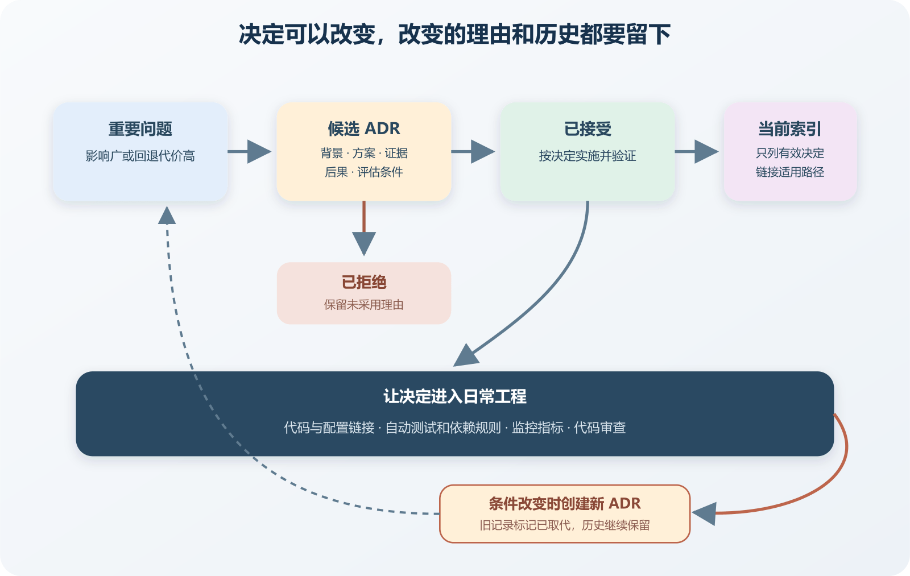

# 用 ADR 保存选择、代价与重新评估条件

半年后打开一个项目，维护者发现用户头像全部放在对象存储，数据库只保存地址。为什么没有直接存进数据库，为什么选了当前供应商，上传失败时怎样处理，仓库里没有答案。AI 看到一个头像组件，建议换成另一套图片服务。代码能告诉它“现在怎样做”，很难告诉它“当初排除了什么”。

ADR 是 Architecture Decision Record 的缩写，中文可以称为架构决策记录。它用一份短文保存重要选择的背景、候选方案、决定和后果。若条件改变，项目创建一份新记录取代旧决定，旧记录继续保留当时理由。这样能防止 AI 把已经验证过的旧方案当成新发现反复提出。

ADR 不需要成为企业文书。个人项目中的一份记录可以只有一两页 Markdown，跟代码一起提交。关键是写下当时可用的证据、主动接受的代价和重新评估入口。



*ADR 从提出、接受到被新决定取代的生命周期*

图中一项重要问题先形成候选记录，经过证据和方案比较后被接受或拒绝。被接受的 ADR 进入当前决定索引，并与代码、测试和监控连接。条件改变时创建新 ADR，旧记录标记为已取代。

## 哪些选择值得记录

每个变量名和按钮颜色都写 ADR，记录会迅速失去可读性。值得记录的决定通常具有较广影响、较高回退成本或较长寿命。数据库类型、身份认证方式、部署区域、模块边界、消息机制、Secret 管理、日志保留和 App 数据同步都可能属于这一类。

可以用三个问题判断。

- 这个选择会约束多个功能或后续维护者吗。
- 更改它是否需要数据迁移、停机、兼容或大量代码调整。
- 几个月后有人可能合理地提出另一个方案吗。

三个问题大多回答否，普通 Issue、提交说明或代码注释已经够用。一次临时试验也可以先写实验记录，达到采用门槛后再形成 ADR。记录数量不是成熟度指标，能帮助未来做决定才有价值。

有些接近实现细节的选择会产生长期影响。时间统一保存 UTC 并在边界保留时区，文件上传先进入对象存储，数据库迁移只向前兼容两个版本，这些规则会影响许多代码。若违反后果明显，就适合记录并配自动检查。

## 一份适合个人项目的最小格式

ADR 常见格式会记录标题、状态、背景、决定和后果，并在决定变化时用新记录取代旧记录。个人项目可以从更短的格式开始。

```
# ADR-0007 使用数据库任务表处理邮件发送

已接受

2026-08-11

## 背景

注册请求等待邮件供应商，偶发超过四秒。
当前每天约五十封邮件，应用已经使用 PostgreSQL。

注册事务同时写入待发送任务。
一个 Worker 读取任务并执行发送。

- 保持请求内发送并缩短超时
- 使用数据库任务表
- 引入独立消息队列

- 用户响应不再等待邮件供应商
- 邮件可能延迟，需要积压与失败监控
- Worker 必须支持重试和幂等

## 重新评估条件

- 最老任务经常超过五分钟
- 多个系统需要共同生产与消费消息
- 数据库任务显著影响主要请求

- 注册成功后任务可见
- 发送器超时后任务保留并可重试
- 相同任务不会重复发送
```

示例数字只服务于假设项目，不能直接复制。最重要的部分是背景中的当前事实、后果中的新增责任，以及重新评估条件。只写“选择 PostgreSQL，因为稳定可靠”，未来几乎无法判断当时权衡了什么。

背景说明决定发生时有哪些约束。用户规模、团队能力、预算、部署平台、数据敏感性、延迟要求和已有技术都可能影响选择。小型活动报名站选择 SQLite，应说明单实例部署、写入量低、备份方式简单，并明确网络共享文件系统不在支持范围。

背景中的事实要标注来源和日期。平台价格、免费额度、商店政策与合规要求会变化，应链接官方页面并写检索日期。推测与已验证事实分开。预计明年有十万用户属于预测，当前峰值每分钟一百请求属于测量。

AI 可以帮助收集候选方案，来源仍需核对。它可能把旧版本限制、博客经验或另一平台规则写成当前事实。ADR 应引用项目实际日志、测试、账单和官方文档，无法验证的内容标记为假设。ADR 也要控制敏感内容。

## 方案比较要保留被放弃的理由

ADR 不要求写一篇长报告，至少应列出实际考虑过的可行方案，包括维持现状。每个方案使用相同维度比较，例如开发时间、运行责任、数据风险、费用、性能、可逆性和维护者熟悉程度。

被放弃的方案不能只写“太复杂”或“不够先进”。独立队列在当前每天五十封邮件的负载下会增加一套凭据、监控和恢复流程，而数据库任务表已经满足时限，这样的理由更可检查。未来流量与协作方式改变时，团队也知道何时重新评估。

不要为证明已选方案正确而歪曲其他选项。每个方案都可能在不同约束下合理。方案若经过试验，要附验证环境、数据量、步骤、实际输出和已知缺口。

## “后果”要同时写收益和负担

决定带来的正面结果通常容易写，新增责任更容易遗漏。选择对象存储可以减少应用服务器磁盘管理，也要处理上传权限、失效链接、跨域设置、费用和数据迁移。选择托管身份服务可以缩短登录开发，同时增加供应商可用性与账号策略依赖。

后果还包括对未来选择的约束。事件异步处理让调用者与消费者解耦，也接受延迟、重复和积压。模块共享数据库便于本地事务，独立扩展与权限隔离会更困难。新增队列后，谁看积压，哪个告警触发处理，备份是否需要恢复演练，也要写清。

常用状态包括提议中、已接受、已拒绝和已取代。名称可以调整，含义要稳定。提议中表示仍在收集意见与证据，已接受表示项目按它实施，已拒绝保存未采用理由。已取代表示新决定已经替换它，并链接到新记录。

接受后的 ADR 不宜直接重写成今天的观点。历史如果被修改，维护者会误以为旧代码是在新条件下设计的。发现事实错误可以添加更正说明，决定改变则创建新 ADR，并让两份记录互相链接。

仓库中可以建立 `docs/adr` 目录和一个当前决定索引。索引只列仍有效的重要决定，历史记录仍可搜索。文件名使用稳定编号与简短标题，例如 `0007-database-job-email.md`。

分支合并时，ADR 与相关代码一起审查。若代码先落地、记录几个月后补写，背景容易被结果倒推。重大决定可以先提交提议 ADR，确认方向后再实现。

## 让决定与代码保持连接

文档过时的主要原因是修改代码时看不到它。ADR 应链接涉及的模块、配置、迁移、监控与 Issue。反过来，模块 README、重要配置或代码审查模板也可以链接对应 ADR。

能自动检查的决定应转成测试或规则。ADR 规定模块不能导入支付内部目录，可以用架构测试检查。规定所有生产请求设置超时，可以用集成测试或静态规则覆盖关键客户端。自动检查只能覆盖清晰规则，不能为了自动化把含义压成一个失真的数字。

每次修改公共依赖、数据库、部署和安全配置时，审查者可以搜索相关 ADR。代码与记录冲突时有两种可能。实现绕过了仍有效决定，应修正实现。条件已改变，旧决定不再合适，应提出新 ADR。

## ADR 也会失败

记录过长会阻碍使用。每次决定都要求填写几十个字段，维护者会在完成后补一份形式文件。个人项目从最小模板开始，只有安全、合规或高成本迁移需要扩展字段。

记录过多会淹没有效决定。一次依赖小版本更新、普通 UI 选择和可随时撤销的实验不必进入 ADR。Issue 与提交记录已保存过程，ADR 聚焦长期约束。

记录过少也会失去解释力。标题写“采用微服务”，正文没有边界、数据和失败策略，之后每个人都可以按自己理解实现。记录还可能变成权威装饰。代码早已不符合，索引仍写有效。可以按季度抽查当前决定，结合依赖图、配置、测试和生产状态确认。

## 让 AI 使用 ADR 时给它“当前索引”

AI 不应每次读取所有历史记录并自行猜测有效性。提供当前决定索引，标明已接受记录、适用路径和被取代关系。任务开始时，让 AI 列出与本次改动相关的 ADR，并说明准备怎样遵守。

若 AI 提议新数据库、队列、身份方式或模块边界，要求它起草候选 ADR。草稿要分开项目事实、外部资料和假设，列出维持现状，写明失败、费用、迁移与退出。人核对证据和产品后果以后才能接受。

实现完成后，对照 ADR 检查 Diff 和验证结果。决定要求数据库任务表与业务状态同事务写入，代码若先提交注册再异步写任务，就没有落实关键后果。测试通过也不能替代这项结构检查。

ADR 可以让小变更仍保留大背景。它不需要指挥每行代码，只要说明这次修改不能破坏哪些已接受边界。

## 一次完整练习

选择项目中一个尚未定案的真实问题，例如文件放本地磁盘还是对象存储。先写当前规模、部署方式、备份要求与费用限制，再列出维持现状、托管对象存储和自建存储三项方案。没有数据时先标假设，不急着宣布答案。

挑选一个最小试验，上传文件、读取、删除，并模拟凭据失效。记录预期和实际结果。成功上传只能证明当前环境的基本路径，凭据失效时应用返回明确错误，可以证明这条权限失败得到处理。恢复、费用上限和批量迁移仍要另行验证。

根据结果接受、拒绝或继续提议。接受时把 ADR、配置样例、测试和操作说明一起提交。三个月后按重新评估条件检查。条件没有变化，记录继续有效；条件已经变化，创建新 ADR，比较新的事实并明确取代关系。

这套练习的重点，是让选择拥有可追溯的理由和有限结论。即使未来改用另一方案，旧 ADR 也完成了任务。它解释了当时为什么合理，并告诉后来者变化发生在哪里。
