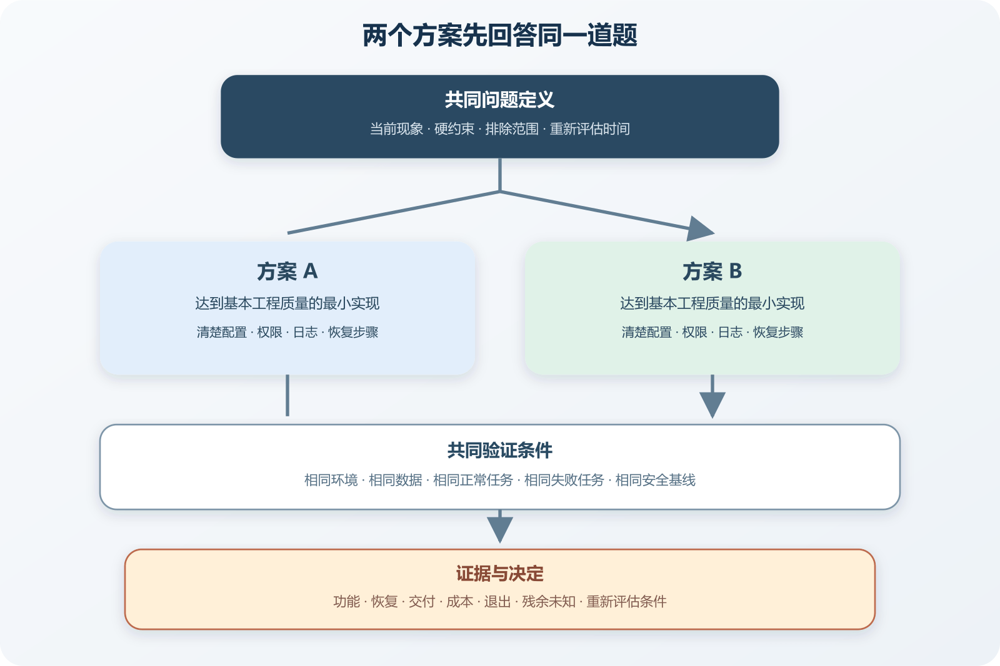

# 怎样让两个工程方案真正对打

工程讨论很容易变成两份产品说明书。支持方案 A 的人只讲接入简单、生态成熟和未来扩展，支持方案 B 的人只讲性能、控制权和长期成本。双方引用的数据来自不同规模的项目，测试机器和请求模型也不一样。最后的决定往往取决于谁说得更有气势。

让两个方案对打，需要先给它们同一道题。需求、约束、数据、运行环境、成功条件和失败条件都保持一致，再分别观察结果。每个方案都由最合理的实现代表，不能故意给自己喜欢的方案充分调优，却让另一个方案使用默认配置草草上场。

这套方法不会自动算出唯一答案。它能把事实差异、价值取舍和仍然未知的部分分开，让维护者知道自己选择了什么，也知道选择在哪些条件下可能改变。

*两个工程方案使用同一问题、同一环境和同一证据门槛进行比较*

图中两个候选方案先接受同一份问题定义和硬约束，再使用相同数据、环境、正常任务与失败任务完成小型验证。结果按功能、恢复、交付、成本和退出难度比较，最后形成带条件的决定。任何一项硬约束失败，都不能靠其他项目的高分抵消。

## 先把争论改写成一个决定问题

“Redis 和数据库哪个好”没有稳定答案。Redis 可以承担缓存、计数、队列和临时状态，数据库也有多种产品与部署形态。比较对象太宽，双方很容易挑有利场景。

决定问题应写清当前动作和边界。例如一个单实例课程网站每天发送约五十封事务邮件，注册请求偶尔因邮件供应商变慢超过四秒。项目已经使用 PostgreSQL，维护者只有一人。现在要在数据库任务表和托管消息队列之间选择，目标是让注册请求不再等待邮件发送，并在发送失败后保留可重试记录。

这段话给出了用户动作、当前故障、已有设施、规模和维护能力。它也排除了几项无关争论。项目此时没有比较所有队列产品，没有讨论每秒百万消息，也没有决定未来全部异步任务的统一平台。

决定问题最好包含时间范围。当前选择服务未来六到十二个月，达到某些流量或协作条件后重新评估。把几十年后的想象塞进今天的实现，会让任何复杂设计都能找到理由。

## 先写硬约束，再写偏好

硬约束一旦不满足，方案就不能采用。事务邮件不能丢失，真实凭据不能写进代码，故障不能让注册请求无限等待，这些都可以是硬约束。法规、数据地区和预算上限也可能属于这一类。

偏好允许权衡。本地开发更简单、费用更低、延迟更短、供应商依赖更少、团队更熟悉，都可能增加方案吸引力，却未必单独决定结果。把偏好伪装成硬约束，会让比较在开始前就结束。

可以让每条约束回答三个问题。

- 谁提出这项要求。
- 怎样验证它是否满足。
- 失败以后会造成什么后果。

“必须高可用”很难直接测试。改成邮件服务中断十分钟期间，注册仍能完成，待发送任务在服务恢复后继续处理，测试就有了明确动作。高可用涉及的范围很广，本次比较只验证其中一段。

约束之间冲突时要明确优先顺序。极低费用、零运维、完全可控和无限扩展很难同时获得。个人项目可以先保护数据与恢复能力，再比较开发时间和费用。支付或医疗系统会有不同顺序，不能从一张通用评分表抄答案。

## 两个方案都要用合理实现

公平比较要求双方都达到基本工程质量。数据库任务表需要索引、原子领取、状态、重试次数和 Worker。若只建一张表，再用脚本每秒扫描全部记录，它代表的是一个草率实现。托管队列也需要正确可见性超时、确认、死信处理和身份权限，不能只把消息发进去就宣布完成。

验证规模要控制。Proof of Concept 常译为概念验证，用来回答某项技术在当前条件下能否成立。AWS 的服务评估指南建议通过受控技术验证确认候选方案能否满足要求，并把有效性与总体成本放在一起考虑。原指南面向安全服务，本章借用的是验证方法，不能把其中具体服务结论搬到其他场景。

概念验证只实现决定所需的窄路径。比较邮件任务时，双方都完成创建任务、领取、发送成功、发送失败、重复处理和恢复。管理后台、美观图表和完整通用框架可以以后再做。试验写得太大，维护者会因为投入太多而舍不得放弃。

双方还要使用相同安全基线。测试数据不含真实用户信息，凭据来自受控环境变量，访问权限限定到所需资源。一个方案使用管理员账号，另一个使用最小权限，结果无法公平比较，安全风险也不应成为性能捷径。

## 固定环境、数据和任务

性能与恢复结果都依赖环境。记录操作系统、运行时版本、数据库或服务版本、机器资源、网络位置和关键配置。托管服务无法与本地数据库位于相同网络时，至少写清差异，不要把网络距离造成的延迟全算到产品能力上。

数据要接近真实形状。测试一百万条只有数字 ID 的记录，不能代表包含正文、索引和关联的生产数据。邮件任务可以准备不同大小的内容、几个目标域名和一段失败比例。涉及个人信息时使用合成数据，不复制生产用户表。

任务分成正常路径和失败路径。正常路径回答能否完成、耗时和资源消耗。失败路径回答中断后留下什么状态、怎样发现、怎样恢复。两套方案接受相同任务，例如下面这些。

- 连续创建一百个邮件任务并全部成功发送。
- 发送器连续五次返回可重试错误。
- Worker 在领取任务后、确认完成前退出。
- 同一个任务被两个 Worker 同时看到。
- 依赖中断十分钟后恢复。
- 更换一次凭据并撤销旧凭据。

数字只是教学示例。真实项目应根据当前负载和风险调整。测试量太小看不见竞争与积压，远大于可预见规模又会把优化方向带偏。

## 正常结果只证明正常路径

两个方案都能发送一百封邮件，说明它们具备基本功能。方案 A 平均处理更快，可能来自本地网络、批量策略或测试噪声。要重复运行，记录中位数和较高百分位，并观察资源。一次最快值没有多少决策价值。

正常路径还要检查结果正确。任务数量、成功数量、重复数量和最终状态应能对上。只看吞吐，可能把重复发送也当成处理成功。测试日志要带任务标识，便于回到单项记录核对。

比较开发体验时也要保留动作。新环境从空目录启动需要哪些命令，测试是否依赖外部账号，调试失败任务要打开几个控制台，恢复一条消息需要什么权限。用“开发者体验很好”代替这些过程，结论无法复查。

让 Worker 在领取任务后退出，可以观察处理中状态是否会永久卡住。数据库方案可能通过租约到期重新领取，队列方案可能依靠可见性超时让消息重新出现。两种机制都可能完成恢复，配置和等待时间不同。

发送成功后、确认任务完成前退出，容易产生重复。邮件供应商支持幂等标识时可以利用，供应商不支持时要记录已发结果或接受有限重复风险。测试中没有重复，只能证明这组时序没有触发，不能证明所有并发顺序都安全。

依赖中断十分钟的测试要观察前台注册、积压增长、告警和恢复速度。注册继续完成且任务保留，可以证明异步边界在这次故障中生效。服务恢复后任务全部处理，可以证明当前积压量能够恢复。它不能证明一天故障后的容量，也不能证明供应商返回永久错误时的处理正确。

恢复过程需要人能执行。维护者从哪里看失败原因，怎样重试一条任务，怎样暂停消费者，怎样避免在依赖仍然过载时制造重试风暴。操作步骤太复杂会增加实际恢复时间，即使架构图很漂亮。

## 比较总成本，别只看账单单价

总成本包含开发、运行、维护、学习、迁移和事故处理。数据库任务表使用已有 PostgreSQL，新增账单可能很少，却会增加表增长、清理和数据库负载。托管队列按使用量收费，可能减少部分自建运维，也增加供应商配置、权限和网络依赖。

估算应写范围和口径。每月消息量、请求次数、数据保留、出口流量和日志量都会影响费用。价格容易变化，正式决定前重新查看官方页面并写检索日期。不要把免费额度写进永久架构假设。

学习成本也要承认。维护者首次使用消息队列，需要理解确认、可见性超时、死信和重复语义。数据库方案看起来熟悉，正确实现并发领取也需要数据库锁和事务知识。熟悉程度能影响短期风险，却不能证明技术本身更简单。

退出成本常被漏掉。数据库任务表可以随应用迁移，托管队列中的积压怎样导出或排空，切换期间新任务写到哪里，都要考虑。一个方案接入只需十分钟，退出需要数周，决策记录里应把这件事写出来。

## 评分表只能整理证据

评分表适合让结果并排出现，不适合制造数学权威。给数据安全五分、开发速度三分、费用两分，再算加权总分，权重稍微调整就可能换冠军。分数来自判断时，应保留原始观察和理由。

硬约束先单独判断。任一方案无法满足数据地区、恢复目标或权限要求，就标为不合格。剩余方案再比较偏好。可以采用下面这样的简表。

| 比较项 | 数据库任务表 | 托管消息队列 | 证据状态 |
| --- | --- | --- | --- |
| 注册与发送解耦 | 可实现 | 可实现 | 正常测试通过后确认 |
| Worker 中断恢复 | 依赖租约设计 | 依赖队列可见性机制 | 需要故障测试 |
| 当前月度费用 | 使用现有数据库资源 | 依据请求、保留和网络计费 | 采用前核对官方价格 |
| 本地开发 | 可随本地数据库运行 | 可能需要模拟器或远程服务 | 实际走一遍启动流程 |
| 运维责任 | 表增长、索引、锁与清理 | 权限、队列配置、积压和平台限制 | 两边都需运行说明 |
| 退出路径 | 导出或迁移任务表 | 排空队列并切换生产者 | 需要迁移草案 |

表中故意不填假设结果。完成验证以后再把“需要测试”改成实际观察。未知项保留未知，比凭经验补一个分数更诚实。

## 让双方先攻击自己的方案

支持方案的人通常最了解它，也最容易忽略熟悉带来的偏好。让每一方先列出自己方案最可能失败的三种方式，再提出验证。数据库方案要面对共享数据库过载、锁竞争和清理失控。队列方案要面对权限错误、重复消息、平台中断和费用变化。

随后交换审查。反方只能攻击已经写出的需求和证据，不能临时扩大场景。当前项目只有一个维护者，就不能用“五十个团队需要自治”否定数据库方案。未来确实可能增加团队，可以写进重新评估条件。

两方也要陈述对方最强理由。能准确讲清对方为什么在当前条件下合理，讨论才有机会摆脱技术偏好。Google 的代码审查标准建议让技术事实和数据优先于个人意见，并承认多个方案可能同时有效。

AI 可以分别生成两份方案辩护，但提示中必须共享同一份事实清单。第一轮要求各自给出实现、收益、失败和验证。第二轮让它们互相审查假设。最后由一个汇总任务只整理共同事实、分歧和缺失证据，不允许直接宣布赢家。人再核对来源和产品后果。

## 识别无法通过小实验回答的问题

概念验证能测当前延迟和恢复过程，无法完整预测三年维护成本、供应商政策和团队变化。有些风险只能通过合同、官方承诺、真实运行和时间观察。把它们标为残余不确定性，并决定是否可以接受。

试验环境与生产环境差异也要列出。开发电脑只有一个 Worker，生产可能滚动更新多个实例。测试队列与生产队列位于不同地区，网络结果不能直接外推。缺口越接近硬约束，越需要在预览或受控生产阶段继续验证。

停止条件能防止试验无限延长。双方都满足硬约束，关键偏好差异已经清楚，剩余未知不会改变近期决定时，可以结束。继续调参只会追求漂亮数字，就应把精力还给产品。

最终结论可以写成“在当前每日约五十封邮件、单实例 PostgreSQL 和单人维护条件下，采用数据库任务表。若多个系统需要共同生产消息，或任务积压持续超过恢复目标，重新评估托管队列”。这比“数据库队列更简单”多了适用范围。

随后把问题、证据、候选方案、决定、接受的后果和重新评估条件写进 ADR。AWS 的 ADR 流程要求记录背景、决定和后果，并在条件变化时创建新记录取代旧决定。开源 ADR 仓库提供多种模板与真实文件组织方式。

代码改动保持小批次。Google 的小变更指南指出，自包含的较小改动更容易审查、测试和回滚。可以先加入任务表和 Worker，再切换一条测试邮件，随后迁移注册邮件，最后删除请求内发送。每一步都能运行和退回。

决定实施后继续观察之前定义的指标。任务积压、最老任务年龄、重复发送、数据库负载和月度费用出现变化时，回到 ADR 的重新评估条件。方案比较完成以后，项目得到一项有条件、可复查的选择。某项技术是否赢得争论没有实际意义。

## 一份可复用的对打记录

以后比较 REST 与 GraphQL、轮询与 WebSocket、托管平台与 VPS、单体与微服务，都可以保留下面这些内容。

- 当前决定问题与明确排除范围。
- 已验证事实、外部来源和仍待确认的假设。
- 硬约束、偏好及其优先顺序。
- 双方最小合理实现和共同安全基线。
- 相同环境、数据、正常任务和失败任务。
- 功能正确性、恢复、交付、费用和退出证据。
- 每个结果能证明什么，不能证明什么。
- 最强反方理由与残余不确定性。
- 最终决定、接受的代价和重新评估条件。

记录不要求每次都写六千字。小决定一页已经够用，代价高的决定再补试验报告与图表。只要双方回答同一道题，证据范围清楚，技术讨论就不必靠名词和气势决胜。
