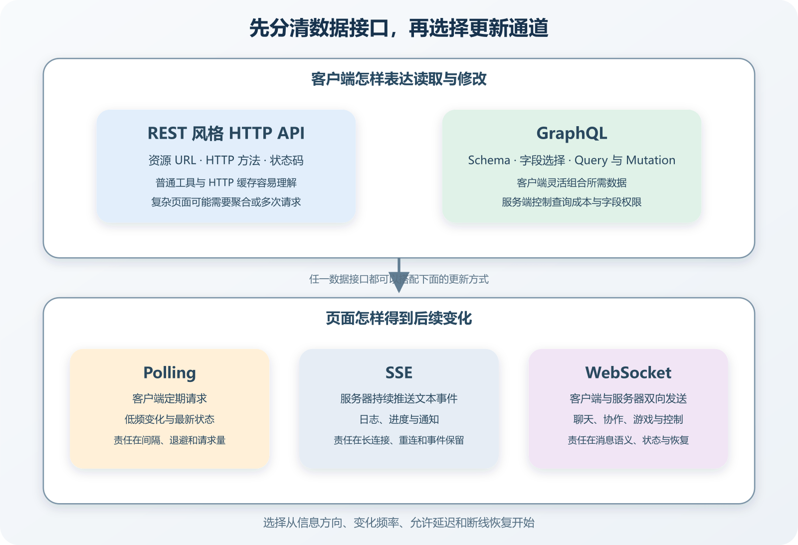

# REST、GraphQL、Polling、SSE 与 WebSocket

一个订单页面要显示付款进度。最朴素的做法，是用户打开页面时请求一次，之后每隔几秒再问服务器。有人会觉得这样不够实时，建议换 WebSocket。另一个人嫌接口字段太多，又建议引入 GraphQL。三种建议放在一起吵，很容易吵偏，因为它们处理的不是同一组问题。

REST 与 GraphQL 主要处理客户端怎样向服务端表达数据需求。Polling、SSE 与 WebSocket 主要处理页面怎样得到后续变化。一个系统可以用 REST 创建订单，再用 SSE 接收状态更新；也可以用 GraphQL 查询页面数据，同时用普通轮询刷新。先把这两组问题分开，很多方案会自己退场。

选择时先看用户动作。数据由谁发起，多久变化一次，晚几秒有没有影响，断线后要不要补齐，客户端会不会主动高频发送，服务器能不能长期维护大量连接。协议名称排在这些问题后面。

*REST、GraphQL 与 Polling、SSE、WebSocket 分别解决的接口和更新问题*

图的上半部分比较 REST 风格 HTTP API 与 GraphQL 数据接口，下半部分比较轮询、SSE 和 WebSocket 更新通道。两个方向可以组合。REST 或 GraphQL 不会自动提供实时更新，使用 WebSocket 也不会替系统决定数据模型、权限和恢复规则。

## 先分清两组问题

用户打开课程详情页，需要读取标题、作者和章节。这是一次数据请求。课程发布者修改内容以后，已打开页面能否收到变化，这是更新传播问题。

数据接口要回答客户端怎样表达读取和修改，资源或 Schema 怎样设计，权限在哪里检查，错误怎样返回，缓存和版本怎样处理。REST 风格 API 与 GraphQL 在这里提供不同组织方式。

更新通道要回答谁先开口，连接保持多久，变化怎样送达，断线怎样恢复，消息是否允许重复，后台与移动端会发生什么。轮询、SSE 和 WebSocket 在这里提供不同路径。

把两组问题捆在一起，会制造错误替换。某个 REST 接口返回字段太多，引入 WebSocket 不会减少字段。聊天消息需要双向低延迟传输，换成 GraphQL 查询也不会解决长期连接。先写清眼前是哪一组问题，再比较候选方案。

## REST 说的是资源与 HTTP 行为

REST 来自 Roy Fielding 对网络软件架构风格的研究，包含客户端与服务器分离、无状态交互、可缓存、统一接口和分层系统等约束。日常开发里，人们常把使用 HTTP 方法、资源 URL 和 JSON 的接口统称为 REST API，其中许多项目只采用了部分思想。

初学者先掌握资源与动作的关系就够用。`GET /orders/123` 读取订单，`POST /orders` 创建订单，`PATCH /orders/123` 修改允许改变的部分。服务器用 HTTP 状态码和响应内容表达结果。RFC 9110 定义了 HTTP 方法、状态码、字段和缓存等共同语义。

这种接口的好处，是路径和 HTTP 行为容易被浏览器、代理、日志、缓存与测试工具理解。客户端需要一个明确资源时，请求和响应也直观。静态内容、公开读取接口和常规增删改查通常能从标准 HTTP 语义里受益。

代价会在页面需要多类关联数据时出现。课程页可能先取课程，再取作者、章节和当前用户权限。服务端可以增加一个面向页面的聚合接口，也可以让客户端发多次请求。若每个页面都要求后端新增一套专属返回结构，接口数量和版本会很快增长。

REST 也不等于把数据库表暴露出去。订单资源可以组合多个内部模型，写入接口必须执行业务规则。URL 命名再漂亮，客户端若能随意修改付款状态，系统仍然不安全。

## GraphQL 让客户端声明字段

GraphQL 使用类型系统描述服务端能力，客户端通过查询选择需要的字段。规范包含 Query、Mutation 和 Subscription 等操作。一个课程页面可以在一次查询里请求课程标题、作者姓名和前三章，另一个页面只取标题与封面。

它适合多个客户端对数据形状有不同需求的情况。网页、iOS、Android 和后台可能各自组合字段，服务端不必为每个界面建立大量相近端点。Schema 还能提供类型、字段说明和工具提示，客户端容易发现可用能力。

灵活性会把更多责任交给服务端。一条查询可能沿作者、课程、章节和评论展开，产生大量数据库访问。服务端需要批量加载、分页、深度或复杂度限制、超时和监控。GitHub 的 GraphQL API 是实际案例，它公开 Schema 和查询指南，同时设置查询成本、节点、超时和速率等限制。具体数值会变化，使用前应查看当前官方文档。

权限要落到字段与业务动作。用户能读取订单，不代表能读取内部风控备注。客户端没有请求某字段时，服务器可以少做工作；客户端请求了字段，服务器仍要检查身份和权限。GraphQL 不能把授权责任交给前端。

缓存方式也会改变。REST 风格的公开 GET 资源较容易利用 URL、HTTP 缓存字段和 CDN。GraphQL 常把不同查询发送到同一入口，HTTP 层难以只凭 URL 区分数据需求。客户端缓存、持久化查询和服务端缓存可以解决部分问题，也会增加键、失效与权限设计。

## REST 与 GraphQL 可以共存

项目已有稳定 REST API，不必为了一个复杂页面全部重写。可以为内部管理端增加有限的 GraphQL 层，也可以先建立一个聚合 REST 端点。反过来，GraphQL 系统处理文件上传、Webhook 和公开缓存内容时，也可能保留普通 HTTP 接口。

共存会增加文档、鉴权和监控路径。相同业务规则必须落在共同应用层，不能在 REST 与 GraphQL 两边各写一份。订单取消无论从哪个入口到达，都要执行同一状态与权限判断。

选择前可以统计客户端数量、页面数据组合、现有端点变化频率和缓存要求。只有一个网页客户端，接口形状稳定，普通 REST 风格 API 往往更容易维护。多个客户端频繁要求不同字段组合，GraphQL 的 Schema 与查询能力才可能节省协调工作。

## Polling 用普通请求换取简单恢复

Polling 通常译为轮询。页面每隔固定时间发出一次 HTTP 请求，询问状态是否改变。它沿用普通请求、鉴权、状态码和日志，反向代理与托管平台也熟悉。订单状态十几秒变化一次，用户允许晚五秒看到，轮询可能已经足够。

间隔决定延迟和请求量。每秒轮询更新更快，也会在没有变化时持续消耗网络、服务器和数据库。每分钟一次负担较小，用户等待更久。不要抄教程默认值，要根据变化频率、在线人数和可接受延迟计算。

页面隐藏、网络离线和连续错误时，应降低或暂停轮询。多个浏览器同时使用整秒间隔，可能在相同时间集中请求，可以加入少量随机偏移。错误发生后逐步延长间隔，并设置停止条件，避免依赖过载时继续增加流量。

轮询恢复很直观。网络回来后重新请求当前权威状态，不需要补齐每一次中间变化。它适合用户只关心最新结果的场景。若审计页面必须看到每条事件，接口要支持按游标或时间获取遗漏记录，单纯读取当前状态不够。

Long Polling 常译为长轮询。服务器收到请求后暂时不返回，直到有新数据或等待超时，客户端收到后立即发下一次。它减少无变化时的快速重复请求，却仍要管理大量挂起请求、超时和重连。现代项目若已有 SSE 支持，长轮询的优势要结合平台条件重新判断。

## SSE 适合服务器持续推送文本事件

SSE 是 Server-Sent Events 的缩写，可以译为服务器发送事件。浏览器通过 `EventSource` 打开一个 HTTP 事件流，服务器保持响应并持续发送文本事件。WHATWG HTML 标准定义了 EventSource、事件流格式、事件 ID 与 `Last-Event-ID` 等行为。

它的方向主要是服务器到浏览器。构建日志、后台导出进度、通知提示和行情摘要都可能适合。用户需要提交命令时，仍可使用普通 HTTP 请求，服务器再通过 SSE 推送结果。这样能保留清楚的写入接口，也减少页面反复查询。

浏览器 EventSource 会处理部分重连行为。应用若为事件分配稳定 ID，断线后可以利用最后事件 ID 继续发送遗漏内容。能否补齐，取决于服务器有没有保存事件、保存多久、怎样处理过期游标。加了 ID 字段，不等于已经做成可靠消息系统。

连接会经过浏览器、反向代理、CDN 和应用服务器。某一层若缓存响应、缓冲输出或设置较短空闲超时，页面可能迟迟收不到事件，也可能频繁断线。上线前要用真实部署路径测试，不能只看本地直连成功。

鉴权也要提前设计。EventSource 构造方式与普通 `fetch` 可设置的选项不同，浏览器端通常结合 Cookie、同源策略、带凭据模式或受限的短期连接地址。不要把长期 Token 放进会被日志和历史记录保存的 URL。具体方式要符合站点的身份体系，并检查跨域与 CSRF 风险。

## WebSocket 提供双向长期通道

WebSocket 让客户端和服务器在一个长期连接上双向发送消息。协议从 HTTP 握手开始，随后使用 WebSocket 帧通信。RFC 6455 定义了握手、数据帧、Ping、Pong 和关闭等协议行为。

聊天室、多人协作、在线游戏和远程控制常需要双方频繁低延迟发送。用户输入文字，服务器广播消息；编辑器发送光标和文档变化。WebSocket 能避免为每个小消息重新建立普通请求。

双向通道只提供运输能力。消息类型、版本、权限、确认、顺序、重复、房间成员和断线恢复都由应用设计。客户端发出修改文档消息，服务器必须验证用户是否仍有编辑权限，不能因为连接在登录后建立就长期信任。

连接断开是正常情况。手机切换网络、电脑休眠、代理超时和服务发布都会中断。客户端需要识别关闭原因、逐步重连并重新认证。恢复以后，是重新获取当前完整状态，还是从某个序号补事件，要由数据特点决定。

消息积压需要限制。客户端处理速度低于服务器发送速度时，内存队列可能增长。高频进度、光标和传感器数据可以合并或丢弃旧值，付款状态和用户消息则不能随便丢。优先级与保留策略属于业务规则，WebSocket 协议不会替项目选择。

多实例部署也会增加工作。用户 A 与用户 B 连接到不同实例，A 的消息要通过共享发布订阅、消息系统或其他路由送到 B 所在实例。还要监控连接数、握手失败、消息速率、广播延迟和异常关闭。若业务每天只产生几次变化，这些责任很可能超过收益。

## 五种技术放在一起看

| 技术 | 主要解决什么 | 通信方向 | 适合的普通场景 | 主要新增责任 |
| --- | --- | --- | --- | --- |
| REST 风格 HTTP API | 资源读取与修改 | 客户端请求，服务器响应 | 常规业务 API、公开读取、增删改查 | 资源设计、版本、权限与缓存 |
| GraphQL | 客户端声明字段组合 | 客户端发操作，服务器执行 | 多客户端、复杂关联页面 | Schema、字段授权、查询成本与缓存 |
| Polling | 定期获取最新状态 | 客户端反复请求 | 低频状态、允许数秒延迟 | 间隔、请求量、退避与页面生命周期 |
| SSE | 服务器连续推送事件 | 以服务器到浏览器为主 | 日志、进度、通知、状态流 | 长连接、代理缓冲、重连与事件保留 |
| WebSocket | 双向频繁消息 | 客户端与服务器双向 | 聊天、协作、游戏、控制 | 消息协议、连接状态、恢复、扩展与限流 |

表格只帮助定位。一个通知中心可以用 REST 拉历史列表，用 SSE 接收新通知。聊天也可以用 REST 发送消息、轮询接收，只是延迟和请求量可能不合适。技术可以组合，组合以后每条路径都需要一致权限和数据规则。

后台订单列表每隔十几秒更新一次，几十名内部用户使用，只关心最新状态。先用带退避的轮询通常合理。实现简单，断线恢复就是重新获取列表。测到请求量或延迟不满足以后，再评估 SSE。

构建页面需要持续显示日志，用户几乎不向通道发送消息。SSE 能沿一个文本流推送日志，普通 HTTP 接口负责启动和取消构建。服务端要保存日志位置，断线后按游标补发，或明确告诉用户重新加载完整日志。

在线客服需要客户和客服频繁发送消息，并显示正在输入与已读状态。WebSocket 更符合双向交互。历史消息仍可通过普通 API 分页读取，连接恢复时先获取权威会话状态，避免把长期连接当成唯一数据来源。

内容管理后台有多个页面，每页需要不同字段组合，客户端也包括网页与 App。GraphQL 可能减少专用聚合接口。若只有一个页面和稳定字段，REST 风格接口更容易通过普通 HTTP 工具调试和缓存。

手机 App 进入后台后，长期连接可能暂停或断开。需要系统级通知时，应评估 Apple Push Notification service 或 Firebase Cloud Messaging 等推送体系，不能期待网页 SSE 或 WebSocket 在后台长期保持。商店和系统政策会变化，具体流程需查当前官方资料。

## 权限与数据边界不能交给通信通道

REST 端点、GraphQL 字段、SSE 订阅和 WebSocket 消息都要验证身份与权限。身份在连接建立时有效，不代表几小时后仍有效。账号被停用、角色改变或项目成员被移除时，长期连接需要重新检查或主动断开。

订阅目标不能只相信客户端提交的用户 ID。服务器从已验证身份推导可访问的订单、房间和项目。客户端尝试订阅其他用户订单时应被拒绝，并留下不含敏感数据的安全日志。

消息内容也要校验大小、类型和频率。GraphQL 查询需要深度或成本控制，WebSocket 需要每连接与每用户限流，SSE 要限制连接数，轮询接口要防止过短间隔。防护条件应返回明确错误并进入指标，方便区分恶意请求和客户端错误。

浏览器跨域规则在不同通道上的表现不完全相同。REST 与 GraphQL 常通过 Fetch 和 CORS，EventSource 有自己的凭据模式，WebSocket 握手需要服务端检查 Origin 与身份。不要从一个通道复制配置到另一个通道后就认为边界相同。

## 失败练习比本地演示更重要

正常测试先确认业务结果。创建订单，付款状态改变，页面在目标时间内显示新状态。记录请求、事件或消息标识，核对页面状态与服务器权威记录一致。一次成功只能证明当前路径可以完成。

随后在测试环境断开网络十秒。轮询应在网络恢复后重新请求，SSE 和 WebSocket 应按策略重连。页面不能把断线期间的旧状态显示成最新状态，最好明确显示正在重连或最后更新时间。

重启服务端实例可以检验连接恢复。连接重新建立以后，客户端获取当前状态或补齐事件。若页面只收到重启后的新消息，断线期间变化永久缺失，恢复设计还不完整。

让同一事件重复到达，检查界面是否重复插入。让旧事件晚于新事件到达，检查版本号或时间判断是否阻止状态倒退。测试成功说明当前去重或顺序规则覆盖了这组输入，不能证明所有并发顺序都已解决。

再让代理在空闲一段时间后关闭连接，观察心跳、重连和日志。很多本地演示失败在生产，原因就在中间网络设备。真实部署前应经过预览域名、HTTPS、反向代理和负载均衡器走一遍。

## 日志和指标要区分请求与连接

普通 HTTP API 关注请求量、状态码、延迟和响应大小。GraphQL 还要记录操作名称、查询成本、解析与数据加载耗时，避免直接记录包含敏感变量的完整查询。

轮询要看每用户频率、未修改比例和错误退避。大量响应都没有变化，说明间隔可能过短。SSE 与 WebSocket 要看当前连接数、连接持续时间、重连率、异常关闭、每连接消息量和发送积压。

跨通道操作需要关联标识。用户通过 REST 启动导出，后台任务执行，SSE 推送进度。三个阶段共享任务 ID，日志才能重新拼回一次用户动作。不要把身份证号、Token 和完整查询条件当作关联标识。

告警要对应用户影响。连接数短暂下降可能来自正常发布，订单状态持续不更新更需要处理。监控技术对象的同时，保留业务指标，例如消息从保存到页面可见的延迟、积压事件数量和重复消息率。

## 让 AI 先回答方向、频率和恢复

要求 AI 推荐通信方式以前，给它当前用户动作、在线人数、变化频率、允许延迟、部署平台和权限边界。让它先回答数据由谁主动发送，客户端只要最新状态还是完整事件，断线后怎样恢复，后台与移动端怎样表现。

候选方案至少保留一个简单基线。比较 WebSocket 时，把轮询也实现成可测方案。比较 GraphQL 时，把一个 REST 聚合端点放进候选。双方使用同一数据和失败任务，记录代码、配置、运行与恢复差异。

AI 生成 WebSocket 或 SSE 示例时，检查它是否只完成本地正常路径。重连、认证过期、代理超时、重复消息、顺序、连接清理、限流和多实例分发都要明确。当前项目不需要的复杂机制可以不实现，缺口必须写在决定记录中。

最后把选择写成带条件的结论。订单状态页面先用五秒轮询，因为变化低频、用户量小且只关心最新状态。在线用户与无变化请求达到某个已定义水平，或产品要求一秒内更新时，再测试 SSE。这样的决定能够复查，也允许项目以后改变。
