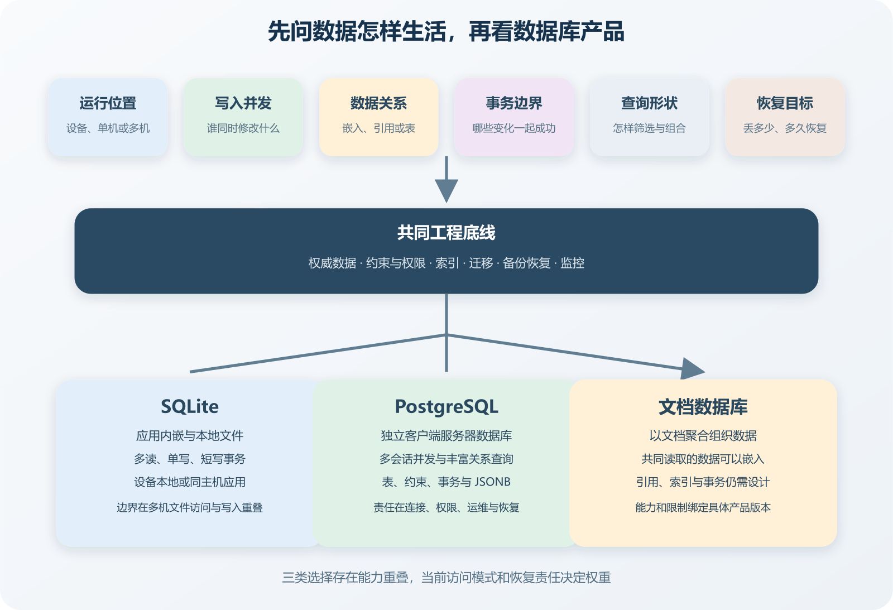

# SQLite、PostgreSQL、SQL 与文档数据库

AI 做个人项目时，很喜欢把数据库选择压成几句。小项目用 SQLite，正式项目用 PostgreSQL，字段经常变化就用文档数据库。这几句话有时成立，也可能把人带偏。

SQLite 能支撑许多真实应用和网站，边界主要来自运行位置与写事务形态。PostgreSQL 适合客户端服务器模式和多会话并发，也带来连接、权限、备份与升级。文档数据库允许把相关数据放在一个文档中，仍然要设计结构、索引、关系和事务。SQL 是查询与数据操作语言，不能和某个数据库产品简单对立。

*SQLite、PostgreSQL 和文档数据库的六项选型条件*

## 先把四个名词放回位置

SQL 是 Structured Query Language 的缩写，中文常称结构化查询语言。它用来定义、查询和修改关系数据。不同数据库支持的语法与扩展并不完全相同，`SELECT`、`JOIN`、约束和事务等概念可以迁移。

PostgreSQL 是独立运行的开源关系数据库服务。应用通过本地套接字或网络连接，数据库管理多个用户、连接和事务。SQLite 是嵌入应用的数据库引擎，数据库通常放在一个文件中，应用通过库直接读写。两者都支持 SQL、事务、索引和约束，差别首先来自部署形态。

文档数据库以文档为主要存储单位，文档常用类似 JSON 的嵌套结构表达。MongoDB 是常见产品之一，不能代表所有文档数据库。采用任何产品，都要看它对嵌入、引用、事务、索引和备份的当前说明。

四个名词不在同一层级。PostgreSQL 可以保存 `jsonb`，文档数据库也可能支持事务与类似连接的查询。现实项目经常使用混合模型，一句话选型很难负责。

## 数据库在哪里运行

桌面工具、手机 App、浏览器扩展和离线采集程序，经常需要数据跟着单个应用安装。SQLite 数据库与应用位于同一设备，备份和迁移可以围绕本地文件进行。网络断开以后，应用仍能读取本地数据。

网站后端通常由服务器代表用户访问数据库。数据库文件与访问它的进程位于同一主机时，SQLite 可以工作；同机也可以有多个进程，关键是文件锁有效、写事务短且等待可控。[SQLite 官方适用说明](https://www.sqlite.org/whentouse.html)列出设备本地存储、应用文件格式、网站和数据分析等用途，也提醒多台服务器直接访问同一数据库文件、网络文件系统和高并发写入等边界。

多个应用实例位于不同机器，需要共同读写权威数据时，客户端服务器数据库更自然。PostgreSQL 维护独立服务地址、认证和并发控制，应用实例通过连接池访问。不要把 SQLite 文件放到普通网络共享目录，再让多台服务器同时写。

Serverless 与边缘函数还要检查连接模型。大量短生命周期函数各自创建 PostgreSQL 连接，可能耗尽数据库连接数。平台连接池或数据库代理可以缓解，配置与费用也随之增加。SQLite 若运行在短暂文件系统中，实例销毁后本地数据可能消失。

## 写入怎样重叠

并发用户很多仍然太宽。一万个用户同时阅读，与一百个用户同时修改热门记录，压力完全不同。要看写事务数量、持续时间和冲突位置。

SQLite 允许多个读事务，同时只有一个写事务。WAL 模式可以让读取与写入并行，仍然只有一个写者。写事务短、写入彼此错开时，这个模型可以表现很好。应用在事务里等待网络或执行耗时计算，会长期占住写入机会。

PostgreSQL 允许多个会话并发读写，通过多版本并发控制、隔离级别和锁维护一致性。它能处理更复杂并发，但两个请求争夺最后一个名额时，仍要使用约束、锁或合适隔离，并处理失败重试。

瓶颈也可能来自连接池、热点行、索引和慢查询。换数据库以前先找等待位置。一个事务更新全局计数器，任何产品都会遇到热点。可以分散计数、异步聚合或重新定义业务动作。

## 数据关系和事务

课程平台有课程、课时、教师、学生、报名和付款。学生可以报名多门课程，一门课程有许多学生。付款与报名都有独立状态和审计要求。这类关系适合用表、主键、外键和唯一约束表达。报名表引用课程与学生，唯一约束阻止同一学生重复报名。

文档模型先看哪些数据共同读取与共同变化。课程简介与少量固定课时经常一起显示，可以嵌入一个课程文档。课时数量持续增长、需要独立编辑和搜索时，单独集合加引用可能更合适。教师姓名嵌入每门课程以后，改名要更新许多文档，或者接受旧课程保留快照。

报名最后一个名额时，创建报名、减少余量和记录付款意图可能需要保持一致。SQLite 和 PostgreSQL 都提供事务，部署与并发模型不同。事务只覆盖数据库内部。发送邮件、调用支付和上传文件属于外部副作用，数据库回滚无法撤回已经完成的外部动作。可以在事务中记录待处理任务，再由 Worker 执行。

MongoDB 的单文档操作具有原子性，也支持多文档事务。官方文档同时提醒，多文档或分布式事务会增加成本，不能替代合适的数据模型。产品支持事务，只说明它提供机制。应用是否正确划分事务、设置超时、处理冲突和重试，仍要验证。

## 查询决定模型能不能长期使用

先收集用户与后台实际需要的查询。课程列表按教师、标签和发布时间筛选，报名后台按状态、日期和课程统计，学生页面查看自己最近学习位置。数据模型应让高频且重要的查询可表达、可索引、可观察。

关系数据库擅长临时组合关系。SQL 可以 JOIN、聚合、排序和筛选，数据库优化器选择执行计划。索引根据真实查询建立，每个索引都会增加存储与写入成本。数据量很小时，全表扫描也可能正常。

文档数据库适合一次读取完整聚合。课程页所需内容位于一个文档时，读取路径直接。需要跨大量文档做任意关系分析时，聚合流程和数据复制可能增加。选择文档模型以前，至少写出最重要的读取和更新，不要只看写入 JSON 很方便。

PostgreSQL 也能保存 JSON。字段有一部分稳定关系，另一部分来自不同外部设备或插件时，可以在 PostgreSQL 表中使用 `jsonb`。订单 ID、用户 ID、状态、金额和时间保留普通列与约束，供应商原始响应或可选元数据放进 JSON。灵活字段不等于没有 Schema。需要关联、筛选、唯一与审计的字段，应留在明确列中。

## 灵活 Schema 仍然需要迁移

关系数据库通过迁移增加列、索引和约束。迁移文件进入版本控制，部署时按顺序执行。生产表很大时，某些变更可能锁表或重写数据，需要查产品版本文档，并在接近真实规模的副本上验证。

文档数据库允许旧新文档结构共存，应用也要同时理解多个版本。字段从字符串改成数组以后，旧记录怎样读取，写回时是否升级，索引何时建立，都属于迁移。可以给文档保存 Schema 版本，后台逐批转换，并监控剩余旧版本数量。

数据库约束应逐步收紧。先检测现有脏数据，修复以后增加约束。直接在生产加入非空或唯一规则，历史数据不符合时会失败。AI 生成迁移脚本后，要审查锁影响、执行时间、失败状态和代码回滚后的兼容。

## 备份与恢复决定选型下限

数据库是否容易启动，与数据是否容易恢复没有直接关系。SQLite 只有一个主要文件，运行中写入时随手复制可能得不到一致快照。SQLite 提供在线 Backup API 等方式创建一致副本。备份后还要在隔离目录打开、查询并运行应用验证。

PostgreSQL 提供 SQL dump、文件系统级备份和连续归档等路线。选择取决于数据量、恢复时间和恢复点要求。托管平台的自动备份需要核对保留时间、恢复粒度、地区与费用，不能把控制台显示已备份当成恢复完成。文档数据库同样需要与部署拓扑匹配的备份，恢复后检查记录数量、关键约束、索引和应用行为。

恢复目标会反过来影响选型。只能接受一天数据丢失，与必须恢复到几分钟前，需要的日志、归档、费用和操作完全不同。先写恢复点目标与恢复时间目标，再确认产品和维护能力能否做到。

## 用同一个课程平台做草图

关系模型可以建立课程、课时、学生、报名和付款表。报名通过外键连接学生与课程，唯一约束避免重复。它适合后台跨课程统计、付款审计和关系变化。

文档模型可以把课程简介与有界课时嵌入课程文档，报名和付款保持独立文档并引用学生与课程。课程详情读取集中，跨课程报名统计要通过索引和聚合。SQLite 模型可以与关系表相同，运行在教师桌面端或单机服务器。PostgreSQL 混合模型可以用关系表保存课程、报名和付款，把不同课时类型的可选配置放进 `jsonb`。

正常验证先走核心动作。创建课程、发布课时、两名学生同时争抢最后一个名额、付款回调重复到达、后台统计报名。检查数据结果、约束、事务与查询耗时。恢复验证在测试环境执行，创建备份，继续写入几条记录，模拟数据库不可用，再恢复到独立环境。

## 让 AI 输出选择依据

要求 AI 推荐数据库以前，提供运行拓扑、写入并发、核心关系、事务、查询、数据量、备份和维护能力。让它分别说明 SQLite、PostgreSQL、文档数据库和维持现状怎样处理这些条件。

AI 经常根据框架模板默认选库，也会为显示灵活把字段塞进 JSON。审查 Schema 时检查权威数据、唯一约束、删除、历史快照和敏感字段。文档结构要检查增长是否有界，重复字段怎样更新，引用失效怎样发现。

实施以后要求它交付迁移、索引、备份、恢复和故障验证证据。连接成功只能证明应用能够访问数据库，创建一行只能证明基本写入。并发约束、恢复和旧版本兼容需要各自测试。

最终决定写明当前条件。单机桌面工具选择 SQLite，多实例交易后端选择 PostgreSQL，以有界聚合读写为主的内容系统选择文档数据库，都可能合理。条件变化时重新比较，不能让早期选择变成不可讨论的信条。
