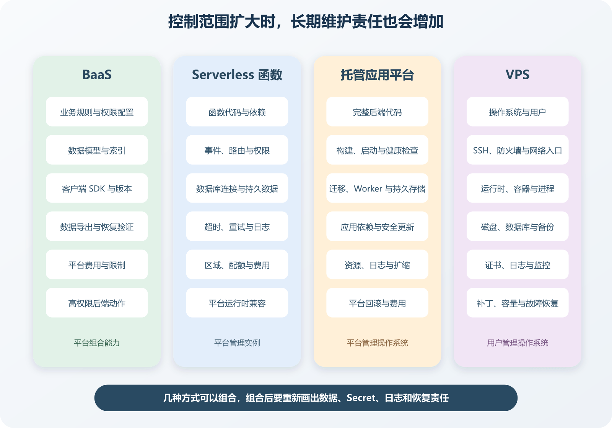

# BaaS、自建后端、托管平台、VPS 与 Serverless

一个 Flutter App 或微信小程序需要账号、数据库、文件上传、推送和几段业务接口。AI 可能同时给出几套建议。直接接 Firebase，使用 Supabase，用微信云开发，把 Node.js 部署到托管平台，购买 VPS 跑 Docker，或者把接口写成 Serverless Functions。每条路都能做出可运行版本，维护者承担的部分差别很大。

这些名词经常交叉。Supabase、Firebase 和微信云开发里的部分能力属于后端即服务，内部仍运行数据库、身份和存储组件。托管平台可以运行普通后端，也可以提供函数。VPS 由用户管理操作系统。Serverless 仍然运行在服务器上，只是实例、扩缩与部分基础设施由平台管理。

选择时不要问哪一种更先进。先决定哪些责任交给平台，哪些控制留在自己手里，应用需要怎样的运行时间、网络、数据、后台任务和恢复方式。

*BaaS、托管平台、Serverless 与 VPS 的责任分界*

图中越向右，用户控制的运行层越多，安装、升级和恢复责任也越多。BaaS 让项目主要配置数据、权限与业务规则，托管函数和应用平台运行项目代码，VPS 还要求维护操作系统、网络入口和运行时。几种方式可以组合，组合后要把责任交界写清。

## 先分清后端代码和后端能力

后端代码是项目自己编写的业务逻辑，例如核对优惠券、创建订单、处理支付回调。后端能力包括数据库、身份认证、对象存储、邮件、消息、定时任务和日志。完整产品常同时需要两者。

BaaS 是 Backend as a Service 的缩写，可以译为后端即服务。平台把数据库、身份、文件存储、实时同步和函数等能力组合成 SDK 或 API。Supabase 的架构包含 PostgreSQL、认证、REST、Realtime、Storage、Functions 和网关等组件。Firebase 也提供 Authentication、Firestore、Functions、Storage 和 Cloud Messaging 等能力。

自建后端表示项目自己拥有并维护业务服务代码。它可以部署在 VPS，也可以部署到 Render、Vercel 或其他应用平台。自建描述代码与责任归属，不等于必须购买裸服务器。

托管应用平台接收仓库或容器，负责构建、启动、域名、证书、日志入口和部分扩缩容。项目仍要提供启动命令、环境变量、数据库迁移、健康检查和应用监控。平台处理基础设施，不会替代码判断订单是否可以退款。

Serverless 通常指开发者按函数或请求模型运行代码，平台管理实例和扩缩。函数可能按请求、事件或计划任务触发。项目仍要关心运行区域、数据库连接、执行限制、日志和费用。

VPS 是 Virtual Private Server 的缩写，可以译为虚拟专用服务器。云厂商提供虚拟机、网络与磁盘，用户维护操作系统、软件包、防火墙、SSH、反向代理、应用进程、备份和更新。系统与应用责任都在用户身上。

## BaaS 省下的工作和留下的边界

个人项目最容易从账号、数据库和文件上传开始体会差别。自己实现密码登录，要处理散列、找回、邮箱验证、会话、限流和安全更新。Firebase Authentication、Supabase Auth 或微信小程序身份能力能省掉许多早期工作，Firestore、Supabase Storage、云数据库和云存储也能让原型更快成形。

省下服务器搭建以后，重点会移到权限规则。登录成功只证明平台识别了用户，不能证明用户有权读取某个订单。Firestore Security Rules、Supabase Row Level Security、微信云开发权限规则或服务端检查，都要表达数据权限。规则写成任何登录用户都能读整张表，平台不会替项目挡住越权。

客户端可直接访问 BaaS 时，要分清普通配置和 Secret。AppID、环境 ID、公开项目标识可以随 App 或小程序发布，管理员密钥、服务账号私钥、支付密钥和绕过权限的密钥不能进入客户端。高权限动作应放在可信后端或受控函数里。

BaaS 会承担部分备份、扩展和可用性，但责任范围取决于产品与计划。保留时间、恢复粒度、地区、导出和费用都要查当前官方文档。控制台里有备份选项，不等于项目已经做过恢复演练。

## 小程序要单独看平台约束

微信小程序有自己的账号、审核、域名配置、网络请求限制、支付和消息能力。后端可以用微信云开发，也可以用自建 API 或托管平台。选型时先看项目是否依赖微信生态能力，是否还要连接外部系统，数据以后能不能导出，团队有没有人维护后端。

云开发适合早期验证登录、数据、文件和简单函数。它减少服务器维护，也会让数据模型、权限规则、日志、费用和迁移方式与平台绑定。以后要同时支持网页、App、后台和其他渠道时，应提前记录接口边界，别把业务规则全部散在小程序页面里。

审核和发布也会改变技术安排。类目、订阅消息、支付能力、服务器域名和隐私材料都可能影响上线。AI 生成小程序方案时，要让它列出域名、权限、云函数、支付回调、数据导出和审核材料，不能只给页面代码。

## BaaS 没有接管业务设计

课程 App 可以让客户端直接读公开课程，也可以让登录用户读取自己的报名。付款回调、管理员退款、发放高权限角色等操作，必须由可信服务端验证签名、权限和当前状态，不能让客户端自己声明结果。

Firestore 与 PostgreSQL 的事务、查询和一致性模型不同。迁移平台不能只替换 SDK 名称，数据模型、索引、规则、离线同步和事务都要重新设计。Cloud Functions、Edge Functions 或云函数能补上可信代码，也有运行时间、网络、内存和并发限制，长时间视频转换和大批量迁移未必合适。平台组合还会产生跨服务故障。认证正常时数据库可能不可用，文件上传成功后数据库记录可能失败，监控和测试要按组件分开。

## 托管应用平台适合完整后端

普通 Node.js、Python、Go 或 Java 后端通常需要一个持续运行的进程，监听端口并处理请求。托管平台可以从 Git 仓库构建并部署这个进程，提供日志、环境变量、域名和健康检查。它比 VPS 少了操作系统维护，项目仍要更新语言运行时与依赖，限制数据库权限，设置超时，检查内存与磁盘，并验证平台重启时的行为。

文件系统常是临时的。用户上传文件若只写进应用目录，实例重启或重新部署后可能消失。需要持久文件时使用平台磁盘或对象存储，并核对备份。应用平台适合已有完整后端框架、持续进程、后台 Worker 或 WebSocket 的项目，具体能力要按当前产品文档确认。

部署回滚通常只恢复代码或构建产物。数据库迁移已经删除一列，切回旧代码可能仍然失败。发布计划要把代码、数据库和外部配置分开。

## Serverless 函数适合短动作

短时间响应请求、处理 Webhook、生成签名地址、运行轻量计划任务，通常符合函数模型。流量为零时平台可以缩减实例，流量增长时自动增加执行。函数实例可能被复用，也可能随时换新，进程内缓存、临时文件和全局变量不能当成权威状态。

冷启动、执行时间和资源限制会影响体验。不同运行时、计划和地区限制不同。Cloudflare Workers 官方限制页列出 CPU、内存、请求、子请求、连接和日志等资源维度。具体数值变化快，本书不写成固定承诺。函数与数据库的距离也很重要。函数在美国，数据库在亚洲，每次请求都要跨地区往返。突发扩展还可能压垮下游，需要连接池、代理、并发上限或队列。

长任务要确认平台模型。视频转码、批量导入和持续爬取可能超过函数时限，或产生高额资源费用。可以把请求变成任务，交给专用 Worker、队列或容器服务。函数负责接收和查询状态，长任务在适合的运行环境执行。

## VPS 给控制，也给责任

VPS 可以安装任意兼容软件，运行 Docker Compose、数据库、队列、反向代理和后台任务。固定进程、持久磁盘、特殊系统依赖和自定义网络更容易安排。控制从操作系统开始。创建用户、配置 SSH、防火墙、系统更新、磁盘、日志轮转和服务自启动都由你处理。应用崩溃、证书续期失败、磁盘写满和数据库备份失败，没有平台自动替你修复。

一台 VPS 上放网页、API、数据库和文件，成本与理解起初很简单，故障范围也集中。快照、异机备份和恢复演练要覆盖这项集中风险。单机资源不够时，可以升级规格，也可以拆数据库、增加实例和负载均衡，后者会引入部署协调。

VPS 适合维护者愿意学习服务器、需要特殊运行环境、希望长期进程与持久磁盘，或者托管平台限制已被实际工作负载触发的情况。它不适合只想完成业务功能、没有时间维护安全更新和恢复的人。

## 五类方案可以组合

一个常见网页可以部署在 Vercel，接口使用 Vercel Functions，数据和身份放在 Supabase。Flutter App 可以用 Firebase Authentication、Firestore、Storage 与 Cloud Messaging，再用 Cloud Functions 处理高权限动作。微信小程序可以用云开发完成登录态、云数据库、云存储和云函数，也可以把业务 API 放到自建后端。

> **跟做视频**
>
> 中文主入口见[视频跟做索引里的微信小程序云开发与发布](../frontmatter/videos.md)。看视频时把它当成 BaaS 方案的可见样本，重点观察小程序端、云数据库、云函数和云存储怎样分工。支付回调、管理员动作和数据导出仍要按自己的项目另行设计。

普通 API 可以部署到 Render，数据库使用托管 PostgreSQL，文件进入对象存储。也可以在 VPS 运行 Docker Compose，数据库使用外部托管服务。组合越多，责任交界越多。系统地图应标出每个组件、权威数据、Secret、日志和责任人。

## 用几个问题开始选择

先看运行形态。短请求与事件处理适合函数，持续进程、常驻连接和自定义 Worker 更适合托管应用或 VPS。移动端离线数据与实时同步，可以重点评估 BaaS 的客户端能力。再看权威数据在哪里，怎样备份，怎样导出。计算平台离数据太远会增加延迟，数据迁移困难会增加退出成本。

然后写清权限、失败和费用。客户端能直接访问什么，哪些动作必须经过可信服务端，管理员密钥放在哪里。函数超时、平台部署失败、BaaS 数据库不可用、VPS 磁盘满，各自影响哪些用户。最后看维护者能否长期承担。一个月后谁升级依赖，半年后谁恢复数据，平台改变计划时谁评估迁移。

## 假设项目怎样选择

个人作品集只有静态页面和联系表单，静态托管加轻量函数或表单服务通常够用。小型会员 App 需要登录、头像和少量实时状态，维护者只有一人，BaaS 可以缩短身份、数据库与存储接入。小程序点单工具需要微信登录、支付、订阅消息和后台订单管理，云开发可以快速成型，支付回调与管理员操作要放在云函数或可信后端。

文档转换服务需要系统工具，单个任务运行十分钟并产生临时大文件，普通短函数可能受时长、内存或文件限制。托管容器加任务 Worker，或一台资源合适的 VPS，会更容易控制运行环境。并发、地区、数据敏感性、预算和团队能力改变以后，选择也会改变。

## 正常与失败验证

正常路径要从真实客户端走。注册用户、写入受权限保护的数据、上传文件、触发后端动作并读取结果。再做权限失败测试，让用户 A 读取用户 B 的资料，让普通用户调用管理员函数，让过期 Token 访问长期连接。系统应拒绝并留下安全记录。

平台失败可以在预览环境模拟。让函数超过测试超时，让数据库连接失败，让应用实例重启，让 VPS 上的服务进程退出。托管应用重新部署后，上传文件是否仍在。函数换实例后，任务状态是否丢失。VPS 从快照恢复以后，数据库与文件是否一致。回滚还要区分代码与数据，数据库迁移不会因为切回旧代码自动撤销。

## 迁移与退出从第一天就记录

BaaS 迁移要列出用户身份、数据库、文件、函数和实时订阅。数据库能导出，不代表用户密码与认证状态能无损迁移。客户端 SDK 也可能绑定数据模型和离线行为。

Serverless 迁移要看运行时 API、平台环境变量、路由、缓存和事件源。托管应用迁移通常围绕容器、启动命令、环境变量、域名和持久数据。VPS 迁移还要处理系统包、用户、服务文件、防火墙和磁盘。退出说明至少要记录数据导出方式、专属能力、预计停机、要更换的客户端代码和当前阻碍。

## 让 AI 画责任图再推荐平台

给 AI 一个项目需求时，要求它先画客户端、计算、身份、数据库、文件、消息和外部 API。每个节点写明谁管理、数据是否持久、Secret 在哪里、失败看哪份日志。

随后让它分别给出 BaaS、托管应用、Serverless、VPS 和组合方案。每套方案都要覆盖权限、部署、备份、恢复、费用与退出，不能只比较首次上线步骤。

AI 生成配置后，检查它是否默认开放数据库、把服务密钥放入前端、依赖临时文件、忽略函数时限或让所有服务共用管理员权限。最终选择写进 ADR，记录当前规模、维护能力、数据地区、工作负载、平台责任、接受的限制和重新评估条件。平台功能、价格和计划会变化，封版与采用前重新核对官方资料。
