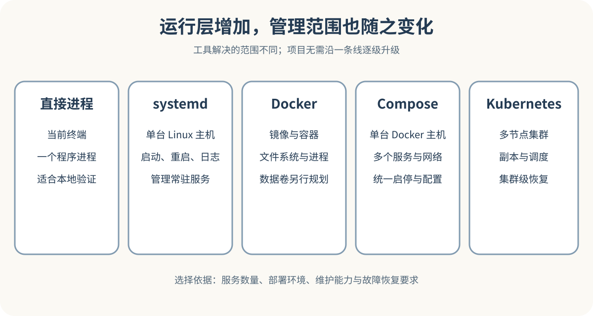

# 直接进程、Docker、Compose 与 Kubernetes

同一个 Python 或 Node.js 服务，可以在终端里直接启动，也可以交给 systemd 管理，还可以装进 Docker 容器。服务数量增加以后，项目可能用 Compose 管理一组容器。团队拥有多台机器、许多服务和明确的高可用需求时，还可能把容器交给 Kubernetes 编排。

这些做法经常被排成一条升级路线，好像项目迟早要从终端走到 Kubernetes。现实中没有这条固定路线。它们解决的问题范围不同，后面的工具也不会自动让应用设计正确。维护良好的 systemd 服务，可能比无人理解的 Kubernetes 集群可靠。单台 VPS 上的三容器项目，Compose 往往已经足够。



*直接进程、systemd、Docker、Compose 与 Kubernetes 的管理范围*

## 先分开应用、进程、容器和编排

应用是项目实现的业务能力，例如课程 API、后台任务和管理页面。进程是操作系统正在执行的程序实例。容器把进程及其文件、依赖和运行设置放进隔离环境。编排工具负责维持多个运行实例的目标状态。

这些概念可以组合，不能互相替代。Docker 镜像能够带上正确的 Python 版本，却不会替应用补上事务。Compose 能创建 Web 服务与数据库，却不能保证数据库完成业务初始化。Kubernetes 能把崩溃的 Pod 再拉起，却不能修复每次启动都崩溃的代码。应用架构也不由容器数量决定，微服务需要业务边界、独立部署和跨进程协作方面的理由。

## 直接启动适合先看应用本身

开发阶段最短的路径通常是在项目目录执行启动命令。

```
python -m uvicorn app:app --host 127.0.0.1 --port 8000
```

这条命令会启动当前 Python 环境中的 Uvicorn，让 `app` 模块里的应用监听本机 8000 端口。终端能直接显示导入错误、配置缺失和请求日志。按下 `Ctrl+C` 会向进程发送中断信号，关闭终端、退出账号或电脑重启也可能结束它。

直接启动的价值在于透明。维护者很容易核对当前目录、解释器、环境变量、监听地址、端口和错误输出。它不适合无人值守的长期服务，生产环境还需要确定运行用户、工作目录、启动顺序、日志、重启限制和停止方式。

## systemd 管理单机服务

Ubuntu 等 Linux 系统常用 systemd 管理长期运行的系统与应用服务。服务单元可以写明程序、运行用户、工作目录、环境文件、启动依赖和重启策略。系统启动时，systemd 按配置拉起服务，并记录进程状态。

一个最小服务单元会写明运行账号、工作目录、环境文件、完整启动命令和重启策略。服务输出进入 journal 后，可以用 `systemctl status` 和 `journalctl -u` 查看。验收 systemd 服务不能停在 `active (running)`，还要发出真实请求，检查数据库访问，并确认重启策略按预期工作。

## Docker 把运行环境做成镜像

Dockerfile 是构建镜像的指令文件。它通常声明基础镜像、工作目录、依赖安装、项目文件和启动命令。镜像构建完成后，可以在装有兼容容器运行时的机器上创建容器。OCI 定义了镜像、运行时和分发等开放规范，容器生态不等于某个单一产品。

容器运行时会给进程建立隔离的文件系统、进程树和网络环境。端口必须明确发布，宿主机目录或命名卷要明确挂载。这种隔离减少了环境差异，却没有提供完整独立操作系统。容器与宿主机共享内核，安全更新、运行时配置和主机权限仍需维护。

容器最重要的收益，是把应用运行所需的版本和文件封装为可重复分发的产物。版本标签仍可能被重新指向，精确固定镜像应记录内容摘要 digest；只有仓库明确实施不可变标签策略时，才能依赖该策略。发布前在测试环境运行同一摘要的镜像，并定期通过受控更新获取安全修复。容器自己的可写层应按可丢弃处理，用户上传、SQLite 文件、数据库目录和队列状态需要放入明确的持久卷或外部服务。镜像构建成功只证明 Dockerfile 能生成镜像，容器显示 `running` 只证明主进程尚未退出。相关区别见 [Docker 镜像固定说明](https://docs.docker.com/build/building/best-practices/#pin-base-image-versions)。

安全边界也需要单独处理。镜像要选择可信来源并固定适用版本，容器尽量使用非 root 用户，只发布必要端口，Secret 通过运行环境注入。把 Docker Socket 挂进普通容器会给它很强的宿主机控制能力，不能为了方便部署随意开放。

## Compose 管理单机多容器

一个网页项目可能包含 Web、Worker、PostgreSQL 和反向代理。Compose 使用 `compose.yaml` 把服务、端口、网络、卷、环境变量和启动参数写在一起，`docker compose up` 按配置创建网络、卷和容器。

Compose 适合本地开发、演示环境和许多单机生产项目。服务名组成默认网络中的可解析名称，因此 Web 可以使用 `db` 访问数据库。`depends_on` 能表达部分启动关系，实际可用性仍应由健康检查、连接超时与应用重试共同处理。

操作 Compose 时要分清停止、删除和删除数据。`docker compose down` 默认删除项目容器与网络，不会删除命名卷。加上 `--volumes` 会删除配置中声明的命名卷和附着的匿名卷，标为 external 的卷不在其删除范围。如果数据库数据位于被删除的卷，这一步可能造成不可恢复的数据丢失。只想停止服务可用 `docker compose stop`；清理卷之前必须确认目标项目、备份和恢复方法，具体范围见 [Compose 命令说明](https://docs.docker.com/reference/cli/docker/compose/down/)。

一次有意义的 Compose 演练可以这样安排。先启动完整项目并创建测试数据，随后重建 Web 容器，确认数据仍在；再停止数据库，观察 Web 的超时和错误信息；最后更新 Web，检查迁移、健康状态和日志，失败时切回旧镜像。

## Kubernetes 处理集群级编排

Kubernetes 面向容器化工作负载的部署、扩缩、更新和故障恢复。维护者声明期望的副本、镜像、配置和网络入口，控制平面持续比较实际状态并作出调整。Service 提供稳定访问位置，Deployment 管理副本与滚动更新。

这套能力适合确实存在集群问题的项目。服务需要跨多台节点运行，单个实例故障后要重新调度，团队需要统一发布策略，多个服务需要按权限共享集群资源，这些需求会给 Kubernetes 明确的工作。只有一台 VPS、三个容器和一名维护者时，引入集群通常会增加证书、网络、存储、权限、升级、监控和排错工作。

Kubernetes 也不能自动带来高可用。控制平面、节点、负载均衡、存储和数据库都要有相应设计。把两个 Pod 放在同一节点，节点失效后仍会一起离线。滚动更新只管理工作负载版本，数据库迁移顺序、兼容窗口和回滚条件仍需项目设计。

## 用七个问题选择运行方式

先数长期运行的进程。单个 API 可以由 systemd 管理，Web、Worker 和数据库组成的单机项目更适合 Compose。进程多不等于必须跨主机。只有一台主机时，Kubernetes 的调度能力没有发挥空间。多台主机也不必立刻上集群，先确认是否需要自动调度、滚动发布和统一资源管理。

然后看运行时是否难以重复。依赖简单、主机固定的项目可以直接安装。需要固定系统库、交付给多种环境或频繁回滚时，镜像能提供更强的产物一致性。权威数据必须有明确位置，选型会议若只讨论计算层，没有讨论数据恢复，结论还不能用于生产。

最后看维护与回退。个人工具可以接受人工登录重启，商业服务可能需要自动重启、备用实例或跨节点调度。团队已经拥有集群平台与值班人员时，新增工作负载的成本可能较低。个人维护者首次引入 Kubernetes，需要承担整套学习、升级和排错成本。

三类项目可以快速判断。单台 VPS 上的 FastAPI 服务，虚拟环境加 systemd 通常够用。Web、Worker、PostgreSQL 和 Caddy 都在一台 VPS 上时，Compose 能统一网络、卷和环境配置。十几个无状态服务、流量波动明显、团队已有多节点集群时，Kubernetes 才更像合适工具。

## 让 AI 交付责任图和验证证据

让 AI 部署项目时，先要求它列出应用进程、运行用户、监听端口、环境变量、持久数据、外部依赖、日志位置、启动方式和停止方式。随后让它说明每个工具增加了哪项能力，以及不用这项工具会损失什么。若回答只说便于扩展、更专业或更云原生，还没有完成选型。

AI 生成 Dockerfile 后，要审查基础镜像、依赖锁定、构建上下文、最终用户、启动信号和健康检查。生成 Compose 配置后，要审查端口、卷、Secret、重启策略和数据删除风险。建议 Kubernetes 后，还应给出具体的多节点、扩缩、发布或组织需求。

验证记录至少包含镜像或代码版本、主机与运行时版本、启动结果、真实业务请求、重启行为、数据重建测试、日志位置和回滚结果。一次单机演练不能证明跨节点高可用，一个绿色健康接口不能证明所有业务路径正常。
