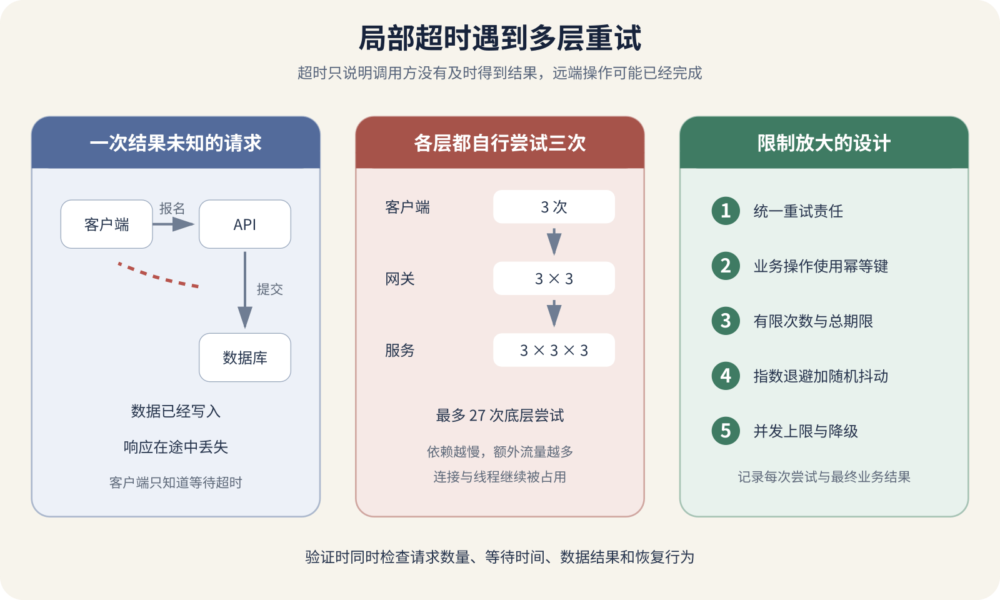

# 局部故障、超时、重试放大与退避

设想一次课程报名。用户在 App 里点击“确认报名”，客户端把请求发给 API，API 写入数据库，数据库提交成功。就在服务器准备返回结果时，移动网络断开了。几秒以后，客户端只看到超时。

危险来自一句含糊的判断。客户端确实没有收到成功响应，服务器上的操作却可能已经完成。用户再点一次，App 自动再试一次，网关又重放一次，后台也重试，系统可能生成两份报名、扣两次库存，甚至触发两次付款。

局部故障本来只发生在一次响应传输上。缺少边界的重试会增加请求量，占满连接与线程，让健康组件也开始超时。可靠性设计要先承认调用方经常无法确定远端执行到了哪一步。



*一次局部超时怎样被多层重试放大*

## 局部故障让各方看到不同事实

单机程序容易形成一种直觉。函数要么返回结果，要么抛出错误。网络系统多了一批中间状态。DNS 可以正常，TCP 连接可能失败；请求已经到达服务器，数据库可能变慢；数据已经提交，响应可能丢失；页面成功收到响应，对象存储仍可能故障。

局部故障表示系统的一部分在工作，另一部分已经失败。用户看到按钮一直转，API 日志显示请求处理完成，支付服务记录已经创建，消息队列的消费者还没有收到事件。所有记录都可能是真的。

HTTP 状态码能表达服务器已经给出的结果。`400` 表示请求本身存在问题，`401` 和 `403` 涉及认证或授权，`429` 常用于请求过多，`500` 表示服务器内部错误，`502`、`503`、`504` 常出现在代理与上游故障中。超时不同，调用方没有在期限内拿到需要的结果，只能先记录成结果未知，再通过查询、幂等记录或对账确定后续状态。

## 把结果未知保存成正式状态

很多界面只准备了成功和失败两个结果。请求超时以后，它只能弹出提交失败，随后允许用户再点一次。这个文案把通信结果误写成业务结果，也是重复操作最常见的起点。

写操作可以先在客户端生成操作 ID，并把界面状态设为正在确认。服务器收到操作后，以同一个 ID 保存处理中、已成功或明确失败。客户端没有收到响应时，不创建新操作，而是用原 ID 查询。服务器仍在处理，客户端继续等待；服务器已经成功，客户端展示原结果。

有些结果不能靠一次查询立即确定。第三方付款已受理、Webhook 尚未到达时，系统可以保留待确认，随后通过回调和定时对账更新。维护者要规定这个状态最长保留多久，超过期限由谁检查，以及用户能否发起第二笔操作。

## 超时是一项资源预算

没有超时的调用可能无限等待。上游线程、数据库连接、浏览器请求槽位和用户耐心都被占住，故障无法及时释放资源。超时设得过短又会把正常慢请求误判成失败，引发多余重试。项目需要根据正常延迟分布、用户等待上限和下游预算设置。

一次请求可能包含多个阶段。

```
DNS 查询
建立 TCP 连接
TLS 握手
发送请求
等待响应头
读取响应正文
解析并写入本地状态
```

有些客户端库只对读取阶段设置超时，连接与 DNS 仍可能等待更久。有些十秒超时覆盖整次调用，重定向、连接和正文读取共同消耗这十秒。配置前要看当前语言与库的准确说明，再用故障测试核对真实行为。

服务之间还要传递剩余预算。用户请求允许等待三秒，API 不应先给数据库三秒，再给邮件服务三秒。取消也不一定能撤销已经发生的副作用。数据库事务在超时前已经提交，客户端取消只能停止继续等待。

## 可重试和不可重试分开

重试适合短暂且有机会恢复的问题，例如连接建立失败、短时服务不可用、限流后等待，或数据库明确返回可重试的并发错误。长期配置错误、权限不足、参数无效和资源不存在，重复发送通常没有帮助。

HTTP 方法提供了一部分语义线索。规范把 GET、HEAD、PUT、DELETE 等方法定义为幂等方法，表示多次发送相同请求的预期效果与一次相同。这不保证每个实现都正确，也不表示重试没有日志、计费或性能代价。

POST 常用于创建或执行动作，默认不能假定可安全重试。项目可以给操作增加幂等键。客户端为一次报名生成一个稳定标识，同一次业务操作的所有尝试都携带它。服务器在受事务保护的存储中记录该标识、请求摘要和最终结果。重复请求到达时，服务器返回原结果，或报告原操作仍在处理中。

幂等键不能每次重试都重新生成，也不能在不同请求内容之间复用。服务器要核对请求摘要，并设置符合业务期限的保留时间。数据库唯一约束可以提供最后一道保护。报名表对用户与课程设置唯一约束，即使两个请求同时通过前置检查，数据库也只允许一条有效记录。

## 重试会放大流量

假设客户端最多尝试三次，API 调用库存服务时也尝试三次，库存服务访问数据库代理又尝试三次。用户的一次操作在最坏情况下会产生二十七次底层尝试。再增加一层三次重试，就会变成八十一次。

```
3 × 3 × 3 × 3 = 81
```

底层依赖已经过载时，这些额外请求恰好在它最缺资源的时候到来。线程等待更久，连接池被占满，队列继续增长，上游又因为超时发起新尝试。AWS 的可靠性指南把这类现象称为重试风暴，并建议限制重试次数或总时间，使用退避与随机抖动。

重试责任最好集中在最了解业务语义、又能控制总时间的一层。浏览器、移动 App、CDN、网关、服务 SDK、应用代码和任务队列若都使用默认重试，维护者要先列出每一层，再决定哪里保留。

立即重试会让所有失败请求再次同时到达。指数退避让等待时间随尝试次数增长，例如先等二百毫秒，再等四百、八百、一千六百毫秒。项目还要设置最大等待与总期限，避免用户操作在后台拖得没有边界。

许多客户端会在同一时刻遇到故障。若它们使用完全相同的等待序列，二百毫秒后仍会一起重试，形成新的尖峰。随机抖动会在允许范围内加入差异，让请求分散到一段时间。项目应优先使用经过维护的 SDK 实现，并核对它是否尊重服务器的 `Retry-After` 提示。

## 局部故障怎样扩大

共享资源会把影响传到健康组件。课程推荐服务变慢，主页 API 同步等待推荐结果，占住 Web 线程。用户刷新又创建新请求，连接池逐渐耗尽。登录、课程详情和管理页面原本不依赖推荐算法，也开始排队。

项目可以让非关键推荐在短时间内失败，并返回没有推荐区块的主页。线程池、连接池和并发上限也可以按依赖隔离，避免一个下游吃掉全部资源。队列把可异步的工作移出用户请求，但队列积压仍需限制、监控和降级策略。

GitHub 的 [2026 年 2 月可用性报告](https://github.blog/news-insights/company-news/github-availability-report-february-2026/)描述了 2 月 9 日缓存重写压垮共享协调组件，继而使 Git HTTPS 代理连接耗尽的传播过程。同篇报告中，遥测丢失导致存储安全策略误应用属于 2 月 2 日另一场事故，不能拼成同一条因果链。熔断器会在近期失败超过条件时暂时停止访问某个依赖，让调用快速失败，并在之后用少量探测检查恢复。个人项目先把超时、并发上限、有限重试和降级做好。

## 用受控故障验证

先在本地或测试环境建立正常样本。记录一次报名请求的请求 ID、幂等键、响应时间、数据库记录和日志。随后只改变一个条件，避免同时制造多个故障后无法判断原因。

第一次让 API 在数据库提交后延迟返回，延迟时间超过客户端超时。客户端应显示待确认，随后用操作 ID 查询，数据库只有一条记录，重复请求返回同一业务结果。第二次让下游连续返回明确的参数错误，调用次数应为一次。第三次让下游短暂返回服务不可用，请求次数不得超过上限，间隔应逐步增大并带有差异。第四次并发发起一百个请求，再让依赖变慢，系统应在限制处拒绝或降级。

这些测试必须使用测试账号、测试数据和可回收环境。支付、短信、邮件和推送等外部副作用应使用供应商沙盒或受控替身。

## 观测重试要看数量和时间

普通错误日志只会告诉维护者某次调用失败。定位放大效应还需要记录初始请求 ID、当前尝试序号、幂等键的安全摘要、下游名称、超时阶段、错误类别、等待时间和最终结果。Secret、完整付款信息与个人数据不能写进日志。

指标至少区分原始业务操作数、实际下游尝试数、超时率、重试成功率、最终失败率和延迟分位数。业务操作一百次，下游请求三百次，平均延迟仍可能看起来正常。把尝试数除以业务操作数，能够直接观察重试放大。

分布式追踪可以把一次用户请求经过的多个服务关联起来。字段要能回答哪一层重试、等待多久、最终产生了什么业务结果。告警应关注用户可见的最终失败、资源接近上限和重试率突然上升。

## 让 AI 先回答结果未知怎样处理

AI 很容易给所有网络请求套一个通用重试装饰器。提交代码前，要求它逐项列出操作是否只读、是否有副作用、哪些错误可重试、谁生成幂等键、服务端怎样持久化、总时间预算和最终失败状态。回答缺少任何一项，都不能把通用重试用于写操作。

再让 AI 画出重试层级。客户端、反向代理、SDK、应用服务、数据库驱动和队列分别尝试多少次，最坏情况下会产生多少底层调用。它还要给出请求日志或测试计数作为证据。

最后要求 AI 设计五类测试。正常请求、提交后丢失响应、不可重试错误、短暂可重试错误、并发过载。每项测试都要写预期请求数、时间上限、数据结果和恢复条件。只要请求可能修改现实状态，就要把结果未知、幂等、对账和人工介入一起设计。
