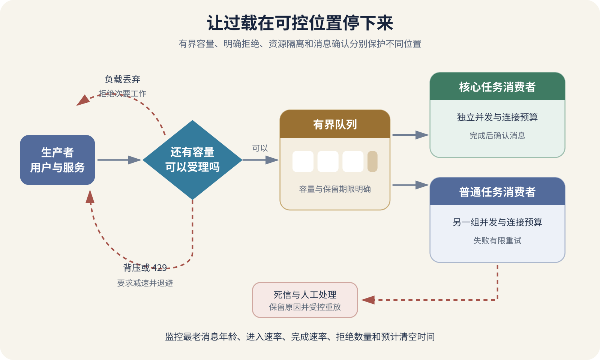

# 背压、负载丢弃、隔离与队列语义

一个图片处理服务每秒最多生成十张缩略图。平时每秒只有两三个任务，页面上传后很快看到结果。某天用户一次导入五千张图片，API 仍然飞快地接收所有请求，把任务不断塞进内存。几分钟后，进程占满内存并被系统终止，尚未保存的任务全部消失。客户端见到超时后自动重试，又把一批重复任务送了进来。

这次故障的起点不是图片算法变慢。入口接受工作的速度长期超过处理速度，系统却没有告诉上游减速，也没有在容量用尽前拒绝次要工作。队列把压力藏了一段时间，最终让延迟、内存和重复任务一起失控。

背压、负载丢弃、隔离和消息队列都在处理“工作量超过当前处理能力”这件事。背压要求生产者减速，负载丢弃主动拒绝一部分工作，隔离限制故障占用的资源范围，队列把生产与消费错开。四种办法会组合使用，任何一种都不能凭空增加处理能力。

*过载时背压、负载丢弃、隔离和队列怎样协作*

图中请求先经过容量判断。仍有预算时，系统把受理任务写入有界队列；容量不足时，它可以要求上游减速，或明确拒绝低优先级工作。不同任务使用独立并发与队列，能防止一个热点耗尽全部资源。消费者处理完成并确认以后，消息才结束自己的生命周期。

## 队列会推迟压力，不会消除压力

生产速度记为每秒二十项，消费速度记为每秒十项，每秒就会新增十项积压。队列容量一万项，只能把崩溃向后推迟大约一千秒。扩大队列能吸收短时尖峰，长期吞吐不平衡仍会填满。

积压还会转化成等待时间。队列里有六千项，消费者合计每秒处理十项，新任务即使处理本身只需一百毫秒，也可能等十分钟才轮到。接口很快返回“已受理”，不能证明用户很快得到结果。

有界队列比无限队列诚实。容量、消息保留时间和最大任务大小让系统在明确位置做决定。队列满以后，可以拒绝新工作、覆盖允许丢弃的旧状态、降低采样率，或把生产者阻塞在安全期限内。无限增长只是把拒绝推迟到内存、磁盘或账单耗尽时发生。

判断队列是否健康，至少要看队列长度、最老消息年龄、进入速率、完成速率、失败率和预计清空时间。长度一万在每秒处理十万项的系统里可能很轻，在每分钟处理十项的系统里已经是严重积压。年龄往往比长度更接近用户感受。

预计清空时间可以用积压量除以消费速率粗略估算。这个估算假定新任务不再进入，处理速度稳定。流量仍在持续时，应使用消费速率减去生产速率作为净清空速度。两者相等时，队列不会缩短。

## 背压让上游知道下游已经跟不上

背压是下游把容量信号传给上游，让上游降低发送速度或停止继续读取。最直观的例子是有界内存队列。队列满以后，生产者的写入等待，处理速度由消费者决定。流式协议还可能用窗口、信用额度或请求数量控制上游一次发送多少数据。

HTTP 请求通常不能长时间堵在入口。服务接近容量时，可以返回 `429 Too Many Requests` 或 `503 Service Unavailable`，并在适用时给出 `Retry-After`。调用方要按总期限退避，不能立即并发重试。状态码只是信号，服务端仍需限制正在处理的请求数。

浏览器上传大文件时，服务器若边接收边处理，读取速度下降会通过网络缓冲影响发送方。若服务器先把所有文件读进内存，再开始处理，背压信号到得太晚。流式读取、单文件大小限制和并发上传上限，应当一起设计。

SSE 与 WebSocket 也要处理慢客户端。服务器每秒产生一百条事件，手机只能消费十条，发送缓冲会持续增长。项目可以只保留最新状态、限制每个连接的待发送数量、断开严重落后的连接，或让客户端重连后从持久事件位置恢复。协议提供通信通道，不会替业务决定哪些消息可以合并或丢弃。

背压必须能跨越实际边界。Worker 从代理一次预取一千条消息，再放进自己无界内存队列，代理看到的积压会突然下降，进程内压力却继续增长。预取数量应与并发数、单项内存和处理时间匹配。RabbitMQ 的消费者确认与预取共同影响尚未确认消息的数量。

## 负载丢弃要在资源耗尽之前发生

负载丢弃也叫 Load Shedding。系统确认无法及时处理全部请求时，主动拒绝或降低一部分工作，保护仍能完成的核心操作。等线程池、内存和数据库连接全部用完以后再报错，拒绝已经太晚，恢复也会更慢。

丢弃要有业务顺序。课程平台可以先关闭个性化推荐、实时在线人数和昂贵报表，保留登录、课程阅读和已经付款用户的订单查询。图片服务可以暂停自动生成多种尺寸，只保留原图上传与一张基础缩略图。Google SRE 的过载案例也讨论了降级响应、客户端节流和在容量不足时丢弃负载。

有些工作不能静默丢弃。支付回调、用户删除请求和已经承诺持久保存的上传任务，需要明确接收确认、持久队列或人工补偿。系统若返回成功，随后偷偷删掉任务，用户无法知道需要重试。可丢弃的遥测采样与不可丢弃的业务动作应使用不同入口和资源预算。

负载丢弃还要避免永远牺牲同一批用户。可以按优先级、租户配额、用户身份和请求成本分配容量。只按“谁先把连接占满”处理，单个脚本或大客户就可能挤走其他用户。策略越复杂，越需要记录被拒绝的原因与数量。

客户端收到过载响应后，应显示明确状态并限制手动连点。后台自动重试必须有退避、抖动与总次数。上一章说明了多层重试怎样放大压力，过载期间尤其不能让客户端、网关与服务同时补发。

## 隔离把一项故障限制在自己的预算内

隔离常被称为舱壁设计，名字来自船舱分隔。工程含义很直接。不同工作不要共享全部线程、连接、队列、内存和并发名额。推荐服务变慢时，它只能占用自己的预算，不能让登录请求也拿不到数据库连接。

隔离可以发生在多个位置。API 为导出报表设置独立并发上限，数据库给后台任务使用独立连接池，消息代理把邮件与支付事件放入不同队列，Kubernetes 为工作负载设置资源请求与上限，云账号为测试环境设置独立配额。边界应按故障传播方式选择，不能只按代码目录划分。

资源完全分开会降低平均利用率，也增加配置与监控。个人项目不必为每个接口建立独立池。先找昂贵、突发、可降级或依赖不稳定的工作，例如视频转码、批量导出、第三方 AI 调用和群发邮件，再为它们设置单独队列与并发。

隔离测试要制造一个明确热点。让报表任务占满自己的 Worker，随后检查登录与普通查询的延迟。如果两者仍共用同一个数据库账号、连接池或磁盘，隔离可能只停留在进程层。测试结果要指出保护了哪项资源，不能只说“其他页面还能打开”。

GitHub 2026 年 2 月可用性报告描述了后台异步操作、共享协调组件连接耗尽和策略问题产生的级联影响。真实事故经常跨过代码模块边界，共享连接、控制组件和遥测系统都可能成为传播位置。隔离设计要跟着共享资源走。

## 消息进入代理不等于业务已经完成

消息系统至少包含生产者、代理和消费者。生产者把任务发给代理，代理保存并投递，消费者处理业务。每一段都可能发生“对方做了，但确认没有回来”的情况，因此需要明确确认与责任转移。

RabbitMQ 的 Publisher Confirm 用于让代理确认已经接收生产者的消息。消费者确认用于告诉代理某条消息已经处理，可以从队列删除。两种确认互相独立。代理确认发布成功，不能证明消费者已经执行任务；消费者确认也不替生产者证明业务结果已经通知用户。

消费者在处理前自动确认，进程随后崩溃，消息可能丢失。消费者完成数据库写入后再手动确认，确认在网络中丢失，代理可能重新投递，消息就会重复。RabbitMQ 的可靠性指南明确提醒确认机制仍可能带来重复交付。因此消费者要按至少一次交付设计，使用业务唯一键、幂等记录或数据库约束处理重复。

“恰好一次”必须写清范围。代理可能保证某个内部日志位置只提交一次，业务还会经过数据库、邮件、第三方 API 和回调。只要这些系统不能加入同一事务，端到端恰好一次就需要幂等、去重和对账共同完成。宣传页上的 Exactly Once 不能直接翻译成“用户绝不会收到两封邮件”。

Amazon SQS 使用可见性超时表达相似过程。消费者收到消息后，消息在一段时间内对其他消费者不可见；消费者处理完成后删除消息。处理时间超过可见性期限而没有延长，消息可能再次出现并由另一个消费者处理。可见性期限过短会造成并发重复，过长会拖慢故障后的重新处理。

确认时机要放在业务完成之后，也要避免把不可恢复错误无限重排。消息格式错误、引用资源永久不存在、代码每次都在同一点崩溃，这类消息常被称为毒消息。系统应限制接收次数，随后送入死信队列或失败表，保留错误、原消息引用和处理版本，等待修复或人工判断。

死信队列不是垃圾桶。需要告警、查看权限、保留期限、重新投递流程和处理记录。修复代码以后批量重放，仍要控制速度并保持幂等。直接把所有死信一次性倒回主队列，可能重新触发过载。

## 顺序、并发和吞吐会互相制约

全局严格顺序意味着后一条消息要等待前一条。第一条消息处理很慢或成为毒消息，后面的无关任务也会被堵住。许多系统只需要同一订单、同一用户或同一文件内保持顺序，可以按业务键分组，不同键并行处理。

增加消费者能提升并发，直到数据库、第三方 API、CPU 或磁盘成为新限制。十个 Worker 每个再开二十个并发，实际下游请求可能达到二百。扩容消费者之前，要核对下游配额、连接池和幂等设计。

任务执行时间差异很大时，少量长任务会占住消费者。可以把大型与小型任务分到不同队列，或把长任务拆成可恢复的小步骤。拆分后要保存进度，定义步骤间失败怎样重试，不能只把一个大故障变成许多无法追踪的小任务。

队列优先级也会造成饥饿。高优先级任务持续进入，普通任务可能永远得不到处理。监控要按优先级查看最老消息年龄，并为低优先级保留最低处理份额。

## 从数据库写入到发布消息还有一道缝

订单事务提交后，应用准备发布“订单已创建”事件。数据库提交成功而发布失败，订单存在，邮件与库存消费者却永远不知道。先发布事件再提交数据库，也可能让消费者看到最后被回滚的订单。

常见做法是在同一个数据库事务里写订单和待发送事件表。独立发布器读取事件表，成功交给消息代理后记录已发送。发布器崩溃后可以继续扫描。这个做法常称 Transactional Outbox，中文可以理解为事务发件箱。

发布器仍可能在代理已经接收、数据库尚未记下“已发送”时崩溃，恢复后会再次发布。因此发件箱解决的是数据库状态与待发布记录一起保存，消费者仍需去重。每项机制只覆盖一段边界，不能把整套系统一次变成恰好一次。

个人项目不一定需要消息代理。后台工作量很小，可以先用数据库任务表、状态字段和一个 Worker。它同样要有领取期限、重试次数、失败状态和幂等处理。队列产品能提供成熟能力，也会增加部署、权限、监控与恢复责任。

## 用过载演练证明保护措施有效

先测出单个消费者在正常数据上的稳定处理速率、延迟和资源占用。随后逐步提高生产速率，直到接近目标容量。记录入口何时开始拒绝，队列年龄怎样变化，停止生产后需要多久清空。不要第一次就把压力加到机器失去响应。

再放入一条每次都失败的毒消息。它应在有限次数后离开主队列，后续正常消息仍能处理。死信记录应包含足够的错误与版本信息，修复后可以用测试副本重放。

让消费者在业务写入后、确认前退出。消息应再次投递，数据库仍只保留一个业务结果。这能证明确认时机和幂等设计能够共同处理重复。

让一个低优先级任务类型持续过载，同时发送登录或付款确认任务。核心任务应保留可接受延迟，次要任务按设计排队或拒绝。这个结果才能证明隔离策略覆盖了实际共享资源。

最后停止消费者一段时间，再恢复一半容量。监控应显示最老消息年龄上升、告警触发和预计清空时间变化。恢复以后，系统按限速清空积压，不应因为大量重试再次压垮数据库。

## 让 AI 把容量和消息所有权写清

AI 建议加队列时，先要求它计算生产峰值、消费速率、允许等待时间、队列容量和预计清空时间。再让它说明队列满了怎样处理，消息保存多久，数据大小上限是多少。只写“削峰填谷”没有给出可验收设计。

随后要求它画出消息责任转移。生产者怎样知道代理接收，消费者什么时候确认，进程崩溃后谁重新投递，重复消息怎样识别，永久失败去哪里，死信怎样重放。每个箭头都要对应日志、状态或测试证据。

AI 生成消费者代码后，要检查确认是否早于业务完成，异常是否会无限重排，可见性期限是否覆盖最长处理时间，幂等键是否落到持久存储。生成并发配置后，还要计算对数据库和第三方接口的最大请求数。

维护者最终要亲自决定哪些工作允许拒绝、哪些可以降级、哪些必须持久保存。这些选择涉及用户承诺和业务损失，不能从中间件默认值推导。队列能让系统等一等，背压能让上游慢一点，负载丢弃能保住重要操作，隔离能缩小故障范围。处理能力、数据语义和用户承诺仍要由项目自己说明。
