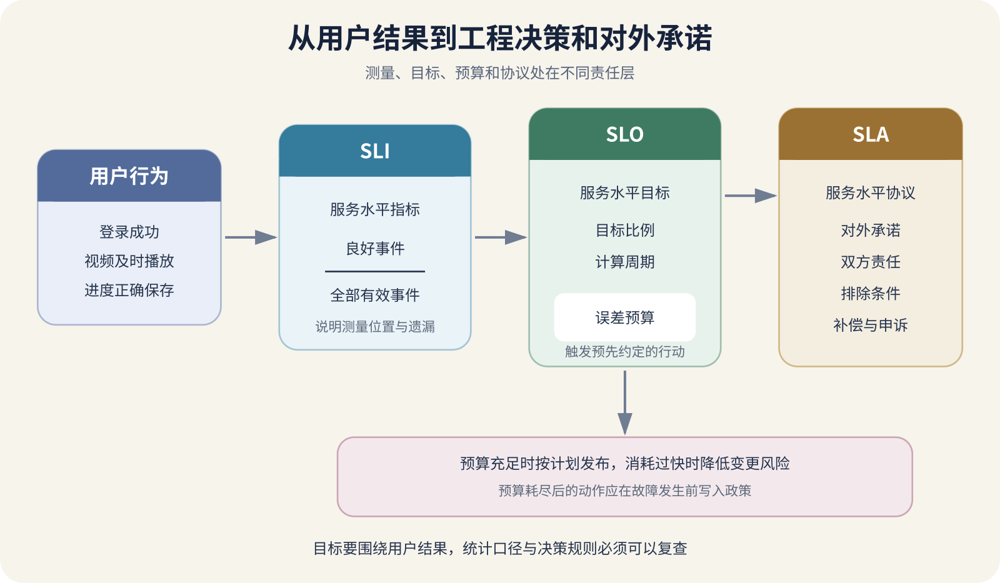

# SLI、SLO、SLA 与 Error Budget

课程网站首页能打开，CPU 只有 20%，视频却一直转圈。系统若只问“服务器在线吗”，答案可能是肯定；学生问“我能按时开始上课吗”，答案却是否定。可靠性必须围绕用户要完成的事情衡量。

SLI 负责测量用户结果，SLO 为一段时间设目标，Error Budget 把允许的坏结果换成决策额度，SLA 则是面向客户的服务约定。四者彼此相关，但不在同一层。



*图 91-1　从用户行为定义 SLI，以 SLO 形成内部目标和误差预算；SLA 位于对外责任一侧。*

## SLI 先定义什么叫“好”

课程播放可以这样定义。

```text
良好事件：用户点击后 2 秒内开始连续播放
有效事件：用户对可观看课程发起的播放操作
SLI = 良好事件数 / 有效事件数
```

它比“播放地址接口返回 200”更接近体验。API 可能成功，CDN 或播放器随后仍失败。测量放在服务端便宜，却看不到 DNS、边缘与客户端故障；放在客户端更接近用户，也要处理隐私、离线日志和版本差异。测量位置必须写进定义。

分母尤其重要。内部探测、明显无效请求、未授权访问、用户主动取消和测试流量是否计入，要在事故前决定。把所有 4xx 都算服务失败，会被攻击流量扭曲；全部排除，又可能隐藏服务错误地拒绝合法用户。分类依据是用户结果和服务责任，不是让百分比好看。

可用性、延迟、正确性、新鲜度和持久性是不同结果。视频最终播放但等了 20 秒，可用性可能为好，2 秒延迟 SLI 应为坏。不要把所有东西压成一个“在线率”。

> **证据边界**
>
> SLI 只按已定义的数据、位置和分母反映体验；数据缺失、分类错误和未覆盖客户端会让指标说谎。一个百分比不能替代样本核对、用户反馈和事故调查。

## SLO 目标必须带窗口

完整 SLO 同时包含指标、比例、时间和范围。

> 在 28 天滚动窗口内，有效视频播放操作中至少 99.5% 应在点击后 2 秒内开始播放。

99.5% 不是越高越专业。更高目标可能需要更多冗余、更慢发布和更强值班，仍可能测错用户结果。目标来自用户容忍度、业务后果、历史数据与团队能力。100% 通常不是默认答案，它会消灭任何试验空间，也无法区分普通波动和紧急工作。

“几个九”还要说明按请求还是按时间。30 天内 99.9% 的时间型目标约允许 43.2 分钟不符合；请求型目标按事件计算，高峰一分钟与深夜一分钟消耗不同。滚动 28 天关注最近状态，日历月便于结算，两者不能在报告时临时挑更好看的。

新项目可先设暂定目标，观察几周再修正。每次修改 SLI/SLO 都记录原因与生效日期，不能为掩盖事故而事后换分母。这样后来的报告才知道自己在比较哪一套规则。

## Error Budget 把差距变成行动

误差预算公式如下。

```text
允许坏事件 = 有效事件 × (1 - SLO)
剩余预算 = 允许坏事件 - 已观察坏事件
```

仍用课程视频举例。28 天内有 200,000 次有效播放，SLO 为 99.5%，允许坏事件如下。

```text
200000 × (1 - 0.995) = 1000
```

若这 200,000 次事件中已有 650 次坏事件，剩余 350 次，使用了 65% 预算。若另一份同样有 200,000 次有效事件的样本中，某次发布贡献了 100 次失败，它就消耗了该窗口预算的 10%，不能用“只影响了 0.05% 请求”忽略。这是固定分母的示例；实际滚动窗口的新事件进入、旧事件退出都会改变允许量和已用量，预算要随窗口重算。

预算要配预先同意的政策。充足时正常发布；消耗加快时缩小变更并加强观察；接近耗尽时暂停非必要高风险发布；耗尽后只做安全修复与恢复工作。具体阈值由项目后果与发布频率决定，事故发生后才临时发明规则，数字很难改变立场。

Burn Rate 观察“烧得多快”。简化理解为当前坏事件比例除以 SLO 允许的坏比例。允许坏比例是 0.5%，若某窗口实际坏比例为 5%，burn rate 为 10；按同样速度会比预算允许快十倍。短窗口发现突发，长窗口过滤小波动。

低流量服务一天十个请求，一个失败就会剧烈改变百分比。可增加最小事件量、延长窗口或结合人工探测，不能因为样本少就假装没有问题。长任务也可用窗口型 SLI，例如“每日备份在规定时间前完成且恢复验证通过的天数比例”。

## SLA 是对外约定

SLA 会写服务水平、统计口径、双方责任、排除条件、申报与补偿。它可能引用类似可用性数字，但具有合同和商业作用；内部 SLO 可以随学习迭代，SLA 变更需要正式责任确认。

供应商 SLA 还可能按产品、地区、套餐和架构不同，并使用服务信用而不是赔偿全部损失。采用时保存当时条款，不能只记宣传页上的“几个九”。供应商违反 SLA 也不会让用户自动恢复，项目仍需降级、恢复和沟通。

内部 SLO 应为对外承诺留余量。产品承诺 99.9%，唯一数据库的供应商 SLA 也写着 99.9%，并不能推出用户路径能达到同样水平。SLA 是约定口径，不是依赖实际故障率；还要核对测量范围、冗余和降级。多个串行依赖会共同影响用户结果，不能挑最高数字作为系统承诺。

## 指标漂亮不等于用户结果好

首页探针全年绿色，却从不执行登录和播放，只能证明探针位置能访问首页。API 200 但返回空课程，备份任务退出码 0 但产物不能恢复，也都是“技术成功、用户失败”。SLI 要尽量测到用户需要的结果，并用合成操作或正确性检查补足状态码。

平均延迟也会隐藏尾部。九十九个请求 100 毫秒、一个请求 20 秒，平均值可能仍好看，而那位用户确实失败。使用“低于用户阈值的事件比例”或合适分位数更接近体验。CPU、内存、队列和连接数仍是重要诊断指标，却不必全部升级成 SLO；SLO 保持少而稳定，内部指标负责解释为何消耗预算。

## 一个小项目怎样开始

1. 选一个最重要用户动作，不先从现有图表挑指标。
2. 写 good/valid、测量位置、阈值、窗口和已知遗漏。
3. 用脱敏样本逐条核对成功、业务失败、超时、主动取消和无效请求是否进入分子分母。
4. 设暂定目标，手算一组事件数和预算，确认查询与公式一致。
5. 写预算充足、快速消耗和耗尽时的行动与负责人。
6. 定期检查哪些事故未进入 SLI、哪些告警没有用户影响。

可以做一个受控实验。正常播放应成为良好事件；把响应延迟到 2 秒外，延迟 SLI 应变坏；在请求到达应用前由测试代理阻断，客户端测量应看见、只看应用日志的指标会漏掉。实验只证明统计实现符合当前定义，不证明目标适合所有用户。

AI 可以生成查询和仪表盘，但必须同时交付分子、分母、阈值、窗口、时区、去重、缺失数据处理，以及几条人工判定样本。只给一条百分比曲线，不能用于发布决策。SLA 和预算政策涉及风险偏好与客户责任，由人最终确认。

指标定义本身也要版本化。更换客户端事件、排除条件或数据源后，新旧曲线可能不可直接比较；记录变更日期、原因和重算范围。若数据管道中断，明确显示未知，不把缺失事件默认算成成功。

## 现在可以跳过什么，继续查哪里

个人低风险项目可以先只记录一个诚实 SLI 和五条样本，不必立刻建立正式 SLA、值班和多窗口告警。出现付费承诺、多人协作、频繁发布或明显用户损失时，再引入完整 SLO、预算政策和 burn-rate 告警。

详细计算卡、证据模板、事故记录与测试策略见[《测试、监控与事故参考》](../../references/testing-monitoring-incidents.md)，目标与预算的设计依据可继续读 [Google SRE 的 SLO 实施章节](https://sre.google/workbook/implementing-slos/)。高级知识要落到用户结果的测量上，并让这些测量改变发布与可靠性决策。
