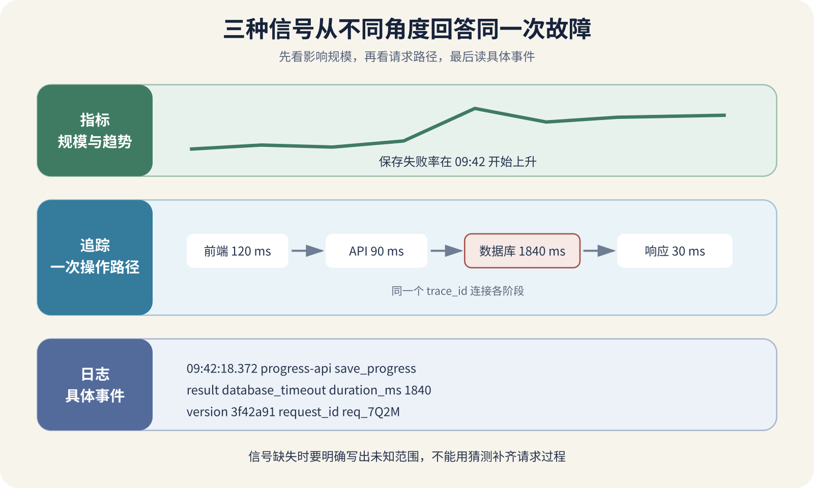

# 日志、指标、追踪与 OpenTelemetry

用户点击“保存学习进度”，页面转了几秒，最后显示失败。前端 Console 里有一条网络错误，API 日志写着请求返回 200，数据库图表没有明显波动。三份证据放在一起，维护者仍不知道进度到底有没有保存。

这种时候继续增加日志数量通常没有帮助。项目需要先确定要回答的问题。多少用户受影响，故障从什么时候开始，哪一类请求变慢，这一次请求经过了哪些组件，数据最终写到哪里。日志、指标和追踪分别擅长回答其中一部分。

可观测性表示维护者能够根据系统产生的外部信号判断内部发生了什么。它不等于购买一个监控平台，也不等于把每行代码都打印出来。信号要围绕用户动作、业务状态和运行边界组织，才能在故障时缩小未知范围。



*日志、指标、追踪怎样共同解释一次用户请求*

图中指标先发现保存失败率上升，追踪把一次请求经过的前端、API、队列和数据库操作串起来，日志提供每个位置的具体事件与错误。三种信号通过稳定的服务名、请求标识、追踪标识和明确时间相关联。

## 日志记录发生过的具体事件

日志是一条带时间和上下文的事件记录。它适合回答哪个服务、哪个版本、哪次请求、执行到哪一步、收到什么错误。OpenTelemetry 的日志说明也强调稳定结构的重要性。JSON 只是编码方式，字段今天叫 `requestId`，明天改成 `req_id`，类型还不一致，仍然很难可靠查询。

一条有用的保存日志可以包含下面这些字段。

```
{
  "time": "2026-08-11T09:42:18.372+08:00",
  "level": "error",
  "service": "progress-api",
  "version": "3f42a91",
  "request_id": "req_7Q2M",
  "trace_id": "4bf92f3577b34da6a3ce929d0e0e4736",
  "operation": "save_progress",
  "course_id": "course_104",
  "result": "database_timeout",
  "duration_ms": 1840
}
```

时间应带明确 UTC 偏移或使用 `Z` 表示 UTC。RFC 3339 提供互联网时间戳格式，能避免 `CST` 这类多义缩写。跨地区排错还可能同时保存 IANA 时区名称，地区规则与数值偏移才不会混在一起。

日志字段要服务于排查，不能把秘密和个人数据全部复制进去。密码、Cookie、Authorization、访问令牌、支付信息和完整请求正文通常不应记录。用户 ID 可以按用途保存内部标识或不可逆摘要，仍要考虑访问权限、保留时间和删除要求。

错误日志需要写结果和阶段。“保存失败”太宽，“等待 PostgreSQL 提交超过 1500 毫秒”更接近可以行动的事实。堆栈信息要保留异常类型与调用位置，但日志不能只剩一大段堆栈。没有服务名、版本、请求标识和业务动作，维护者很难把它放回现场。

日志级别也要稳定。`error` 表示操作未达到预期且需要调查，`warn` 表示已处理的异常条件，`info` 记录重要状态变化，`debug` 用于受控诊断。一次用户参数错误若被记录为服务错误，告警会被正常输入淹没。重试过程中的每次失败可以是警告，最终失败再记为错误，并把尝试次数放在字段中。

## 指标显示规模、趋势和分布

指标是随时间采集的数值。它适合回答每分钟多少请求、错误比例是否上升、队列有多长、内存是否接近上限。指标不保存每次请求的全部细节，因此成本通常比完整日志低，也更适合持续告警。

计数器只增加或在进程重启后归零，例如请求总数、失败总数。查询时通常计算一段时间内的增长率。Gauge 可以升降，例如当前队列长度、活动连接和内存。Histogram 用一组区间记录延迟或大小分布，并保留计数和总和。

指标标签会生成时间序列。`method`、`route`、`status_class` 和 `region` 通常具有有限取值，适合做标签。把用户 ID、完整 URL、请求 ID 或错误全文作为标签，会让序列数量随用户与请求增长，造成内存、存储和查询成本失控。这类高基数信息更适合放在日志或追踪里。

平均值会掩盖少数极慢请求。九十九次请求用一百毫秒，一次请求用二十秒，平均值仍可能显得可以接受。分位数会告诉维护者百分之五十、百分之九十五或百分之九十九的请求落在哪里。Google SRE 的监控章节也建议用分位数观察延迟。

不同实例已经各自计算出的百分之九十五分位数，不能再求平均得到全局百分之九十五。Prometheus 文档明确说明 summary 的预计算分位数通常无法跨实例聚合，直方图可以在桶布局兼容时先合并分布，再计算分位数。这一点会在下一章继续展开。

指标名称要带单位与对象，例如 `http_server_request_duration_seconds`。同一个指标不能有时写毫秒、有时写秒。错误率的分子与分母也要一致，不能用五分钟错误数除以一小时请求数。

## 追踪展示一次操作经过的路径

分布式追踪把一次操作表示成 Trace。每个组件中的一段工作称为 Span，可以记录开始时间、持续时间、父子关系、状态和属性。保存进度的 Trace 可能包含 API 验证、读取课程、更新数据库、发布事件和等待队列确认。

追踪最适合回答时间花在哪里，以及错误从哪一步开始。总请求用两秒，其中数据库 Span 用一点八秒，方向就很清楚。若 API 自己只用二十毫秒，剩余时间发生在客户端到边缘之间，继续优化 SQL 没有帮助。

跨进程关联需要传播上下文。W3C Trace Context 规定 `traceparent` 与 `tracestate` 等 HTTP 头格式，让不同实现能够传递同一 Trace 的上下文。消息队列也要把上下文写入消息属性，消费者才能继续创建关联 Span。

外部传入的追踪头不能当作身份或权限依据。攻击者可以伪造标识，超长 Baggage 还会增加传输和存储。网关应校验格式、限制大小，并在信任边界决定是否保留或重新生成。用户认证仍使用独立安全机制。

追踪通常采样。百分之百保留每次请求会增加处理、网络和存储成本。固定比例采样简单，却可能漏掉稀有错误。尾部采样可以等 Trace 结束后优先保留错误和慢请求，代价是采集组件需要暂存更多数据。项目要记录采样策略，看到“没有 Trace”时才能判断它是未发生、未采样还是采集失败。

## 三种信号怎样一起使用

指标适合先发现问题。保存失败率从千分之一升到百分之五，告警指出影响规模与开始时间。维护者随后从告警时间段选取失败 Trace，查看延迟集中在数据库提交。再用 Trace ID 查询相关日志，看到连接池等待超时和部署版本。

反方向也成立。用户提供一个错误时间和操作 ID，维护者先找到日志，再跳到 Trace，最后查看同一时段的数据库连接指标，确认这是单个异常还是普遍过载。

三种信号之间需要稳定关联字段。

```
service.name
service.version
deployment.environment
trace_id
span_id
request_id
operation
result
```

Trace ID 适合跨服务技术关联，请求 ID 可以作为向用户展示的短标识，业务操作 ID 用于查询报名、订单或上传任务。三者用途不同。把所有东西都叫 `id`，故障现场很容易查错。

时间只能帮助缩小范围，不能证明因果。两个错误在同一秒出现，可能来自同一个请求，也可能只是并发发生。追踪父子关系、业务标识和明确状态变化比“时间差不多”更可靠。

## OpenTelemetry 处在什么位置

OpenTelemetry 是一套生成、传播、处理和导出遥测信号的开放规范与工具生态。它支持 Traces、Metrics、Logs 和 Baggage 等信号。应用可以通过 SDK 主动埋点，也可以使用自动插桩捕获常见 HTTP、数据库和框架操作。

Collector 是可独立部署的采集与处理组件。它接收遥测，进行批处理、过滤、属性修改、采样或路由，再导出到一个或多个后端。应用不必直接绑定某个商业监控平台，更换后端时也可能少改代码。

开放标准不保证完全无迁移成本。不同后端支持的字段、查询、采样和告警能力不同，各语言 SDK 的成熟度也会变化。采用前要核对当前语言、框架和信号状态，不能因为三种信号都叫 OpenTelemetry 就假定功能完全一致。

自动插桩适合先获得 HTTP、数据库与运行时信息。业务动作仍需手工描述。工具知道执行了 `POST /progress`，不知道这是用户保存学习进度，也不知道结果应当处于已保存、待确认还是冲突。自定义 Span 和指标要围绕业务事实，数量保持可维护。

OpenTelemetry 也不负责存储与展示。项目仍需选择后端，设置保留期限、访问权限、费用上限、仪表盘和告警。Collector 停止或出口拥堵时，还要决定遥测可以丢多少，不能让监控流量拖垮业务请求。

## 从最小可用观测开始

个人项目不必一次部署完整监控平台。第一步先统一结构化日志，至少包含时间、级别、服务、版本、环境、操作、结果与请求标识。确保本地、托管平台和容器环境都能找到它。

第二步增加四类基础指标。请求数量、错误数量、延迟分布和当前资源饱和度。后台任务还要记录队列年龄与完成速率，数据库要看连接使用与慢操作。

第三步只为一个重要用户动作接入追踪，例如登录或保存进度。沿途传播上下文，确认 API、数据库和队列 Span 能组成同一 Trace。成功以后再覆盖其他路径。

第四步建立一张从用户症状出发的仪表盘。先显示成功率和延迟，再显示请求量、饱和度与依赖状态。把 CPU 图放在最上面，用户全部失败时 CPU 仍可能很低。

第五步写一条能行动的告警。它应说明哪个用户结果恶化、持续多久、当前值、相关仪表盘和第一步检查位置。每个异常都发通知，会让维护者很快忽略所有通知。

## 用正常样本和受控故障验证观测

先执行一次成功保存，记录页面操作 ID。应能在日志中找到最终结果，在 Trace 中看到完整路径，在指标中增加一次良好事件。这个样本证明三种信号能够围绕同一操作关联。

随后让数据库响应超过超时。日志应记录等待阶段和最终结果，Trace 应把慢 Span 标在数据库位置，失败与延迟指标应增加。若只看到 API 报错，没有下游 Span，说明传播或插桩存在缺口。

再让日志出口暂时不可用。业务请求不应因为同步等待日志上传而长时间阻塞。Collector 或日志代理应按容量缓存或丢弃，并暴露自身的丢弃数量。这个测试证明观测系统故障不会直接拖垮核心业务。

把采样率降低后重复一次普通请求，再制造一个明确错误。普通 Trace 可能被采样掉，错误 Trace 应按策略保留。结果只能证明当前采样规则在该测试中工作，不能证明所有稀有故障都能被看到。

最后检查数据保护。用测试令牌和模拟个人字段发送请求，确认日志、Span 属性和导出数据没有保存原值。平台访问权限也要用低权限账号验证，不能只看管理员能够打开页面。

## 让 AI 提交观测问题而非堆积字段

让 AI 增加监控前，先要求它列出需要回答的五个故障问题，以及每个问题依赖哪种信号。字段、指标和 Span 都应追溯到这些问题。无法说明用途的高基数标签和重复日志应删掉。

AI 生成日志代码后，要检查秘密、个人数据、级别、时间格式和异常路径。生成指标后，要估算标签组合数量，并说明重启、缺失数据与单位。生成追踪后，要检查上下文是否跨 HTTP、消息与后台任务传播。

仪表盘截图不能作为唯一验收证据。维护者需要保存测试操作、查询条件、原始样本和预期变化。图表显示一条线，只能证明后端画出了数据，不能证明统计口径对应用户体验。

最终目标很朴素。用户说某个动作失败时，维护者能确认影响范围，找到同一次操作经过的位置，看见关键状态变化，并知道哪些地方仍然没有证据。可观测性不会自动给答案，它让问题变得可以继续追查。
