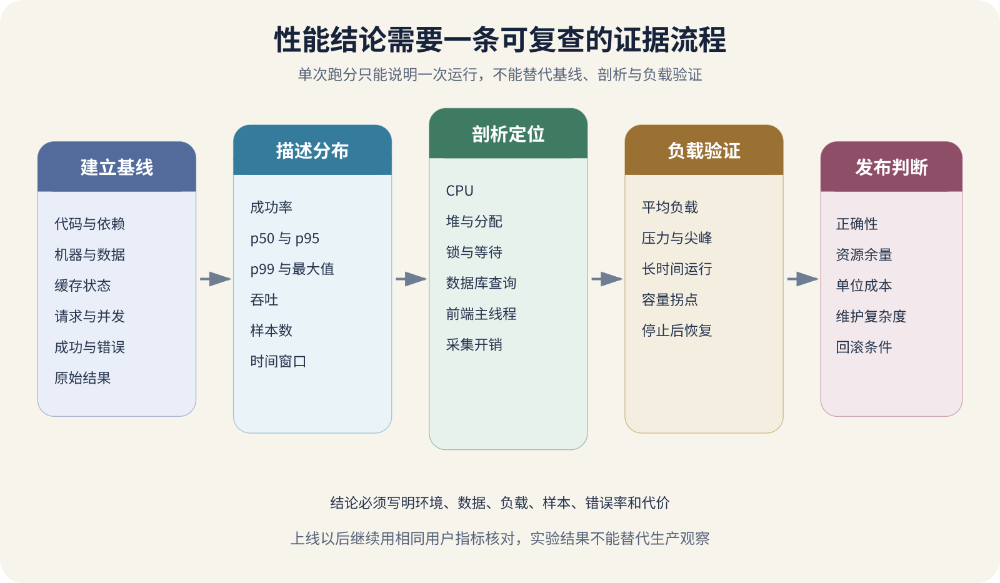

# 性能基线、分位数、剖析、压测与成本

设想一次缺少完整验证的优化。AI 把课程搜索接口的一次本地测量从八百毫秒降到二百毫秒，维护者就准备上线。发布以后，大多数请求确实很快，少量包含中文组合词的查询却要十几秒；并发达到五十时，数据库连接池耗尽，云账单还因为新增缓存与搜索服务明显上涨。这些数字用于说明比较条件，未对应某次真实压测。

“变快了”缺少比较条件。哪台机器、哪份数据、哪种请求、多少并发、预热多久、测了多少次、错误有没有增加。性能结论必须带着这些条件，才能用于发布判断。

性能工作可以分成五步。先建立可重复基线，再用分布描述体验，通过剖析找到资源花在哪里，用受控负载验证容量与恢复，最后把速度、费用、复杂度和正确性一起计算。



*从性能基线到成本判断的证据流程*

## 基线让前后结果能够比较

基线是变更以前在已记录条件下测得的结果。它不代表系统永远应有的速度，只提供当前比较点。没有基线，优化后看到二百毫秒，不知道原来是一百还是八百。

一次可复查的基线至少记录下面这些条件。

```
代码版本与依赖锁文件
操作系统、CPU、内存和磁盘
数据库版本、数据量和索引
服务副本、连接池和缓存状态
请求样本与并发模型
测试持续时间和预热时间
网络位置与带宽限制
成功条件、错误率和超时
```

开发电脑与生产服务器的 CPU、磁盘、网络和后台程序不同，本地结果不能直接承诺生产表现。它仍适合做相对比较，只要前后使用同一环境并控制噪声。数据规模也会改变算法与数据库计划。一百条课程记录使用全表扫描很快，一千万条记录可能完全不同。

每项测试要重复足够次数，保存原始结果和环境。一次最快值常来自偶然调度，不能代表用户。比较前后版本时交替运行或保持时间接近，可以减少机器温度、邻居负载和网络时段的影响。

## 微基准和用户动作回答不同问题

微基准只测一个小函数或操作，例如解析 JSON、排序或生成缩略图。它运行快，容易重复，适合比较算法和检查性能回归。编译器优化、测试数据过小和未使用返回值，都可能让微基准测到与真实程序不同的工作。

组件基准把范围扩大到数据库查询、缓存读写或一个 API 处理器。端到端性能测试从用户入口完成登录、搜索、保存或上传，最接近体验，也更容易受到网络、外部服务和测试数据影响。微基准快十倍，不保证页面快十倍；页面变慢，也不一定是刚修改的函数。

建立回归门槛时，可以给稳定微基准设置较窄范围，端到端测试使用更宽容的阈值与趋势。共享 CI 机器波动很大，微小差异不应立即阻断发布。前后平均值只差百分之二，运行间波动却达到百分之十，当前实验无法支持提升百分之二的结论。

## 平均值不能描述尾部体验

中位数也叫第五十分位数。它表示一半观测值不大于这个数。第九十五分位数表示百分之九十五的观测值不大于该值，剩余百分之五更慢。第九十九分位数关注更少但更极端的尾部。

假设一百次请求中九十五次在二百毫秒内完成，四次用两秒，一次用二十秒。平均值会受到极慢请求影响，中位数又会完全看不见尾部。报告可以同时给出成功率、p50、p95、p99 和最大值，并说明样本数与窗口。

分位数也不能脱离数量。每天只有一百次请求，p99 大致落在最慢的一个样本上，变化很跳跃。每秒十万次请求时，百分之一仍代表很多用户。多个实例的分位数也不能直接平均。Prometheus 文档说明直方图可以在兼容桶上合并再计算分位数，而 summary 的预计算分位数通常不能聚合。

## 剖析回答资源花在哪里

指标告诉你 CPU 很高，剖析器可以显示哪些函数占用 CPU。堆剖析帮助找内存分配与保留，阻塞剖析关注锁和等待，运行时追踪展示调度与并发活动。Go 官方诊断文档也把这些资料分开，并提醒某些工具会干扰被测程序。

CPU 火焰图里宽度表示样本中出现的时间比例，不等于该函数每次调用都很慢。Wall-clock 时间还包括网络、磁盘、锁和睡眠。请求耗时十秒，CPU 剖析只有几十毫秒，问题可能在数据库等待或远程 API。追踪、慢查询与等待剖析需要一起看。

内存问题也要区分。分配量大不等于持续泄漏，垃圾回收后能释放的临时对象与一直被引用的对象影响不同。浏览器前端可以用 Chrome Performance 面板记录主线程、网络、渲染和内存，但本地高性能 Mac 的录制仍不能代表低端手机和慢网络。

剖析本身会增加开销。详细追踪、精确内存分析和大量调用栈可能改变时序。报告应写明工具、采样时长、开关和被测流量。高风险生产环境先用低开销采样，并限制剖析端点访问。

## 压测要模拟真实工作

压测工具每秒发一千次首页 GET 很容易，不能证明登录、搜索、保存和上传在真实组合下工作。负载模型要来自用户动作比例、到达速度、停顿时间、数据分布和会话状态。

冒烟测试用极少流量验证脚本与环境，平均负载测试建立日常基线，压力测试逼近目标上限，尖峰测试观察突然流量，浸泡测试寻找内存增长、连接泄漏与队列积压。并发用户数与每秒请求数不同。五十个用户每次等待五秒，产生的请求速率可能很低。

测试要设置通过阈值，例如失败率低于目标、p95 延迟低于一秒、队列最老任务不超过两分钟。只报告最高每秒请求数，会鼓励系统在大量失败时继续计数。

压测机也可能先达到上限。它的 CPU、网络、端口和连接不足，结果会被误认为服务瓶颈。要同时监控发生器和被测系统。禁止对没有授权的第三方和生产服务随意压测。生产验证也应有明确窗口、限额、回退条件和负责人。

## 找到容量拐点和恢复行为

逐步增加流量时，系统通常会经历线性区、接近饱和区和过载区。在线性区，吞吐随负载增加，延迟变化较小。接近饱和后，队列和等待迅速增长。过载时错误、超时和重试一起上升。

容量上限不应定义成机器崩溃前最后一个成功数字。安全容量需要留出流量波动、后台任务、单机故障和发布重启余量。压测停止后还要观察连接池、队列、重试、内存和错误率怎样恢复。数据库、队列和第三方 API 常先成为限制，每次扩容都要重新核对共享依赖与费用。

## 性能改善要和正确性一起验收

删除权限检查能让接口变快，结果显然不能接受。减少数据库事务范围可能提高吞吐，也可能产生中间状态。缓存能降低延迟，但会带来过期和失效问题。性能测试必须在相同正确性条件下比较。

压测脚本要验证响应内容和业务状态，不能只检查 HTTP 200。创建订单后应查询订单与库存，上传后应校验文件，重试后应确认没有重复记录。结果检查过重时可以抽样，但抽样比例要记录。

优化还可能把成本转移。把图片全部预生成，读取变快，存储和构建时间增加。增加数据库索引，查询变快，写入与磁盘成本增加。使用全球 CDN 改善远端延迟，流量费用与缓存一致性会变化。

云账单总额受用户增长影响，单看总额无法判断效率。可以计算每千次成功请求、每千张处理图片、每活跃用户或每小时视频的成本。分母必须使用成功业务结果，失败重试消耗的资源不能当成产出。

```
单位成功搜索成本

搜索相关计算、数据库、缓存和网络费用
÷
成功返回有效结果的搜索次数
```

成本还包括维护时间和复杂度。每月省十元服务器费用，却增加一种数据库、一个值班告警和四小时维护，未必划算。价格、免费额度和计费维度会变化，采用服务时必须按检索日查看官方价格，并用真实账单复核。压测本身也可能产生显著费用，开始前设置预算和停止条件。

## 一次完整改动怎样验证

课程搜索变慢时，先保存基线。使用固定数据快照和二十种查询，分别测冷缓存与热缓存，在一、十、五十并发下记录成功率、p50、p95、p99、吞吐、CPU、内存、数据库时间与费用估算。

随后用追踪和剖析定位。若大部分时间在数据库缺少索引，先构建候选索引；若时间在应用分词，采集 CPU 剖析。每次只改一个主要因素，保留提交与配置。改动后重复同一基线，再进行尖峰和浸泡测试，检查正确性、索引大小、写入变慢、缓存失效和恢复时间。

```
在测试数据 500 万条、20 种固定查询、
10 个并发用户和热缓存条件下，
p95 从 820 毫秒降到 310 毫秒，
错误率无变化，数据库存储增加 1.8 GB。
```

上面是一份假设的结论写法，数值不代表实测成绩。真实报告还应附原始结果、重复运行与正确性检查；这些证据满足预先约定的门槛后，才可支持受控发布。上线后还要用同一 SLI 对比真实用户数据，并准备回滚。

## 让 AI 交付可复现实验

让 AI 优化性能前，要求它提交假设、基线、工作负载和通过条件。它说数据库慢，要指出具体查询、等待或剖析证据。它说缓存会快，要说明命中率、失效、内存与一致性。

AI 生成压测脚本后，要检查是否模拟登录、数据变化和用户停顿，是否验证业务结果，是否会误伤生产。再让它估算压测机上限，并输出原始结果文件，不能只交一张漂亮图。

AI 给出十倍提升时，维护者应核对前后条件、失败请求、预热、样本量和测量开销。若它同时改变算法、缓存、数据和并发，结果无法归因，应拆成小实验。性能工作最后要回答用户得到了什么，系统牺牲了什么，结论在哪些条件下成立。
