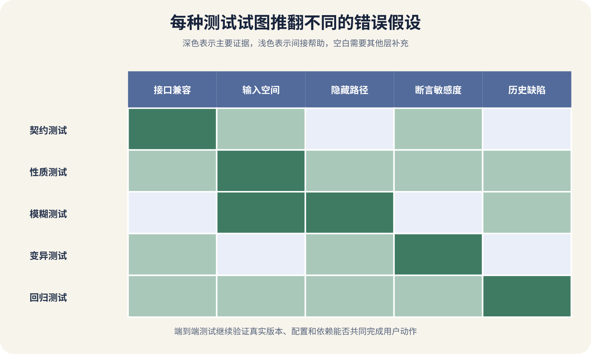

# 契约、性质、模糊、变异与回归测试

AI 为课程 App 改了保存进度接口，普通单元测试全部通过。上线以后，旧版手机因为响应里少了一个字段而崩溃；一段异常长的课程标题让解析器耗尽内存；把进度从零改成负数时，后端仍然保存；修复之后，同样问题几个月后又出现了一次。

这些错误分别对应不同的测试依据。契约测试检查组件之间说好的消息，性质测试检查一大类输入都应满足的规律，模糊测试持续寻找能让程序崩溃或越界的输入，变异测试故意改坏代码来检查现有测试是否真能发现，回归测试把已经发生的错误保存成以后必须通过的样本。

没有一种测试能够覆盖全部风险。测试体系的价值来自不同依据互相补充，并写清每个通过结果的范围。



*契约、性质、模糊、变异与回归测试覆盖的不同问题*

图中横向展示接口变化、输入空间、隐藏路径、断言强度和历史缺陷五类问题。每种测试有主要覆盖区，也有明显空白。端到端测试仍用于确认真实组件能共同完成用户动作。

## 普通示例测试容易遗漏什么

常见测试给函数一个输入，再断言一个输出。

```
def test_save_progress():
    result = save_progress(user_id="u1", course_id="c1", seconds=60)
    assert result.seconds == 60
```

它能证明当前环境中这一组输入得到预期结果。它没有证明负数、极大值、重复请求、并发更新、数据库超时和旧版客户端。增加十个示例会扩大范围，仍然依赖作者提前想到输入。

测试覆盖率只说明哪些代码被执行，不能说明结果检查得是否充分。一条测试调用保存函数却没有断言数据库状态，也能覆盖很多行。好的测试把断言放在用户可见行为、稳定接口和重要状态上。

判断测试质量时，可以暂时遮住测试名称，只看它准备了什么条件，执行了什么动作，观察了什么。如果观察点只是“没有抛异常”，很多错误会被当成成功。

异步操作还要等待业务完成条件。测试调用上传接口后固定睡眠两秒，机器快时通过，机器慢时失败。更稳的做法是轮询任务状态并设置总期限，或等待受控事件。

## 契约测试保护共同约定

契约是消费者与提供者对请求、响应或消息达成的可执行约定。消费者可以是 Flutter App，提供者是课程 API。契约会描述方法、路径、必要字段、类型、状态码和示例交互。

Pact 的消费者驱动契约让消费者测试生成自己实际依赖的交互，再由提供者验证真实实现能否满足。它适合发现字段删除、类型变化、状态码变化和消息结构不兼容。

旧版 App 依赖 `progress_seconds` 为整数，新后端把它改名为 `position`。后端自己的测试可以全部通过，旧版消费者契约会失败。提供者若同时返回旧字段和新字段，契约可以在兼容窗口内通过，等旧版使用率降到允许范围再删除。

契约测试不证明完整业务成功。Mock 数据库返回课程存在，真实数据库迁移可能缺列；提供者在本地满足响应结构，生产权限配置可能错误。契约覆盖的是交互边界，需要和提供者测试、迁移测试与少量端到端测试组合。

Schema 验证与消费者契约也有区别。OpenAPI 或 GraphQL Schema 描述允许的结构，消费者契约描述某个消费者实际使用的交互。Schema 允许字段缺省，旧客户端可能仍然假定它一定存在。

消息队列契约还要包含事件版本、幂等键、时间语义和重复处理。代理确认消息已经接收，不能证明消费者理解字段和完成业务。

## 性质测试检查不变量

性质测试也叫 Property-based Testing。维护者描述输入范围和必须始终成立的性质，工具生成许多数据，包括容易遗漏的边界，再尝试把失败样本缩小。Hypothesis 是 Python 中的常见实现。

排序函数不必为每个列表手写预期结果，可以检查三个性质。结果长度不变，元素集合与数量不变，相邻元素保持顺序。编码器可以检查编码后再解码得到原值。金额分配可以检查各部分之和等于总额且没有负数。

课程进度适合检查下面这些性质。

```
保存后的进度不小于零
进度不超过课程总时长
同一幂等键重复提交不产生两条记录
读取结果等于最后一次成功提交
序列化后再解析保持业务字段
```

性质写错，工具会认真验证错误规则。进度永远不下降听起来合理，用户主动重置课程时却不成立。需要把状态、权限和允许例外写入前置条件。

随机生成不等于每个可能输入都测过。通过一万组数据，只能证明这次生成的样本没有推翻性质。失败时保存最小样本、随机种子、工具版本和环境，随后把它加入固定回归测试。

状态机性质测试会生成创建课程、报名、保存、重置、删除等一系列动作，再检查任何阶段都满足不变量。它比单次函数输入更适合发现顺序相关错误。个人项目先从纯函数、解析器和幂等操作开始。

## 模糊测试探索异常输入

模糊测试也叫 Fuzz Testing。工具不断改变输入，观察崩溃、越界、超时、内存错误或未处理异常。覆盖引导工具还会优先保留能到达新代码路径的输入。LLVM 的 libFuzzer 就是进程内覆盖引导模糊引擎。

文件解析、图片元数据、压缩包、URL、JSON、协议帧和模板渲染都适合模糊测试。它们接收复杂外部输入，手工样本很难覆盖长度、编码、嵌套和损坏组合。

一个好的 Fuzz Target 范围要窄，运行要快，给同一输入尽量得到相同结果，并能接受空、长、畸形数据。模糊测试发现程序没有崩溃，不证明结果正确。关键格式还要有语义不变量。

失败样本可能包含用户数据或恶意内容，保存和上传 CI 工件时要限制访问。修复后将最小样本加入回归集合。

## 变异测试检查断言敏感度

变异测试工具会对代码做许多小改动，例如把 `>=` 改成 `>`，删除一次函数调用，反转条件或改变返回值，然后运行现有测试。测试失败表示该变异体被杀死，测试仍通过表示它存活。

PIT 的基本概念文档展示了条件边界等变异，并说明存活、无覆盖、超时和等价变异等结果。如果把“进度不得超过总时长”中的 `>` 改成 `>=`，测试仍通过，说明边界值可能没有被断言。

存活变异体不一定代表真实缺陷。有些改动与原代码行为等价，或只影响不要求测试的调试日志。维护者要检查高风险业务代码中的存活项。

变异测试运行成本高，适合核心规则、权限、金额、状态机和公共库。先确保普通测试稳定，再对变更模块或夜间任务运行。某行被覆盖，删除关键调用后测试仍通过，说明断言没有观察结果。

## 回归测试保存已知失败

线上发现标题为某个 Unicode 组合时保存失败，先保存脱敏后的最小输入、环境、错误和预期行为。修复之前写一个会失败的测试，修复后让它通过。以后每次修改都执行，这就是回归测试。

回归测试必须先复现。测试在旧版本上也通过，说明它没有抓住原问题。一个故障常需要多层回归，层数来自故障传播位置。失败样本要稳定，真实时间、随机数、第三方接口和共享测试账号都可能造成偶发失败。

回归集合也需要清理。重复测试拖慢 CI，过时接口让重构困难。删除前要确认它保护的风险已经由更稳定测试覆盖，并在变更记录中说明，不要因为测试慢就直接跳过。

## 五种测试组合到一次接口修改

假设 AI 要把进度值从整数秒扩展成带小数的毫秒。先由契约测试确认旧客户端仍收到整数秒，新客户端可以读取新增毫秒字段。提供者验证两套契约。

性质测试生成零、负数、极大值、小数与课程边界，检查保存值规范化、序列化往返和幂等。模糊测试针对 JSON 解析、数字格式和深层嵌套，寻找崩溃与资源耗尽。变异测试修改比较符、舍入与权限分支，检查现有断言能否发现。历史上出现过的负数、溢出和重复提交作为固定回归样本。

随后在真实数据库与一版旧 App、一版新 App 上完成少量端到端测试。它证明指定版本组合在该环境中共同工作，仍不能证明所有网络、设备和并发条件。

## 把测试放进合适节奏

每次保存代码都运行的测试应当快速、确定并能定位。核心单元测试、少量性质样本和当前模块契约通常适合这一层。测试几分钟才能启动外部环境，开发者会减少运行次数，反馈来得太晚。

每个拉取请求可以增加提供者契约、数据库集成、迁移和关键回归。模糊、变异、长状态机和大规模组合可以放到夜间或定期任务。夜间失败不能长期无人处理。

发布前保留少量真实环境冒烟。它检查部署产物、环境变量、网络、迁移和外部依赖。发布后再做只读或可回滚的合成操作，确认真实入口工作。

测试目录可以按风险与速度分组，不必按工具品牌分组。

```
tests/unit
tests/contracts
tests/integration
tests/regression
tests/properties
tests/fuzz
tests/release-smoke
```

每组提供运行命令、环境要求、预计时间和数据清理方式。新维护者与 AI 才能知道修改后应该运行哪一组。

## 常见误用会制造虚假信心

把 Mock 当成真实提供者，是第一种误用。消费者测试里 Mock 按预期返回，不能证明生产 API 也这样返回。契约必须由提供者实现验证。

让性质等于实现，是第二种误用。测试用与生产代码相同的公式计算预期值，两边会一起犯错。性质应来自业务规则、独立模型或可人工验证的小范围结果。

只追求模糊执行次数，也会误导维护者。目标函数没有进入复杂解析路径，跑十亿次也可能没有价值。变异分数也不能当绩效，先看权限、金额、边界和状态转换中的存活变异，再决定是否补测试或标记等价。

修复回归测试后，还要验证旧版本失败。测试写错或测试数据没有触发原条件，它会从第一天起一直绿色。保存旧提交或临时撤回修复进行反证。

## 让 AI 说明测试依据和未知范围

要求 AI 为每个测试写一句它试图推翻什么。契约测试试图推翻兼容性，性质测试试图推翻不变量，模糊测试试图找到异常输入路径，变异测试试图证明断言不敏感，回归测试试图让已知错误再次出现。

AI 生成大量测试后，抽查断言。只断言状态码、只比较快照、过度 Mock 和吞掉异常，是常见弱点。再故意改坏一处业务条件，看测试是否失败。

测试通过报告要包含代码提交、测试命令、环境、样本或种子、耗时和跳过项。CI 显示绿色时，还要确认任务确实运行，没有被条件表达式跳过，也没有把失败配置成允许继续。
