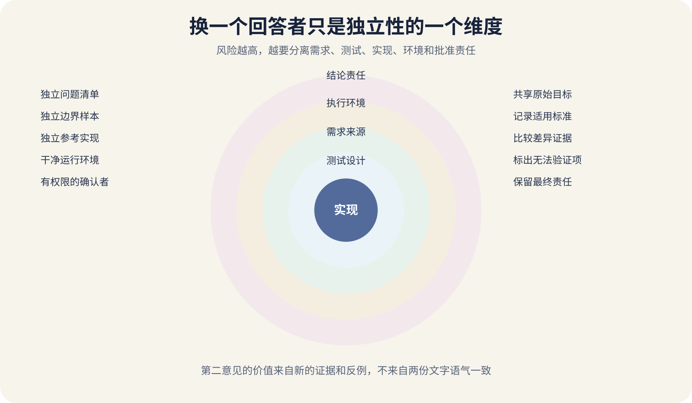

# 独立测试依据与可信的第二意见

第一位 AI 设计接口、编写实现、生成测试，再总结“全部通过”。第二位 AI 收到第一位的说明和代码后，很快回复“方案合理，没有明显问题”。这份第二意见看起来增加了把握，两个回答却可能共享同一个错误前提。

测试需要一个判断结果对错的依据，测试理论中常称 Oracle，可以译为判定依据。需求、标准、旧版本行为、参考实现、人工计算、真实用户结果和安全规则都可能成为依据。若依据本身来自被测实现，测试会把实现的错误复制成预期。

独立性也有不同程度。换一个模型名称，仍使用原作者的需求摘要、测试数据和结论，只获得了回答者独立。更有价值的复核会分离问题定义、测试设计、执行环境和责任。



*第二意见可以在哪些维度保持独立*

图中把独立性分成需求来源、测试设计、实现作者、执行环境和结论责任五个维度。个人项目不必全部分离，风险越高，越应增加独立维度。

## 测试先要知道什么算正确

一个税费函数返回 12.37，测试若直接复制同一段公式计算预期值，两边会一起犯错。更可靠的依据可以是法规给出的计算规则、人工核对的小样本、经过验证的实现，或金额守恒等不变量。

HTTP 客户端兼容性可以依据 RFC、公开 API Schema 和提供者契约。数据库迁移可以依据迁移前后应保持的行数、约束与业务状态。上传功能可以依据文件哈希、内容类型规则和对象存储实际结果。

不同依据也可能冲突。需求文档说进度允许回退，旧版代码禁止回退，用户界面提供“重新学习”按钮。测试不能静默挑一个。应记录冲突，找负责产品判断的人确认。标准只能解决它覆盖的部分，生产行为也不天然正确。线上系统已经重复扣费，录制它的输出作为 Golden File，只会把缺陷固定下来。

## 独立验证和普通复读的区别

NIST 对独立验证与确认的定义强调由客观第三方评审、分析和测试，同时检查需求是否正确定义，以及系统是否正确实现功能与安全要求。个人项目可以借用其中的结构。

第一项独立是需求来源。复核者先看原始用户目标、公开规范和验收条件，不先读实现者的结论。第二项独立是测试设计。复核者自己列风险、边界和反例，再与已有测试比较。把作者生成的测试套件交给另一位 AI 运行，只能独立执行。

第三项独立是实现。使用参考实现、旧稳定版本或简化模型对同一输入计算结果，比较差异。两个实现若复制同一算法，独立程度有限。第四项独立是环境。作者只在 Windows 开发机测试，复核在干净 Linux 容器、真实 PostgreSQL 和受限权限账号运行。

第五项独立是责任。发布高风险付款或数据删除功能时，确认者不能只依赖“AI 说可以”。具有权限和业务责任的人要查看证据、剩余风险与回滚条件。

## 按风险决定独立到什么程度

改 README 标点和调整按钮间距，作者自检加普通预览通常足够。修改登录权限、批量删除、付款回调、数据库迁移和 App 签名，错误后果更大，应该增加独立测试设计、干净环境与人工确认。

风险可以从五个方面判断。影响多少用户，数据能否恢复，是否涉及金钱与法律责任，错误多久才能发现，回滚是否需要外部平台配合。任何一项很高，都不应只依赖作者自测。

个人项目也可以做轻量分级。

```
低风险
作者测试加 Diff 审查

中风险
独立问题清单加干净环境运行

高风险
独立测试设计、备份恢复演练、人工批准

不可逆或受监管操作
专业要求、双人确认和正式留痕
```

分级不是给流程贴标签。高风险项缺少真实账号或设备时，结论应停在未验证。复核成本也要放在计划里。把高风险边界写入仓库，普通变更自动运行测试，触发敏感目录、迁移、权限或发布配置时增加审批。

## 两个 AI 为什么容易给出相同错误

两次请求共享同一段需求摘要，摘要里漏掉“旧版 App 仍在使用”，两个模型都不会自动知道。第一位 AI 的解释还会给第二位设定观察方向。

生成测试与实现时，模型还会复制字段名、状态码和边界。实现把上限写成 100，测试也断言 100，实际需求是 99。测试绿色只是说明两份生成物互相一致。更好的任务写法是提供原始目标、仓库和变更范围，要求它寻找能推翻方案的输入、版本冲突、权限绕过、恢复失败和未测试假设。

模型独立也不能替代资料独立。两个模型都依靠同一篇过时博客，输出仍然高度相关。时间敏感的平台政策、价格、界面和版本必须回到当前官方来源核对。

## 建立独立的测试依据表

每项高风险行为可以记录下面这些字段。

```
行为
原始需求来源
适用标准或官方文档
良好样本
边界与失败样本
判定规则
执行环境
被测提交
测试设计者
执行者
仍然共享的假设
结果与证据位置
```

报名接口的原始需求来自产品说明，HTTP 语义来自 RFC，权限来自角色表，重复请求依据幂等规则，数据库结果依据唯一约束。每项依据可以由不同测试验证，发生冲突时也能知道应该回到哪里修改。测试依据要版本化。官方 API 版本、数据库版本、商店政策和业务规则变化后，旧测试可能继续通过却已经不适用。只有脚本输出 `PASS`，没有输入、预期和比较过程，复核者无法判断脚本本身。

## 差分测试让实现互相暴露差异

差分测试把同一批输入交给两个实现，比较输出。新版解析器可以与旧稳定版比较，自己写的 JSON 规范化器可以与成熟库比较，两个数据库查询可以比较结果集合。

差异本身不等于新版错误。旧版可能有缺陷，两个实现也可能对未定义输入采取不同合法行为。出现差异后，要回到规范与业务规则裁决。

简化参考模型常比第二套完整系统更实用。金额分配的生产算法为性能做了优化，测试模型可以用慢但直观的枚举。外部系统没有参考实现时，可以使用蜕变关系。图片缩小两次不应变大，排序后再次排序应保持结果。

## 测试代码也需要审查

Google 的代码审查指南明确提醒测试不会测试自己，需要人检查测试是否有效、是否会在代码损坏时失败。复核测试时先找断言，再找它能否观察业务结果。

过度 Mock 会让测试只证明替身按脚本工作。权限测试如果 Mock 掉授权中间件，就不能证明真实角色。集成边界应保留少量真实组件，替身只隔离不可控或昂贵依赖。

测试也会出现条件反转、固定时间、共享状态和错误清理。审查者可以做三次反证。删除核心业务调用，测试应失败；交换两个重要返回值，测试应失败；让外部依赖返回错误，测试应进入预期失败路径。

## 安全验证需要更强依据

安全测试不能让“没有发现漏洞”变成“没有漏洞”。扫描器覆盖已知规则，渗透测试覆盖约定范围和时间，代码审查依赖审查者能力。报告要列出测试范围、身份、环境、工具、版本和未覆盖项。NIST SSDF 把安全开发验证放在需求、代码审查、分析、测试与人工核验的组合中。高风险认证、授权、密钥和数据删除应使用官方安全要求与项目威胁模型。向外部 AI 或服务提交代码和日志前，还要检查保密范围。

## 一次可执行的双重验证流程

先冻结候选提交和构建产物，记录哈希、依赖与环境。第一位实现者提交需求映射、设计、测试和已知限制。第二位复核者先只看原始需求、Diff 和公开标准，独立列出风险与测试，再查看第一份材料，比较遗漏。

两边使用各自准备的关键样本，在一个干净环境运行。高风险数据库操作还要检查迁移前后、并发、失败恢复和备份。前端或 App 要在至少一个目标设备验证核心动作。结论分为通过、带条件通过、失败和无法验证。无法取得真实商店账号、生产权限或目标硬件时，应写“未验证”，不能由模型推断补上。分歧用证据裁决，仍无法裁决的部分进入 ADR 或风险登记。

## 用破坏性迁移检验独立性

假设 AI 要把 `users.name` 拆成 `first_name` 与 `last_name`，并在迁移末尾删除旧列。实现者测试了十条英文姓名，迁移成功，应用启动正常。

独立复核先从原始数据与用户规则出发。单名、中文姓名、空值、前后空格、组织名称和已经人工修正的记录如何处理。复核者不使用实现者的拆分函数准备预期值，而是抽取脱敏样本并让业务负责人确认。

随后在数据库副本运行迁移，比较迁移前后行数、空值、唯一约束、外键和应用读取。再运行旧版应用与新版应用，检查滚动发布期间是否兼容。失败演练在写入一半时中止迁移，确认事务或恢复脚本能回到一致状态。备份还要实际恢复到另一数据库。

若部分姓名无法可靠拆分，第二意见应明确指出需求本身缺少规则。安全方案可能是先新增字段、保留旧列、记录待人工确认项，经过一个兼容周期后再决定删除。独立复核在这里改变了问题定义。

这个例子也说明，测试通过范围要逐项写出。十条样本成功只证明十条样本，副本迁移成功只证明该快照和版本，恢复演练成功只证明这套备份在本次环境可恢复。

## 让 AI 声明自己与第一份工作的关系

调用第二个 AI 时，要求它列出已经看到的材料、没有看到的材料、与第一位共享的来源和执行能力。无法运行代码时，它只能做静态审查。

要求它输出反例和证据，不要求给一个笼统分数。每项意见包含对应文件、需求、标准或实验，并标记推测。意见没有可复查依据，就只是新的候选想法。还可以让两个 AI 先独立生成测试清单，随后再合并。两份结论相同，也要问它们是否共享同一盲点；两份结论不同，就把差异转成可执行实验。
