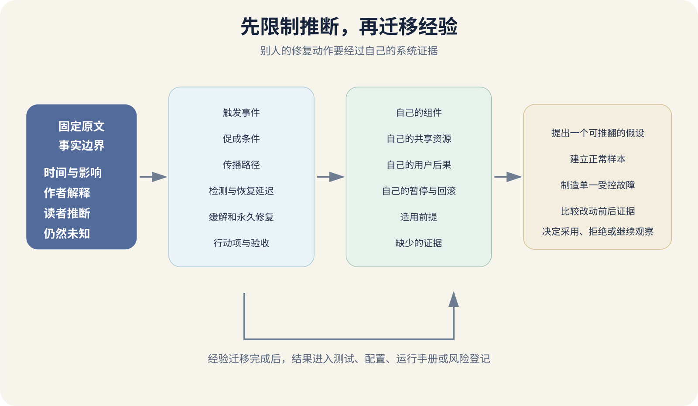

# 怎样阅读事故复盘并提取可迁移经验

一篇事故报告写着“连接池耗尽导致服务不可用”。读者很容易记住解决办法，调大连接池。原报告里的连接耗尽也许来自重试风暴、后台任务、错误路由或下游变慢。只复制最后一个修复动作，自己的系统可能更晚报警，耗尽时影响还更大。

事故复盘是一份关于特定系统、特定时间和已知证据的记录。它能帮助读者认识故障传播方式，不能直接提供通用处方。阅读时要把发生了什么、为什么扩大、怎样恢复、作者准备做什么分开。



*从事故报告中提取可迁移经验的阅读流程*

图中先固定时间、影响与证据，再区分触发事件、促成条件、防线缺口和恢复动作。最后把经验改写成自己系统中的可验证问题，经过本地证据后才形成改动。

## 先确认报告属于什么类型

状态页更新通常面向用户，说明影响与恢复进度，技术细节有限。公司发布的可用性报告会增加时间线、组件和改进。内部复盘可能包含命令、指标、错误判断和未公开架构。Issue 与聊天记录更接近现场，也可能混杂未经确认的猜测。

阅读公开报告时，不要把没有写出的细节补成事实。公司可能出于安全、隐私和篇幅省略信息。报告写“我们发现连接增加”，不能推断某个员工误操作，也不能断言未提到的组件没有问题。

发布日期与事故发生时间要分开。月度可用性报告可能在事故几周后发布。引用时记录事件起止、报告日期和检索日期。报告还可能持续更新，初次状态页写“正在调查”，最终复盘会修正原因。

## 用四栏笔记限制推断

第一栏写已确认事实，只记录报告直接给出的时间、用户影响、错误率、组件状态、部署和恢复动作。第二栏写作者解释，留意报告使用了“导致”“促成”还是“可能”。第三栏写读者推断，例如“这个系统可能缺少连接上限”。第四栏写未知，例如受影响用户数是否完整，监控为什么没报警，数据有没有损坏。承认未知能防止文章把故事讲得比材料完整。下面是虚构的笔记格式，本章后面的时间线与行动项数字也仅用于教学，不是 GitHub 事故记录。

```
已确认事实
09:42 错误率开始上升

作者解释
后台任务增加了共享组件连接压力

读者推断
隔离连接池可能缩小影响

仍然未知
当时各类任务的连接配额
```

复盘常用简化图帮助解释，图上的箭头仍要回到文字证据。两个事件先后发生，只能确认时间顺序；证明因果还需要机制、指标、日志或可复现行为。

## 触发事件和长期条件要分开

部署一项改动后故障立刻发生，这项改动可能是触发事件。系统还可能长期存在无界队列、共享连接、缺少限流、回滚缓慢和监控盲区。没有这些条件，同样改动也许只造成短暂局部错误。

把原因写成“某人执行了错误命令”，下一步往往是提醒大家小心。更有用的问题是命令为什么能影响全部数据，预览为什么没有显示范围，审批为什么没发现，备份为何不能快速恢复。

无责复盘不等于没有责任。它不把惩罚个人当成主要修复，同时仍要明确系统所有者、决策条件和行动项负责人。复杂事故通常有多个促成条件，行动项也不应全部压在一个组件上。

## 时间线要写当时看到了什么

一条有用时间线不只列会议和通知。它记录用户影响何时开始，哪个告警先触发，操作员当时看到了什么，采取什么动作，结果怎样，什么时候确认恢复。

```
09:42  五分钟错误率超过阈值
09:45  值班人员确认写请求集中失败
09:51  初步怀疑数据库 CPU，事实显示 CPU 正常
10:02  发现连接等待持续增长
10:10  暂停后台任务，错误率下降
10:18  写请求恢复，开始检查数据一致性
```

保留早期错误判断很重要。它能说明仪表盘和运行手册为何把人带到错误方向。只写最终答案，会让后来读者以为现场很容易判断。时间线还要区分缓解与解决。暂停后台任务可能让用户恢复，连接隔离、代码修复与容量测试尚未完成。

## 量化影响时别只写部分用户

理想报告会说明哪些地区、功能、请求或数据受到影响，持续多久，错误比例与延迟如何。公开材料没有精确数字时，可以如实写“报告未公布”。

平均错误率会稀释尖峰。全天错误率只有百分之一，事故十分钟内可能达到百分之八十。数据事故还要区分不可用、延迟、重复、丢失和错误写入。用户能够登录不能证明数据已经一致。没有统一口径时，不要把不同公司的“可用性”数字直接排名。

## 图表要检查分母和缺失数据

事故报告里的折线通常经过聚合。五分钟平均错误率会把一分钟尖峰摊薄，所有地区合计会掩盖单一区域完全失败。读图时记录指标名称、分子、分母、采样间隔、时区和筛选条件。

没有数据的时间段尤其危险。采集器随服务一起故障，图表可能下降到零，看起来像错误消失。请求量、成功量、失败量同时消失，应标成遥测缺口，不能计算成百分之百成功。

报告给出百分位延迟时，还要检查失败请求是否被排除。超时请求没有完成时长，仪表盘若只统计成功请求，事故最严重时 p95 反而下降。成功率与延迟要一起阅读。公开报告没有原始查询和事件链接时，读者要把可验证范围限制在报告本身。

## 用反事实问题检查行动项

反事实问题问“如果某道防线已经存在，事故还会怎样”。如果后台任务有独立连接池，用户请求是否仍会失败；如果告警提前十分钟触发，影响是否缩短；如果回滚自动完成，数据是否仍需修复。

反事实不能证明历史事实，它用于检查行动项与故障机制是否连得上。答案需要架构、指标或实验支持。只说“如果更小心就不会发生”，没有形成可执行防线。

同一事故可以有多道有效防线。输入校验阻止错误配置，预览显示影响范围，审批阻止高风险变更，运行时上限限制传播，告警缩短发现，回滚缩短恢复。还要检查共同失效。主服务与监控共用同一数据库，数据库故障时告警也消失；备份与生产位于同一账号，权限误删会一起影响。

## 行动项要对准防线缺口

“增加监控”“完善测试”“加强培训”无法验收。行动项应说明改什么、由谁负责、何时完成、怎样证明有效。

```
为后台任务建立独立连接池并限制为 20
负责人  数据平台维护者
验收  压测时后台任务耗尽连接，用户写请求仍满足 SLO
```

好的行动项分布在预防、检测、缓解和恢复。只修触发代码，下一种故障仍可能经过同一路径扩大。行动项也有成本，要按影响、复发概率、实现成本和误差预算排序。回滚版本可以消除新代码，不能回滚已经执行的数据库迁移和外部消息。

## 真实报告怎样读

GitHub 于 2026 年 3 月 11 日发布的 [2 月可用性报告](https://github.blog/news-insights/company-news/github-availability-report-february-2026/)记载了多场事故。2 月 9 日，异步缓存重写压垮共享协调组件，连锁故障导致 Git HTTPS 代理连接耗尽；初次缓解未覆盖的另一类缓存更新又引发后续中断。2 月 2 日的遥测丢失与安全策略误应用属于另一场计算基础设施事故。阅读时必须保留日期和组件边界，不能把同一月报中的不同事故合并解释。

可迁移问题可以这样写。自己的后台任务是否与用户请求共享连接，是否有独立并发上限，监控能否按任务类型区分连接，暂停后台工作能否快速缓解，策略变更怎样预览范围。

这些问题随后要在自己的系统验证。查看连接池配置，运行后台高负载测试，观察用户请求，演练暂停开关。若项目只有一个进程和一个本地 SQLite 文件，复制 GitHub 的分布式协调方案毫无意义，资源隔离与观测问题仍可能有用。

## 常见错误读法

第一种是寻找一个犯错的人。它让故事容易理解，却丢失权限、流程和防线。第二种是把事故当架构广告，公司因为某故障迁移到新系统，不代表所有项目都应迁移。第三种是只看行动项，没有读影响、时间线和约束，就不知道行动项针对什么。第四种是用结果倒推当时应当知道。复盘作者已经拥有完整时间线，现场人员只有零散告警。第五种是把没有再次发生当作修复有效，行动项仍需要受控测试或可观测证据。

## 把外部经验转成受控练习

选一篇与项目故障形状接近的第一方复盘，完成四栏笔记。随后画出自己的组件、共享资源和暂停开关，找出对应位置。

只挑一个可验证假设，例如“后台导出会占满用户查询连接”。在测试环境建立正常样本，再提高后台并发，观察用户延迟与连接。结果没有变化，说明该经验当前不适用，或者测试没有覆盖真实边界。若故障出现，实施最小保护，再重复相同测试。练习不能在生产随意制造中断，使用副本、测试账号、限额和可恢复数据。
