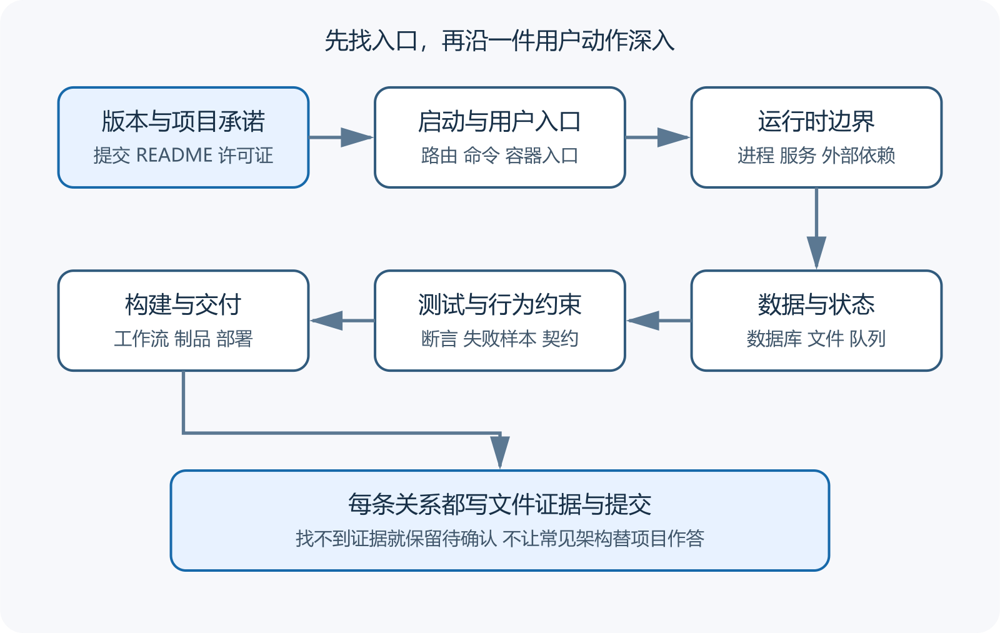

# 先画成熟开源仓库的 Repository Map

打开一个成熟开源项目，第一眼经常是一长串目录。有人从第一个文件逐行读，有人先问 AI 整个项目怎样工作。前一种方法很快陷进工具配置，后一种方法会得到一张听起来完整、却可能把猜测当成事实的架构图。更稳妥的起点是一张 Repository Map，也就是仓库导航图。它记录项目入口、主要边界和证据位置，暂时不解释每个文件。

仓库导航图和文件清单用途不同。文件清单回答这里有什么，导航图回答为了理解一次用户动作，应该依次看哪里。成熟项目可能有生成代码、第三方依赖、测试快照、翻译文件、迁移脚本和多套部署配置。它们都重要，却不适合作为第一站。



*成熟仓库的分层阅读路线*

图中从项目承诺和启动入口开始，随后连接运行时边界、数据与外部系统、测试和交付。每个方框都要写出文件证据，问号留给尚未确认的关系。

## 先固定你正在看的版本

同一个仓库的默认分支、最新发布版和服务器正在运行的版本可能不同。阅读前记录仓库地址、分支、提交哈希和检索日期。GitHub 为每个提交分配唯一的 SHA 标识，它能把讨论、代码和测试固定在同一份内容上。只写“我看了最新版”，过几周就很难复核。

若目标是修复生产故障，优先查看生产环境对应的提交。若目标是学习下一版架构，可以看默认分支，但要把未发布改动标出来。标签只能说明维护者给某个提交起了版本名，不能自动证明部署环境使用了它。

下载陌生项目后先保持只读。不要立刻执行安装脚本、开发容器或仓库里的自动化命令。脚本拥有当前用户能够使用的文件和网络权限，公开仓库也不能因此获得天然信任。先看 README、许可证、依赖清单、工作流和启动命令，再决定是否放进隔离环境运行。

README 通常说明项目解决什么问题、支持什么平台、最短启动方法和文档入口。它是一份维护者陈述，不能单独证明所有功能仍可用。接着看许可证、发布记录、贡献指南和安全策略。GitHub 的 Community Standards 会检查 README、LICENSE、CONTRIBUTING 和安全策略等社区文件，但清单齐全只说明维护者提供了入口。

然后找依赖清单和锁文件。常见文件包括 `package.json`、`pyproject.toml`、`go.mod`、`pubspec.yaml` 与它们的锁文件。清单说明直接需求，锁文件把实际解析版本固定下来。GitHub 的依赖图会解析受支持生态的清单与锁文件，并展示依赖版本、许可证和已知漏洞线索。它可能漏掉动态下载、脚本安装和不受支持的格式，只能作为辅助清单。

这一圈结束时，写下四句话就够了。项目给谁用，怎样启动，核心数据放在哪里，维护者建议怎样报告问题。答不出来的地方先记问号，不要让 AI 用常见架构补空。

## 第二圈寻找可执行入口

入口是程序开始接受用户动作的位置。网页项目可能从路由、页面组件或服务器启动文件进入。命令行工具会在参数解析处进入。移动应用先经过平台入口，再进入导航和状态管理。Docker Compose 的 `command`、镜像入口和健康检查还能说明容器实际启动什么。

入口不等于业务逻辑。一个 HTTP 控制器可能只校验输入，随后调用服务层。前端按钮也可能只发送请求。导航图应把两者分开写。

```
用户动作  上传一张图片
客户端入口  上传按钮与请求函数
接口入口  资源上传端点
业务处理  权限检查与记录创建
异步处理  缩略图和元数据任务
持久数据  数据库记录与原始文件
可见结果  列表出现资源与处理状态
```

这份记录不假设目录名称。等你在代码里找到真实文件后，再把路径补在每一行后面。路径找不到时保留“待确认”，比填一个熟悉的文件名可靠。

## 第三圈辨认运行时和数据边界

启动配置能告诉你程序由几个进程组成。单一可执行文件也可能同时提供管理界面、接口和定时任务。大型项目则可能把网页、接口、后台工作进程、数据库、缓存和对象存储分开。边界数量会直接改变部署、日志和故障范围。

PocketBase 的[官方介绍](https://pocketbase.io/docs/)把产品描述为带 SQLite、实时订阅、内置认证、管理界面和接口的单一后端应用。它运行后会管理数据目录和迁移目录。Supabase 的官方架构围绕 Postgres 组合认证、接口、实时能力、存储和其他服务。两者都能快速提供后端能力，仓库导航图却会呈现完全不同的运行和运维边界。这里比较组成，不构成生产适用性保证，兼容承诺和选型边界见第 99 章。

看见数据库调用后，不要立即把所有数据归到数据库。上传文件可能进入本地目录或对象存储，队列消息可能只在有限时间内保存，缓存丢失后的影响也不同。给每种状态标出所有者、保存位置、备份方法和允许丢失的程度。

测试会透露维护者认为什么行为不能被改坏。先找覆盖核心用户动作的集成测试，再看边界条件和单元测试。测试名称只是线索，断言才是证据。一个名为“上传成功”的测试也许只检查返回码，没有验证文件、数据库和后台任务。

持续集成工作流说明提交后自动执行哪些检查。读取触发条件、运行环境、权限、缓存、测试命令和发布步骤。工作流显示某个检查存在，不能证明默认分支每次都强制通过。还要看分支规则、所需状态检查和最近运行结果。

部署文件要和开发文件分开。开发用 Compose 往往开放更多端口、使用示例密码并挂载源码。它方便本地调试，不代表可以直接暴露到公网。导航图可给每份配置加“开发”“测试”“生产候选”标签，未知用途则写“未确认”。

## 不要先读这些地方

依赖安装目录、编译产物、压缩文件、自动生成的接口客户端和大型测试快照通常不适合先读。它们能回答具体问题，却会淹没项目边界。锁文件不能跳过，只需先确认包管理器、锁定方式和是否有异常来源，无须逐行阅读几万行版本解析结果。

名称相似的目录也不能按经验归类。`services` 可能装业务逻辑，也可能装外部客户端。`core` 可能是核心领域，也可能只是历史遗留。仓库里的导入关系、启动配置和测试调用才能证明目录职责。

一张实用的导航图至少包含路径、职责、进入方式、调用对象、保存的数据、相关测试和证据强度。每条关系标成“代码直接显示”“配置显示”“维护者文档说明”或“待验证推断”。这样 AI 和人都能指出哪一格缺证据。

```
路径  src/upload
暂定职责  接收上传并创建资源记录
直接证据  路由注册与服务调用
相关测试  tests/upload
外部依赖  对象存储
仍待确认  失败重试与重复上传处理
```

地图应附提交哈希。项目升级后先比较入口、依赖清单、迁移、工作流和部署文件，再决定哪些关系要重画。它是一份阅读工具，不该成为永远正确的架构声明。

## 让 AI 帮忙画图时怎样验收

可以让 AI 列目录、识别清单和寻找入口，也可以让它沿一条调用链生成初版。输入中应写明目标提交、排除目录和证据格式，要求每个判断给出文件路径与符号名。没有证据的内容必须单列。

随后亲自抽查三处。启动命令是否真的进入它标注的入口，核心用户动作是否经过它画出的服务，数据是否落到它声称的位置。再执行一项最小测试或在隔离环境观察日志。三处都吻合，只能说明这条路线暂时可信。

仓库越成熟，目录越不会主动向新读者解释自己。先画导航图的价值就在这里。你不必马上学会全部代码，但会知道一次改动跨过了哪些边界，哪里有测试，哪里需要另一位维护者或另一种证据。

复杂仓库再加一层补充检查。Monorepo 要列出每个子项目的运行时、入口、依赖清单、制品和部署目标。根目录的 `test` 可能运行全部测试，也可能只挑几个包，脚本名字不能直接当成证明。OpenAPI 客户端、数据库模型和协议代码常由工具生成，修改前要找到源文件、生成命令和消费者。vendored code 也要查许可证、来源版本和本地补丁。

地图不需要覆盖每个文件。你能回答一项用户动作从哪里进入，跨过哪些运行边界，写入哪些状态，由哪些测试保护，怎样构建和部署，就可以进入深入阅读。仍然未知的细节留在问题清单。

做完后找一个没有参与绘制的人，或开启一段不带先前结论的新 AI 会话，只提供仓库和提交，让它尝试沿同一动作寻找证据。两张图不一致时回到代码。第二张图的作用是暴露遗漏，不能通过多数投票决定架构。

仓库升级后不用全部重画。比较依赖清单、启动配置、迁移、工作流和核心入口的差异，再更新受影响部分。每次修改在图注中留下提交，读者就能知道它描述哪个版本。
