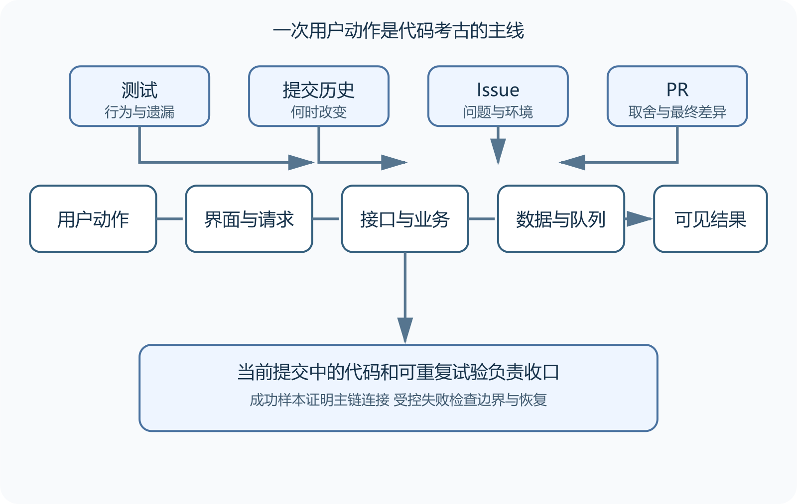

# 沿用户动作阅读测试、历史、Issue 与 PR

仓库导航图给出方向，接下来选一件用户真的会做的事，沿着它进入代码。注册、上传、付款或导出都可以。成熟系统里的一个按钮可能跨过前端、接口、权限、数据库和后台任务，一次只追一条路径更容易保留证据。

代码说明当前实现，测试记录维护者准备守住的行为，提交历史提供变化顺序，Issue 保存问题与需求，Pull Request 则记录一次改动怎样讨论和合入。任何一份材料都可能过时，最后仍要回到指定提交中的代码与可重复测试。



*沿用户动作连接代码、测试与历史证据*

## 从可观察结果往回找

先写用户做了什么以及看见什么。以照片上传为例，请求完成、资源进入列表和缩略图生成是三个可观察结果。只盯着 HTTP 成功会漏掉后台任务失败。

从浏览器 Network 或客户端日志记录方法、路径、状态码和响应字段，再搜索路由、字段或翻译键。找到接口后逐层回答当前函数接收什么、检查什么、调用谁和返回什么。遇到抽象接口，再找实现与依赖注入位置。一次让 AI 跳过多层总结，容易把旧实现和测试替身混在一起。

测试要看准备条件、执行动作和断言。例如测试准备无权限用户，调用上传接口，断言请求被拒绝并确认没有创建记录。它能证明该提交检查了这一条路径，无法证明所有权限组合都安全，也无法证明部署环境运行过测试。

阅读时同时记录未覆盖部分。后台任务、存储写满和重复请求若没有出现，就需要其他测试或实验。端到端测试覆盖连接较多，单元测试定位更快却常替换数据库与网络，契约测试只核对消息约定。每类证据都有自己的范围。

## 用历史解释奇怪代码

一行代码看起来多余时，查看它最近一次有意义的变化。文件历史和 Blame 可以把行连接到提交，但 Blame 只显示最后修改，格式化和搬迁还会遮住更早原因。

本地只读命令可以沿重命名查看历史、检查完整提交和定位一段代码的归属。

```
git log --follow -- path/to/file
git show COMMIT_SHA
git blame -L 40,80 path/to/file
```

打开提交后要看完整差异。代码、测试、迁移与文档可能共同表达约束。再确认它是否进入 Pull Request、默认分支和目标发布版。浅克隆或部分历史会让结果不完整，结论中应标明限制。

功能经过拆分或大规模搬迁时，`git log --follow` 未必能完整追踪。先找到搬迁提交和父提交，再从稳定符号、测试名称、接口路径与提交消息继续搜索。代码搜索也要固定版本，旧 Issue 引用的路径不能用默认分支当前内容代替。

涉及数据结构时，还要沿相关迁移查看旧数据怎样转换、索引怎样建立和约束何时收紧。安全演进通常先增加兼容字段，完成数据填充后再收紧约束。若一次迁移同时改名、改类型并删除旧列，代码回滚可能已经读不了数据。迁移应在包含旧版边界数据的副本上演练，并核对行数、空值、唯一约束和新旧应用读取。

## 正确使用 Issue 与 PR

Issue 标题写上传损坏文件，正文可能只涉及旧版本、特定文件系统和断电场景。记录版本、部署方式、复现步骤、日志、维护者回复和最终状态。Closed 可能表示已修复、重复、无法复现或超出范围，不能单凭状态判断结果。

评论里的命令还要区分诊断、临时缓解和正式修复。删除缓存、重建索引或回滚数据库可能带来数据风险。多人回复有效只说明办法值得验证，仍要匹配版本并准备备份。

阅读 PR 时先看目标和最终差异，再看关键评论、测试结果与合并提交。早期方案可能已被后续提交推翻，检查全绿也要确认工作流覆盖范围和是否允许跳过。审查意见应区分已修正缺陷、被接受的取舍和延后建议。

一页笔记保留改动目标、接受的代价、验证证据、未解决事项与进入版本。每个链接都写明它支持哪条判断。

## 沿失败路径核对一次

成功路径跑通后，再选一个受控失败。上传无效格式、让测试存储返回容量不足，或让测试环境中的后台任务报错都可以。故障不能制造在生产环境，也不能靠删除真实数据验证恢复。

先写预期，再收集状态码、界面提示、日志关联标识、数据库变化和队列状态。行为与测试不同时，核对提交、配置和数据条件，再看测试替身是否绕开真实存储或队列。

AI 可以帮助寻找控制器、服务、数据访问和测试，也可以概括 PR。输出必须带文件路径、符号、提交和未确认部分。随后反向检查接口是否注册到那个处理器、测试是否真走该路径、最终差异是否支持概括，并运行一个成功样本和一个安全失败样本。

完成后只保存一页变更档案，写下用户动作、目标提交、当前调用链、关键测试、决定性 Issue 与 PR、仍生效的取舍和待验证问题。以后修改相同功能时，这页记录会提醒维护者重新处理旧故障条件。
