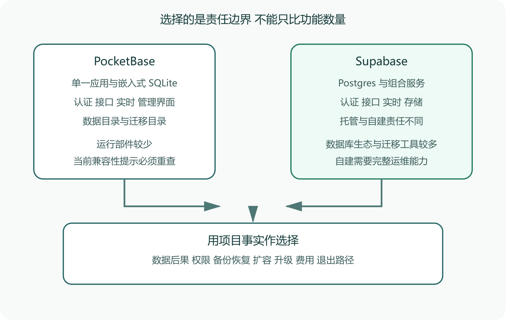

# PocketBase 与 Supabase 的边界选择

PocketBase 和 Supabase 经常出现在“快速做出后端”的候选表里。两者都能提供数据库、认证、接口和管理能力，选择却不能只看功能清单。你要判断数据量、并发、迁移、备份、权限、运维能力和故障后果，也要分清托管服务与自己部署带来的责任。PocketBase 的稳定性和兼容承诺、Supabase 托管与自建的能力差异，都会随版本变化，选型前应重新核对官方文档。



*PocketBase 与 Supabase 的边界选择图*

图中没有安排总冠军。左侧强调较少的运行部件，右侧强调围绕 Postgres 组合的能力。下方的责任问题决定某个优点在你的项目里会不会变成负担。

## 先把三个选项分开

第一个选项是运行 PocketBase。官方文档把它描述为一个包含嵌入式 SQLite、实时订阅、内置认证、管理界面和简洁接口的开源后端，可作为独立应用运行，也能用 Go 扩展。程序会在旁边管理数据目录和迁移目录。

第二个选项是使用 Supabase 托管平台。Supabase 以 Postgres 为核心，组合认证、自动接口、实时通信、存储和函数等服务。平台负责大量基础设施工作，用户仍要负责表结构、行级权限、密钥使用、数据生命周期和费用。

第三个选项是自建 Supabase。它和托管平台不能按同一责任表理解。官方自建文档列明，使用者要负责服务器维护、安全加固、服务配置、Postgres 维护、高可用、扩容、备份、灾难恢复、监控和在线时间。托管平台的一些能力在自建版中也不可用。

很多比较把第二个选项的便利与第一个选项的可控放在一起，随后得出“Supabase 功能更多，PocketBase 更轻”。这句话太粗。你应当先决定托管还是自建，再比较数据和应用边界。

## 少量部件会减少哪些工作

PocketBase 下载后可以直接启动，开发者很快得到管理界面、集合、认证和接口。个人原型、局域网工具、可重新生成数据的内部应用，以及对单机边界很清楚的小项目，常能从这种紧凑结构受益。

部件少意味着本地复现和备份路径更容易看懂。你仍要确认数据目录、上传文件、迁移文件、反向代理、TLS、系统服务、日志和备份恢复。复制一个 SQLite 文件不能直接等同于可恢复备份。活跃写入时怎样取得一致快照，上传文件是否同步，恢复到另一台机器后权限是否正常，都需要测试。

SQLite 适合很多真实应用，不能因为“嵌入式”就把它当玩具。选择边界来自写入模式、可用性目标、扩容方式和团队能力。若业务要求多节点高可用、复杂分析、成熟数据库运维工具或大量并发写入，应进一步验证，不能只依据启动速度决定。

Supabase 的核心是可直接访问的 Postgres。官方架构说明认证服务与 Postgres 行级安全协作，PostgREST 把数据库能力提供为接口，实时服务、存储和其他组件围绕同一数据库组合。

这套结构适合需要关系约束、SQL 查询、数据库迁移、细粒度行级权限和既有 Postgres 工具的项目。能力增加也带来更多概念。前端使用公开密钥不代表可以跳过权限策略，服务角色密钥不能放进客户端。表能查询不代表备份覆盖了对象存储，数据库恢复也不保证外部邮件和第三方付款状态自动一致。

托管平台能替你运行基础设施，不能替你设计权限。最小练习应建立两个用户与两行互不相属的数据，确认每个用户只能读写自己的记录。随后用未登录请求和错误用户再测一次。成功创建记录证明写入过程可用，无权限请求被拒绝才能为访问边界提供证据。

## 从数据恢复要求倒推

先列出项目不能失去的状态。用户账号、业务记录、上传文件、权限策略、数据库函数、定时任务和外部服务标识可能分别存在不同位置。再写可接受的数据丢失量与恢复时间。

若一个家庭工具允许停机半天，最近一天数据也能手工补回，单机方案可能足够。若用户付费内容必须持续可用，数据丢失会引发合同或法律问题，就需要更严格的备份、恢复演练、监控与责任安排。此时“部署简单”只覆盖初次上线，不能覆盖长期运营。

无论选择哪边，都做一次不碰生产数据的恢复演练。创建测试实例，写入文本和文件，生成备份，破坏测试实例，再恢复到一个新位置。检查账号、权限、记录、文件、时间字段和应用连接。备份文件存在只证明复制动作完成，恢复后的逐项检查才能证明它有使用价值。

PocketBase 的集合迁移可保存到迁移目录，数据和文件位于运行目录相关位置。升级前要读对应版本变更记录，备份并在副本上执行迁移。官方当前的兼容性提醒意味着维护者不能把“以后再升级”当作完整计划。

Supabase 以 Postgres 和常见导出格式强调可移植性，但迁移仍可能涉及认证哈希、对象存储、实时订阅、函数、数据库扩展和平台配置。能导出表，不等于另一个平台能直接接管整个应用。

选型时写一页退出清单。

```
数据库怎样导出与恢复
上传文件怎样完整复制
用户身份怎样迁移或重置
权限规则在哪里保存
客户端要替换哪些地址和密钥
停机窗口与回滚点在哪里
谁验证迁移后的记录数量和权限
```

退出成本不是拒绝平台的理由。它让团队知道便利换走了哪些控制权，也让将来的迁移有准备。

## 用四类项目做判断

个人原型重视几小时内做出可用界面，数据可以重建。PocketBase 的紧凑结构值得优先试验，仍要接受它在当前版本下写明的兼容性边界。

小型正式应用需要关系数据、登录、文件和稳定托管，团队没有数据库运维人员。托管 Supabase 往往更符合责任能力，但要测试行级权限、备份能力、地区可用性和费用。价格与免费额度会变化，必须按选型日期查询官方页面。

离线或局域网工具要求一个可携带进程，外网长期不可用。PocketBase 可能更容易部署，前提是设备备份、升级和访问控制能由本地负责人完成。

受监管或高可用系统需要审计、隔离、灾难恢复和明确支持责任。此时不能仅凭二者的快速入门做决定。可能需要托管企业能力、专门数据库平台或经过验证的自建方案，安全与运维人员也要进入评审。

## 做一场有结果的试验

为两个候选方案实现同一条最小业务链。用户登录，创建一条只属于自己的记录，上传一个文件，第二个用户无法访问，备份后能在新环境恢复。记录初次搭建时间、配置文件、权限规则、日志位置、备份步骤和升级步骤。

然后安排两个受控失败。撤销当前用户权限，确认接口与界面都拒绝。让测试存储暂时不可写，确认系统不会返回虚假的成功。所有故障只在测试数据与隔离环境中进行。

最终表格不要只填“支持”或“不支持”。填入谁负责、怎样验证、出错去哪里看、恢复需要多久。这样选型就从功能投票变成责任判断。AI 可以完成样例代码和对比表，账号权限、真实备份、费用与上线责任仍要由项目所有者确认。

两种方案都能让用户注册和登录，应用仍需定义谁能对哪条记录执行什么动作。PocketBase 的 API 规则和过滤器、Supabase 的 Postgres 行级安全都需要结合数据模型设计。管理界面里能看到记录，不代表普通客户端也应拥有同等访问。

建立权限矩阵会比逐页点选清楚。

```
角色  未登录用户
对象  公开文章
动作  读取允许  创建拒绝  修改拒绝

角色  普通用户
对象  自己的草稿
动作  读取允许  创建允许  修改允许

角色  普通用户
对象  他人的草稿
动作  读取拒绝  修改拒绝
```

根据矩阵写自动测试，并从真实客户端执行。管理密钥和服务角色只能留在可信服务器。若网页为了绕过规则直接使用高权限密钥，平台提供的权限能力已经失去意义。

## 先测你的写入方式，再谈性能

性能比较必须给出数据规模、读写比例、并发、查询、索引、硬件和网络。别人发布的每秒请求数很难直接迁移。先用接近真实的数据和用户动作建立基线，观察延迟分布、错误、CPU、内存、磁盘和连接。

PocketBase 的单机边界使扩容路径更集中，要特别测试长事务、批量导入、备份和写入竞争。Supabase 托管版会替用户处理不少基础设施，但数据库连接、慢查询、索引、行级规则和费用仍会成为应用问题。自建 Supabase 还要管理多项服务的容量与升级。

压测只在隔离环境进行。先跑低负载确认脚本正确，再逐步增加。测试结束后核对记录数量和权限，防止系统以丢请求换来好看的延迟。个人项目若远未接近容量边界，优先处理备份、权限和可维护性。

托管平台的数据地区、服务可用性、付款方式、出站网络和支持等级会随时间与账户计划变化。涉及个人信息、跨境传输或行业监管时，应由合适的法律与安全人员确认。本书不能把某个地区当前可用写成永久事实。

自建带来数据位置控制，也把补丁、入侵响应、硬件故障和备份责任交给自己。控制权只有在团队能够履行这些工作时才产生价值。没有值班和恢复能力的单台 VPS，不会因为软件开源就自动满足高可用要求。

选型记录中注明检索日期、官方价格与政策链接、支持渠道和重新评审条件。费用超过预算、数据量增长、需要多地区或兼容性承诺改变，都可以触发重新选择。
