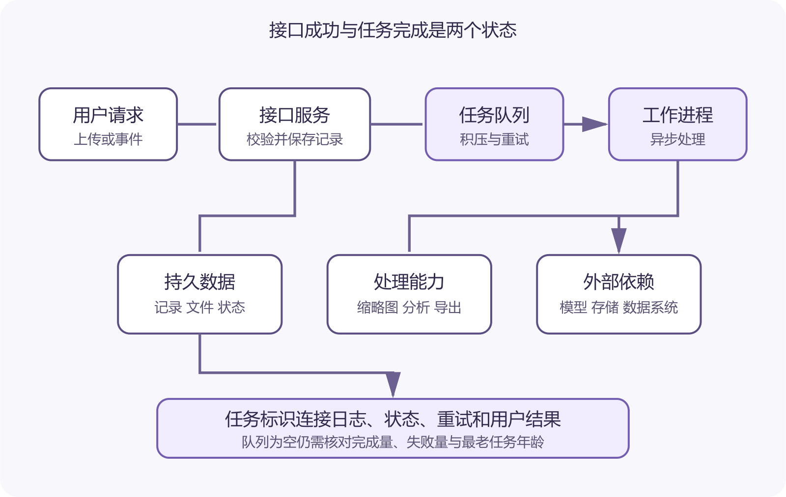

# Immich 与 PostHog 中的后台任务和工程组织

用户上传一张照片，服务器收到文件以后还可能提取元数据、生成缩略图、转码视频、建立搜索索引和执行识别。若把全部工作塞进一次请求，用户会长时间等待，任何一步失败都可能让整次上传重来。后台任务把这些工作移出请求，但系统也因此多出队列、工作进程、重试、积压和状态一致性问题。

Immich 是自托管照片与视频管理项目，PostHog 是产品分析平台。它们的规模和用途差别很大，却都能帮助读者观察成熟系统怎样拆开同步请求、异步工作和持久数据。本章只研究公开文档与仓库在 2026 年 8 月 11 日呈现的结构。



*同步请求与后台任务的工程边界*

图中用户请求先建立可追踪记录，再把耗时工作交给队列。工作进程执行后更新状态，界面通过查询或推送显示结果。每条箭头都可能失败，因此需要标识、重试边界和可见状态。

## Immich 的上传为什么会产生一串任务

Immich 官方架构说明它采用客户端与服务器结构，移动端、网页和命令行客户端通过 REST 接口连接后端。服务端还连接 Postgres、Redis、机器学习服务和文件系统。

官方列出的后台工作包括缩略图、元数据提取、视频转码、智能搜索、面部识别、存储模板迁移和删除任务。Redis 与 BullMQ 管理任务队列，一些任务会在前置任务完成后继续触发。例如部分搜索与识别工作依赖缩略图。

这解释了一个常见现象。上传接口返回成功后，缩略图可能还没出现。这里至少有三个成功状态。文件已被服务器接收，资源记录已被持久化，派生任务已完成。界面若只显示一个绿色对勾，用户很难知道问题在哪里。

阅读这类系统时，为状态建立明确词汇。

```
received  请求已接收
stored  原始文件和记录已保存
queued  后台任务已进入队列
processing  工作进程正在处理
ready  需要的派生结果已生成
failed  已记录错误，等待处理
```

具体项目可以使用其他名字，含义必须稳定。接口返回 `200` 只能证明当前请求按约定完成，不能自动证明所有后台任务结束。

## 队列把等待移走，也把故障分开

队列允许接口快速返回，并让工作进程按资源能力处理任务。视频转码和机器学习需要不同 CPU、内存或硬件，拆开后可以限制并发，也能在暂时不可用时保留任务。

新的故障由此出现。任务可能重复投递，工作进程可能执行到一半崩溃，依赖服务可能超时，队列可能积压，记录与文件可能只完成一边。重试不能假设任务只执行一次。生成同一缩略图应尽量得到同一结果，扣款、发邮件和删除数据则要有更严格的幂等标识与人工边界。

“队列长度为零”也不是全部正常。生产者也许没有成功入队，任务可能进入失败集合，消费者可能错误地确认了消息。监控要同时看进入量、完成量、失败量、最老任务年龄和处理时长。

先固定提交，再从公开架构文档给出的控制器、服务、仓储接口和队列概念进入。搜索一个具体任务名，找到任务产生位置、处理器、状态更新和测试。

检查以下问题。

- 谁创建任务标识，重复请求会不会复用它。
- 原始文件与数据库记录哪一步先完成。
- 工作进程失败后由谁重试，最大次数和延迟在哪里配置。
- 任务完成后怎样更新资源状态。
- 用户能否取消、重跑或查看失败原因。
- 升级期间旧任务能否被新版本处理。

官方管理页面能远程管理部分任务队列，但界面按钮和能力会随版本变化。实际操作前应查当前版本文档，先在测试数据上验证重跑与清理。删除队列记录可能让尚未完成的资源永远缺少派生结果。

## PostHog 展示了更大的工程分工

PostHog 的本地开发文档列出网页前端、Django 服务、Node.js 服务和执行后台任务的 Celery 工作进程，也列出若干面向性能关键路径的 Rust 服务。外部依赖包括 PostgreSQL、ClickHouse、Kafka、Redis 和对象存储等。

这类结构来自不同数据路径。账号、项目和配置等事务数据与大量分析事件有不同的写入和查询方式。事件接收需要持续进入处理链，复杂分析查询又需要面向分析负载的数据系统。后台任务还承担导出、维护和延后处理。

读者不需要记住所有组件名。按数据路径找所有者即可。

```
控制路径  用户、项目、权限和配置
摄取路径  客户端事件进入系统
处理路径  清洗、关联与写入分析存储
查询路径  报表和产品功能读取结果
后台路径  导出、周期任务和延后处理
```

同一个项目可以同时拥有这些路径。它们的延迟目标、重试方式和数据存储不同，日志却要能通过项目、用户、请求或任务标识联系起来。

## 工程组织怎样跟着边界生长

小项目常以技术层分目录，例如页面、接口、服务和数据访问。项目增大后，单纯技术层会让一次功能改动散到许多巨大目录。成熟项目可能按领域、产品或服务分组，同时保留共享协议和基础设施。

目录结构不能单独证明组织结构。应结合代码所有者、贡献指南、工作流路径过滤、测试位置和服务部署文件。一个目录由某团队审查，并不表示只有该团队能改；一项服务共享数据库，也不表示它拥有全部表。

跨语言系统还要关注契约。自动生成客户端、OpenAPI、消息结构和数据库迁移承担不同约束。更改一个字段时，旧客户端、积压任务和分阶段部署可能同时存在。兼容性测试和逐步发布因此比“本地编译通过”更重要。

假设 AI 为照片应用新增“上传后生成摘要”。先检查异步理由。若任务耗时不稳定、依赖外部模型或允许稍后完成，异步有合理依据。若只做一次极快的字段计算，队列可能增加无用边界。

然后审查任务输入。传完整文件、数据库主键或不可变对象地址，会带来不同耦合。任务执行时原记录可能已被删除或修改，处理器必须定义行为。敏感内容送往外部服务还涉及权限、地区、保留期限和用户告知。

还要看交付语义。队列通常难以保证业务效果严格只发生一次。处理器应能识别重复任务，外部调用要使用幂等键或结果记录。失败分类要区分暂时网络问题、永久输入错误和需要人工决定的情况。无限重试会消耗资源，并让严重故障长期藏在队列里。

界面也要跟上。用户应看见等待、完成或失败，必要时能重试。若产品悄悄等待后台结果，支持人员会收到模糊报告。

## 用隔离环境观察积压与恢复

建立几条可删除的测试数据，记录正常任务的入队、开始和完成时间。随后暂停测试工作进程，让任务积压，确认接口是否仍可用、界面是否显示处理中、告警是否识别最老任务年龄。恢复工作进程后观察处理速率和资源使用。

再让一个可控依赖返回临时错误，确认重试有上限和延迟。使用固定的测试任务标识检查日志，避免在大量输出中凭时间猜测。测试结束后核对每条任务的最终状态和派生结果，不能只看队列恢复为零。

这场练习提供几类证据。暂停时接口仍可用，说明同步路径没有等待该工作进程。任务留在队列，说明暂时停机没有立刻丢失已入队工作。恢复后结果只生成一次，说明这个样本下的重复处理受到控制。

个人项目不必因为看过 PostHog 就部署 Kafka、ClickHouse 和许多服务。先用数据库记录任务状态，或使用现有平台提供的任务能力，也可能足够。只有当请求等待、资源隔离、可靠重试或处理吞吐形成真实问题时，再引入新的队列与工作进程。

从成熟项目借走三件事已经很有价值。给长任务明确状态，让日志能够关联一次任务，把失败与重试写成可检查规则。组件数量应由实际负载和责任能力决定。

## 状态一致性和观测要一起设计

原始文件保存成功、数据库记录失败时怎么办，记录成功、任务没有入队又怎么办。系统可以使用数据库事务、发件箱模式、定期对账或补偿任务缩小这些间隙。选择哪种方法取决于数据系统和后果，不必一开始引入最复杂方案。

简单项目可以先把任务状态写入数据库，再由工作进程扫描待处理记录。它的吞吐可能不如专门队列，却容易把业务记录与任务状态放在同一事务中。使用专门队列后，应考虑数据库提交与消息发送之间的失败。定期对账可以寻找已保存但未入队、任务完成但状态未更新的对象。

任何方案都要定义事实来源。资源是否就绪由数据库状态、文件存在还是队列结果决定。多个来源同时声称权威，会在故障后互相矛盾。

部署新版本时，队列里可能还有旧消息。若新工作进程不能识别旧格式，升级会把积压变成永久失败。消息结构需要版本字段或向后兼容读取，破坏性变化要先排空队列或运行过渡消费者。数据库迁移也要配合工作进程，先发布能同时读新旧结构的代码，再迁移数据，最后移除旧路径。

接口仪表盘显示请求正常时，后台队列仍可能积压。至少记录任务进入量、完成量、失败量、重试量、最老等待时间和处理时长。日志包含任务标识、任务类型、资源标识、尝试次数和错误类别，不记录文件内容与敏感令牌。

小项目可以创建任务标识、类型、资源标识、状态、尝试次数、下次执行时间和最后错误。测试覆盖正常完成、重复领取、进程中断、永久输入错误、依赖暂时失败和旧格式任务升级。出现数据库争用、吞吐或调度限制后，再评估专门队列。
