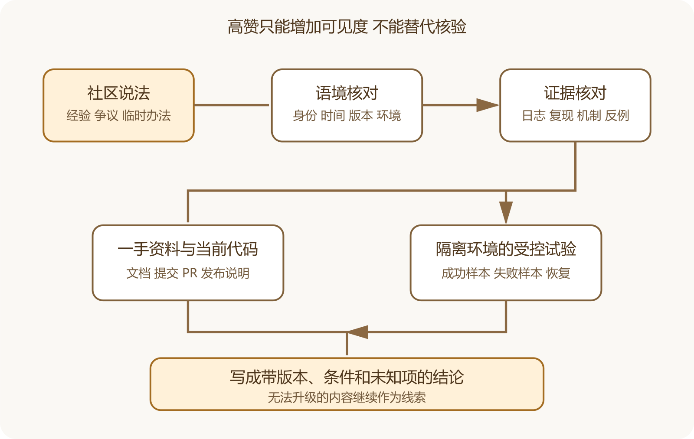

# 怎样正确使用技术社区中的争议与经验

官方文档会告诉你一个功能应当怎样使用，真实故障往往先出现在 Issue、Discussion、论坛和问答网站里。社区材料能补上版本组合、失败日志和维护者尚未整理的限制，也会混入记错的命令、特殊环境、利益立场和过期经验。正确用法是把它当成可追查的线索和现场记录，随后回到版本、代码、文档与实验。

一个高赞回答、维护者回复和十名用户确认，证明力并不相同。判断之前先问这段话在陈述事实、报告个人经历、解释机制，还是提出建议。四种内容需要的核验方式不同。



*技术社区材料的证据升级路线*

图中社区帖子先经过身份、版本、复现和机制检查，再与一手资料和受控试验交叉。无法升级的内容可以保留为风险提示，不能写成稳定结论。

## 先看讨论发生在什么地方

GitHub Issue 通常对应一个具体缺陷、任务或需求，有仓库、标签、状态和负责人。Pull Request 对应一项可查看差异的改动。Discussion 更适合开放问题、想法和社区知识，维护者可以把某条回复标为答案。GitHub 官方也提醒，Discussion 常常没有明确负责人，也未必产生可执行任务。

平台位置提供语境，不能自动保证内容正确。Issue 中的维护者也可能先作出临时判断，之后被日志或代码推翻。被标记的答案可能针对当时版本。Pull Request 的评论若指向旧差异，最终合并代码可能已经改变。

普通论坛、Reddit、X 长帖和个人博客的上下文更分散。作者可能没有写版本，也可能只展示成功截图。它们适合发现关键词、特殊硬件、地区限制和用户感受。涉及安全、删除、费用、政策和数据恢复时，仍要查官方资料并自己验证。

假设有人说“更新以后数据库连不上，删掉缓存就好了”。先拆成五项。

```
产品与版本  哪个版本更新到哪个版本
环境  操作系统、数据库、部署方式和代理
现象  哪个连接失败，错误原文是什么
动作  删除了哪个具体路径或记录
结果  暂时恢复，还是之后持续正常
```

“删缓存”可能指浏览器缓存、包管理缓存、应用缓存、Redis 数据或一个名字带 cache 的业务目录。它们的风险完全不同。路径没说清就不能执行，更不能在生产环境尝试。先备份可恢复数据，在测试副本上确认对象与后果。

把观点拆开后，还要找机制。若回答声称证书过期导致 TLS 失败，日志、证书有效期和系统时间能否支持它。若声称内存不足，进程退出原因和系统日志有没有相应记录。机制与证据吻合，这条经验才值得迁移。

## 版本与时间比赞数更重要

技术答案会过期。记录发布日期、最后编辑、软件版本、操作系统、云平台和检索日期。一个五年前的高赞答案可能解决旧版界面，一条昨天的新回复也可能只是猜测。

评论顺序也会误导。早期用户报告问题，维护者随后给出临时办法，再后来发布正式修复。搜索引擎可能只截取中间那条办法。阅读时一直看到关闭说明、关联提交和发布版本。若问题重新打开，也要查原因。

同一标题下可能有多种故障。`connection refused` 指向目标端口没有接受连接，超时可能涉及网络、防火墙或过载，认证失败则进入凭据与权限。把错误原文和环境条件保留下来，才能避免拿相似标题套错方案。

维护者熟悉设计意图和当前实现，但他未必拥有提问者的环境。云平台员工能准确说明平台能力，也可能更倾向平台内方案。博客作者如果给出仓库、版本、脚本和失败记录，证据可能比一句官方回复完整。身份是一项权重，不能代替内容核验。

优先保留能够展示原始日志、最小复现、提交链接、配置差异和后续结果的材料。只有结论、没有过程的内容适合生成搜索词。大量重复转贴不能算多个独立来源，它们可能都来自同一篇文章。推荐托管服务的作者是否接受赞助，性能比较是否省略成本与环境，也要一起看。

## 怎样处理互相冲突的回答

两条答案冲突时，先找适用条件。一个建议增加超时，另一个建议尽快失败，它们可能面对不同任务。离线批处理允许等待，用户交互请求需要及时反馈。一个建议重试，另一个警告重复扣款，差异来自操作是否幂等。

若适用条件相同，再比较证据。谁提供了可重复步骤，谁固定了版本，谁展示了反例，谁的解释与代码和官方文档吻合。仍无法决定时，在隔离环境运行最小试验，并把结果限制在当前环境。

工程争议常有多个有效方案。Google 的代码审查指南建议把讨论建立在技术事实、数据和清楚的原则上。偏好可以存在，应当与强制要求分开。

事故报告、Issue 和现场聊天最有价值的部分通常是判断过程。操作员先看见什么，哪项指标把人带错，什么动作只缓解症状，什么证据最终改变判断。只摘最终命令，会失去这些内容。

阅读故障材料时分别记录触发、促成条件、影响扩大、防线缺口和恢复动作。GitHub 2026 年 2 月可用性报告描述了一次后台异步工作对共享协调组件造成压力的事故，并区分影响、传播和后续改进。这个案例能帮助理解共享资源与遥测盲区，不能证明自己的连接耗尽也有同一原因。

把经验迁移到自己的系统时改写成问题。后台任务是否与用户请求共享连接池，队列积压是否可见，错误策略是否会扩大范围。随后寻找本地配置、指标和测试。这样材料提供的是检查方向，不是复制命令。

## 发帖求助也要提供可以使用的证据

一条高质量求助应写目标、环境、最小步骤、预期结果、实际结果、完整错误和已经尝试的动作。配置与日志先去掉令牌、域名中的隐私信息、邮箱和用户数据。不要只截最后一行，也不要上传整个生产数据库。

```
目标  使用 Compose 启动测试环境
版本  应用提交、Docker 与系统版本
步骤  从空目录开始执行的最短命令
预期  健康检查通过
实际  数据库容器启动，应用持续重启
证据  应用日志前后各二十行，配置字段名已脱敏
尝试  检查端口和环境变量，结果未变
```

说明你拥有哪些权限，以及哪些动作不能执行。若数据不能删除、服务器不能重启，提前写出来。回答者才不会把高风险命令当成普通诊断。

对真正影响决策的帖子，保存标题、作者或账号、平台、链接、发表与编辑时间、检索日期、对应版本、支持的结论、冲突信息和验证状态。网页可能被编辑或删除，必要时保存合规的文字摘录，但不要复制整篇受版权保护的文章。

把状态分成“仅线索”“已与官方资料交叉”“已在测试环境复现”“不适用当前版本”。不要用“已验证”覆盖多个层次。别人成功复现证明现象存在，你在当前环境复现才证明它与你的项目有关。AI 很适合总结长讨论、抽取版本和列出冲突观点，验收时要打开原链接抽查引用，确认它没有把猜测提升为维护者结论。

## 搜索结果要防止幸存者偏差

能被搜索到的帖子往往来自失败者愿意公开求助，也来自成功解决后愿意回来更新的人。大量没有发帖、没有解决或换掉产品的情况不会出现在同一页面。不能用十条成功回复推算方案的普遍成功率。

平台排序还会偏向互动、发布时间和关键词。搜索时更换错误原文、组件名和版本，查看关闭 Issue、发布说明与安全公告。若只搜自己已经相信的原因，结果会越来越一致。

性能和稳定性讨论尤其需要分母。有人说“一周崩了三次”，还要知道请求量、硬件和负载。有人说“运行两年没问题”，也要知道数据量、备份是否恢复过，以及哪些功能根本没用。

重启进程、扩大磁盘、清缓存和暂停工作进程可能迅速恢复服务。它们适合作为有范围的缓解，不能自动关闭原因调查。记录缓解前后指标、效果持续多久，以及它改变了哪些证据。

长期修复要处理导致故障和扩大影响的条件，并用测试或运行指标验收。若重启后连接恢复，应继续查连接为什么没有释放、监控为何晚发现、重启是否会丢任务。高风险临时办法还要设撤销时间，日志级别、网络规则和诊断权限都不能长期裸放。

## 引用社区经验时写清它支持到哪里

书稿或项目决策不能只贴链接。写明这条材料支持的现象、适用版本、作者身份、是否有复现，以及你怎样交叉核对。若它只帮助发现一个搜索词，就在资料账本中标为线索，不进入事实注释。

可以引用一条维护者在 Issue 中解释设计取舍，也要连接对应代码或文档。若讨论后来被新版本取代，在正文中使用当前结论，把旧材料放进变更背景。

视频评论区、短帖和群聊很难保留完整语境。它们可以提醒某个界面变化或地区问题，涉及读者行动时应转到官方页面和当前测试结果。来源越容易编辑、删除和脱离上下文，结论越要收窄。
