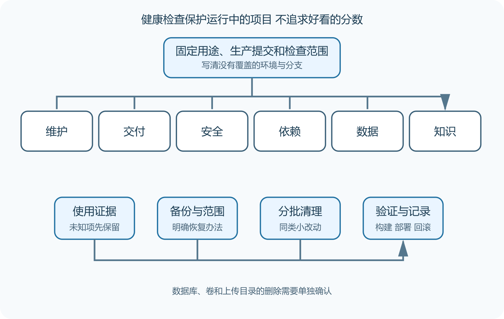

# Repository Health Review 与长期清理

项目上线以后，仓库会慢慢积累旧分支、过期依赖、失效文档、废弃配置、无人认领的自动化和 AI 生成的重复实现。它们平时各自只占一点空间，到了升级或故障时却会让人无法判断哪份文件仍在使用。Repository Health Review 是一次有证据的仓库健康检查，目标是找出维护风险和安全的清理顺序。

健康检查不是给仓库打一个虚荣分数。星标、提交数量和最近活动能提供线索，不能直接说明项目适合你的用途。GitHub 的仓库图表可以展示提交、贡献者、流量与依赖关系，部分图表还有仓库规模、计划和可见性限制。



*仓库健康检查与安全清理流程*

图中先固定用途和运行版本，再检查维护、交付、安全、依赖、数据和知识。清理动作必须经过使用证据、备份、分批修改和验证，未知对象先隔离或标记。

## 先确认这次检查保护什么

同一仓库可能同时服务生产部署、开发工具、文档站和历史版本。检查前写出当前生产提交、活跃分支、发布方式、数据位置、负责人和可接受停机时间。若这些信息缺失，首要问题是可追踪性，不是代码风格。

记录检查日期和范围。只检查默认分支，就不能声称所有长期分支安全。只看 GitHub 页面，也看不到服务器上的临时改动、外部密钥和未提交配置。健康报告应把这些盲区写出来。

先看最近发布是否有清楚说明，默认分支的持续集成是否稳定，严重 Issue 是否得到回应，依赖和安全公告是否有人处理。再看关键路径由多少人维护，离开一位贡献者后是否还有人能发布与恢复。

Community Standards 中的 README、许可证、贡献指南和安全策略能帮助使用者找到入口。文件存在不代表内容仍有效。安装命令是否对应当前版本，安全邮箱是否仍有人接收，贡献指南要求的测试是否仍在工作流里，都要抽查。

提交活跃也不能单独判断健康。一个稳定的小工具可能几个月没有改动，因为需求已经满足。一个每天自动更新依赖的项目看起来很热闹，核心缺陷仍可能无人处理。活跃度要和项目性质、发布承诺、使用风险放在一起看。

## 交付链要能从源码走到运行版本

检查构建命令、锁文件、工作流、制品、发布标签和部署记录。选择一个发布版，确认能追溯到提交，制品由哪次运行产生，部署环境使用什么配置。若只能在某位维护者电脑上构建，项目已经存在交付单点。

查看分支规则、所需检查和代码所有者。GitHub 的 CODEOWNERS 可以按路径请求责任人审查，结合规则还能形成合并门槛。它表达审查责任，不会自动证明某人理解所有改动，也不能替代测试。

抽查一次失败的工作流。日志是否说明失败步骤，重跑是否会产生重复发布，密钥有没有出现在输出。只看绿色徽章会漏掉偶发失败和被允许跳过的任务。

## 依赖清单要与运行事实对上

GitHub 依赖图根据受支持的清单、锁文件和提交的数据构建依赖关系，可以显示版本、许可证和已知漏洞线索。动态下载、容器基础镜像、系统包和外部脚本可能需要另查。

检查新增、更新与移除的依赖。GitHub 的依赖审查能在 Pull Request 中展示部分变化和漏洞信息，仍要人工判断为什么需要这个包、维护状态、许可证、传递依赖和替换成本。

不要为了“全部最新”一次升级所有依赖。先按安全修复、平台兼容、功能需要和普通维护分组。小批更新，每批运行测试和构建，保留回滚点。数据库驱动、认证、序列化和构建工具需要更严格的迁移检查。

搜索没有入口引用的目录、长期未运行的脚本、重复配置、旧部署说明和多个功能相似的模块。静态搜索只能产生候选。反射、动态导入、工作流、外部定时器和人工操作可能不会留下普通代码引用。

给每个候选记录最后修改、引用位置、运行日志、负责人、删除后果和恢复办法。无法确认用途时，先在 Issue 中询问或移入受控弃用流程。不要把未知文件直接删掉来验证系统是否会坏。

AI 生成内容尤其容易出现平行实现。一个功能已经有认证客户端，AI 又增加第二套 HTTP 封装；仓库已有日志工具，它又在新目录创建自定义记录器。健康检查应搜索同一职责是否出现多个入口，并比较真实调用链。

## 安全与数据检查不能只扫代码

检查版本历史中的密钥、公开工作流权限、依赖来源、上传目录、数据库暴露、测试数据和日志。删除当前文件里的密钥不能消除历史泄露，发现后要撤销并轮换，再按托管平台方法处理历史。

备份和恢复也属于仓库健康，因为迁移脚本与部署配置决定数据能否回到可用状态。检查最近一次恢复演练、备份覆盖范围、加密、保留期限和负责人员。服务器显示备份任务成功，只能证明命令退出正常，不能证明文件完整或应用能启动。

敏感信息不要复制进健康报告。报告只写秘密标识、存放系统、权限范围、轮换日期和验证状态。日志摘录要先脱敏。

第一步建立候选清单，不修改。第二步为将删除内容建立可恢复副本或确认它已在版本历史与制品中可靠保存。第三步分小批删除或弃用，每批只处理同一类对象。第四步运行构建、测试、部署预览和关键用户动作。

清理分支前确认没有未合并提交、发布标签和外部部署引用。清理依赖前确认代码、脚本和构建都不使用。清理容器卷、数据库和上传目录属于数据删除，必须另做精确范围确认，不能因为仓库代码已经不用就顺手处理。

```
候选对象  legacy-export
使用证据  默认分支无调用，生产日志三十天无记录
仍有疑点  外部定时任务尚未核查
本轮动作  暂不删除，先查服务器调度器
恢复办法  保留标签和制品
验收  导出主流程、构建与回滚检查
```

## 把结果写成下一步动作

报告按风险排序。立即处理的包括已泄露秘密、公开数据库、失效备份和无法追溯的生产部署。计划处理的包括过期依赖、无人认领工作流和重复实现。观察项包括低风险旧目录与缺少使用证据的功能。

每项动作要有负责人、完成条件、验证证据和复查日期。“整理文档”无法验收，“在两个受支持系统从空目录完成安装，并修正失败步骤”才有结束条件。

健康检查适合每月做轻量版，在重大升级、交接和事故后做完整版本。检查频率要服从变化速度和风险。没人阅读的长报告本身也会成为维护负担，所以保留当前状态、关键证据和仍待决定的事项即可。

健康检查不能只找异常，也要保存正常样本。一次可追溯的发布应能从标签找到提交、工作流、制品和部署记录。一次可恢复备份应能在新环境启动并通过关键用户动作。以后状态变化时，维护者有具体对象可比较。

正常样本还会防止清理误判。某个目录三个月没变，但每次构建都使用，它是稳定内容。另一个脚本每天由机器人改写，却从未进入部署，它可能只是无效自动化。使用证据比修改时间更可靠。

## 用受控失败检查维护能力

在测试仓库让一项必要检查失败，确认分支规则阻止合并。用扫描器的安全测试样本或演练告警，确认通知能到达负责人，并能找到修复路径；版本旧本身不保证触发漏洞告警，也不必为练习安装危险依赖。撤掉测试环境的一个必需但不含秘密的变量，确认构建或启动给出明确错误，而非带着错误默认值上线。

恢复演练在隔离环境删除测试实例，再从备份恢复。这里的删除对象、备份路径和账号都要提前确认，不能使用生产数据库。记录从发现到恢复的实际时间，以及哪些步骤依赖某个人的记忆。

这些练习各自证明局部能力。规则阻止一次合并，说明当前分支和当前检查连接正常。恢复一份测试备份，说明该样本在该环境可用。它们不能替代生产监控，也不能保证所有备份都完整。

长期分支和 Fork 清理前，列出最后提交、与默认分支差异、远端部署、负责人和上游同步方法。已合并只是一个信号，压缩合并和挑选提交可能让普通合并判断失真。停止维护的仓库可以归档，但归档前先撤销工作流密钥、关闭部署、说明最后版本和已知风险。只把页面设成只读，不会自动停止服务器、域名和云账单。

## 形成可重复的季度审查表

季度完整检查可以固定十项。生产版本可追溯，主分支检查有效，关键路径有责任人，安全报告入口可用，依赖风险已分类，备份恢复有近期证据，数据删除有批准边界，文档从空环境可执行，费用与账号有人负责，废弃资产已有处置日期。

每项只保留当前证据和行动。上季度已经关闭的问题移入历史，不在主表反复出现。这样报告能被真正使用，也便于下一位维护者比较变化。
