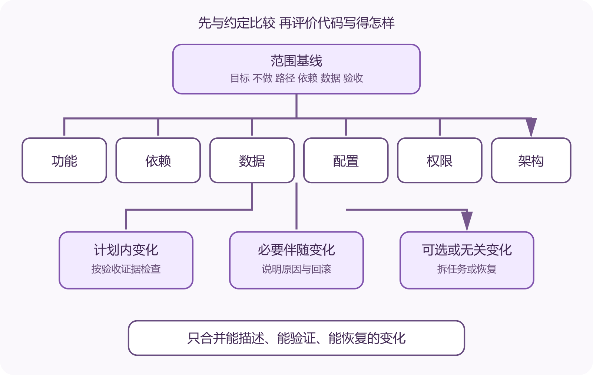

# 审查 AI 的范围扩张、依赖与架构漂移

你让 AI 给表单增加一个字段，它可能同时换掉表单库、重写接口封装、添加状态管理包、修改数据库结构和整理一遍目录。页面也许能运行，审查难度却从一个字段变成了六类变化。范围扩张指改动超出已同意目标，架构漂移则是许多局部改动逐步改变系统边界和依赖方向。

AI 没有恶意。它倾向于补齐自己熟悉的模式，也会为了解决眼前错误引入新包或绕开既有约束。项目所有者要把任务边界、允许变化和验收证据写清，再通过差异和运行结果检查。



*AI 改动的范围、依赖与架构漂移审查*

图中请求先形成范围基线，差异被分为功能、依赖、数据、配置、权限和架构六类。任何计划外变化都要获得理由和单独验证，不能藏在“顺手优化”里。

## 先写一份可比较的变更约定

约定不需要很长。写目标、明确不做、允许修改的路径、禁止新增的依赖、数据迁移要求、测试和回滚办法。若你不知道具体文件，可以要求 AI 先只读调查，列出候选路径和证据，获得确认后再改。

```
目标  注册表单增加可选昵称并显示在个人页
保持不变  登录方式、权限模型和路由
允许修改  表单、用户接口、数据库迁移、相关测试
依赖  不新增运行时包
数据  旧用户昵称为空，迁移可回滚
验收  注册、旧用户登录、权限与迁移测试通过
```

这份约定使“完成”可以检查。没有它，AI 可能把任何相关整理都解释为任务的一部分。

## 第一遍只看变化清单

先看新增、修改、删除文件和总差异，不急着逐行读。按功能代码、测试、依赖清单、锁文件、数据库迁移、部署配置、工作流、权限和文档分类。任何超出约定的类别先标记。

小变更更容易完整审查、测试和回滚。Google 工程实践建议保持自包含的小改动，并把重构与行为变化尽量分开。固定行数没有意义，关键是审查者能理解一项意图及其全部后果。

自动格式化可能让几行逻辑改动变成几千行差异。让 AI 恢复无关格式变化，或把机械修改分到独立提交。不要在巨大差异里用搜索代替审查。

为什么现有代码和标准库不能满足，需要哪项具体能力，包的维护与许可证怎样，会增加哪些传递依赖，在哪些环境运行，怎样退出。一个只为格式化日期引入的大包，长期更新与安全成本可能超过手写几行明确代码。

查看清单和锁文件的真实变化。AI 有时只修改清单，没有更新锁文件；也可能在修复安装错误时升级许多无关包。GitHub 依赖审查可以显示 Pull Request 中部分新增、移除和更新，但支持范围与仓库配置会变化，人工仍要核对来源、版本和使用位置。

执行安装前审查包脚本和来源，在隔离环境运行。生产构建应使用锁定版本与可复现命令。删除新增依赖的试验也很有用，若功能仍通过，说明依赖可能没有必要。

## 数据与配置变化单独提高风险等级

数据库迁移、对象存储、环境变量、缓存键和队列消息会跨版本存在。代码回滚不一定撤销数据变化。审查迁移前向和回退方向，确认旧版本能否读取新数据，部署顺序是否允许新旧进程短暂共存。

新增环境变量要写用途、秘密级别、默认行为和缺失时的错误。不能用宽松默认值掩盖生产缺失。新增端口、云权限、工作流令牌和服务角色要检查最小权限。AI 生成的示例值只能用占位符，不能把真实密钥写进提示、日志或提交。

配置改动还可能悄悄改变故障范围。把数据库连接数调大，会把压力转移到数据库；把超时加长，会让请求占用资源更久；把重试次数增加，会在下游故障时放大流量。每项参数要说明希望改变的指标和停止条件。

仓库导航图已经记录入口、业务、数据和外部系统。把本次新增导入与调用画上去。若界面组件直接连接数据库，领域逻辑开始依赖具体云 SDK，两个原本独立模块互相导入，边界正在变化。

边界变化未必错误。项目需求可能已经改变。此时应写 Architecture Decision Record，也就是架构决策记录，说明背景、选择、替代方案和后果。GitHub 工程团队的 ADR 经验强调让后来维护者能找到代码选择的背景，并把记录与实际模块和审查联系起来。

可以用架构测试、导入规则、CODEOWNERS 和工作流路径限制持续检查。工具只能抓住已经编码的规则。若项目从未写明谁拥有数据、哪些模块可以调用外部服务，先补一页简单边界说明。

## 防止 AI 自己证明自己正确

AI 写代码、写测试、生成样本并解释结果时，几项证据可能共享同一错误假设。把需求示例和验收数据独立保存，关键测试由人或另一套方法检查。高风险变更使用独立环境、真实协议实现和恢复演练。

测试通过要看测试是否能失败。故意改坏一个关键条件，确认相关测试变红，再恢复。变异测试可以系统施加小改动，性质与模糊测试能扩大输入范围。它们提供补充证据，仍需人定义正确行为和危险边界。

安全与权限要加反例。允许用户读取自己的记录以后，用另一个用户、未登录请求和猜测标识尝试访问。成功路径证明功能可用，拒绝路径才为隔离提供证据。

比较变更前后的运行组件、外部服务、依赖、数据所有者、公开接口、权限和运维步骤。若任意一项增加，问谁维护、怎样监控、怎样备份和怎样移除。

```
运行组件  新增一个后台工作进程
引入原因  外部调用耗时不稳定
新增责任  队列监控、重试和失败处理
验证  积压、恢复和重复任务测试
退出  可切回同步处理，仅限低流量窗口
```

这张表能阻止“只加了一个 worker”的轻描淡写。一个进程会带来部署、日志、资源、升级和故障处理。

## 发现范围扩张以后怎样处理

先不要整批接受，也不要整批推翻。把计划内改动、必要的伴随改动、可选优化和无关变化分开。必要伴随改动例如新增字段必须配数据库迁移，它属于目标的技术后果。改用另一套状态管理通常是可选优化，应另开任务。

要求 AI 给每项额外变化提供具体理由、替代方案和删除影响。理由无法落到需求、失败证据或项目约束，就恢复该部分。将剩余改动拆成可独立验证的提交，再从最小范围重新跑测试。

回退 AI 改动时只处理本次差异。工作区里可能有用户未提交内容，不能用覆盖整个目录的命令。先查看状态与差异，建立补丁或副本，精确恢复文件。

AI 让非专业开发者能完成更大的工程工作，也让改动速度超过理解速度。范围约定、依赖审查和架构漂移核对的作用，是让项目所有者重新获得节奏。每次只接受自己能描述、能验证、出错后能恢复的变化。

## 审查 AI 生成测试中的常见空洞

第一类空洞是只断言函数被调用，没有断言用户结果。第二类是测试输入和实现使用同一份常量，双方一起写错仍会通过。第三类是把数据库、队列和权限都替换成宽松替身，最后只测到自己的模拟代码。

第四类是快照过大。AI 更新整份快照后，真实变化藏在几百行文本中。把关键行为写成明确断言，快照只保留结构稳定且人工能审查的部分。第五类是异常测试只检查“抛错”，没有检查错误类型、数据状态和是否产生副作用。

审查时先说出一个测试失败代表什么。说不出来，测试名称再完整也不能提供决策证据。对关键路径加入独立测试数据，必要时由人先写验收样本，再让 AI 实现。

许多语言和构建工具能限制模块导入。项目可以规定界面层只能调用应用接口，领域模块不能引用云 SDK，数据库实现不能反向依赖页面。把规则放进持续集成后，AI 引入越界依赖会立刻失败。

规则不要一次写得过细。先保护最重要的三四条边界，并给历史例外明确期限。若规则与当前代码大面积冲突，强行启用会导致所有人学会跳过检查。

运行时边界也能通过契约与部署检查。服务接口变化要验证消费者，新增服务要进入健康检查、日志、资源限制和部署清单。代码目录没有新增依赖，不代表系统架构没有增加一个外部 SaaS。

## 提示和代理权限也属于变更范围

AI 代理可能读取仓库、运行命令、安装依赖、访问网络和调用部署工具。任务开始前限制工作目录、可写路径、可用凭据和允许命令。生产密钥不要为了省一步配置交给通用开发会话。

代理生成的命令先看执行位置与变量展开。删除、覆盖、迁移和权限命令需要精确目标和备份。自动批准会让一个范围误解直接变成外部状态变化。

保留操作记录，但先处理敏感字段。日志能说明代理执行了什么，不能证明每项结果正确。最终仍要查看文件差异、测试输出和部署状态。

为普通功能设简单预算，例如不增加服务、不更换核心库、数据库迁移单独评审。预算不是永远禁止变化，它迫使提议者说明为什么当前任务值得扩大系统。

若确实需要越过预算，把架构变化拆成独立提案。先验证候选方案、运维成本和退出路径，再实施功能。这样失败时可以分别回滚，也能看清收益究竟来自功能还是新架构。

每月比较运行组件、依赖数量、公开接口和关键配置。数字增加本身不是错误，无法说明所有者与用途的增加才需要处理。
