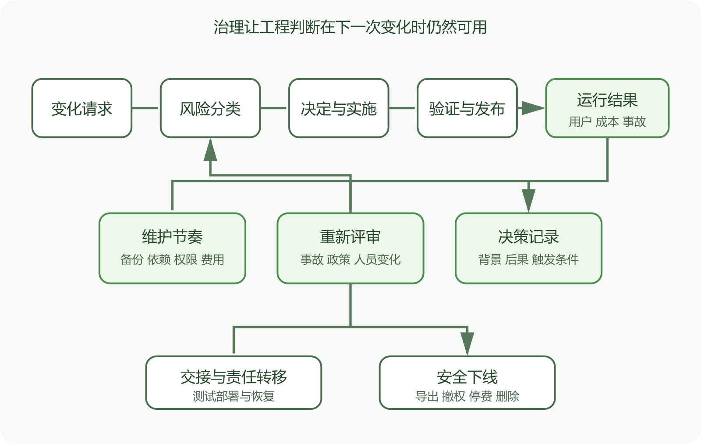

# 把工程判断变成可持续的项目治理

一个人借助 AI 做出网页或 App，第一次上线只是工程工作的开始。域名要续费，依赖会更新，证书和密钥会轮换，平台政策会变，数据要备份，事故要有人处理。项目治理把谁能决定、什么证据足够、何时停止发布和怎样退出写成可执行的规则。

小项目也需要治理，只是形式可以很轻。一页责任表、几个发布门槛和固定维护节奏，往往比厚重流程更有效。规则数量应当跟风险、人员和用户承诺一起增长。



*从变更请求到维护与退出的项目治理循环*

图中每项变化都经过分类、决定、实施、验证和发布，运行证据再进入维护。事故、成本、政策和人员变化会触发重新评审，项目也保留安全下线的出口。

## 先写清谁拥有最后决定

代码可以由 AI 生成，账号、域名、服务器、数据库、商店和付款关系仍属于具体的人或组织。为每项关键资产记录所有者、日常操作者、紧急联系人和恢复凭据位置。不要把密码写进责任表，只写秘密管理系统和访问恢复流程。

一个人也要区分角色。开发时可以快速试验，发布时换成项目所有者视角，检查用户影响、数据与回滚。高风险操作最好让另一位可信人员复核。暂时没有第二人，就隔一段时间重新审查，并使用独立测试数据和环境减少同一思路的盲点。

外部开发者或 AI 服务完成改动，不代表它们承担上线责任。点击生产部署的人要看见差异、测试证据、备份状态和回滚步骤。

文字和样式的小改动通常可以走轻量流程。认证、权限、付款、数据迁移、上传、安全配置和删除功能需要更严格门槛。平台切换、数据库升级和应用商店发布还涉及外部政策。

分类不以修改行数决定。改一行权限条件可能暴露全部记录，增加几百行独立帮助页面却风险较低。给每类变化规定所需证据。

```
低风险  预览、自动测试和人工页面检查
中风险  上述证据，加受控失败与回滚验证
高风险  独立复核、测试环境迁移、备份恢复和发布审批
紧急修复  缩小改动，保留记录，恢复后补完整复盘
```

紧急流程可以更快，不能没有边界。先恢复用户服务，随后补测试、文档和长期修复。

## 发布门槛要写成可见证据

“测试通过”太笼统。写出测试名称、提交、环境和结果。网页发布至少检查构建、关键页面、接口、权限、日志和回滚。移动应用还要检查签名、版本号、权限声明与内部测试。

分支规则和 CODEOWNERS 能让所需检查与责任人进入合并流程。工具执行的是已配置规则，项目所有者仍要核对规则有没有覆盖生产分支，责任人是否仍有效。

发布记录应包含提交、制品校验、数据库迁移、配置变化、部署时间、操作者、验证和回滚点。几个月后出现故障时，这些信息比“当时应该测过”可靠。

维护节奏可以分成每周、每月和每季度。每周看可用性、错误、备份任务和异常费用。每月看依赖、安全告警、证书与域名、失败任务和恢复样本。每季度做恢复演练、权限复核、仓库健康检查和下线资产清点。

频率不是固定标准。没有用户的实验项目可以更轻，保存重要数据或收费的服务需要更严。任何告警都要有接收人和动作。

可以为用户最关心的结果设少量服务目标，例如登录成功率、上传完成率和关键页面延迟。Google SRE 把 SLI 用作用户结果的测量，把 SLO 用作一段时间内的目标。个人项目不必照搬大型组织的数字，可以用它决定何时暂停新功能，先处理可靠性。

## 把决策写进仓库附近

重要选择使用短 ADR。记录当时问题、可选方案、决定、后果、复查触发条件和相关提交。触发条件可以是用户量超过阈值、费用变化、平台停止某能力、恢复时间不达标或维护者离开。

决策会过期。ADR 不要悄悄改写历史，新决定另建记录并链接旧记录。后来的人要知道旧方案在当时为何合理，也要知道什么证据使它改变。

运行手册记录可重复操作。它应说明入口条件、命令位置、预期输出、停止条件、风险、升级路径和验证。危险步骤使用测试环境演练，真实凭据用占位符。

记录域名注册商、DNS、托管平台、邮件、对象存储、数据库、分析、AI 接口和应用商店账号。每项写所有者、账单方式、数据出口、替代方案和停用步骤。

价格、免费额度和平台政策会变化。预算不能只写当前月费，还要设置提醒与上限，检查流量增长、日志保留、出站流量和后台任务带来的费用。收到费用告警时，先限制非关键消耗。

供应商故障时要知道哪些功能可以降级。邮件暂时不可用，注册是否停止；AI 接口超时，主业务能否继续；对象存储不可写，接口是否明确失败。治理把这些选择提前写下，现场就少一次临时猜测。

## 事故以后修系统也修流程

事故复盘记录影响、时间线、证据、促成条件、恢复动作和负责人。行动项要能改变检测、隔离、恢复或决策，不能只写“以后更小心”。

若错误改动通过了审查，检查发布门槛为什么没有覆盖。若备份不可用，补恢复演练和所有权。若操作员没有权限回滚，修正紧急访问流程。处理个人失误时保留事实与责任，同时检查系统为什么允许单次动作造成如此大的后果。

行动项数量要受控制。每项有负责人、期限和验证。无法说明预期改变哪种故障的事项先不要添加。

交接包包括系统地图、仓库导航图、账号与资产清单、部署与恢复手册、当前风险、决策记录和最近验证报告。凭据通过秘密管理系统转交，不放进压缩包、聊天记录或书面文档。

让接手者在你观察下完成一次测试部署和恢复。能阅读文档不代表能操作。过程中出现的口头补充要写回手册。确认新负责人能接收告警、续费域名、访问备份和撤销旧权限。

## 保留停止运营的能力

项目可能因为费用、人员、法律要求或需求消失而结束。安全下线包括通知用户、提供数据导出、停止写入、撤销令牌、关闭公开入口、保留必要记录、删除不再需要的数据和终止账单。具体顺序必须照顾依赖关系，例如先完成用户导出，再撤销导出所需的访问；暂停写入后还要核对未完成任务、付款与回调。

删除顺序要有清单和批准。先确认法律与合同保留要求，再验证导出和备份，最后按精确对象处理。云资源关闭后恢复可能很困难，不能靠“以后需要再开”作计划。

仓库可以归档，文档要标明最后支持版本和安全状态。域名若不再保留，旧链接和回调可能被他人接管，需提前解除 OAuth、邮件和应用配置。

先完成五件事。记录生产提交和部署位置，确认备份能恢复，列出账号和费用所有者，为高风险改动写发布门槛，安排下次维护日期。随后每遇到一次真实问题，只增加一条确实能缩小后果的规则。

这本书讲过仓库、网络、部署、服务器、容器、应用商店、日志、测试和 AI 审查。你不需要独自精通每一层。你要能看见一次变化跨过哪些边界，知道应向谁求助，并在证据不足时暂停生产操作。

AI 可以继续写大部分代码、配置和说明。项目所有者负责选择目标、守住数据、确认用户承诺和承担发布决定。治理把这些判断留下来，下一次改动就少依靠记忆和运气。

## 权限治理要覆盖加入、变化与离开

新成员只获得完成当前职责需要的权限。职责变化时重新评估，离开项目后及时撤销代码、云平台、域名、商店、监控和密码管理器访问。共享账号让撤权和审计变得困难，应尽量使用个人账号与角色权限。

紧急访问凭据要能恢复，也要防止日常滥用。把恢复材料放在受控位置，定期确认可用。每次紧急使用留下原因、时间、动作和后续撤权。机器人和工作流账号同样需要所有者、权限范围和轮换。

每类数据写用途、来源、访问者、保存位置、保留期限、导出和删除方法。用户请求删除时，要知道数据库、对象存储、搜索索引、队列、缓存和备份怎样处理。具体法律义务需要专业意见，技术实现则要留下可验证记录。测试环境使用合成或脱敏数据。

## 变更冻结和例外怎样落地

重要活动、节假日无人值守和重大迁移期间，可以冻结高风险发布。冻结范围、开始结束时间和允许例外要提前写清。安全修复与严重故障仍可能需要发布，这时采用紧急流程并提高复核。

例外要记录谁批准、为什么不能等、减少了哪些验证、怎样补回。长期存在的例外说明原规则不适合项目，应修改规则或解决阻碍。服务目标和错误预算可以帮助决定冻结，用户结果持续低于目标时，先修可靠性。

检查项目还有哪些用户、产生什么价值、每年花费多少时间与费用、持有哪些数据和承诺。若维护成本已经超过价值，可以缩减功能、迁移到托管服务、只读归档或安全下线。继续运营也要重新确认技术选择。

把决定与下一次触发条件写进 ADR。用户量、费用、恢复结果或人员变化达到条件时提前复查，不必等到年度日期。
